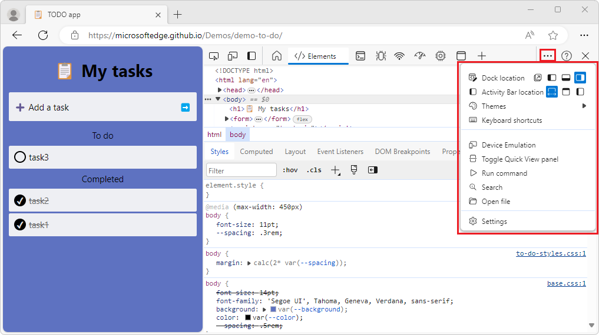

# What's New in DevTools (Microsoft Edge 122)

[!INCLUDE [Microsoft Edge team note for top of What's New](../../includes/edge-whats-new-note.md)]

<!-- ====================================================================== -->
## Icons are fixed in DevTools UI

<!-- Subtitle: In recent versions of Microsoft Edge, icons were missing or were colored incorrectly. In Microsoft Edge 122, this issue has been resolved. -->

There was a bug where numerous any icons were missing, had the wrong background color, or didn't work with high contrast mode throughout DevTools. In Microsoft Edge 122, all these icons have been fixed and are compatible when high contrast mode is enabled.

<!-- ====================================================================== -->
## Keyboard shortcut to change panels is now working correctly

<!-- Subtitle: In previous versions of Microsoft Edge, the Ctrl + ]/[ keyboard shortcut wasn't working correctly. In Microsoft Edge 122, this issue has been resolved. -->

There was a bug with the Ctrl + ]/Ctrl + [ keyboard shortcut where the next tool in the Activity Bar wasn't selected and the Activity Bar wouldn't update so it looked like the previous tool was selected. For example, starting on the Elements panel:

Using the shortcut to move across tools, the Elements tab is still highlighted, but the Network tool is displayed:

This issue has been resolved with Microsoft Edge 122 and works as expected.

<!-- ====================================================================== -->
## Context menu is fixed

<!-- Subtitle: In previous versions of Microsoft Edge, Devtools' context menu was broken and unresponsive. In Microsoft Edge 122, this issue has been resolved. -->

The context menu was unresponsive and would not open when you clicked it, preventing you from customizing DevTools. This is now fixed in Microsoft Edge 122.

<!-- ====================================================================== -->
## Updated Devtools Copilot explain console errors prompt

<!-- Subtitle: Use Copilot to explain console errors and fix suggestions. -->

We updated the prompt to include a fix plan in addition to the error explanation when using Copilot to help explain console errors:

<!-- ====================================================================== -->
## Announcements from the Chromium project

* [The official collection of Recorder extensions is live](https://developer.chrome.com/blog/new-in-devtools-122#recorder-extensions)
* [Network improvements](https://developer.chrome.com/blog/new-in-devtools-122#network)
   * [Failure reason in the Status column](https://developer.chrome.com/blog/new-in-devtools-122#failure-status)
   * [Improved Copy submenu](https://developer.chrome.com/blog/new-in-devtools-122#copy-submenu)
* [Performance improvements](https://developer.chrome.com/blog/new-in-devtools-122#perf-improvements)
   * [Breadcrumbs in the Timeline](https://developer.chrome.com/blog/new-in-devtools-122#perf-breadcrumbs)
   * [Event initiators in the Main track](https://developer.chrome.com/blog/new-in-devtools-122#event-initiators)
   * [JavaScript VM instance selector menu for Node.js DevTools](https://developer.chrome.com/blog/new-in-devtools-122#js-vm-menu)
* [Elements improvements](https://developer.chrome.com/blog/new-in-devtools-122#elements-improvements)
   * [The ::view-transition pseudo-element is now editable in Styles](https://developer.chrome.com/blog/new-in-devtools-122#view-transition)
   * [The align-content property support for block containers](https://developer.chrome.com/blog/new-in-devtools-122#align-content-in-blocks)
* [New shortcut and command in Sources](https://developer.chrome.com/blog/new-in-devtools-122#sources)
* [Posture support for emulated foldable devices](https://developer.chrome.com/blog/new-in-devtools-122#device-posture)
* [Dynamic theming](https://developer.chrome.com/blog/new-in-devtools-122#dynamic-theming)
* [Third-party cookies phaseout warnings in the Network and Application panels](https://developer.chrome.com/blog/new-in-devtools-122#3pc)
* [Lighthouse 11.4.0](https://developer.chrome.com/blog/new-in-devtools-122#lighthouse)
* [Accessibility](https://developer.chrome.com/blog/new-in-devtools-122#accessibility)
* [Miscellaneous highlights](https://developer.chrome.com/blog/new-in-devtools-122#misc)
<!-- todo: maybe remove some links -->

<!-- ====================================================================== -->
<!-- uncomment if content is copied from developer.chrome.com to this page -->

<!-- > [!NOTE]
> Portions of this page are modifications based on work created and [shared by Google](https://developers.google.com/terms/site-policies) and used according to terms described in the [Creative Commons Attribution 4.0 International License](https://creativecommons.org/licenses/by/4.0).
> The original page for announcements from the Chromium project is [What's New in DevTools (Chrome 122)](https://developer.chrome.com/blog/new-in-devtools-122) and is authored by [Sofia Emelianova](https://developers.google.com/web/resources/contributors) (Senior Technical Writer working on Chrome DevTools at Google). -->

<!-- ====================================================================== -->
<!-- uncomment if content is copied from developer.chrome.com to this page -->

<!-- 
This work is licensed under a [Creative Commons Attribution 4.0 International License](https://creativecommons.org/licenses/by/4.0). -->
