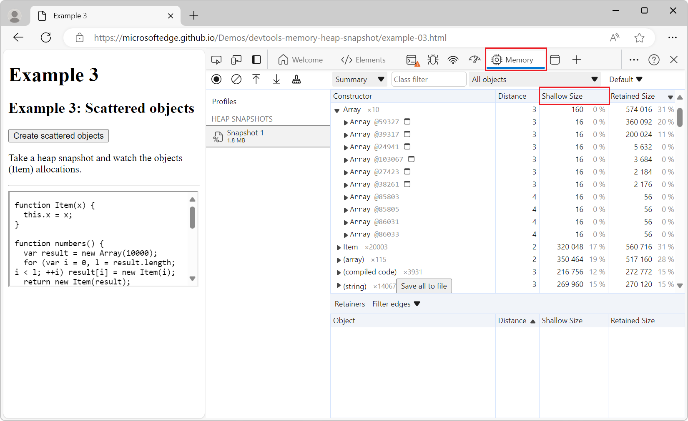
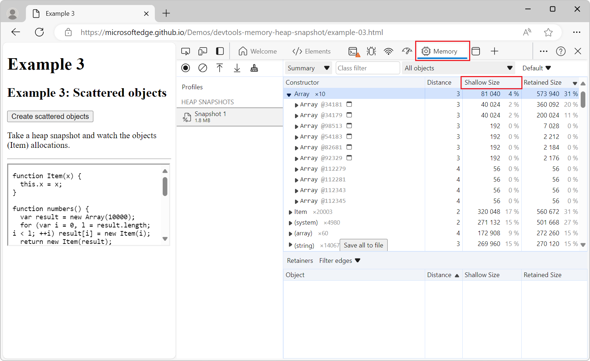
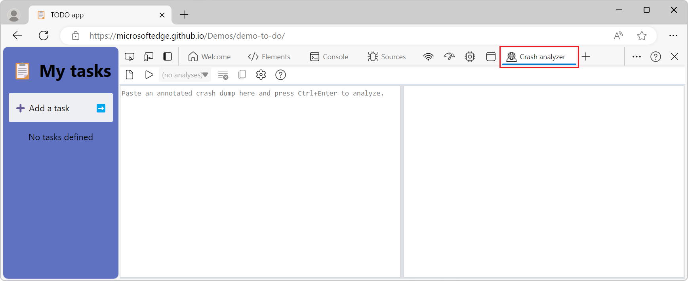

# What's New in DevTools (Microsoft Edge 123)

[!INCLUDE [Microsoft Edge team note for top of What's New](../../includes/edge-whats-new-note.md)]

<!-- ====================================================================== -->
## Memory tool reports backing store sizes as part of an object's shallow size

<!-- Subtitle: New experiment is available to make Shallow Size column in the Memory tool more helpful. -->

Microsoft Edge 123 adds a new experiment called **In heap snapshots, treat backing store size as part of the containing object**.  If you enable this experiment, the **Memory** tool reports shallow sizes in a way that more closely matches JavaScript behavior.  By enabling this experiment, containers and their contents can now be represented as a single item, such as:
* An `Object` and its properties.
* An `Array` and its contents.
* A `Map` and its contents.
* A `Set` and its contents.

For example, to find the largest arrays, you can sort `Array`​ instances by shallow size, as shown below.

Default behavior for heap snapshots:

Heap snapshots with the new experiment enabled:

This experiment is helpful because heap snapshots in the Memory tool show a complete list of everything allocated in the V8 and Blink heaps.  Sometimes that list is a little too fine-grained, breaking out an item as if it is multiple items.  For example, the list in the heap snapshot represents each JavaScript `Array` instance separately from the contents of that `Array`, which are called `(object elements)[]`. However, in JavaScript code, an `Array` is a single entity, rather than an array instance and separate contents of the array.

See also:
* [Record heap snapshots using the Memory tool](../../../memory-problems/heap-snapshots.md)

<!-- ====================================================================== -->
## Crash analyzer tool is available by default

<!-- Subtitle: The Crash analyzer tool has been moved out of DevTools Experiments and is available in More Tools on the Activity Bar. -->

The **Crash analyzer** tool is now available by default, and is no longer an experiment that needs to be enabled.  To open the **Crash analyzer** tool, in the **Activity Bar**, click the **More tools** (+) menu, and then select **Crash analyzer**.

The **Crash analyzer** tool helps you create a JavaScript stack trace, and applies your sourcemaps to the stack trace so that you can debug faster:

<!--
See also:
* [Crash analyzer tool](../../../crash-analyzer/index.md)
todo: after merging PR 3086 (New article "Crash analyzer tool"), un-comment -->

<!-- ====================================================================== -->
## Command Palette experimental feature has been removed

<!-- Subtitle: The Command Palette experiment has been removed. -->

The Command Palette experimental feature has been removed from Microsoft Edge, starting with version 123.

See also:
* [Introducing the Command Palette](../../2022/09/devtools-106.md#introducing-the-command-palette) in _What's New in DevTools (Microsoft Edge 106)_.
* [New keyboard shortcut for the Command Palette experiment](../../2022/10/devtools-107.md#new-keyboard-shortcut-for-the-command-palette-experiment) in _What's New in DevTools (Microsoft Edge 107)_.
* [Improved DevTools navigation via Command Palette](../../2022/12/devtools-108.md#improved-devtools-navigation-via-command-palette) in _What's New in DevTools (Microsoft Edge 108)_.
* [Navigate directly to the Styles and Computed Styles tabs of the Elements tool](../../2023/01/devtools-109.md#navigate-directly-to-the-styles-and-computed-styles-tabs-of-the-elements-tool) in _What's New in DevTools (Microsoft Edge 109)_.

<!-- ====================================================================== -->
## Undocked DevTools window is kept focused as the topmost window while inspecting a page

<!-- Subtitle: In recent versions of Microsoft Edge, the undocked DevTools window lost focus while you're inspecting a webpage. The DevTools window now stays in focus as the topmost window. -->

When DevTools was undocked into its own separate window, and you selected a webpage element to inspect, the DevTools window lost focus and was obscured by the webpage being analyzed.  This bug has been resolved, and the DevTools window stays in focus as the topmost window.

See also:
* [Change DevTools placement (Undock, Dock to bottom, Dock to left)](../../../customize/placement.md)

<!-- ====================================================================== -->
## Announcements from the Chromium project

Microsoft Edge 123 also includes the following updates from the Chromium project:

* [Elements panel updates](https://developer.chrome.com/blog/new-in-devtools-123#elements)
   * [Emulate a focused page in Elements > Styles](https://developer.chrome.com/blog/new-in-devtools-123#focused-page)
   * [Color picker, Angle Clock, and Easing Editor in var() fallbacks](https://developer.chrome.com/blog/new-in-devtools-123#var-fallbacks)
   * [CSS length tool is deprecated](https://developer.chrome.com/blog/new-in-devtools-123#css-length)
* [Popover for the selected search result in the Performance > Main track](https://developer.chrome.com/blog/new-in-devtools-123#perf-popover)
* [Network panel updates](https://developer.chrome.com/blog/new-in-devtools-123#network)
   * [Clear button and search filter in the Network > EventStream tab](https://developer.chrome.com/blog/new-in-devtools-123#event-stream)
   * [Tooltips with exemption reasons for third-party cookies in Network > Cookies](https://developer.chrome.com/blog/new-in-devtools-123#3pc-exemption)
* [Enable and disable all breakpoints in Sources](https://developer.chrome.com/blog/new-in-devtools-123#breakpoints)
* [View loaded scripts in DevTools for Node.js](https://developer.chrome.com/blog/new-in-devtools-123#node-nav-tree)

<!-- ====================================================================== -->
<!-- uncomment if content is copied from developer.chrome.com to this page -->

<!-- > [!NOTE]
> Portions of this page are modifications based on work created and [shared by Google](https://developers.google.com/terms/site-policies) and used according to terms described in the [Creative Commons Attribution 4.0 International License](https://creativecommons.org/licenses/by/4.0).
> The original page for announcements from the Chromium project is [What's New in DevTools (Chrome 123)](https://developer.chrome.com/blog/new-in-devtools-123) and is authored by [Sofia Emelianova](https://developers.google.com/web/resources/contributors) (Senior Technical Writer working on Chrome DevTools at Google). -->

<!-- ====================================================================== -->
<!-- uncomment if content is copied from developer.chrome.com to this page -->

<!-- 
This work is licensed under a [Creative Commons Attribution 4.0 International License](https://creativecommons.org/licenses/by/4.0). -->
