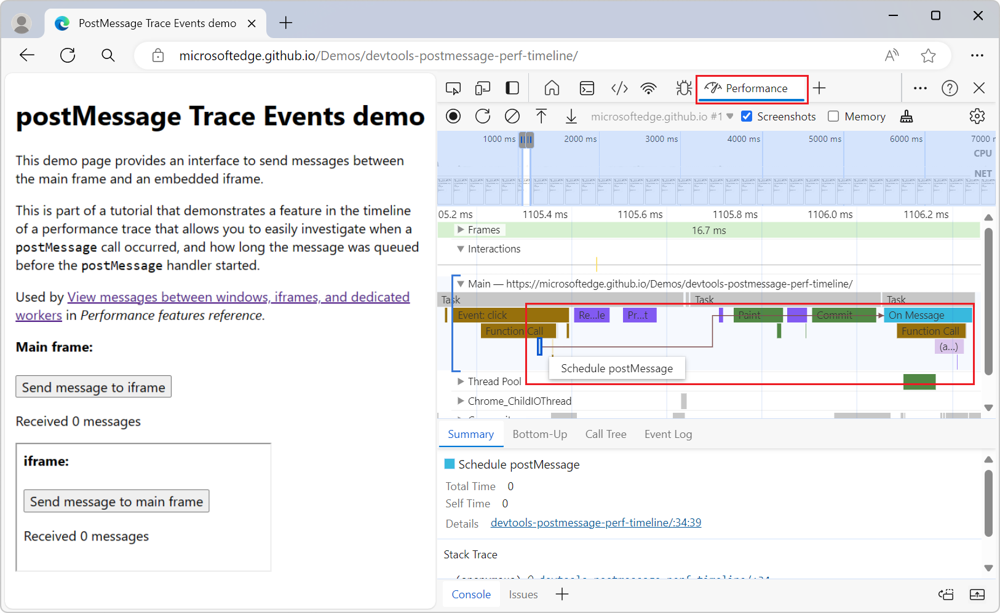
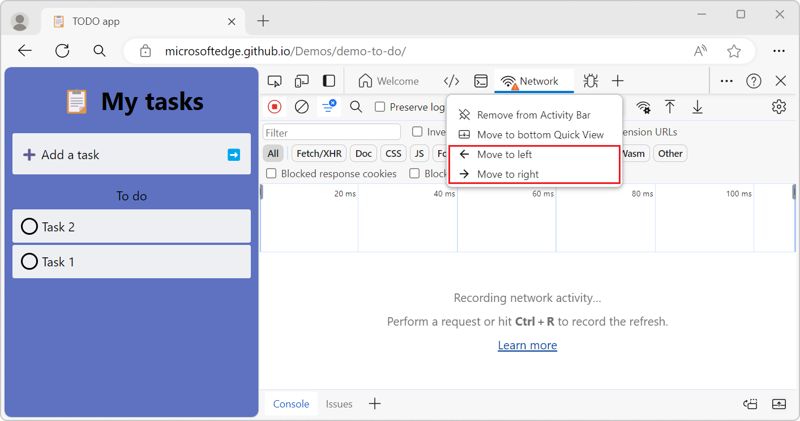
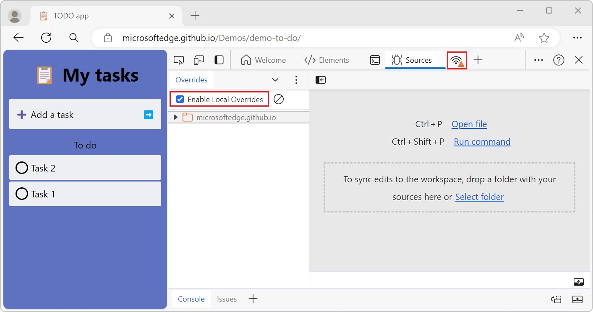

# What's New in DevTools (Microsoft Edge 124)

[!INCLUDE [Microsoft Edge team note for top of What's New](../../includes/edge-whats-new-note.md)]

<!-- ====================================================================== -->
## New Experiment: Distinguish postMessage events from other timeline events in the Performance tool
<!-- Subtitle: Easily investigate performance issues related to post messages across various threads in applications.  -->

We improved the performance timeline to help developers quickly identify postMessage events and handlers by distinguishing postMessage events from other timeline events. Before, postMessage dispatch and handler events appeared as generic scripting function call events. Now, postMessage dispatch and handler events appear on the timeline as "Schedule postMessage" and "On Message" respectively.

The performance timeline has been updated to developers investigate when postMessage calls occur, and how long the message queued for before the handler starts. The dispatch events are linked to handler events with arrow intiators that appear when you click on either event:

Enable the "Timeline: Show postMessage dispatch and handling flows" experiment to use this feature.

<!-- ====================================================================== -->
## Rearrange tabs in the Activity bar using the tab's context menu
<!-- Subtitle: Move the tabs in the Activity bar left or right by using the tab's context menu. -->

Before Microsoft Edge 124, you could rearrange the tabs in the Activity bar only by dragging and moving them. This would be difficult for users who are using input devices like a trackball or head pointer, so a single pointer mode of operation has been added, without the need to drag the tabs. Now, you can move a tab left/right by opening its context menu:

<
<!-- ====================================================================== -->
## Network tool shows a warning icon when throttling or overrides are used

<!-- Subtitle: Previously, this only worked in DevTools' legacy UI, but it's been fixed to work in the new UI now. -->

If you were using DevTools legacy UI, when enabling local overrides in Sources or turning on throttling in Network, the Network tab displays a warning icon, but this didn't work in the new UI. We've fixed this bug so that it works the same way in the new UI and shows the warning icon when needed.

<!-- ====================================================================== -->
## Announcements from the Chromium project

Microsoft Edge 124 also includes the following updates from the Chromium project:

<!-- ====================================================================== -->
<!-- uncomment if content is copied from developer.chrome.com to this page -->

<!-- > [!NOTE]
> Portions of this page are modifications based on work created and [shared by Google](https://developers.google.com/terms/site-policies) and used according to terms described in the [Creative Commons Attribution 4.0 International License](https://creativecommons.org/licenses/by/4.0).
> The original page for announcements from the Chromium project is [What's New in DevTools (Chrome 123)](https://developer.chrome.com/blog/new-in-devtools-123) and is authored by [Sofia Emelianova](https://developers.google.com/web/resources/contributors) (Senior Technical Writer working on Chrome DevTools at Google). -->

<!-- ====================================================================== -->
<!-- uncomment if content is copied from developer.chrome.com to this page -->

<!-- 
This work is licensed under a [Creative Commons Attribution 4.0 International License](https://creativecommons.org/licenses/by/4.0). -->
