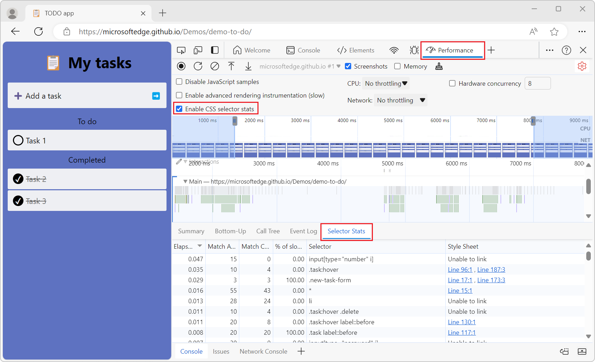
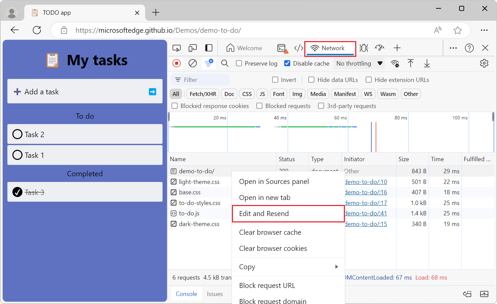

# What's New in DevTools (Microsoft Edge 125)

[!INCLUDE [Microsoft Edge team note for top of What's New](../../includes/edge-whats-new-note.md)]

<!-- ------------------------------ 
todo video
#### Video: What's new in DevTools 115-125

[]
-->

<!-- ====================================================================== -->
## New dedicated setting for CSS Selector Stats in Performance tool

<!-- Subtitle: Use the "Enable CSS selector stats" setting instead of the "Enable advanced rendering instrumentation (slow)" to capture CSS selector statistics for Recalculate Style events-->

In the **Performance** tool, the **Enable advanced rendering instrumentation (slow)** checkbox has been replaced by the **Enable CSS selector stats** checkbox.  This checkbox controls the CSS selector statistics feature.

To record a performance trace with selector stats, select the **Enable CSS selector stats** checkbox, and then record a performance trace.  To view the statistics for a single event, select a `Recalculate Style` event in your recording, and then open the **Selector Stats** tab.

The **Selector Stats** tab has the following changes:

* The **Elapsed** column is sorted from high to low by default, to help you find the most time-consuming CSS selectors.

* The **Fast Reject Count** column has been replaced by the **% of slow-path non-matches** column.

* The unit of time has been changed from microseconds to milliseconds.

See also:
* [Analyze CSS selector performance during Recalculate Style events](../../../evaluate-performance/selector-stats.md)

<!-- ====================================================================== -->
## The "Edit and Resend" function has been restored in the Network tool

<!-- Subtitle: Change and resend a network request by right-clicking it and selecting Edit and Resend. -->

In previous versions of Microsoft Edge, right-clicking on a network request you want to change and resend, and then selecting **Edit and Resend** was unresponsive and had no effect.  This issue has been resolved, and **Edit and Resend** works as expected.

See also:
* [Opening the Network Console tool from within the Network tool](../../../network-console/network-console-tool.md#opening-the-network-console-tool-from-within-the-network-tool) in _Compose and send web API requests using the Network Console tool_.

<!-- ====================================================================== -->
## Announcements from the Chromium project

Microsoft Edge 125 also includes the following updates from the Chromium project:

* [@position-try rules support in Elements > Styles](https://developer.chrome.com/blog/new-in-devtools-125#lposition-try)
* [Sources panel improvements](https://developer.chrome.com/blog/new-in-devtools-125#sources)
   * [Configure automatic pretty-printing and bracket closing](https://developer.chrome.com/blog/new-in-devtools-125#settings)
   * [Handled rejected promises are recognized as caught](https://developer.chrome.com/blog/new-in-devtools-125#caught-rejection)
* [Error causes in the Console](https://developer.chrome.com/blog/new-in-devtools-125#error-cause)
* [Network panel improvements](https://developer.chrome.com/blog/new-in-devtools-125#network)
   * [Inspect Early Hints headers](https://developer.chrome.com/blog/new-in-devtools-125#early-hints)
   * [Hide the Waterfall column](https://developer.chrome.com/blog/new-in-devtools-125#waterfall)
* [Performance panel improvements](https://developer.chrome.com/blog/new-in-devtools-125#perf)
   * [Capture CSS selector statistics](https://developer.chrome.com/blog/new-in-devtools-125#selector-stats)
   * [Change order and hide tracks](https://developer.chrome.com/blog/new-in-devtools-125#track-config)
* [Ignore retainers in the Memory panel](https://developer.chrome.com/blog/new-in-devtools-125#ignore-retainer)

<!-- ====================================================================== -->
<!-- uncomment if content is copied from developer.chrome.com to this page -->

<!-- > [!NOTE]
> Portions of this page are modifications based on work created and [shared by Google](https://developers.google.com/terms/site-policies) and used according to terms described in the [Creative Commons Attribution 4.0 International License](https://creativecommons.org/licenses/by/4.0).
> The original page for announcements from the Chromium project is [What's New in DevTools (Chrome 125)](https://developer.chrome.com/blog/new-in-devtools-125) and is authored by Sofia Emelianova. -->

<!-- ====================================================================== -->
<!-- uncomment if content is copied from developer.chrome.com to this page -->

<!-- 
This work is licensed under a [Creative Commons Attribution 4.0 International License](https://creativecommons.org/licenses/by/4.0). -->
