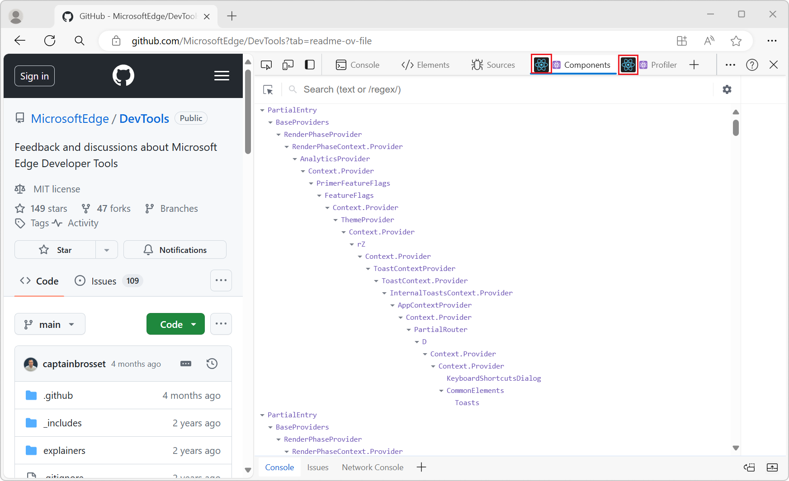

# What's New in DevTools (Microsoft Edge 126)

[!INCLUDE [Microsoft Edge team note for top of What's New](../../includes/edge-whats-new-note.md)]

<!-- ====================================================================== -->
## DevTools will display browser extension icons instead of a blank box

<!-- Subtitle: The DevTools extensions that you install will display their icons so they're easily identifiable in the Activity Bar.-->

There was a bug where some browser extensions were missing icons when opened in DevTools. For example, when the React extension was activated the icon displayed was a grey box:

<!-- Add photo if someone can repro it-->

This has been fixed and the icons are displayed:

<!-- ====================================================================== -->
## Reverted back to the old font for DevTools UI in Chinese

<!-- Subtitle: The DevTools font has been updated back to the old font that users are familiar with when using the DevTools UI in Chinese. -->

In previous versions of Microsoft Edge, right-clicking on a network request you want to change and resend, and then selecting **Edit and Resend** was unresponsive and had no effect.  This issue has been resolved, and **Edit and Resend** works as expected.

See also:
* [Opening the Network Console tool from within the Network tool](../../../network-console/network-console-tool.md#opening-the-network-console-tool-from-within-the-network-tool) in _Compose and send web API requests using the Network Console tool_.

In recent versions of Microsoft Edge, a new default font was introduced in the DevTools UI when the language was set to Chinese. Due to numerous complaints, we fixed the font and changed it back to the one uses are familiar with.

<!-- ====================================================================== -->
## Announcements from the Chromium project

Microsoft Edge 126 also includes the following updates from the Chromium project:

<!-- ====================================================================== -->
<!-- uncomment if content is copied from developer.chrome.com to this page -->

<!-- > [!NOTE]
> Portions of this page are modifications based on work created and [shared by Google](https://developers.google.com/terms/site-policies) and used according to terms described in the [Creative Commons Attribution 4.0 International License](https://creativecommons.org/licenses/by/4.0).
> The original page for announcements from the Chromium project is [What's New in DevTools (Chrome 125)](https://developer.chrome.com/blog/new-in-devtools-125) and is authored by [Sofia Emelianova](https://developers.google.com/web/resources/contributors) (Senior Technical Writer working on Chrome DevTools at Google). -->

<!-- ====================================================================== -->
<!-- uncomment if content is copied from developer.chrome.com to this page -->

<!-- 
This work is licensed under a [Creative Commons Attribution 4.0 International License](https://creativecommons.org/licenses/by/4.0). -->
