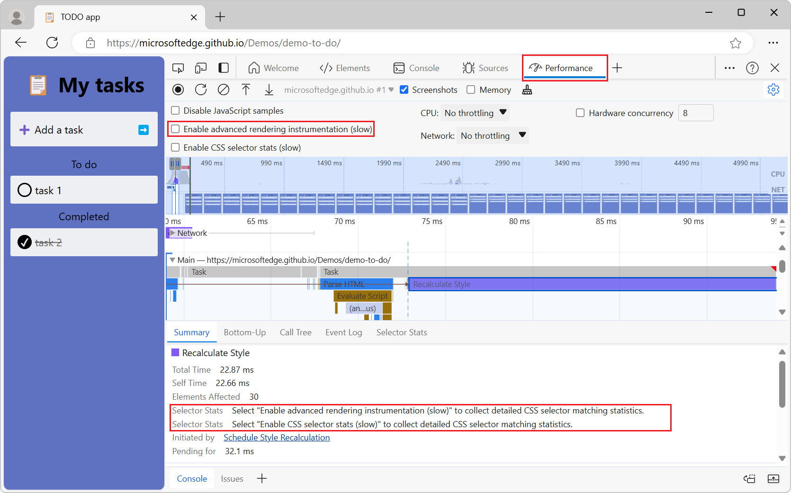
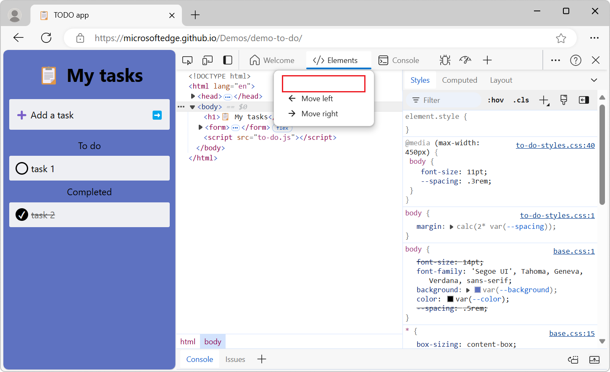
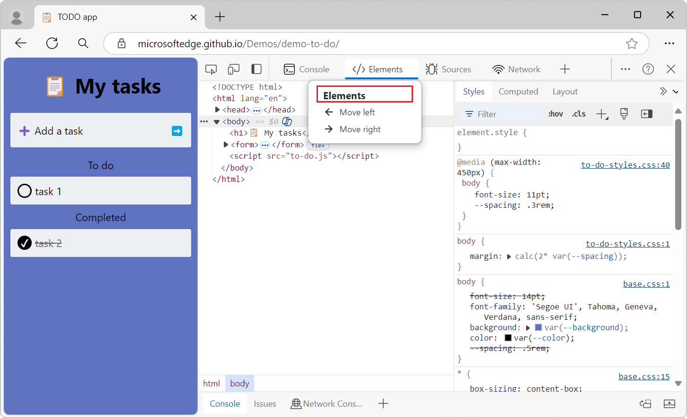

# What's New in DevTools (Microsoft Edge 128)

[!INCLUDE [Microsoft Edge team note for top of What's New](../../includes/edge-whats-new-note.md)]

<!-- ====================================================================== -->
## Updated labels for selector stats

<!-- Subtitle: Use the "Enable CSS selector stats" setting instead of the "Enable advanced paint instrumentation (slow)" to capture CSS selector statistics for Recalculate Style events -->

In the **Performance** tool, we've removed the duplicate **Selector Stats** label that appears in `Recalculate Style` event details. Selector stats can be enabled by using the dedicated setting for it.

Also, the **Enable advanced rendering instrumentation (slow)** setting has been renamed back to **Enable advanced paint instrumentation (slow)**. Previously this setting was used for both paint instrumentation and selector stats. We updated the setting label since there's a dedicated setting for selector stats now.

Before:

After:

<!-- ====================================================================== -->
## Fixed extra padding in the Activity Bar context menu headers

<!-- Subtitle: Header titles in the Activity Bar are restored. -->

In recent versions of Microsoft Edge, the context menus in the Activity Bar displayed some empty whitespace in the header:

The context menus header has been changed back to include its title:

<!-- ====================================================================== -->
## Announcements from the Chromium project

Microsoft Edge 128 also includes the following updates from the Chromium project:

<!-- ====================================================================== -->
<!-- uncomment if content is copied from developer.chrome.com to this page -->

<!-- > [!NOTE]
> Portions of this page are modifications based on work created and [shared by Google](https://developers.google.com/terms/site-policies) and used according to terms described in the [Creative Commons Attribution 4.0 International License](https://creativecommons.org/licenses/by/4.0).
> The original page for announcements from the Chromium project is [What's New in DevTools (Chrome 127)](https://developer.chrome.com/blog/new-in-devtools-127) and is authored by [Sofia Emelianova](https://developers.google.com/web/resources/contributors) (Senior Technical Writer working on Chrome DevTools at Google). -->

<!-- ====================================================================== -->
<!-- uncomment if content is copied from developer.chrome.com to this page -->

<!-- 
This work is licensed under a [Creative Commons Attribution 4.0 International License](https://creativecommons.org/licenses/by/4.0). -->
