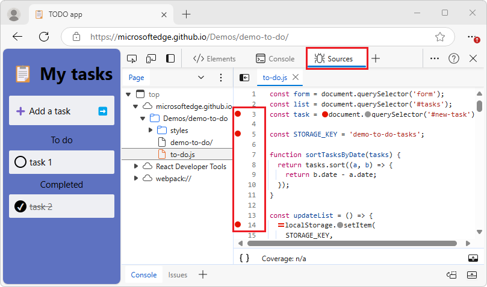

# What's New in DevTools (Microsoft Edge 129)

[!INCLUDE [Microsoft Edge team note for top of What's New](../../includes/edge-whats-new-note.md)]

<!-- ====================================================================== -->
## Improvements to breakpoints

<!-- Subtitle: Refreshed icons to help differentiate breakpoint types, and the textbox width has been fixed in the UI for setting a conditional breakpoint.-->

The **Sources** tool has the following improvements related to setting breakpoints for debugging.

<!-- ------------------------------ -->
#### Unique icons for logpoint and conditional breakpoints

Logpoint and conditional breakpoints now have unique colors and icons to help you differentiate them from regular breakpoints in the line number column.  Previously, all types of breakpoints looked the same, with only the differentiating icon inline with the code.

Before:

After:

<!-- ------------------------------ -->
#### Alignment in UI for setting a conditional breakpoint

The UI that's displayed for setting a conditional breakpoint has been fixed to prevent the width of the textbox from growing and causing alignment issues.

Before:

After:

<!-- ====================================================================== -->
## Bug fixes in the Elements tool

<!-- Screen readers will announce the "Show element in the Elements panel" button, and the context menu has been restored. -->

<!-- ------------------------------ -->
#### Screen readers announce the "Show element in the Elements panel" button

In the **Layout** tab, screen readers now announce the **Show element in the Elements panel** () button that's next to each element name:

<!-- ------------------------------ -->
#### Context menu opens when right-click DOM tree text

Previously, the context menu didn't open after right-clicking text that's selected in the DOM tree.  This issue has been fixed; the context menu has been restored.

<!-- ====================================================================== -->
## CSS selector stats copy table works now as expected

<!-- Subtitle: The Copy table function for CSS selector stats copies data with the values aligned with columns. -->

The **Copy table** function has been fixed to correctly copy the data in the order that the columns and values appear.

<!-- ====================================================================== -->
## Icons in the Activity Bar are restored

<!-- Subtitle: Icons in the Activity Bar help you quickly identify the tools. -->

Previously, the following tools were missing icons in the Activity Bar:
* **Changes**
* **Network conditions**
* **Network request blocking**
* **Performance monitor**
* **Quick source**
* **Search**

The icons have been restored for these tools.

<!-- ====================================================================== -->
## Fixed buttons and icons in the Security tool

<!-- Subtitle: Understand your webpage's security issues with the Security tool -->

Previously, buttons and icons in the **Security** tool had a green overlay and were not visible:

Now, buttons and icons in the **Security** tool are clearly visible:

<!-- ====================================================================== -->
## Device emulation mode is fixed

<!-- Subtitle: Use device emulation mode to simulate different devices. -->

Device emulation mode had a bug where if it was turned on and then DevTools was closed, DevTools wouldn't reopen the next time.  This has been fixed; device emulation mode is working correctly.

<!-- ====================================================================== -->
## Announcements from the Chromium project

Microsoft Edge 129 also includes the following updates from the Chromium project:

* [Recorder supports export to Puppeteer for Firefox](https://developer.chrome.com/blog/new-in-devtools-129#puppeteer-export)
* [Performance panel improvements](https://developer.chrome.com/blog/new-in-devtools-129#perf)
   * [Live metrics observations](https://developer.chrome.com/blog/new-in-devtools-129#observations)
   * [Search requests in the Network track](https://developer.chrome.com/blog/new-in-devtools-129#perf-network-search)
   * [See stack traces of performance.mark and performance.measure calls](https://developer.chrome.com/blog/new-in-devtools-129#extension-stack-traces)
* [Use test address data in the Autofill panel](https://developer.chrome.com/blog/new-in-devtools-129#autofill-addresses)
* [Elements panel improvements](https://developer.chrome.com/blog/new-in-devtools-129#elements)
   * [Force more states for specific elements](https://developer.chrome.com/blog/new-in-devtools-129#specific-element-states)
   * [Elements > Styles now autocompletes more grid properties](https://developer.chrome.com/blog/new-in-devtools-129#grid-autocomplete)
* [Lighthouse 12.2.0](https://developer.chrome.com/blog/new-in-devtools-129#lighthouse)
* [Miscellaneous highlights](https://developer.chrome.com/blog/new-in-devtools-129#misc)
<!-- todo: maybe delete some links -->

<!-- ====================================================================== -->
<!-- uncomment if content is copied from developer.chrome.com to this page -->

<!-- > [!NOTE]
> Portions of this page are modifications based on work created and [shared by Google](https://developers.google.com/terms/site-policies) and used according to terms described in the [Creative Commons Attribution 4.0 International License](https://creativecommons.org/licenses/by/4.0).
> The original page for announcements from the Chromium project is [What's New in DevTools (Chrome 129)](https://developer.chrome.com/blog/new-in-devtools-129) and is authored by [Sofia Emelianova](https://developers.google.com/web/resources/contributors) (Senior Technical Writer working on Chrome DevTools at Google). -->

<!-- ====================================================================== -->
<!-- uncomment if content is copied from developer.chrome.com to this page -->

<!-- 
This work is licensed under a [Creative Commons Attribution 4.0 International License](https://creativecommons.org/licenses/by/4.0). -->
