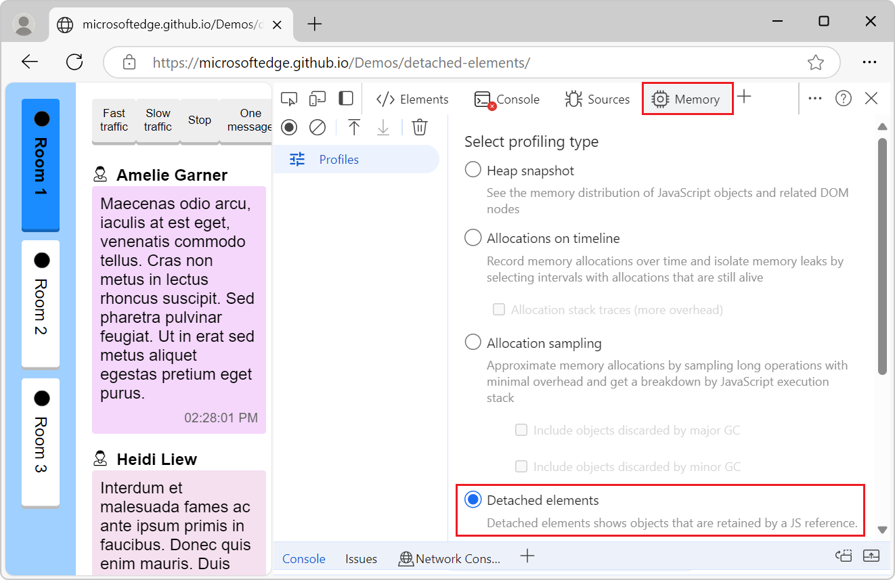
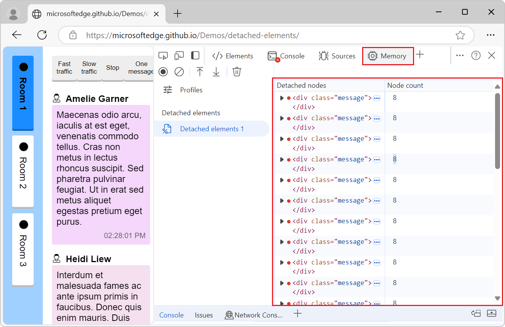
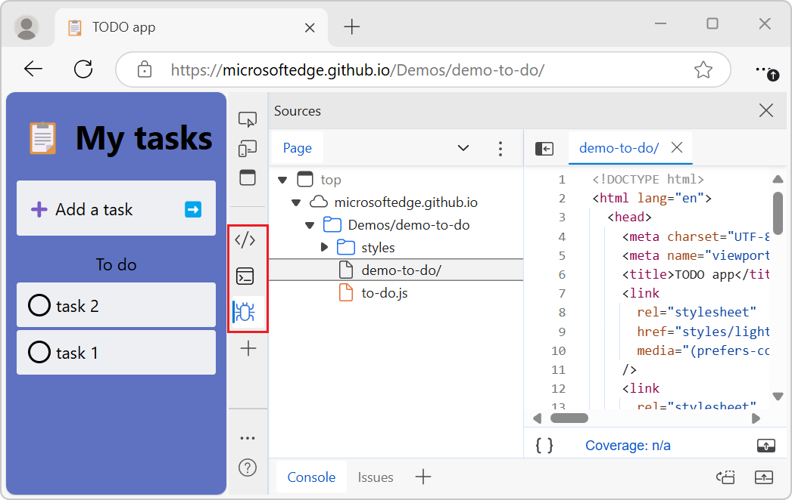
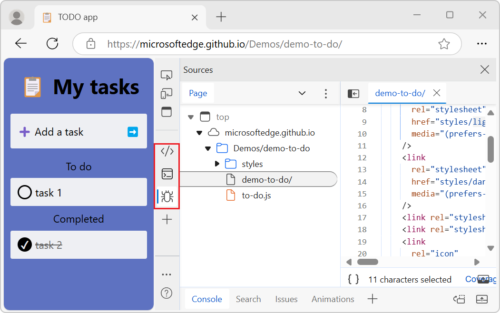
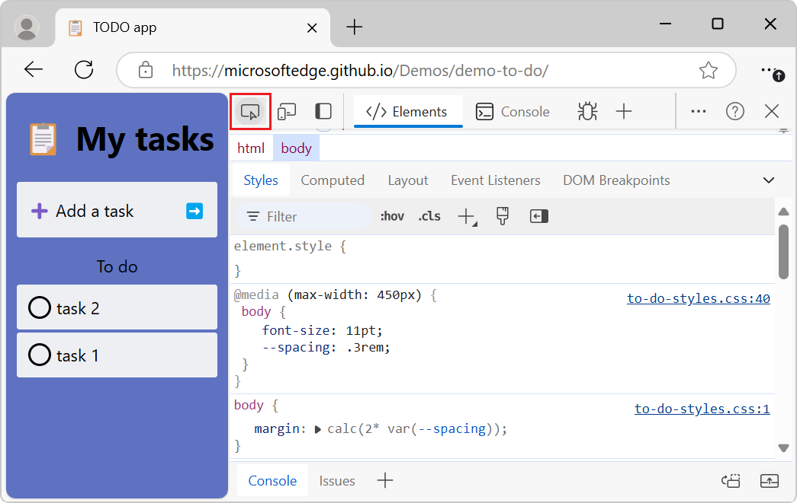
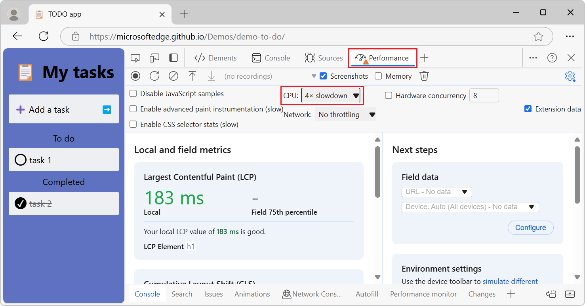
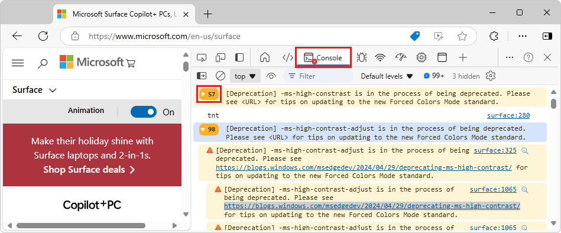
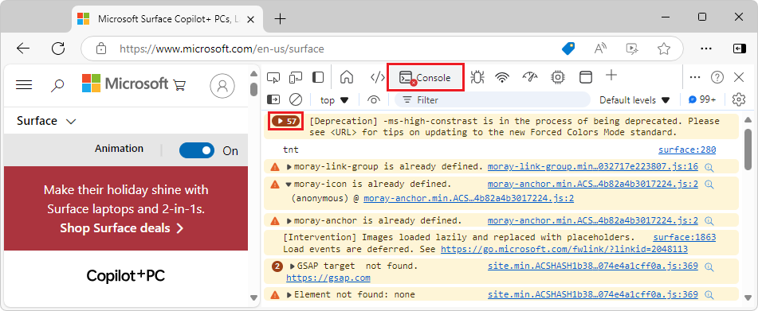

# What's New in DevTools (Microsoft Edge 130)

These are the latest features in the Stable release of Microsoft Edge DevTools.

<!-- ====================================================================== -->
## Detached Elements profiling type in Memory tool

<!-- Subtitle: Detached elements helps you fix memory leaks due to detached DOM elements.-->

The **Memory** tool has a new profiling type called **Detached elements**, which shows detached objects that are retained by a JavaScript reference:

The **Detached elements** profiling type shows a view of the detached nodes to help you identify memory leaks on your webpage:

See also:
* [Debug DOM memory leaks with the Detached Elements feature](../../../memory-problems/dom-leaks.md)

<!-- ====================================================================== -->
## Improved names of JavaScript objects in heap snapshots

<!-- Plain JavaScript objects are named, categorized, and searchable based on the properties they contain.-->

To help differentiate plain JavaScript objects in the **Object** category, they are now named and categorized based on the properties they contain.  These names are also searchable if you press **Ctrl+F**.

See also:
* [Record heap snapshots using the Memory tool](../../../memory-problems/heap-snapshots.md)

<!-- ====================================================================== -->
## Create a collection or environment in Network Console

<!-- Subtitle: Use collections and environments to manage API requests and its values and variables. -->

Previously, in the **Network Console** tool, when you tried to create a new collection or environment, it was unresponsive and wouldn't save after pressing **Enter**.  This bug is fixed and functionality has been restored.

See also:
* [Compose and send web API requests using the Network Console tool](../../../network-console/network-console-tool.md)

<!-- ====================================================================== -->
## Fixed icon alignment in vertical Activity Bar

<!-- Subtitle: Icons in the Activity Bar are properly aligned horizontally. -->

When the **Activity Bar** was vertical, the icons were left-aligned:

This has been fixed:

See also:
* [Overview of the user interface](../../../overview.md#overview-of-the-user-interface) in _Overview of DevTools_.

<!-- ====================================================================== -->
## Removed circle shadow when hover over toolbar icons

<!-- Subtitle: Icons in toolbars show only a square shadow when hovered over, instead of a circular shadow as well. -->

Many icons in the **Activity Bar** and other toolbars showed an overlapping circle and square shadow when you hovered over them:

The double shadow has been removed, and the icon only shows the square shadow when you hover over it:

See also:
* [Overview of the user interface](../../../overview.md#overview-of-the-user-interface) in _Overview of DevTools_.

<!-- ====================================================================== -->
## Performance tool tab warning icon when throttling

<!-- Subtitle: The Performance tab icon gets a warning icon when throttling is enabled. -->

When throttling is enabled in **Device Emulation**, a warning icon is displayed in the **Performance** tab of the toolbar to help you know that performance is impacted by throttling:

See also:
* [Throttle the network and CPU](../../../device-mode/index.md#throttle-the-network-and-cpu) in _Emulate mobile devices (Device Emulation)_.

<!-- ====================================================================== -->
## Console's Warnings count button has increased contrast

<!-- Subtitle: The warning icon and expand button on warning messages in the Console now meet the standard luminosity ratio of 3:1.-->

In the **Console** tool, the Warning count expander button on warning messages in the **Console** previously didn't meet the standard luminosity ratio of 3:1.

This has now been fixed; the Warning count expander button has a higher luminosity ratio:

See also:
* [Inspect and filter information on the current webpage](../../../console/index.md#inspect-and-filter-information-on-the-current-webpage) in _Console overview_.

<!-- ====================================================================== -->
## Announcements from the Chromium project

Microsoft Edge 130 also includes the following updates from the Chromium project:

* [Network panel improvements](https://developer.chrome.com/blog/new-in-devtools-130#network)
   * [Network filters reimagined](https://developer.chrome.com/blog/new-in-devtools-130#network-filters)
   * [HAR exports now exclude sensitive data by default](https://developer.chrome.com/blog/new-in-devtools-130#har)
* [Elements panel improvements](https://developer.chrome.com/blog/new-in-devtools-130#elements)
   * [Autocomplete values for text-emphasis-* properties](https://developer.chrome.com/blog/new-in-devtools-130#autocomplete)
   * [Scroll overflows marked with a badge](https://developer.chrome.com/blog/new-in-devtools-130#scroll-badge)
   * [Bare declarations after nested rules don't "shift up"](https://developer.chrome.com/blog/new-in-devtools-130#css-nesting)
* [Performance panel improvements](https://developer.chrome.com/blog/new-in-devtools-130#perf)
   * [Recommendations in live metrics](https://developer.chrome.com/blog/new-in-devtools-130#live-metrics-recommendations)
   * [Navigate breadcrumbs](https://developer.chrome.com/blog/new-in-devtools-130#breadcrumbs)
* [Turn off dynamic theming](https://developer.chrome.com/blog/new-in-devtools-130#dynamic-theming)

<!-- ====================================================================== -->
<!-- uncomment if content is copied from developer.chrome.com to this page -->

<!-- > [!NOTE]
> Portions of this page are modifications based on work created and [shared by Google](https://developers.google.com/terms/site-policies) and used according to terms described in the [Creative Commons Attribution 4.0 International License](https://creativecommons.org/licenses/by/4.0).
> The original page for announcements from the Chromium project is [What's New in DevTools (Chrome 130)](https://developer.chrome.com/blog/new-in-devtools-130) and is authored by Sofia Emelianova. -->

<!-- ====================================================================== -->
<!-- uncomment if content is copied from developer.chrome.com to this page -->

<!-- 
This work is licensed under a [Creative Commons Attribution 4.0 International License](https://creativecommons.org/licenses/by/4.0). -->

<!-- ====================================================================== -->
## See also

* [What's New in Microsoft Edge DevTools](../../whats-new.md)
* [Release notes for Microsoft Edge web platform](../../../../web-platform/release-notes/index.md)
