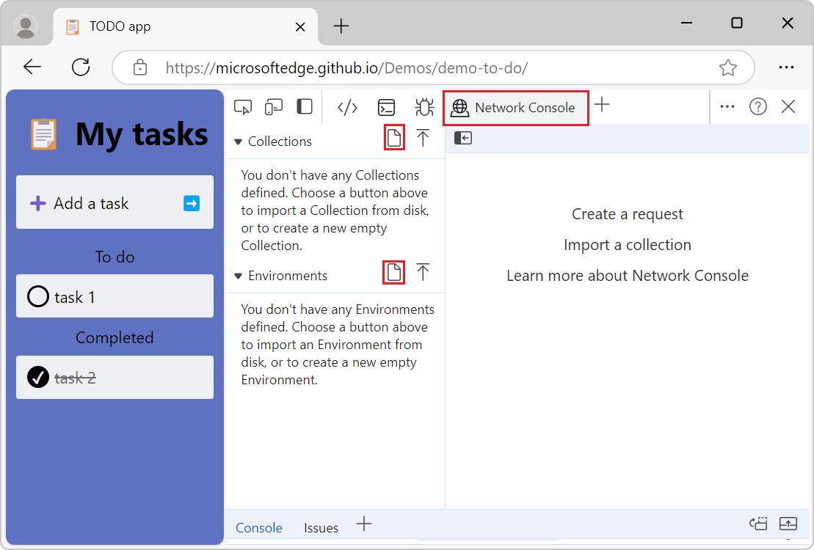
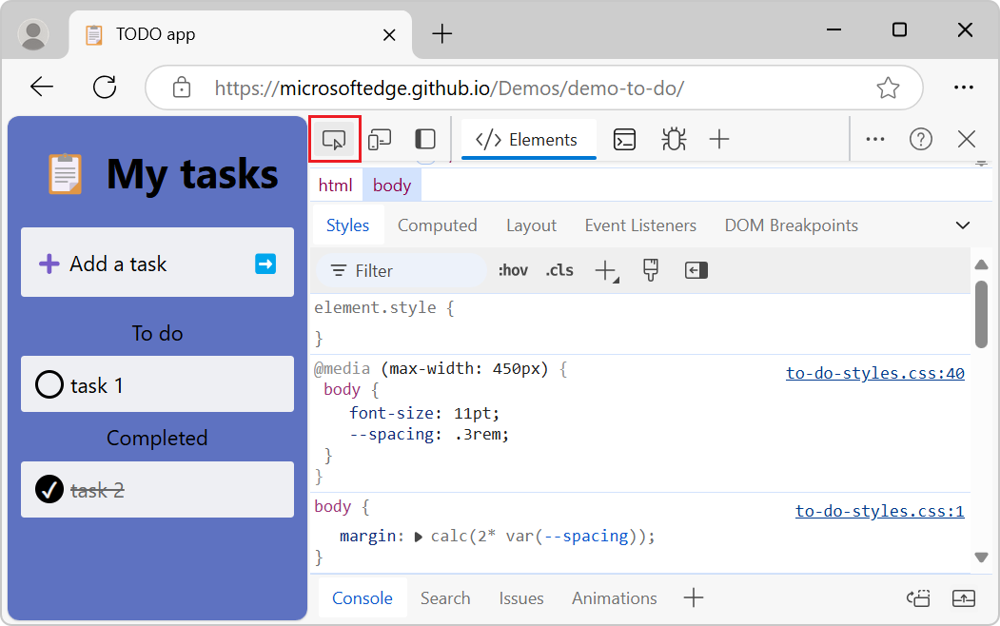

# What's New in DevTools (Microsoft Edge 130)

[!INCLUDE [Microsoft Edge team note for top of What's New](../../includes/edge-whats-new-note.md)]

<!-- ====================================================================== -->
## New Detached elements profile in the Memory tool

<!-- Subtitle: Detached elements helps you fix memory leaks due to detached DOM elements.-->

The **Memory** tool has a new profile type called Detached elements which shows detached objects that are retained by a JavaScript reference. 

This shows a view of the detached nodes to help you identify memory leaks on your webpage.

<!-- ====================================================================== -->
## Improved names of plain JavaScript objects in heap snapshots

<!-- Plain JavaScript objects are named, categorized, and searchable based on the properties they contain.-->

To help differentiate plain JavaScript objects in the `Object` category, they are now named and categorized based on the properties they contain. These names are also searchable if you press Ctrl+F. 

<!-- ====================================================================== -->
## Create a collection or environment in Network Console is working again

<!-- Subtitle: Use collections and environments to manage API requests and its values and variables. -->

Previously, in the **Network Console**, when you tried to create a new collection or environment, it was unreponsonsive and wouldn't save after pressing "Enter". This bug is fixed and functionality has been restored.

<!-- ====================================================================== -->
## Bug fixes for icons

<!-- Subtitle: -->

<!-- ------------------------------ -->
#### Fixed icon alignment in the vertical Activity Bar

When the Activity Bar was vertical, the icons were left-aligned:

This has been fixed:

<!-- ------------------------------ -->
#### Fixed double shadows that appeared on hover

Many icons in the Activity Bar and other toolbars showed an overlapping circle and square shadow on hover:

The double shadow has been removed and only shows the square shadow:

<!-- ------------------------------ -->
#### Performance tool icon now shows a warning when throttling is enabled

When throttling is enabled, a warning icon is displayed in the **Performance** tab of the toolbar to help developers know that performance is impacted by throttling. 

<!-- ====================================================================== -->
## Accessibility bug fix: Warning message icon and expand button meets standard luminosity ratio 

<!-- Subtitle: The warning icon and expand button on warning messages in the Console now meet the standard luminosity ratio of 3:1.-->

The warning icon and expand button on warning messages in the **Console** failed to meet the standard luminosity ratio of 3:1. This has now been fixed.

<!-- ====================================================================== -->
## Announcements from the Chromium project

Microsoft Edge 130 also includes the following updates from the Chromium project:

<!-- ====================================================================== -->
<!-- uncomment if content is copied from developer.chrome.com to this page -->

<!-- > [!NOTE]
> Portions of this page are modifications based on work created and [shared by Google](https://developers.google.com/terms/site-policies) and used according to terms described in the [Creative Commons Attribution 4.0 International License](https://creativecommons.org/licenses/by/4.0).
> The original page for announcements from the Chromium project is [What's New in DevTools (Chrome 129)](https://developer.chrome.com/blog/new-in-devtools-129) and is authored by [Sofia Emelianova](https://developers.google.com/web/resources/contributors) (Senior Technical Writer working on Chrome DevTools at Google). -->

<!-- ====================================================================== -->
<!-- uncomment if content is copied from developer.chrome.com to this page -->

<!-- 
This work is licensed under a [Creative Commons Attribution 4.0 International License](https://creativecommons.org/licenses/by/4.0). -->
