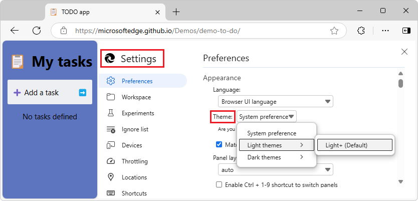
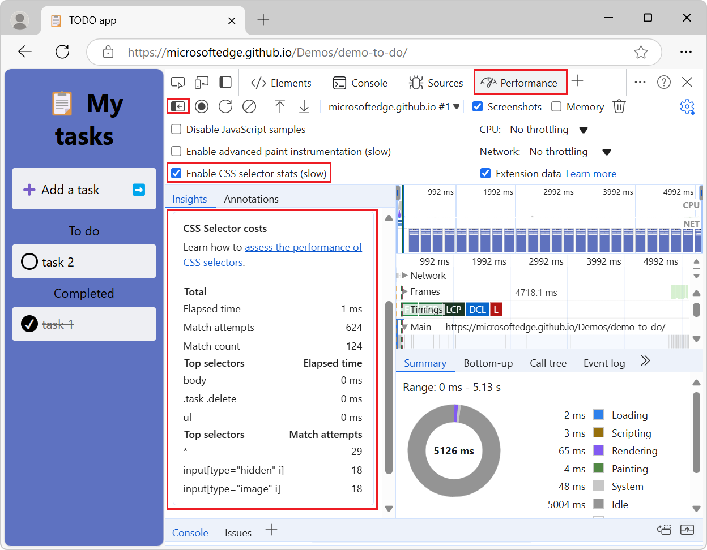

# What's New in DevTools (Microsoft Edge 131)

[!INCLUDE [Microsoft Edge team note for top of What's New](../../includes/edge-whats-new-note.md)]

<!-- ====================================================================== -->
## Visual Studio Code themes are removed

<!-- Subtitle: The Visual Studio Code themes are removed and themes will revert to the default themes: Light+ or Dark+.-->

The Visual Studio Code themes feature is now deprecated.  These themes will revert to the **System preference** theme by default.  The **Light+** and **Dark+** themes continue to be supported.  To select a theme, select **Customize and control DevTools** > **Preferences** > **Theme** drop-down menu:

See also:
* [Check for contrast issues with dark theme and light theme](../../../../devtools-guide-chromium/accessibility/test-dark-mode.md)

<!-- ====================================================================== -->
## Edge experiment settings can be disabled

<!-- Go to Settings > Experiments to enable or disable any experiments you choose. -->

Previously, the following experiments that were enabled by default couldn't be disabled, even after clearing their checkboxes in the **Settings > Experiments** page and reloading DevTools:
* **Enable webhint**
* **Show issues in Elements**
* **Open source files in Visual Studio Code**

This is now fixed, and you can disable these experiments.

See also:
* [Enable webhint](../../../experimental-features/index.md#enable-webhint) in _Experimental features in Microsoft Edge DevTools_.
* [Show issues in Elements](../../../experimental-features/index.md#show-issues-in-elements) in _Experimental features in Microsoft Edge DevTools_.
* [Open source files in Visual Studio Code](../../../experimental-features/index.md#open-source-files-in-visual-studio-code) in _Experimental features in Microsoft Edge DevTools_.

<!-- ====================================================================== -->
## View CSS selector costs in the Performance tool sidebar

<!-- When the "Enable CSS selector stats (slow)" setting is turned on, view selector stats information in the left sidebar of the Performance tool.-->

The left sidebar in the **Performance** tool displays the costs of CSS selectors in the **Insights** tab:

To view CSS selector costs:

1. In the **Performance** tool, click the **Capture settings** () button, and then select the **Enable CSS selector stats (slow)** checkbox.

1. Take a performance recording.

1. If the **Insights** tab isn't displayed, click the **Show sidebar** () button, and then click the **Insights** tab.

1. Click the **CSS Selector costs** button to expand its section.

See also:
* [Analyze CSS selector performance during Recalculate Style events](../../../performance/selector-stats.md)

<!-- ====================================================================== -->
## Fixed edit field to exit after pressing Tab after auto-completion

<!-- Press Tab after choosing an autocomplete option to exit the field.-->

<!-- todo: where in DevTools?  which tools? -->

Pressing the **Tab** key after auto-completion now exits the edit field and focuses on the next focus point.  Before, pressing **Tab** would just indent the text.

<!-- todo 
See also:
* 
-->

<!-- ====================================================================== -->
## Announcements from the Chromium project

Microsoft Edge 131 also includes the following updates from the Chromium project:

* [Performance panel improvements](https://developer.chrome.com/blog/new-in-devtools-131#perf)
   * [Annotate and share performance findings](https://developer.chrome.com/blog/new-in-devtools-131#annotations)
   * [Get performance insights right in the Performance panel](https://developer.chrome.com/blog/new-in-devtools-131#insights)
   * [Spot excessive layout shifts easier](https://developer.chrome.com/blog/new-in-devtools-131#cls)
   * [Spot the non-composited animations](https://developer.chrome.com/blog/new-in-devtools-131#animations)
   * [Hardware concurrency moves to Sensors](https://developer.chrome.com/blog/new-in-devtools-131#hardware-concurrency)
* [Ignore anonymous scripts and focus on your code in stack traces](https://developer.chrome.com/blog/new-in-devtools-131#ignore-list)
* [Elements > Styles: Support for sideways-* writing modes for grid overlays and CSS-wide keywords](https://developer.chrome.com/blog/new-in-devtools-131#styles)

<!-- ====================================================================== -->
<!-- uncomment if content is copied from developer.chrome.com to this page -->

<!-- > [!NOTE]
> Portions of this page are modifications based on work created and [shared by Google](https://developers.google.com/terms/site-policies) and used according to terms described in the [Creative Commons Attribution 4.0 International License](https://creativecommons.org/licenses/by/4.0).
> The original page for announcements from the Chromium project is [What's New in DevTools (Chrome 131)](https://developer.chrome.com/blog/new-in-devtools-131) and is authored by Sofia Emelianova. -->

<!-- ====================================================================== -->
<!-- uncomment if content is copied from developer.chrome.com to this page -->

<!-- 
This work is licensed under a [Creative Commons Attribution 4.0 International License](https://creativecommons.org/licenses/by/4.0). -->
