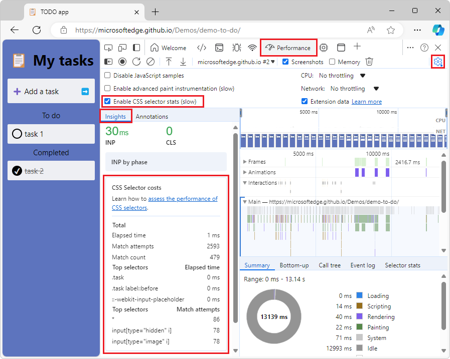

# What's New in DevTools (Microsoft Edge 131)

[!INCLUDE [Microsoft Edge team note for top of What's New](../../includes/edge-whats-new-note.md)]

<!-- ====================================================================== -->
## Visual Studio Code themes are removed

<!-- Subtitle: The Visual Studio Code themes are removed and themes will revert to the default themes: Light+ or Dark+.-->

The Visual Studio Code themes feature is now deprecated. These themes will revert to the "System preference" theme by default. The Light+ and Dark+ themes will continue to be supported.

<!-- ====================================================================== -->
## Edge experiment settings can be disabled

<!-- Go to Settings > Experiments to enable or disable any experiments you choose. -->

Previously, the "Enable webhint", "Show issues in Elements", and "Open source files in Visual Studio Code" experiments that were enabled by default could not be disabled, even after unchecking them on the **Settings > Experiments** page and reloading DevTools. This is now fixed and you can disable these experiments.

<!-- ====================================================================== -->
## View CSS selector stats information in the Insights tab of the sidebar panel in the Performance tool

<!-- When the "Enable CSS selector stats (slow)" setting is turned on, view selector stats information in the left sidebar of the Performance tool.-->

The left sidebar in the **Performance** tool includes information about CSS selector costs in the Insights tab. To view this, select the "Enable CSS selector stats (slow)" setting and take a performance recording, then open the sidebar and expand the CSS Selector costs section.

<!-- ====================================================================== -->
## Fixed edit field to exit after pressing tab after auto-completion

<!-- Press Tab after choosing an autocomplete option to exit the field.-->

Pressing Tab after auto-completion now exits the edit field and focuses on the next focus point. Before, pressing tab would just indent the text.

<!-- ====================================================================== -->
## Announcements from the Chromium project

Microsoft Edge 131 also includes the following updates from the Chromium project:

<!-- ====================================================================== -->
<!-- uncomment if content is copied from developer.chrome.com to this page -->

<!-- > [!NOTE]
> Portions of this page are modifications based on work created and [shared by Google](https://developers.google.com/terms/site-policies) and used according to terms described in the [Creative Commons Attribution 4.0 International License](https://creativecommons.org/licenses/by/4.0).
> The original page for announcements from the Chromium project is [What's New in DevTools (Chrome 130)](https://developer.chrome.com/blog/new-in-devtools-130) and is authored by Sofia Emelianova. -->

<!-- ====================================================================== -->
<!-- uncomment if content is copied from developer.chrome.com to this page -->

<!-- 
This work is licensed under a [Creative Commons Attribution 4.0 International License](https://creativecommons.org/licenses/by/4.0). -->
