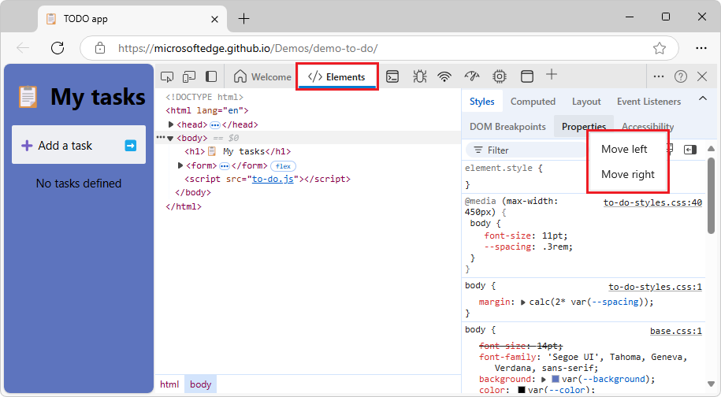
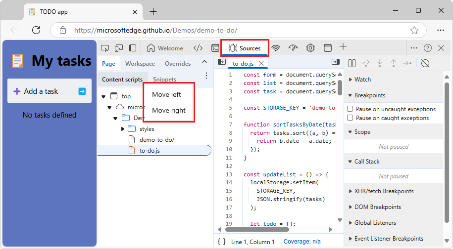

# What's New in DevTools (Microsoft Edge 133)

[!INCLUDE [Microsoft Edge team note for top of What's New](../../includes/edge-whats-new-note.md)]

<!-- ====================================================================== -->
## Move a tab left or right within the Elements or Sources tool

<!-- Subtitle: Move a tab left or right within a tab group in the Elements or Sources tool by right-clicking the tab. -->

Previously, within the **Elements** tool and **Sources** tool, you could rearrange the tabs within a tab group only by dragging them.  Dragging a tab can be difficult when using a trackball, head pointer, or keyboard.  Now, you can also move a tab by right-clicking the tab (or pressing the **Context menu** key) and then selecting **Move left** or **Move right**.

Right-clicking a tab within the **Elements** tool:

Right-clicking a tab within the **Sources** tool:

<!-- ====================================================================== -->
## Screen reader support improvements

<!-- Subtitle: Screen reader support improvements in Developer resources, Elements, and CSS overview.-->

Support for screen readers has been improved for various tools.

<!-- ------------------------------ -->
#### Developer resources tool

In the **Developer resources** tool, after you search by using the **Filter by URL and error** text box, screen readers announce the results information.  If no results are available, screen readers announce **no resource matches**:

<!-- ------------------------------ -->
#### Elements tool

In the **Elements** tool, screen readers announce the expanded or collapsed state of the **More tabs** button and tab group, shown here in the expanded state:

<!-- ------------------------------ -->
#### CSS overview tool

In the **CSS overview** tool, when navigating to a tab, screen readers announce the tab label.  After entering that tab and then navigating to an **occurrences** button, screen readers announce the button's label, such as "Two occurrences":

<!-- ====================================================================== -->
## Announcements from the Chromium project

Microsoft Edge 133 also includes the following updates from the Chromium project:

* [Performance panel improvements](https://developer.chrome.com/blog/new-in-devtools-133#perf)
   * [Image delivery insight](https://developer.chrome.com/blog/new-in-devtools-133#perf-image-delivery)
   * [Classic and modern keyboard navigation](https://developer.chrome.com/blog/new-in-devtools-133#perf-nav)
   * [Ignore irrelevant scripts in the flame chart](https://developer.chrome.com/blog/new-in-devtools-133#ignore-list)
   * [Timeline marker and range highlighting on hover](https://developer.chrome.com/blog/new-in-devtools-133#hover-highlight)
   * [Recommended throttling settings](https://developer.chrome.com/blog/new-in-devtools-133#throttling)
   * [Timings markers in an overlay](https://developer.chrome.com/blog/new-in-devtools-133#markers)
   * [Stack traces of JavaScript calls in Summary](https://developer.chrome.com/blog/new-in-devtools-133#perf-stack-traces)
* [Badge settings moved to menu in Elements](https://developer.chrome.com/blog/new-in-devtools-133#badge-settings)
 

<!-- ====================================================================== -->
<!-- uncomment if content is copied from developer.chrome.com to this page -->

<!-- > [!NOTE]
> Portions of this page are modifications based on work created and [shared by Google](https://developers.google.com/terms/site-policies) and used according to terms described in the [Creative Commons Attribution 4.0 International License](https://creativecommons.org/licenses/by/4.0).
> The original page for announcements from the Chromium project is [What's New in DevTools (Chrome 133)](https://developer.chrome.com/blog/new-in-devtools-133) and is authored by Sofia Emelianova. -->

<!-- ====================================================================== -->
<!-- uncomment if content is copied from developer.chrome.com to this page -->

<!-- 
This work is licensed under a [Creative Commons Attribution 4.0 International License](https://creativecommons.org/licenses/by/4.0). -->
