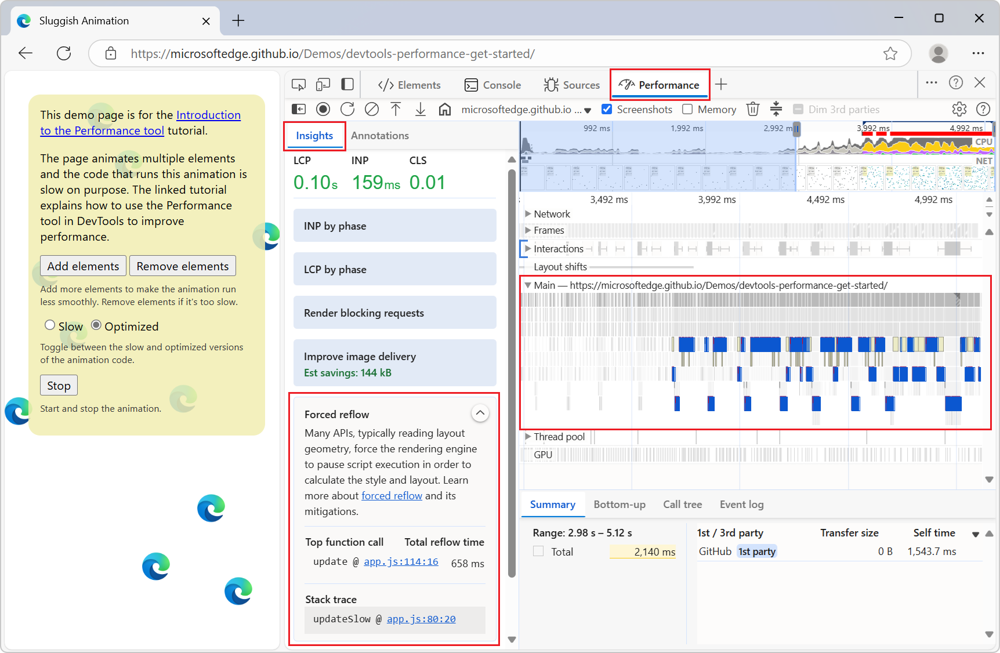
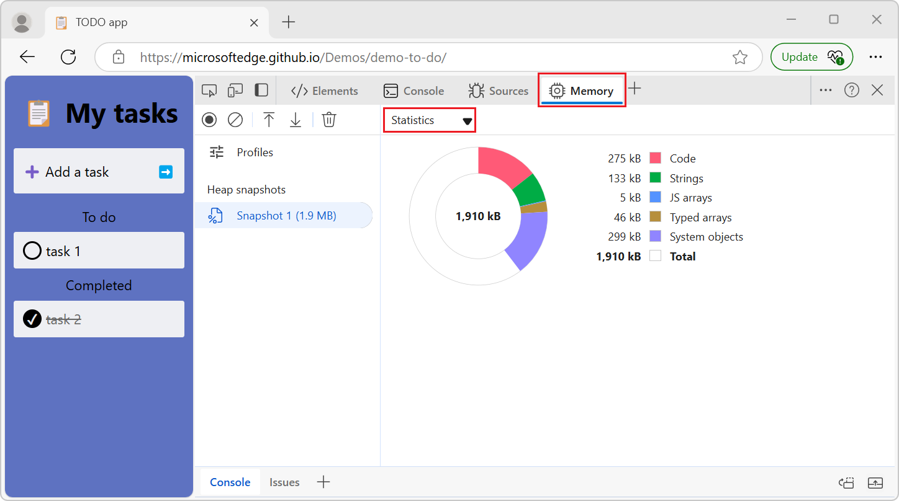
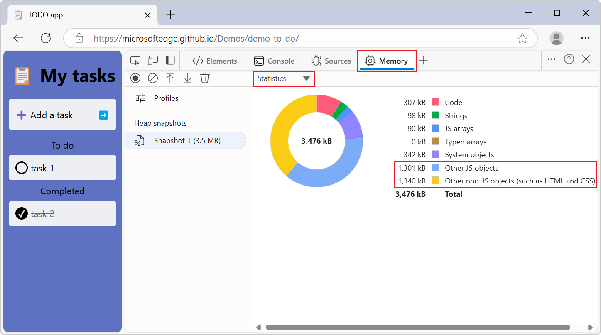
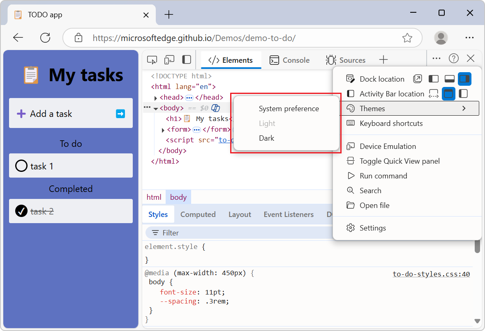

# What's New in DevTools (Microsoft Edge 134)

These are the latest features in the Stable release of Microsoft Edge DevTools.

<!-- ====================================================================== -->
## Forced reflow in the Performance Insights sidebar

<!-- Subtitle: View the top function call and its total reflow time in your performance trace. -->

The Performance Insights sidebar now includes a new section called Forced Reflow. This insight highlights the most time-consuming function call, showing its total reflow time and related stack traces. By clicking on this insight, you can see the function call and its stack trace highlighted in the Main frame.

<!-- ====================================================================== -->
## Heap snapshot statistics account for every byte  

<!-- Subtitle: View a memory allocation pie chart of your heap snapshot under Statistics-->

When you take a heap snapshot in the Memory tool, the Statistics pie chart doesn't show every byte in the categories, resulting in blank parts of the chart. Two new catch-all categories have been added for the rest of the bytes in the heap snapshot: Other JS objects and Other non-JS objects(such as HTML and CSS).

Before:

After:

<!-- ====================================================================== -->
## DevTools theme menu is simplified 

<!-- Subtitle: Change DevTools theme by clicking Customize and control DevTools > Themes. Choose from Light or Dark. -->

The theme options have been simplified by removing the redundant nesting options. When you go to Customize and control DevTools > Themes, the options have been simplified to System preference, Light, Dark.

<!-- ====================================================================== -->
## Announcements from the Chromium project

Microsoft Edge 134 also includes the following updates from the Chromium project:

<!-- ====================================================================== -->
## See also

* [What's New in Microsoft Edge DevTools](../../whats-new.md)
* [Release notes for Microsoft Edge web platform](../../../../web-platform/release-notes/index.md)
