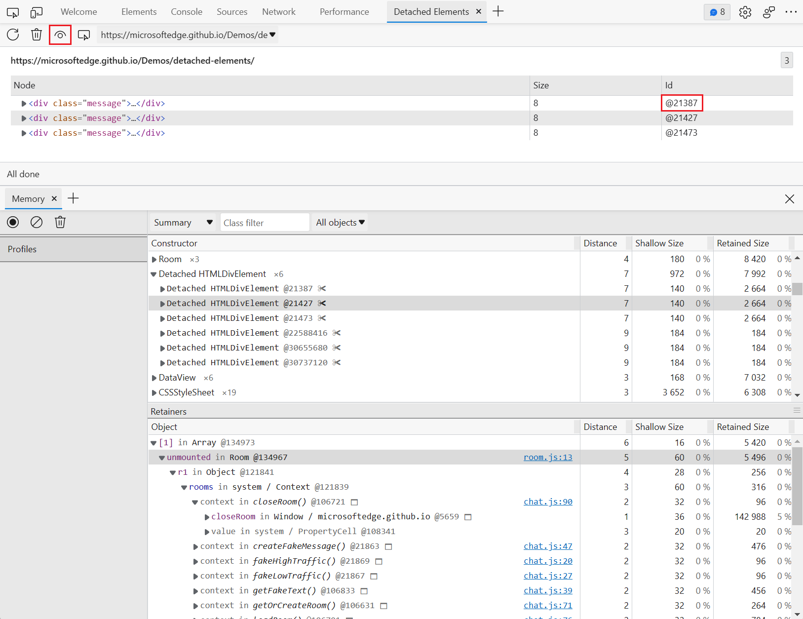

# Reasons to use Microsoft Edge DevTools

The Microsoft Edge DevTools team has added a lot of features based on feedback we received from the community to enhance the experience of Developers.  Here is a list of features that are unique to Microsoft Edge, available on Windows, Mac and Linux.

<!-- ====================================================================== -->
## Ease of use

The developer tools in the browser grew organically over the years.  They can be overwhelming, and sometimes it can be hard to find the feature you're looking for.  So we've been working to ease new users into the tools by providing an improved documentation system.  For seasoned users, we've been making it easier to customize the tools to adapt them to your needs.

### Open and close tools easily

By clicking the `+` button on the main toolbar or the Drawer toolbar, you can add tools without having to use the **Customize and control DevTools** `…` menu. You can activate the `x` button on any tool tab to remove the tool. Some tools like Elements, Sources and Console can't be closed and don't show an `x`.

Adding a new tool to a menu bar by activating the + button and selecting it:

<!-- new png for this article, dummy content; update the content -->

Removing a tool by activating the x button on the tab of the tool:

<!-- new png for this article, dummy content; update the content -->

### Move tools around in the UI
 
By right-clicking any tab in the main toolbar or Drawer toolbar, you can move a tool from the top to the bottom panel, and vice versa.

Moving a tool to the bottom drawer using the right-click menu:

<!-- new png for this article, dummy content; update the content -->

The tool now appears on the bottom drawer:

<!-- new png for this article, dummy content; update the content -->

### Focus Mode with Activity Bar and Quick View tool menu

**Focus Mode** makes the DevTools UI even easier to use.  The Microsoft Edge DevTools team learned through user interviews and feedback sessions that the number of tools displayed at a given time can be overwhelming.  This is why we introduced Focus Mode, which groups a large set of features for related tasks into various tool panels, and then allows you to show only the tools that you need for your current activity or work mode.

Focus mode showing only tools related to Elements Debugging:

<!-- new png for this article, dummy content; update the content -->

Focus mode showing only tools related to Source editing:

<!-- new png for this article, dummy content; update the content -->

<!--
uncomment later

### Tooltips Help Documentation mode

To learn about each tool, enable Tooltips mode, which is a Help mode with links to documentation.  In Focus Mode, you can turn on the Tooltips Mode, which allows you to learn more about the different tools by selecting the various tool tabs in DevTools.

Tool explanations shown when Tooltips mode is enabled:

the above is a new png for this article, dummy content; update the content

-->

<!-- ====================================================================== -->
## Customization

### Change the UI language

You can choose a different User Interface language for Microsoft Edge DevTools.  Our usage data shows that users of DevTools come from all over the world, so it made sense to offer them in different languages.

Microsoft Edge Developer Tools displayed in German:

<!-- new png for this article, dummy content; update the content -->

Microsoft Edge Developer Tools displayed in Japanese:

<!-- new png for this article, dummy content; update the content -->

### Change the color theme

You can choose a different color theme.  Themes can make your user experience much better, and you can change the look of DevTools to your needs.

Switching to a different theme in DevTools Settings:

<!-- new png for this article, dummy content; update the content -->

Microsoft Edge DevTools displayed in the Monokai theme:

<!-- new png for this article, dummy content; update the content -->

<!-- ====================================================================== -->
## Unique tools

These web development tools are only available in Microsoft Edge DevTools.

### Detached Elements panel

The **Detached Elements** panel is a tool that was built on feedback from a Microsoft team that needed to find out about memory leaks in one of our products.  You can find out what elements are using up memory even though they aren't part of the DOM any longer.

The Detached Elements panel showing elements that need to be removed from memory:

<!-- png exists; the above png was created for this file by copying & renaming  -->

The following screenshot is from [Introducing the Detached Elements tool](whats-new/2022/01/devtools.md#introducing-the-detached-elements-tool) in _What's New in DevTools (Microsoft Edge 97)_:

The Detached Elements tool:

<!-- png exists, in whatsnew dir; see paragraph above -->

The following screenshot is from [Identify the JavaScript code that retains detached elements](memory-problems/dom-leaks.md#identify-the-javascript-code-that-retains-detached-elements) in _Debug DOM memory leaks with the Detached Elements tool_:

Analyze Detached Elements in the Detached Elements tool:

<!-- png exists, in mem probs dir; see paragraph above -->

For information about the Detached Elements tool, see [Debug DOM memory leaks with the Detached Elements tool](memory-problems/dom-leaks.md).

### Console error search

In user studies we found that people often copy and paste error messages from the Console to a search engine to find out more about the problem.  We added an icon to these Console messages to make that easier.

Console with highlighted search icon that would open a web search with the error message in a new browser tab:

<!-- new png for this article, dummy content; update the content -->

### 3D View

The **3D View** tool displays either the DOM, the composited layers of a webpage, or the parts of a webpage page that have a z-index assigned to them, as a 3-dimensional representation in an interactive user interface.  This dynamic view allows you to gauge the complexity of your webpage products and find out about memory problems.

The present document displayed in the 3D View tool, showing the depth of the Document Object Model:

<!-- the above png exists, was copied from  -->

<!-- 
image from
[3D View tool supports changing color themes in DevTools](whats-new/2022/01/devtools.md#3d-view-tool-supports-changing-color-themes-in-devtools) in _What's New in DevTools (Microsoft Edge 97)_.

png exists, used by the above article, remotely linked/borrowed here
-->

See [Navigate z-index, DOM, and layers using the 3D View tool](3d-view/index.md).

### Integration with webhint

The **Issues** tool automatically shows you all the things that need fixing in the current webpage.  Under the hood, the **Issues** tool uses [webhint](https://webhint.io), which is a testing tool for the web, that generates reports and provides reporting on various issues.  You not only learn what's wrong with your webpage, but also why it's a problem, where in your webpage the problem exists, and how to fix the issue.

Current problems of a webpage displayed in the Issues panel:

<!-- valid good new png content - 
the above is a new png for the present article with fresh capture -->

### Integration of Microsoft Edge DevTools with Visual Studio Code

When you're debugging a problem with your webpage, it's cumbersome to change from a code editor, to the browser, then using DevTools in the browser to analyze the problem, and then going back to try a possible fix of the problem in your source code.  This is why we created a Visual Studio Code extension that embeds Microsoft Edge DevTools into your code editor workflow. 

For example, without integrated tools, you temporarily fix CSS style rules in your transient, resulting webpage files that are sent from your development server to your browser, and then you have to remember the changes, and then re-apply those changes to your actual source code in your source files, over in your code editor.

Now, by using the Microsoft Edge DevTools extension for Visual Studio Code, you can simply use Microsoft Edge DevTools to change your source code directly within an instance of DevTools that's running in the IDE environment of Visual Studio Code.<!-- condense end -->

Microsoft Edge DevTools integrated into Visual Studio Code:

<!-- new png for this article, dummy content; update the content -->

<!--
uncomment later

### Network Console

Inspecting the network traffic of your web product is already insightful, but often you need to make some changes to the requests to see why they fail.  Using the Network Console, you can change and replay any of the requests, and you can make detailed API calls.

Network Console showing options for changing a network call:

the above is a created png for the present article with placeholder content

-->

<!-- ====================================================================== -->
## Next steps

As a demo tour of Microsoft Edge DevTools, open these demo webpages and follow the steps in the linked articles:

* [Sample code for DevTools](sample-code/sample-code.md)

<!--
* [Demo tour of DevTools](demo-tour/demo-tour-of-microsoft-edge-devtools.md)
-->
<!-- icon tagging & images: [Overview of DevTools](index.md) -->
