<!-- Copyright Kayce Basques

   Licensed under the Apache License, Version 2.0 (the "License");
   you may not use this file except in compliance with the License.
   You may obtain a copy of the License at

       https://www.apache.org/licenses/LICENSE-2.0

   Unless required by applicable law or agreed to in writing, software
   distributed under the License is distributed on an "AS IS" BASIS,
   WITHOUT WARRANTIES OR CONDITIONS OF ANY KIND, either express or implied.
   See the License for the specific language governing permissions and
   limitations under the License.  -->
# Edit and save files in a workspace
<!-- https://developer.chrome.com/docs/devtools/workspaces -->

To save edits to webpage source files, you can use DevTools like an IDE, by adding the source code folder of the webpage in the **Workspace** tab of the **Sources** tool.  You can then edit and save HTML, CSS, and JS files in the **Sources** tool's editor, or in the **Quick source** tool in the **Quick View** panel at the bottom of DevTools.

You can create, copy, rename, and delete source files from within the **Workspace** tab.

Use the **Workspace** tab in the **Sources** tool to define a workspace, to save DevTools changes in your source code files rather than only in a transient copy of the files that are returned by the web server.

This tutorial provides hands-on practice in setting up and using a workspace in DevTools.  After you add files to a workspace, changes that you make in your source code by using DevTools are saved on your local computer.  These changes are preserved across page refreshes.

See also:
* [Getting started with the web](https://developer.mozilla.org/docs/Learn/Getting_started_with_the_web) - How to use HTML, CSS, and JavaScript to build a web page. 
* [Get started viewing and changing CSS](../css/index.md) - How to use DevTools to make basic changes to CSS.
* [Set up a localhost server](../../visual-studio-code/microsoft-edge-devtools-extension/install.md#step-6-set-up-a-localhost-server) in _Installing the DevTools extension for Visual Studio Code_.  How to run a local HTTP web server by using Node.js.
* [Running a simple local HTTP server](https://developer.mozilla.org/docs/Learn/Common_questions/set_up_a_local_testing_server#running_a_simple_local_http_server) in _How do you set up a local testing server?_ - Using Python.


<!-- ====================================================================== -->
## Overview of the DevTools workspace feature
<!-- Overview  https://developer.chrome.com/docs/devtools/workspaces#overview -->

A DevTools _workspace_ is defined by adding the source code folder to the **Workspace** tab of the **Sources** tool.  Use a workspace to save changes that you make to a local copy of the source code to the same file on your computer, so that changes are retained across refreshes of the page.

Here's a typical scenario for using a workspace:

* You have the source code for the demo website on your desktop.

* You are running a local web server from the source code directory, so that the site is accessible at `localhost:8080`.  Note: If you use the Python server option, the default port number is `8000`.

* You opened `localhost:8080` in Microsoft Edge, and you are using DevTools to change the website source code which includes the CSS, HTML, and JavaScript files. 

The tutorial steps below walk you through this environment setup.


<!-- ------------------------------ -->
#### Limitations of the workspace feature with transformed source code
<!-- Limitations  https://developer.chrome.com/docs/devtools/workspaces#limitations -->

If you're using a modern framework, it might transform your source code from a format that's easy to maintain into a format that's optimized to run as quickly as possible.  The **Workspace** tab in the **Sources** tool is usually able to map the optimized code back to the original source code, by using [source maps](https://blog.teamtreehouse.com/introduction-source-maps) for JavaScript and CSS.  However, there's a lot of variation in how each framework uses source maps.

DevTools doesn't support every framework variation; for example, the **Workspace** tab doesn't work with the Create React App framework.

If you run into issues while using workspaces with your framework of choice, or you identify framework-specific steps that are needed, [start a thread in the Chrome DevTools mailing list](https://groups.google.com/forum/#!forum/google-chrome-developer-tools) or [ask a question on Stack Overflow](https://stackoverflow.com/questions/ask?tags=google-chrome-devtools) to exchange information with the rest of the DevTools community.
                                                                     

<!-- ------------------------------ -->
#### Related feature: Local Overrides
<!-- https://developer.chrome.com/docs/devtools/workspaces#overrides -->

**Local overrides** is a DevTools feature that's similar to a workspace.  You can use an override when you want to experiment with changes to a webpage, and you need to display the changes across webpage loads, but you don't care about mapping your changes to the source code of the webpage.  However, your changes aren't saved when you refresh the webpage. 

The **Overrides** feature lets you store a local copy of the webpage files on the server.  When you refresh the page, Microsoft Edge loads the local copy of files instead of the files on the server.

See also:
* [Override webpage resources with local copies (Overrides tab)](../javascript/overrides.md)


<!-- ====================================================================== -->
## Step 1: Setup
<!-- https://developer.chrome.com/docs/devtools/workspaces/#setup -->

* Install an up-to-date version of Node.js and npm from [Node.js](https://nodejs.org).

See also:
* [Install Node.js and Node Package Manager (npm)](../../visual-studio-code/microsoft-edge-devtools-extension/install.md#step-4-install-nodejs-and-node-package-manager-npm) in _Installing the DevTools extension for Visual Studio Code_.


<!-- ------------------------------ -->
#### Set up the workspaces demo
<!-- Set up the demo  https://developer.chrome.com/docs/devtools/workspaces#demo -->

To start this tutorial, in this section, we set up the local directory containing web page source files, and start the localhost test server.


<!-- ---------- -->
###### Clone the Edge Demos repo to your local drive
<!-- Edge heading only -->

To clone the **MicrosoftEdge / Demos** repo to your local drive, including the `/workspaces/` demo folder:

1. Go to [MicrosoftEdge / Demos](https://github.com/MicrosoftEdge/Demos) in a new window or tab.

1. Click the **Code** drop-down button, and then click the **Copy url to clipboard** button.

   The URL is copied to the clipboard: `https://github.com/MicrosoftEdge/Demos.git`

   Or, if you have GitHub Desktop installed, click **Open with GitHub Desktop** to clone the repo, and skip the command prompt step below.

   Or, you can use Visual Studio Code's **Source Control** pane to clone the repo, and skip the command prompt step below.

1. Open a command prompt, such as git bash.

1. Clone the repo to your local drive, entering the URL string that you copied from the GitHub repo.  If you use a command prompt:

   ```Shell
   # example location where the repo directory will be added:
   cd c:/users/localAccount/github/
   git clone https://github.com/MicrosoftEdge/Demos.git
   ```

For details about cloning a repo, see:
* [Cloning a repository](https://docs.github.com/en/repositories/creating-and-managing-repositories/cloning-a-repository) - GitHub docs.

Continue with the next section.


<!-- ---------- -->
###### Start the localhost server
<!-- Edge heading only -->

1. Go to a command prompt, such as the git bash shell, or the Terminal pane in Microsoft Visual Studio Code.

1. Go to the cloned `/workspace/` directory, such as `C:\Users\localAccount\GitHub\Demos\workspaces\`.

   If you use the git bash shell, it's a UNIX shell, so even on Windows, you need to wrap a directory path that has backslashes in quotes, or else use forward slashes rather than backslashes.

1. Run one of the following commands, to start the web server:

   ```bash
   # Node.js option
   cd "C:\Users\localAccount\GitHub\Demos\workspaces\"
   npx http-server  # Node.js
   ```

   For more information and options, see [Start the server (npx http-server)](../../visual-studio-code/microsoft-edge-devtools-extension/install.md#start-the-server-npx-http-server) in _Installing the DevTools extension for Visual Studio Code_.

   ``` bash
   # Python 2 option
   cd "C:\Users\localAccount\GitHub\Demos\workspaces\"
   python -m SimpleHTTPServer  # Python 2
   ```
  
   ``` bash
   # Python 3 option
   cd "C:\Users\localAccount\GitHub\Demos\workspaces\"
   python -m http.server  # Python 3
   ```

1. Open a tab in Microsoft Edge, and go to the locally hosted version of the site.  You should be able to access it by using `localhost:8080`:

   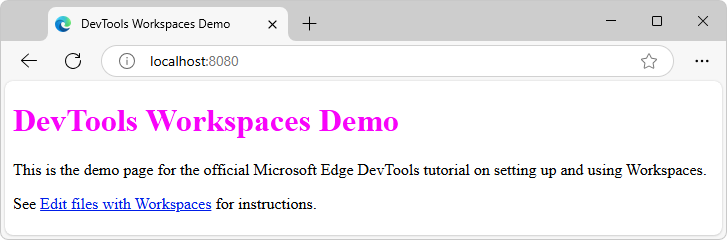
   <!-- todo: in Demos repo change title in link text - or don't b/c will make pngs outdated -->

   Another common equivalent URL is `http://0.0.0.0:8080`.  The default port number for the Python server option is `8000`.  The exact [port number](https://wikipedia.org/wiki/Port_(computer_networking)#Use_in_URLs) might be different.

   The **DevTools Workspaces Demo** webpage opens.

   (The link in the latest demo might say either "Edit file with workspaces" or "Edit and save files in a workspace".)<!-- todo: sync, or keep demo as-is -->

Continue with the next section.


<!-- ------------------------------ -->
#### Add a Workspace folder in the Sources tool
<!-- Set up DevTools  https://developer.chrome.com/docs/devtools/workspaces#devtools -->

<!-- the always-available way -->
Next, define a Workspace in DevTools:

1. Right-click the locally hosted **DevTools Workspaces Demo** webpage and then select **Inspect**.  Or, press **Ctrl+Shift+J** (Windows, Linux) or **Command+Option+J** (macOS).

   DevTools opens.

1. Click the **Sources** () tab.

1. In the **Navigator** pane (on the left), click the **Workspace** tab (which is grouped with the **Page** tab):

   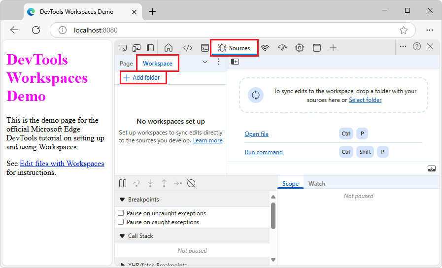

1. Click **Add folder** button.

   The **Select Folder** dialog opens.

1. Go to the cloned `/Demos/workspace/` directory that you created.  For example, in the **Folder:** text box, enter the path, such as `C:\Users\localAccount\GitHub\Demos\workspaces\`.

1. Click the **Select Folder** button.

   DevTools prompts you whether to grant DevTools full access to your `/workspaces/` directory.

1. Click the **Allow** button, to give DevTools permission to read and write to the directory.

   In the **Workspace** tab are page icons that have a green dot, for `index.html`, `script.js`, and `styles.css`. <!--(The two-way arrow colors are mapped to `.html`, `.js`, and `.css` file types.)-->  The green dot indicates that DevTools has established a mapping between a network resource of the page that's received from the web server, and the local source file in your `/Demos/workspace/` directory:

   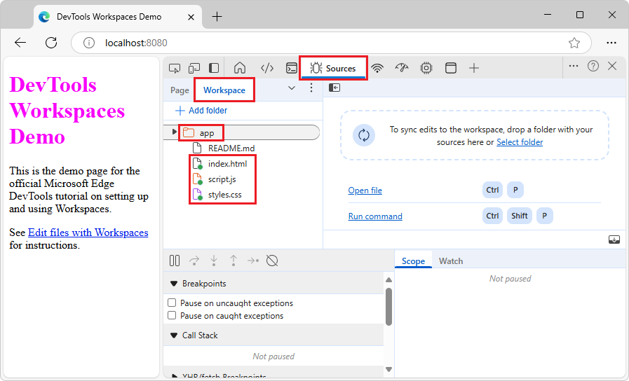

Continue with the next section.


<!-- ====================================================================== -->
## Step 2: Save a CSS change to disk
<!-- https://developer.chrome.com/docs/devtools/workspaces/#css -->

Next, you edit CSS and save changes to the source file.

To make a change in the CSS file and save it to disk:

1. In the **Sources** tool, in the **Workspace** tab (grouped with the **Page** tab), select `styles.css` to open it in the editor pane.  The `color` property of the `h1` element is set to `fuchsia`:

   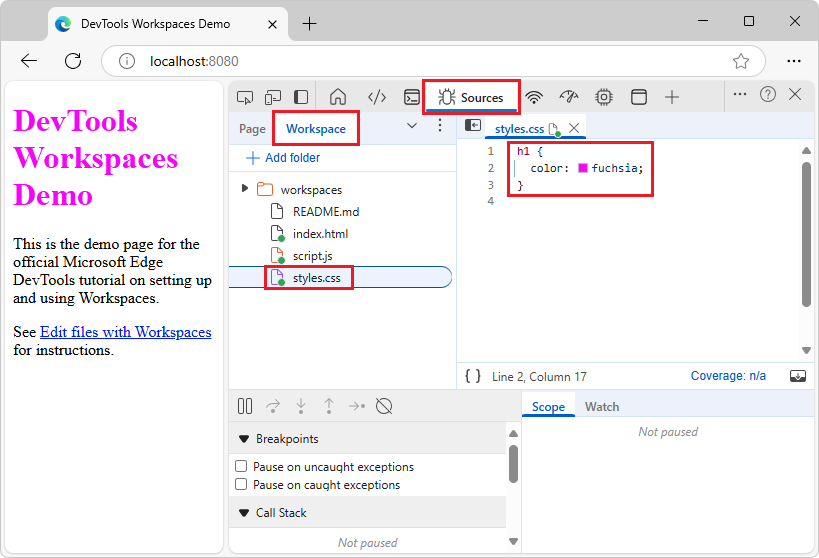

1. Select the **Elements** () tool, and then in the DOM tree, expand the `<body>` element, and then select the `<h1>` element.

   The **Styles** pane displays the CSS rules that are applied to the `<h1>` element.  The **mapped file** () icon next to `styles.css:1` is a page with a green dot.  The green dot means that any changes that you make to this CSS rule are mapped to `styles.css` in your `/Demos/workspace/` directory:

   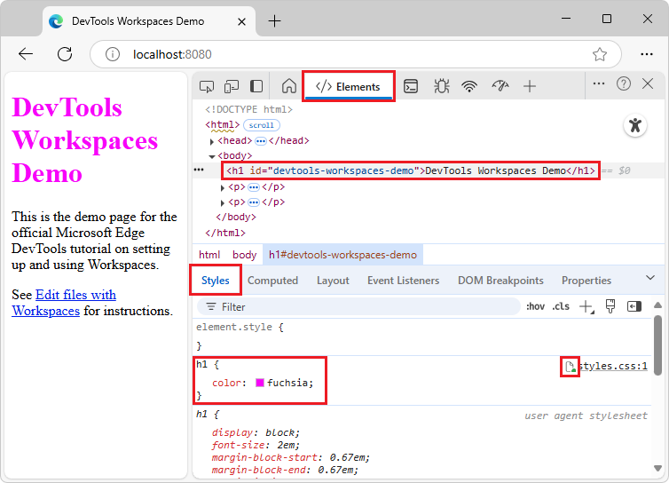

1. Change the value of the `color` property of the `<h1>` element to orange.  To do this, select the `<h1>` element in the **DOM Tree**.  In the CSS rule for `h1`, click `fuchsia`, start typing **orange**, and then select **orange** from the color list:

   

1. Select the **Sources** tool, right-click `styles.css`, and then select **Open in containing folder**.

   File Explorer or Finder opens.

1. Open the copy of `styles.css` that's in your `/Demos/workspace/` directory in a text editor, such as Visual Studio Code.  The `color` property is now set to the new color, which is orange in this example.  The change was not only made in the copy of the file returned from the web server; the change was also made in your mapped file in your `/Demos/workspace/` workspace directory.

1. Refresh the page.

The color of the `<h1>` element is still set to the new color.  The change remains across a refresh, because when you made the change, DevTools saved the change to disk.  When you refreshed the page, your local server served the modified copy of the file from disk.

**Tip:** You can also change the color by clicking the fucshia-colored swatch to open the color picker to pick a new color. The HEX value for the color you pick is the color name.

Continue with the next section.


<!-- ====================================================================== -->
## Step 3: Save an HTML change to disk
<!-- https://developer.chrome.com/docs/devtools/workspaces/#html -->

Next, edit HTML and save changes to the source file.

In the **Elements** tool, it's possible to change HTML tagging in a copy of the file that's returned by the server.  However, to save your edits to a local source file, you need to use the **Sources** tool instead of the **Elements** tool.

Continue with the next section.


<!-- ------------------------------ -->
#### Edited HTML in the DOM tree in the Elements tool isn't preserved after refresh
<!-- #### Try changing HTML from the Elements panel -->
<!-- https://developer.chrome.com/docs/devtools/workspaces#elements -->

To edit an HTML file by using DevTools, use the **Workspace** tab of the **Sources** tool.  There are a couple other tools that display HTML, or allow a temporary edit, but these tools cannot save edits across refreshes of the page:

* The **Page** tab of the **Sources** tool doesn't allow editing an HTML file.
* You can make changes to the HTML content using the DOM tree in the **Elements** tool, but your changes to the DOM tree aren't saved to disk, and only affect the current browser session.

The following steps demonstrate that edits in the DOM tree aren't preserved across page refreshes:

1. Continuing from above, in DevTools, select the **Elements** (`</>`) tool.

1. In the DOM tree, in the `<h1>` element, select the text string `DevTools Workspaces Demo`, delete it, type the text string `I Love Cake`, and then press **Enter**.  The rendered webpage shows the new heading text, **I Love Cake**:

   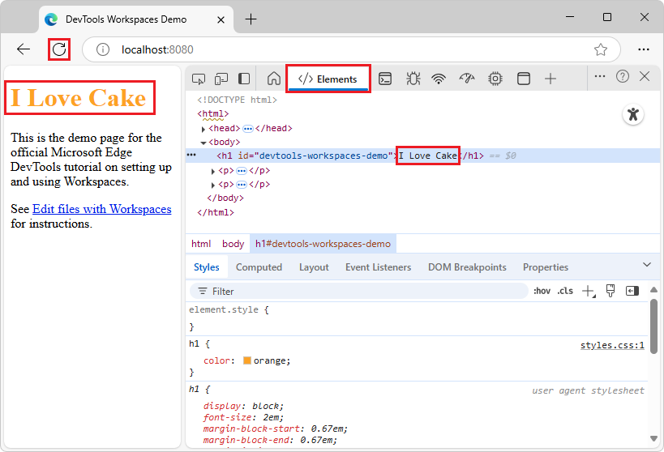

1. Select the **Sources** tool, right-click `index.html`, and then select **Open in containing folder**.

   File Explorer or Finder opens.

1. Open the `index.html` file that's in your `/Demos/workspace/` directory in a text editor, such as Visual Studio Code.  The change that you just made doesn't appear; the heading still reads "DevTools Workspaces Demo", instead of "I Love Cake".

1. In the browser, refresh the demo page.

   The page reverts to the original heading, "DevTools Workspaces Demo", because the DOM tree with your edit was discarded, and the DOM was re-created from the unchanged `index.html` file that's in your `/Demos/workspace/` directory.

Continue with the next section.


<!-- ---------- -->
###### Why it doesn't work
<!-- https://developer.chrome.com/docs/devtools/workspaces#why -->

Changing the DOM tree in the **Elements**, per the above section, doesn't work.

* The tree of nodes that you see on the **Elements** tool represents the page's DOM.

* To display a page, a browser fetches HTML over the network, parses the HTML, and then converts it into a tree of DOM nodes.

* If the page has any JavaScript, that JavaScript may add, delete, or change DOM nodes. CSS can change the DOM, too, via the `content` property.

* The browser eventually uses the DOM to determine what content it should present to browser users.

* Therefore, the final state of the page that users see may be very different from the HTML that the browser fetched.

* This makes it difficult for DevTools to resolve where a change made in the **Elements** tool should be saved, because the DOM is affected by HTML, JavaScript, and CSS.

In short, the **DOM Tree** !== HTML.

Continue with the next section.


<!-- ------------------------------ -->
#### Save HTML changes by opening a file via the Workspace tab of the Sources tool
<!-- Change HTML from the Sources panel  https://developer.chrome.com/docs/devtools/workspaces#sources -->

To save changes to the webpage HTML file, add the source code folder in the **Workspace** tab, and then edit the HTML in the **Sources** tool, rather than changing the HTML in the DOM tree in the **Elements** tool.

Unlike the **Workspace** tab, the **Page** tab of the **Sources** tool doesn't allow you to save changes to the file system.
* An HTML file that's opened via the **Page** tab can't be edited.
* A CSS or JS file that's opened via the **Page** tab can be edited, but the edits are not preserved across refreshes of the webpage.

The DevTools **Workspace** tab is similar to using an editor to edit the HTML source file, but enables editing the HTML source file directly within DevTools.

1. Continuing from above, in DevTools, click the **Sources** () tab.

1. In the **Navigator** pane on the left, in the **Workspace** tab (grouped with the **Page** tab), select `index.html`.

   The **index.html** tab opens in the **Sources** tool.

1. In the the `<h1>` tag, replace "DevTools Workspaces Demo" with "I Love Cake".

   An asterisk appears next to `index.html`.

1. Press **Ctrl+S** (Windows, Linux) or **Command+S** (macOS).

   Your change is saved, and the asterisk disappears.

   You made the change in the file listing, rather than in the DOM tree in the **Elements** tool.

1. Refresh the page.  The heading in the rendered page changes to "I Love Cake", because that string was saved in `index.html` in your mapped `/Demos/workspace/` directory:

   

1. In the **Sources** tool, right-click `index.html`, and then select **Open in containing folder**.

   File Explorer or Finder opens.

1. Open the copy of `index.html` that's in your `/Demos/workspace/` directory in a text editor, such as Visual Studio Code.

   The `<h1>` element contains the new text, "I Love Cake", because you made the change using the **Sources** tool's editor to edit `index.html` and then saved the change, and that file was mapped in a workspace (the **Workspace** tab), indicated by a green dot on the file's icon.

1. Long-click or right-click the **Refresh** button in Microsoft Edge, and then select **Hard refresh**.

   In the **Workspace** tab, green dots appear on all the HTML, CSS, and JS files.

Continue with the next section.


<!-- ====================================================================== -->
## Step 4: Save a JavaScript change to disk
<!-- https://developer.chrome.com/docs/devtools/workspaces/#js
don't doc Quick source tool here
-->

Next, edit JavaScript and save changes to the source file.  To save edits to a JavaScript source file, you can use DevTools like an IDE, by adding the source code folder in the **Workspace** tab of the **Sources** tool.  You can then edit and save the JavaScript (or HTML or CSS) file either in the **Sources** tool's editor, or in the **Quick source** tool in the **Quick View** panel at the bottom of DevTools.

The main place to use the code editor of DevTools is the **Sources** tool.  But sometimes you need to access other tools, such as the **Elements** tool or the **Console**, while editing files.  The **Quick source** tool gives you just the editor from the **Sources** tool (without the **Navigator** or **Debugger** pane), while any tool is open in the upper part of DevTools.

We'll walk through a couple ways to open the **Quick source** tool and open a file in the **Quick source** tool:
* The regular, GUI way.
* The **Command Menu** shortcut way.


<!-- ------------------------------ -->
#### Open the Quick source tool and a .js file
<!-- custom heading for Edge doc -->

1. In the **Sources** tool, in the **Workspace** tab, for each file that's open, click the **X** in the file's tab to close the file.

   No files are open in the **Sources** tool's **Workspace** tab.

1. In DevTools, select **Customize and control DevTools**, and then select **Toggle Quick View panel**.  Or, put focus on DevTools, and then press **Esc** once or twice.

   The **Quick View** toolbar is displayed at the bottom of DevTools, without the **Quick source** tool.

1. On the **Quick View** toolbar, click the **More tools** (**+**) button, and then select the **Quick source** tool.

   The **Quick source** tab is displayed in the **Quick View** toolbar at the bottom of DevTools.  If the **Sources** tool is selected in the **Activity Bar**, the **Quick View** panel is collapsed.

1. In the **Activity Bar**, select a tool other than the **Sources** tool; select the **Elements** () tool.

   The **Quick source** tool is expanded in the **Quick View** panel at the bottom of DevTools, and doesn't show any files, because no files are open in the **Sources** tool.

1. Make the **Quick View** panel tall enough to see the instructions in the **Quick source** tool, including the **Open file** link and the **Run command** link:

   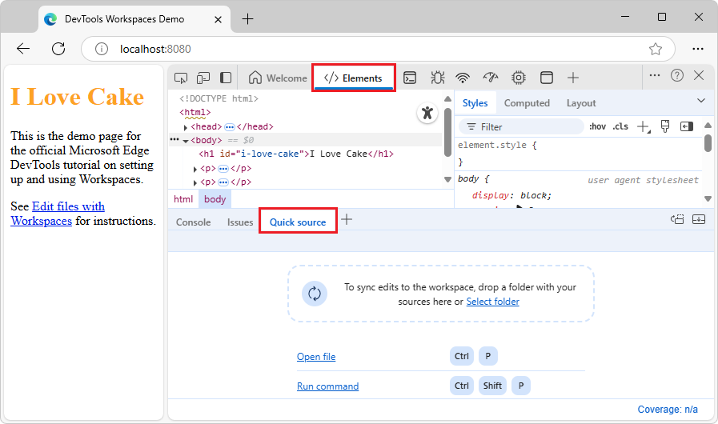

1. In DevTools, select the **Sources** tool.

   The **Quick View** panel collapses, with the **Quick source** tab still selected.

   **Open a .js file in the Quick source tool:**

1. In the **Sources** tool, select the **Workspace** tab (grouped with the **Page** tab), expand the `/Demos/workspace/` folder (added in a section above), and then select `styles.css`.

   The `styles.css` tab opens in the **Sources** tool.

1. In the **Activity Bar**, select a tool other than the **Sources** tool; select the **Elements** () tool.

   The **Quick source** tool is expanded in the **Quick View** panel at the bottom of DevTools, and shows `styles.css`, because that file is open in the **Sources** tool:

   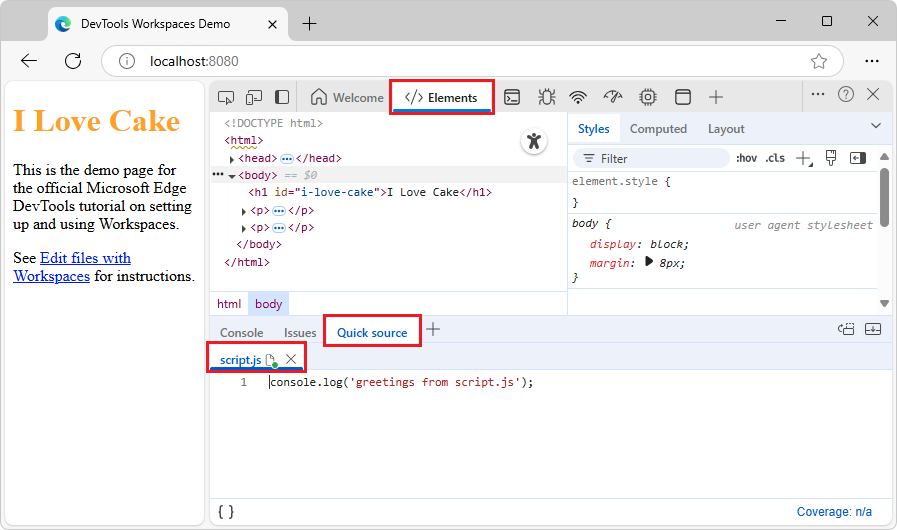

1. In the **Activity Bar**, select the **Sources** tool, and then in the `styles.css` tab, click the **x** button.

1. In the **Activity Bar**, select the **Elements** tool.

Continue with the next section.


<!-- ------------------------------ -->
#### Open the Quick source tool and a .js file by using the Command Menu
<!-- custom heading for Edge doc -->

This approach avoids using the **Sources** tool to open a file.  First, we'll undo the steps from the previous section.

1. In the **Sources** tool, in the **Workspace** tab, for each file that's open, click the **X** in the file's tab.

   No files are open in the **Sources** tool's **Workspace** tab.

1. Put focus on DevTools, and then press **Esc** once or twice.

   The **Quick View** toolbar is displayed at the bottom of DevTools.

1. Right-click the **Quick source** tab, and then select **Remove from Quick View**.

   That sets up an initial state as the starting point.  Now we'll use the **Command Menu** to open the **Quick source** tool and open a `.js` file:

1. Press **Ctrl+Shift+P** (Windows, Linux) or **Command+Shift+P** (macOS).

   The **Command Menu** opens, displaying a **Run >Command** prompt.

1. At the prompt, start typing **quick**, and then select **Show Quick source**:

   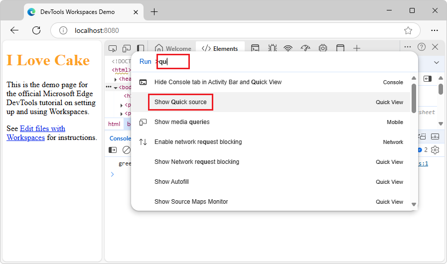

   The **Quick source** tab is displayed in the **Quick View** toolbar at the bottom of DevTools.  If the **Sources** tool is selected in the **Activity Bar**, the **Quick View** panel is collapsed.

1. In the **Activity Bar**, select a tool other than the **Sources** tool; select the **Elements** () tool.

   The **Quick source** tool is expanded in the **Quick View** panel at the bottom of DevTools, and doesn't show any files, because no files are open in the **Sources** tool.

1. Make the **Quick View** panel tall enough to see the instructions in the **Quick source** tool, as shown in the previous section.

   **Open a .js file in the Quick source tool:**

1. Press **Ctrl+P** (Windows, Linux) or **Command+P** (macOS).

   The **Command Menu** opens, and displays **Open File** prompt.

1. Start typing **script**, and then select **script.js** that's in the `/Demos/workspace/` directory:

   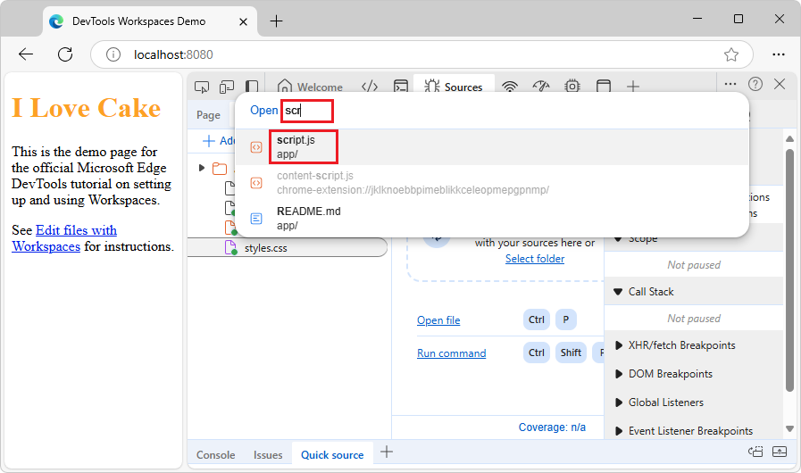

   The `styles.css` tab opens in the **Sources** tool.

1. In the **Activity Bar**, select a tool other than the **Sources** tool; select the **Elements** () tool.

   The **Quick source** tool is expanded in the **Quick View** panel at the bottom of DevTools, and shows `styles.css`, because that file is open in the **Sources** tool.

Continue with the next section.


<!-- ------------------------------ -->
#### Edit the .js file in the Quick source tool
<!-- custom heading for Edge doc -->

In the rendered demo webpage, the **Edit and save files in a workspace** hyperlink is not styled with italic.

1. In the **Quick source** tool, add the following code to the bottom of **script.js**:

    ```javascript
    document.querySelector('a').style = 'font-style:italic';
    ```

   An asterisk appears on the `script.js` tab.

1. Press **Ctrl+S** (Windows, Linux) or **Command+S** (macOS).

   `script.js` is saved, and the asterisk is removed from the `script.js` tab.

1. Refresh the page.

   If needed, click and hold the **Refresh** button and then select **Hard Refresh**.
  
   The **Edit files with Workspaces** (or **Edit and save files in a workspace**) hyperlink on the page is now italicized:<!-- todo: sync link text, or keep as-is so pngs match demo -->

   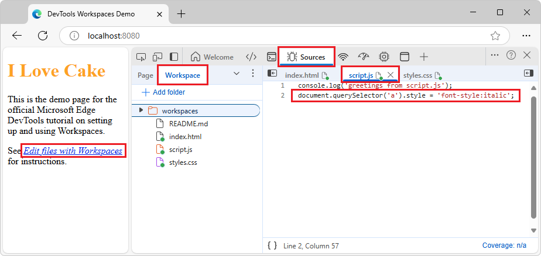

1. Long-click or right-click the **Refresh** button in Microsoft Edge, and then select **Hard refresh**.

   Green dots appear on all files of the webpage.

<!-- todo: 
1. To revert the edits in your `/workspace/` folder on your `localhost` server,
-->

Continue with the next section.


<!-- ====================================================================== -->
## Step 5: Add a .js file using DevTools
<!-- section not in upstream -->

1. In the **Sources** tool, in the **Workspace** tab, right-click the `/workspaces/` folder, and then select the **New file** menuitem.

   A file named `NewFile` is added:

   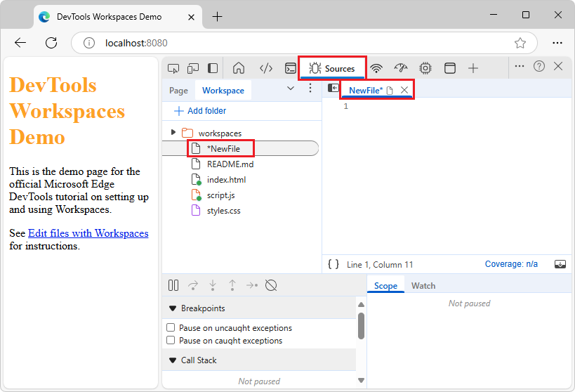

1. Right-click `NewFile` in the **Workspace** tab and then select **Rename**.

1. Rename the file to `test.js`.

1. In `test.js`, add the line: `console.log('hello from test.js');`

1. In the **Sources** tool, in the **Workspace** tab, select `index.html`.

1. In `index.html`, below the line `<script src="./script.js" defer></script>`, add the line: `<script src="./test.js" defer></script>`

1. Press **Ctrl+S** (Windows, Linux) or **Command+S** (macOS).

   `index.html` is saved.

1. Long-click or right-click the **Refresh** button in Microsoft Edge, and then select **Hard refresh**.

   In the **Workspace** tab, green dots appear on all the HTML, CSS, and JS files:

   

This completes the tutorial.


<!-- ====================================================================== -->
## Troubleshooting
<!-- heading not in upstream -->

A green dot next to a file in DevTools indicates that DevTools has established a mapping between a network resource of the page that's received from the web server, and the local source file in your `/Demos/workspace/` directory.  The new file that you add in DevTools must be returned by the server, to be indicated as mapped.


If green circles stop appearing on files in DevTools, such as in the **Workspace** tab; or if the **Changes** tool doesn't show expected changes:

* With DevTools displayed, long-click or right-click the **Refresh** button in Microsoft Edge, and then select **Hard refresh**.


If you want a green "sync" circle to appear on an added `.js` file, and have the file represented in the **Changes** tool:

1. Reference the added `.js` file in the HTML file.

1. Remove the folder from the workspace, and then add the folder to the workspace.

<!-- 
* In DevTools, select **Customize and Control DevTools** (**...**) > **Restore defaults and refresh**. -->

See also:
* [Track changes to files using the Changes tool](../changes/changes-tool.md)


<!-- ====================================================================== -->
## Next steps
<!-- https://developer.chrome.com/docs/devtools/workspaces#next-steps -->

Next, learn how to use DevTools to change CSS and debug JavaScript: 
* [Get started viewing and changing CSS](../css/index.md)
* [Get started debugging JavaScript](../javascript/index.md)


<!-- ====================================================================== -->
## See also

* [Display or edit source files using the Quick source tool](../quick-source/quick-source-tool.md)
* [Open a demo folder in the Sources tool and edit a file](../../devtools-guide-chromium/sample-code/sample-code.md#open-a-demo-folder-in-the-sources-tool-and-edit-a-file) in _Sample code for DevTools_.
* [Track changes to files using the Changes tool](../changes/changes-tool.md)
<!--
* [Workspace]() in **Settings**.
-->


<!-- ====================================================================== -->
> [!NOTE]
> Portions of this page are modifications based on work created and [shared by Google](https://developers.google.com/terms/site-policies) and used according to terms described in the [Creative Commons Attribution 4.0 International License](https://creativecommons.org/licenses/by/4.0).
> The original page is found [here](https://developer.chrome.com/docs/devtools/workspaces/) and is authored by Kayce Basques.

[](https://creativecommons.org/licenses/by/4.0)
This work is licensed under a [Creative Commons Attribution 4.0 International License](https://creativecommons.org/licenses/by/4.0).
