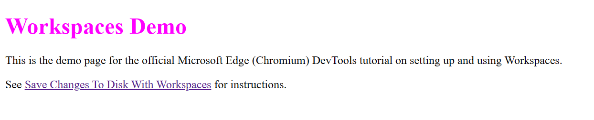
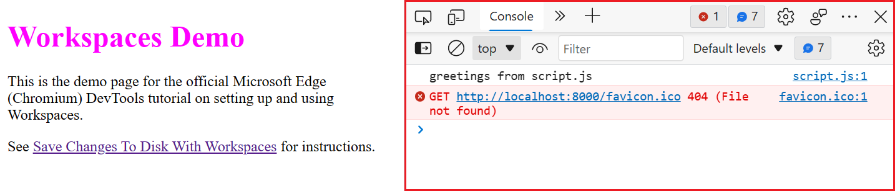
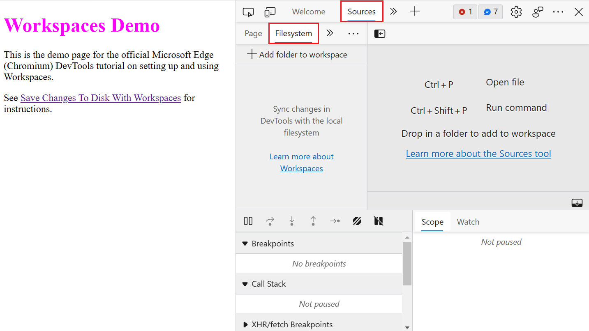
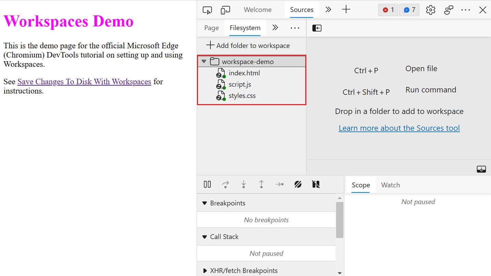
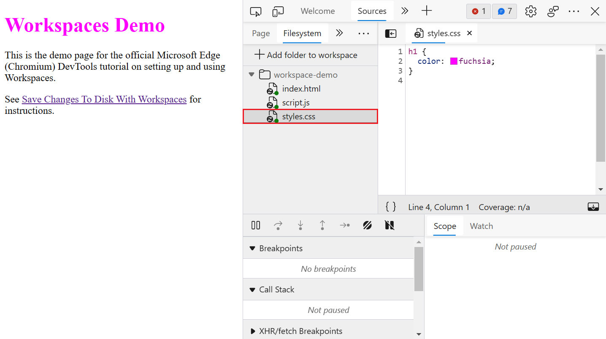
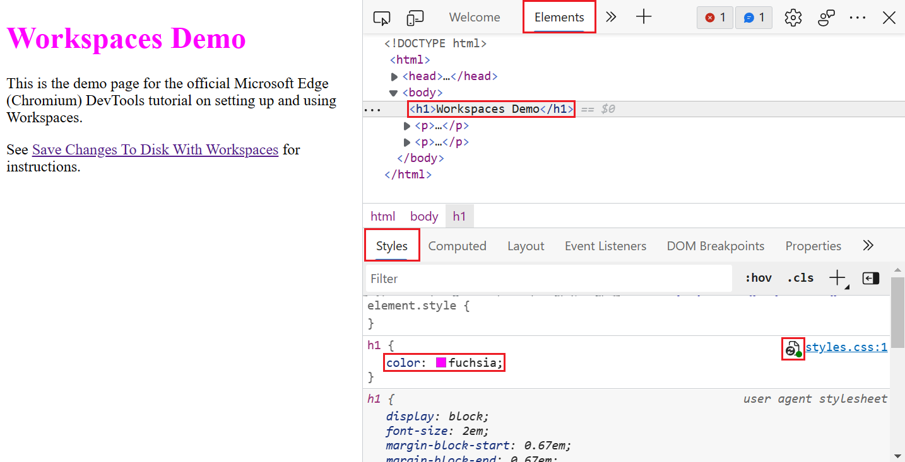
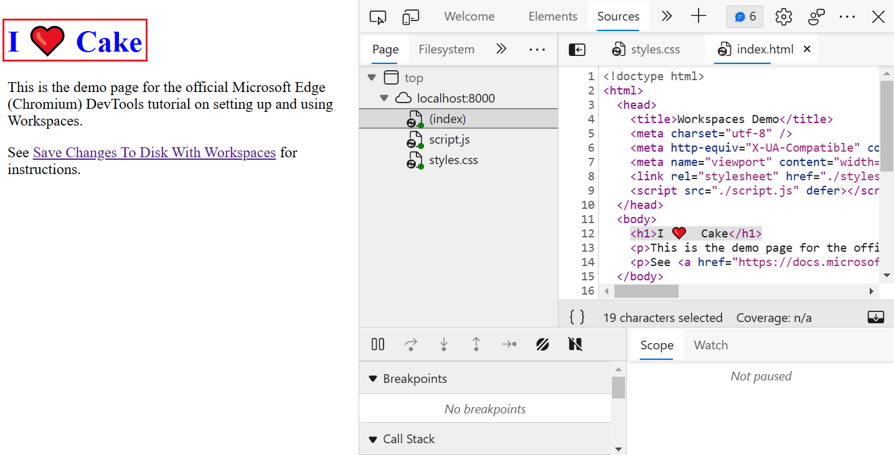
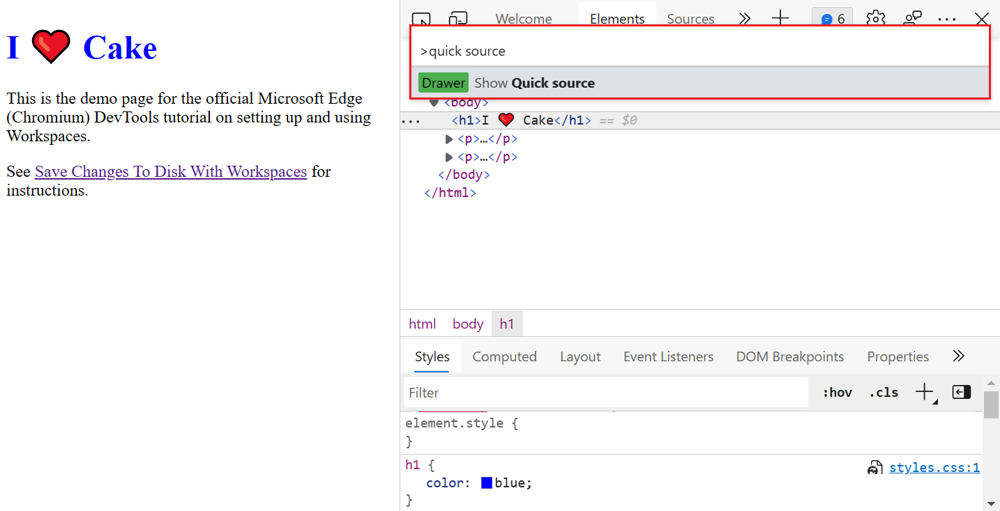
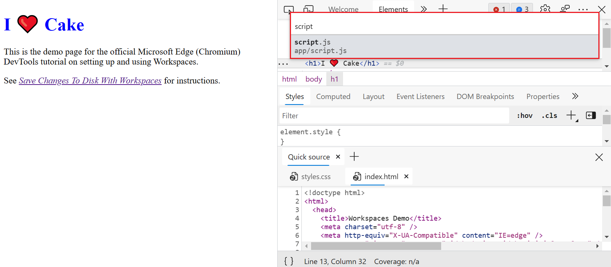
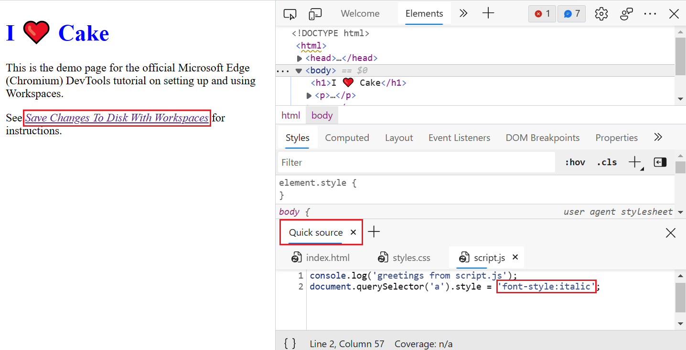

<!-- Copyright Kayce Basques

   Licensed under the Apache License, Version 2.0 (the "License");
   you may not use this file except in compliance with the License.
   You may obtain a copy of the License at

       https://www.apache.org/licenses/LICENSE-2.0

   Unless required by applicable law or agreed to in writing, software
   distributed under the License is distributed on an "AS IS" BASIS,
   WITHOUT WARRANTIES OR CONDITIONS OF ANY KIND, either express or implied.
   See the License for the specific language governing permissions and
   limitations under the License.  -->
# Edit files with Workspaces (Filesystem tab)

Use the **Filesystem** tab in the **Sources** tool to define a workspace, to save DevTools changes in your source code files rather than only in a transient copy of the files that are returned by the web server.

This tutorial provides hands-on practice in setting up and using a workspace in DevTools. After you add files to a workspace, changes that you make in your source code by using DevTools are saved on your local computer. These changes are preserved across page refreshes.

To refresh your knowledge of the technologies used, see the following articles:

* Use HTML, CSS, and JavaScript to build a web page. See [Getting started with the web](https://developer.mozilla.org/en-US/docs/Learn/Getting_started_with_the_web)

* Use DevTools to make basic changes to CSS. See [Get started viewing and changing CSS](/microsoft-edge/devtools-guide-chromium/css/)

* Run a local HTTP web server. See: 

  * Using Node.js (used for this tutorial): [Set up a localhost server](/microsoft-edge/visual-studio-code/microsoft-edge-devtools-extension/install#step-6-set-up-a-localhost-server) in _Installing the DevTools extension for Visual Studio Code_.
  
  * Using Python: [Running a simple local HTTP server](https://developer.mozilla.org/en-US/docs/Learn/Common_questions/set_up_a_local_testing_server#running_a_simple_local_http_server) in _How do you set up a local testing server?_


<!-- ====================================================================== -->
## Introduction

A DevTools _workspace_ lets you save changes that you make to a local copy of the source code to the same file on your computer, so that changes are retained across refreshes of the page. Here's a typical scenario for using a workspace:

* You have the source code for the demo website on your desktop.

* You are running a local web server from the source code directory, so that the site is accessible at `localhost:8080`. Note: If you use the Python server option, the default port number is `8000`.

* You opened `localhost:8080` in Microsoft Edge, and you are using DevTools to change the website source code which includes the CSS, HTML, and JavaScript files. 

The tutorial steps below walk you through this environment setup.


<!-- ====================================================================== -->
#### Limitations

If you're  using a modern framework, it probably transforms your source code from a format that's easy to maintain into a format that's optimized to run as quickly as possible.
A workspace is usually able to map the optimized code back to the original source code with the help of [source maps](https://blog.teamtreehouse.com/introduction-source-maps) for JavaScript and CSS. However, there's a lot of variation in how each framework uses source maps.

**Note:** DevTools doesn't support every framework variation, and the workspace feature doesn't work with the Create React App framework.

If you run into issues while using workspaces with your framework of choice, or you identify framework-specific steps that are needed, [start a thread in the mailing list](https://groups.alphabet.com/forum/#!forum/alphabet-browser-developer-tools) or [ask a question on Stack Overflow](https://stackoverflow.com/questions/ask?tags=alphabet-browser-devtools) to exchange information with the rest of the DevTools community.


<!-- ====================================================================== -->
#### Related feature: Overrides

**Overrides** is a DevTools feature that’s similar to a workspace. You can use an override when you want to experiment with changes to a webpage, and you need to display the changes across webpage loads, but you don't care about mapping your changes to the source code of the webpage. However, your changes aren’t saved when you refresh the webpage. 

The **Overrides** feature lets you store a local copy of the webpage files on the server. When you refresh the page, Microsoft Edge loads the local copy of files instead of the files on the server. To learn more about overrides, see [Override webpage resources with local copies (Overrides tab)](../javascript/overrides.md).

<!--Todo: add section when content is ready  -->


<!-- ====================================================================== -->

## Create the directory of source files

We'll set up the demo files, and then set up DevTools.

1. In another window or tab, go to the [Workspaces demo source code](https://github.com/MicrosoftEdge/Demos/tree/main/workspaces).

1. Create an `app` directory on your desktop.  Save copies of the `index.html`, `styles.css`, and `script.js` files from the demo source code to the `app` directory.  For the rest of the tutorial, this directory is referred to as `~/Desktop/app`, though you can use a different path.

1. Install Node.js and npm. For more information, see [Install Node.js and Node Package Manager (npm)](/microsoft-edge/visual-studio-code/microsoft-edge-devtools-extension/install#step-4-save-a-javascript-change-to-disk)

1. Start a local web server in `~/Desktop/app`. Go to the `app` folder and then run one of the following commands from the command prompt to start up the web server.<br>
Node.js option:

   ```bash
   # Node.js option
   cd ~/Desktop/app
   npx http-server # Node.js
   ```
  
   ``` bash
   # Python 2 option
   cd ~/Desktop/app
   python -m SimpleHTTPServer # Python 2
   ```
  
   ``` bash
   # Python 3 option
   cd ~/Desktop/app
   python -m http.server # Python 3
   ```

1. Open a tab in Microsoft Edge and go to the locally hosted version of the site. You should be able to access it using these URLs:  `localhost:8080` or `http://0.0.0.0:8080`. **Note:** The default port number for the Python server option is `8000`. The exact [port number](https://en.wikipedia.org/wiki/Port_(computer_networking)#Use_in_URLs) might be different.

   

## Define a workspace in DevTools

1. Press `Ctrl`+`Shift`+`J` (Windows, Linux) or `Command`+`Option`+`J` (macOS) to open the DevTools **Console**.

   

1. Click the **Sources** tab.

1. In the **Navigator** pane (on the left), click the **Filesystem** tab.

   

1. Click **Add Folder To Workspace**.

1. When File Explorer opens, type the path (such as `~/Desktop/app`) in the **Folder:** prompt.

1. Click **Allow** to give DevTools permission to read and write to the directory.

In the **Filesystem** tab, the list of files () shows a page icon with two-way arrows and a green dot beside each of these files: `index.html`, `script.js`, and `styles.css`. (The two-way arrow colors are mapped to `.html`, `.js`, and `.css` file types.) A green dot indicates that DevTools has established a mapping between a network resource of the page received from the web server, and the local source file in `~/Desktop/app`:




<!-- ====================================================================== -->
## Edit CSS and save changes to the source file

To make a change in the CSS file and save it to disk:

1. Open `styles.css`.  The `color` property of the `h1` element is set to `fuchsia`.

   

1. Select the **Elements** tool.

   The CSS rules that are applied to the `<h1>` element are shown in the **Styles** pane.  The **mapped file** () icon next to `styles.css:1` is a page with two-way arrows.  This icon means that any changes that you make are mapped to `~/Desktop/app/styles.css`.

   

1. Change the value of the `color` property of the `<h1>` element to your favorite color.  To do this, select the `<h1>` element in the **DOM Tree**. Select `fucshia`, type the new color, and then select it from the color list:

   

1. Open `styles.css` in a text editor.  The `color` property is now set to the new color, which is orange in this example.

1. Refresh the page.

The color of the `<h1>` element is still set to the new color.  The change remains across a refresh, because when you made the change, DevTools saved the change to disk. When you refreshed the page, your local server served the modified copy of the file from disk.

**Tip:** You can also change the color by clicking the fucshia-colored swatch to open the color picker to pick a new color. The HEX value for the color you pick is the color name.

<!-- ====================================================================== -->
## Edit HTML and save changes to the source file

In the **Elements** tool, it's possible to change HTML tagging in a copy of the file that's returned by the server.  However, to save your edits to a local source file, you need to use the **Sources** tool instead of the **Elements** tool.

#### Changing HTML from the Elements tool doesn't save changes

You can make changes to the HTML content using the **Elements** tool, but your changes to the DOM tree aren't saved to disk, and only affect the current browser session.

The following steps demonstrate that edits aren't preserved across page refreshes, if you don't use a workspace.  We'll demonstrate this now so that you don't spend time later trying to figure out why it isn't working.

1. Select the **Elements** tool.

1. Select and edit the text content of the `h1` element, which says `Workspaces Demo`, and replace it with `I Love Cake`.

   

1. Open `~/Desktop/app/index.html` in a text editor.  The change that you just made doesn't appear.

1. Refresh the page.  The page reverts to the original title. 
<!--
#### Optional: Why it isn't working

> [!NOTE]
> This section describes why the workflow from [Try changing html from the Elements panel](#try-changing-html-from-the-elements-panel) doesn't work.  You should skip this section if you don't care why.

*  The tree of nodes that are displayed on the **Elements** tool represents the [DOM](https://developer.mozilla.org/docs/Web/API/Document_Object_Model/Introduction) of the page.
*  To display a page, a browser fetches html over the network, parses the html, and then converts it into a tree of DOM nodes.
*  If the page has any JavaScript, that JavaScript can add, delete, or change DOM nodes.  CSS can change the DOM, too, by using the [`content`](https://developer.mozilla.org/docs/Web/CSS/content) property.
*  The browser eventually uses the DOM to determine what content it should present to browser users.
*  Therefore, the final state of the webpage displayed for users may be very different from the HTML that the browser fetched.
*  This makes it difficult for DevTools to resolve where a change made in the **Elements** tool should be saved, because the DOM is affected by HTML, JavaScript, and CSS.

In short, the **DOM Tree** `!==` HTML.
-->

#### Changing HTML from the Sources tool saves changes

If you want to save a change to the webpage HTML, edit the HTML in the **Sources** tool with a workspace defined (in the **Filesystem** tab), rather than changing the HTML in the **Elements** tool.

1. Click the **Sources** tab.

1. In the **Navigator** pane, click the **Page** tab beside **Filesystem**. If the **Page** tab isn't showing, click `>>` (More tabs) and then select **Page**.

1. Click **(index)**.  The HTML for the page opens.

1. Replace `<h1>Workspaces Demo</h1>` with `<h1>I Love Cake</h1>`.  The demo title changes.

1. Press `Ctrl`+`S` (Windows, Linux) or `Command`+`S` (macOS) to save the change.

1. Refresh the page.  The `<h1>` element continues to display the new text after the page is refreshed.

   

1. Open `~/Desktop/app/index.html` in a text editor.  The `<h1>` element contains the new text.


<!-- ====================================================================== -->
## Edit JavaScript and save changes to the source file

The main place to use the code editor of DevTools is the **Sources** tool.  But sometimes you need to access other tools, such as the **Elements** tool or the **Console**, while editing files.  The **Quick source** tool gives you just the editor from the **Sources** tool, while any tool is open.

To open the DevTools code editor alongside other tools:

1. Select the **Elements** tool.

1. Press `Ctrl`+`Shift`+`P` (Windows, Linux) or `Command`+`Shift`+`P` (macOS) to open the **Command Menu**.

1. Type `quick` at the **Run** prompt, and then select **Show Quick source**.  At the bottom of the DevTools window, the **Quick source** tool appears, displaying the contents of `index.html`, which is the last file you edited in the **Sources** tool.

   

1. Press `Ctrl`+`P` (Windows, Linux) or `Command`+`P` (macOS) to open the **Open File** dialog, shown in the next screenshot.

1. Type `script` at the **Open** prompt, then select **app/script.js**.

   

   The **Edit files with Workspaces** link in the demo is styled regularly.

1. Use the **Quick source** tool to add the following code to the bottom of **script.js**:

    ```javascript
    document.querySelector('a').style = 'font-style:italic';
    ```

1. Press `Ctrl`+`S` (Windows, Linux) or `Command`+`S` (macOS) to save the change.

1. Refresh the page.  The link on the page is now italicized.

   


<!-- ====================================================================== -->
## See also

* [Open a demo folder in the Sources tool and edit a file](../../devtools-guide-chromium/sample-code/sample-code.md#open-a-demo-folder-in-the-sources-tool-and-edit-a-demo-file) in _Sample code for DevTools_.


<!-- ====================================================================== -->
> [!NOTE]
> Portions of this page are modifications based on work created and [shared by Google](https://developers.google.com/terms/site-policies) and used according to terms described in the [Creative Commons Attribution 4.0 International License](https://creativecommons.org/licenses/by/4.0).
> The original page is found [here](https://developer.chrome.com/docs/devtools/workspaces/) and is authored by [Kayce Basques](https://developers.google.com/web/resources/contributors#kayce-basques) (Technical Writer, Chrome DevTools \& Lighthouse).

[](https://creativecommons.org/licenses/by/4.0)
This work is licensed under a [Creative Commons Attribution 4.0 International License](https://creativecommons.org/licenses/by/4.0).
