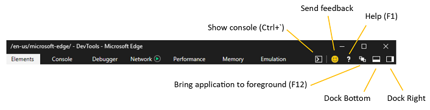
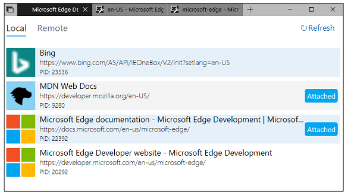
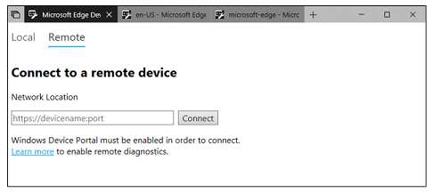

> [!NOTE]
> The Microsoft Edge DevTools help web developers build and test their websites. If you accidentally opened the DevTools, just press "F12" to close them.

# Microsoft Edge Developer Tools

The Microsoft Edge DevTools are built with [TypeScript](http://www.typescriptlang.org/), powered by [open source](https://github.com/Microsoft/ChakraCore), optimized for modern front-end workflows, and now available as a [standalone Windows 10 app](https://www.microsoft.com/store/p/microsoft-edge-devtools-preview/9mzbfrmz0mnj) in the Microsoft Store!

For more on the latest features, check out [*DevTools in the latest update of Windows 10 (EdgeHTML 17)*](./devtools-guide/whats-new.md).

## Core tools

The Microsoft Edge DevTools include:

 - An [**Elements**](./devtools-guide/elements.md) panel to edit HTML and CSS, inspect accessibility properties, view event listeners, and set DOM mutation breakpoints
 - A [**Console**](./devtools-guide/console.md) to view and filter log messages, inspect JavaScript objects and DOM nodes, and run JavaScript in the context of the selected window or frame
 - A [**Debugger**](./devtools-guide/debugger.md) to step through code, set watches and breakpoints, live edit your code, and inspect your web storage and cookie caches
 - A [**Network**](./devtools-guide/network.md) panel to monitor and inspect requests and responses from the network and browser cache 
 - A [**Performance**](./devtools-guide/performance.md) panel to profile the time and system resources required by your site
 - A [**Memory**](./devtools-guide/memory.md) panel to measure your use of memory resources and compare heap snapshots at different states of code execution
 - An [**Emulation**](./devtools-guide/emulation.md) panel to test your site with different browser profiles, screen resolutions, and GPS location coordinates

Please keep sending your [feedback and feature requests](#feedback)!

> [!TIP]
> **[Test on Microsoft Edge free from any browser](https://developer.microsoft.com/microsoft-edge/tools/remote/)**:
> We partnered with [BrowserStack](https://www.browserstack.com/test-on-microsoft-edge-browser#live-cloud) to provide free live and automated testing on Microsoft Edge.

## Microsoft Store app

The **Microsoft Edge DevTools** are [now available for preview](./devtools-guide/whats-new.md) as a standalone [Windows 10 app from the Microsoft Store](https://www.microsoft.com/store/p/microsoft-edge-devtools-preview/9mzbfrmz0mnj?activetab=pivot%3aoverviewtab), in addition to the in-browser (`F12`) tooling experience. With the store version comes a *chooser* panel for attaching to open local and remote page targets and a tabbed layout for easy switching between DevTools instances.

### Local debugging

To debug a page locally, simply launch the *Microsoft Edge DevTools* app. The **Local** panel of the chooser will display all of the active EdgeHTML content processes, including open Edge browser tabs, running [PWAs](./progressive-web-apps/index.md) (*WWAHost.exe* processes), and [webview](./webview.md) controls. Click on your desired target to attach and open a new tab instance of the DevTools.

### Remote debugging

The *Microsoft Edge DevTools* app introduces basic support for debugging pages on a remote machine via our newly released [**DevTools Protocol**](./devtools-protocol/index.md). With this release comes remote access to core funtionality in the [**Debugger**](./devtools-guide/debugger.md) panel, minus cache inspection (for Web storage, Service worker, Cache API, and IndexedDB). Remote debugging is limited to *Microsoft Edge* running *desktop* hosts, with support for other EdgeHTML hosts and Windows 10 devices coming in future releases.

To get started, check out the [*Microsoft Edge DevTools*](./devtools-protocol/0.1/clients.md#microsoft-edge-devtools-preview) section of the [DevTools Protocol](./devtools-protocol/index.md) docs.

## Feedback

Please send us your feedback so we can continue improving the Microsoft Edge DevTools for you! Simply open the tools (`F12`) and click the [**Send feedback**](#microsoft-edge-developer-tools) button.

You can also add and upvote tooling requests to our [UserVoice forum](https://wpdev.uservoice.com/forums/257854-microsoft-edge-developer/category/84475-f12-developer-tools) and become a [Windows Insider](https://insider.windows.com/) to preview the [latest features coming to the DevTools](./devtools-guide/whats-new.md). Use the Windows **Feedback Hub** app to post, upvote, track and get support for general Windows suggestions and problems.

## General Shortcuts

These shortcuts control the main DevTools window and/or work across all tools.

Action | Shortcut
:------------ | :-------------
Show/Hide DevTools (opens to last viewed panel) | F12, Ctrl+Shift+I
Toggle docking (Undock/Bottom/Right) | Ctrl+Shift+D 
Show non-editable HTML source code in Debugger | Ctrl+U
Show/hide Console at the bottom of any other tool  | Ctrl+**`**
Switch to Elements (DOM Explorer) | Ctrl+1
Switch to Console |  Ctrl+2
Switch to Debugger | Ctrl+3
Switch to Network | Ctrl+4
Switch to Performance | Ctrl+5
Switch to Memory | Ctrl+6
Switch to Emulation | Ctrl+7
Help Document | F1
Next tool | Ctrl+F6
Previous tool | Ctrl+Shift+F6
Previous tool (from history) | Ctrl+Shift+[
Next tool (from history) | Ctrl+Shift+]
Next Subframe    | F6
Previous Subframe | Shift+F6
Next match in Search box | F3
Previous match in Search box | Shift+F3
Find in search box | Ctrl+F
Give focus to console at the bottom | Alt+Shift+I
Dock/undock tools (toggle docking) | Ctrl+P  
Launch DevTools to Console | Ctrl+Shift+J
Refresh the page. **Note:** if you're debugging and paused at a breakpoint, this resumes execution first. | Ctrl+Shift+F5 or Ctrl+R
