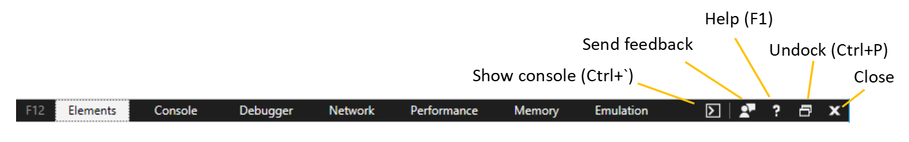

# Microsoft Edge F12 Developer Tools

Browser tooling has come a long way since the days of Internet Explorer! The Microsoft Edge F12 DevTools are built with [TypeScript](http://www.typescriptlang.org/), powered by [open source](https://github.com/Microsoft/ChakraCore), and optimized for modern front-end workflows. 

The Microsoft Edge F12 DevTools include:

 - An [**Elements**](./f12-devtools-guide/elements.md) panel to edit HTML and CSS, inspect accessibility properties, view event listeners, and set DOM mutation breakpoints
 - A [**Console**](./f12-devtools-guide/console.md) to view and filter log messages, inspect JavaScript objects and DOM nodes, and run JavaScript in the context of the selected window or frame
 - A [**Debugger**](./f12-devtools-guide/debugger.md) to step through code, set watches and breakpoints, live edit your code, and inspect your web storage and cookie caches
 - A [**Network**](./f12-devtools-guide/network.md) panel to monitor and inspect requests and responses from the network and browser cache 
 - A [**Performance**](./f12-devtools-guide/performance.md) panel to profile the time and system resources required by your site
 - A [**Memory**](./f12-devtools-guide/memory.md) panel to measure your use of memory resources and compare heap snapshots at different states of code execution
 - An [**Emulation**](./f12-devtools-guide/emulation.md) panel to test your site with different browser profiles, screen resolutions, and GPS location coordinates

There's also [much more to come](./f12-devtools-guide/whats-new.md), so please keep sending us your [feedback and feature requests](#feedback)!

> [!TIP]
> **[Test on Microsoft Edge free from any browser](https://developer.microsoft.com/en-us/microsoft-edge/tools/remote/)**:
> We partnered with [BrowserStack](https://www.browserstack.com/test-on-microsoft-edge-browser#live-cloud) to provide free live and automated testing on Microsoft Edge.

## Feedback

Please send us your feedback so we can continue improving the Microsoft Edge F12 DevTools for you! Simply open the tools (`F12`) and click the [**Send feedback**](#microsoft-edge-f12-developer-tools) button.

You can also add and upvote tooling requests to our [UserVoice forum](https://wpdev.uservoice.com/forums/257854-microsoft-edge-developer/category/84475-f12-developer-tools) and become a [Windows Insider](https://insider.windows.com/en-us/) to preview the [latest features coming to F12 Tools](./f12-devtools-guide/whats-new.md). Use the Windows **Feedback Hub** app to post, upvote, track and get support for general Windows suggestions and problems.

## General Shortcuts

These shortcuts control the main F12 DevTools window and/or work across all tools.

Action | Shortcut
:------------ | :-------------
Show/Hide F12 DevTools (opens to last viewed panel) | F12, Ctrl+Shift+I
Show/hide Console at the bottom of any other tool  | Ctrl+**`**
Switch to Elements (DOM Explorer) | Ctrl+1
Switch to Console |  Ctrl+2
Switch to Debugger | Ctrl+3
Switch to Network | Ctrl+4
Switch to Performance | Ctrl+5
Switch to Memory | Ctrl+6
Switch to Emulation | Ctrl+7
Help Document | F1
Next tool | Ctrl+F6
Previous tool | Ctrl+Shift+F6
Previous tool (from history) | Ctrl+Shift+[
Next tool (from history) | Ctrl+Shift+]
Next Subframe 	  | F6
Previous Subframe | Shift+F6
Next match in Search box | F3
Previous match in Search box | Shift+F3
Find in search box | Ctrl+F
Give focus to console at the bottom | Alt+Shift+I
Dock/undock tools (toggle docking) | Ctrl+P  
Launch F12 DevTools to Console | Ctrl+Shift+J
Refresh the page. **Note:** if you're debugging and paused at a breakpoint, this resumes execution first. | Ctrl+Shift+F5 or Ctrl+R
