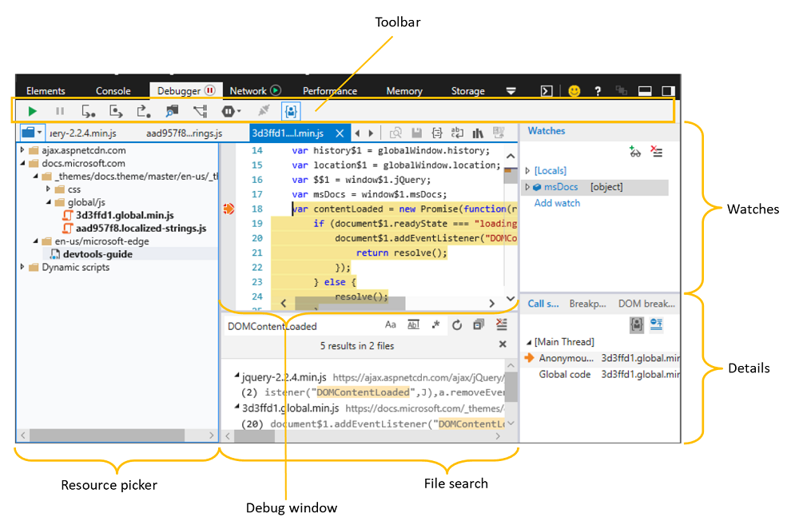
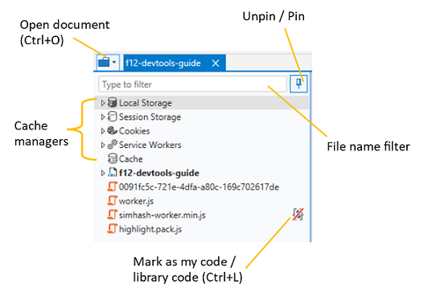
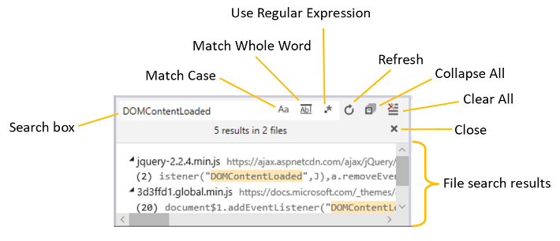
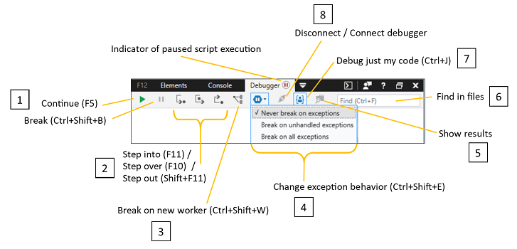
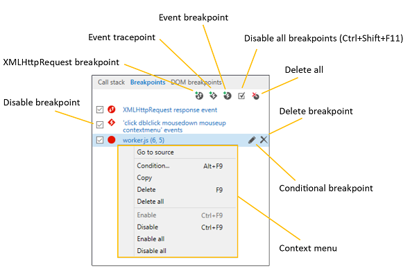
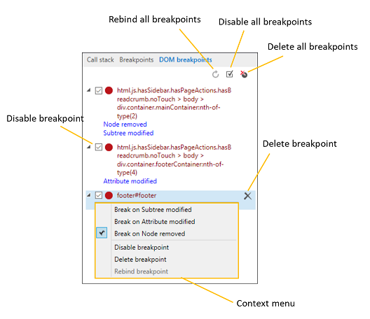

# Debugger - DevTools (EdgeHTML)

Use the **Debugger** to step through code, set watches and breakpoints, live edit your code and inspect your caches. Test and troubleshoot your code by:

- [Browsing](#resource-picker) and [searching](#file-search) code from your loaded source files
- [Controlling the execution flow](#toolbar) as you step through your code
- [Managing page storage resources](./storage.md#cache-manager), including the [service workers and cache](./service-workers.md), [cookies](./storage.md#cookies-list) and [web storage](./storage.md#local-and-session-storage-managers)  
- [Setting breakpoints and live editing](#debug-window) your code as it runs
- [Tracking and editing local variables](#watches) as you debug
- [Hiding or showing asynchronous code and library code](#call-stack) from your callstack as needed
- [Adding specialized breakpoints](#breakpoints) for XmlHttpRequests, events and [DOM mutations](#dom-breakpoints)



There are three ways to begin a debugging session.

1. **Set a breakpoint.** When the execution of your code reaches it, you'll enter the debugger and be able to step through your code.
2. **Initiate a break in code.** Click the [**Break**](#toolbar) (*pause* icon) toolbar button or `Ctrl+Shift+B`. The debugger will break on the next statement of execution.
3. **Set exception behavior.** Use the [**Change exception behavior**](#toolbar) menu (`Ctrl+Shift+E`) to break into the debugger when your code throws an exception. By default, the debugger is set to *Never break on exceptions*, but they are logged to the console.

## Resource picker

Often the first step in debugging is to set breakpoints in the code you're looking to troubleshoot. You can find all the code files currently loaded by the page from the *Resource picker* pane, including *.html, .css* and *.js* files.

 Clicking on a file entry will open a tab for that file in the [Debug window](#debug-window) and bold the text of the file name to indicate this (as *devtools-guide* file name is in the illustration above). You can then set breakpoints within that file from the [Debug window](#debug-window).



From the *Resource picker* context menu, you can also mark a file as **library code** (`Ctrl+L`), giving you the option to [skip over that code in the debugger](#debug-window) and [hide it from the **Call stack** pane](#call-stack). Clicking (or `Ctrl+L`) again will toggle the file back to its previous value as *my code* or *library code*.

### File search

Use the *Find in files* command (`Ctrl`+`Shift`+`F`) when you have a specific string of code you're trying to find in the source. The toolbar provides different search options, including regular expressions. Clicking on a search result will focus the *Debug window* on the specified file and line.



## Debug window

The *Debug window* is where you set your breakpoints, step through code, and live edit your script as you debug. Click to the left of any script command to add (or remove) a **Breakpoint**. Use the right-click context menu or [**Breakpoints**](#breakpoints) pane to *Add a condition* to the breakpoint by supplying a logical expression that causes the debugger to break if it evaluates *True* at that location.


Other features of the debug window include controls for:

### 1. Code editing

You can edit your JavaScript live during a debugging session. Once you make your changes, click <strong>Save</strong> (`Ctrl+S`) to test your changes next time that section of code runs. If you have unsaved code changes, an asterisk (\*) will appear before the file name in the *Debug window* tab.

Click the **Compare document to original** button to view the diff of what you changed.


Please be aware of the following constraints:

- Script editing only works in external *.js* files (and not embedded `<script>` within *.html*)
- Edits are saved in memory and flushed when the document is reloaded, thus you won't be able to run edits inside a `DOMContentLoaded` handler, for example
- Currently there's no way (such as a **Save As** option) to save your edits to disk from the DevTools

### 2.Code formatting

Use these controls to format minified code for better readability as you debug:

#### Pretty print (`Ctrl+Shift+P`) 
Adds line breaks and curly brace alignment per JavaScript conventions. Even compressed code that's been made more readable with this option may have function, selector, and variable names that are much different than in your original source code. In these cases, the [*Toggle source maps*](#source-maps) option might be available.

#### Word wrap (`Alt+W`)
Adjusts code to fit within the current margins of the debug window (eliminating the need for horizontal scrolling).

### 3. Code scoping

You can direct the debugger to ignore certain files with the **Mark as library code** (`Ctrl+L`) button. By default, the [**Debug just my code**](#toolbar) toolbar button is on, meaning that the debugger will skip over any files that you mark as *library code* and they will not appear in the debugger [call stack](#call-stack). Depressing the button (**Mark as my code**, `Ctrl+L`) will remove this flag.

For keeping track of libraries across debugging sessions, you can edit these files to maintain a default list or add wildcards for a domain or file type:

```JavaScript
%APPDATA%\..\LocalLow\Microsoft\F12\header\MyCode.json and %APPDATA%\..\Local\Microsoft\F12\header\MyCode.json
```

#### Source maps

You will see the **Toggle source maps** button enabled for code written in a language that compiles to JavaScript or CSS and that provides a *source map* (an intermediate file mapping to the original source). This option directs the debugger to present the original source to use for debugging (rather than the compiled file that's *actually* running in the browser).

The DevTools will check if the compiler that generated the JavaScript file included a comment with the name of the map file. For example, if a compiler compressed *myfile.js* to *myfile.min.js*, it might also generate a map file, *myfile.min.js.map* and include a comment in the compressed file like this:

```JavaScript
//# sourceMappingURL=myfile.min.js.map
```


If the DevTools can't find the map automatically, you can choose a source map for that file. Right-click the file's tab to find the **Choose source map** option. 

## Toolbar

Use the debugger *Toolbar* to control how you step through code, and what code to step through or ignore. From here you can also do a full text search across your code files for specific strings.



### 1. Continue (`F5`) / Break (`Ctrl+Shift+B`)
 **Continue** (`F5`) continues code execution to the next breakpoint. Holding down `F5` will repeatedly move past breaks until you release it. 

 **Break** (`Ctrl+Shift+B`) will break into the debugger after running the next statement.

### 2. Step functions (`F11`, `Ctrl+F10`, `Shift+F11`)
 **Step into** (`F11`) steps into the function being called. 

 **Step over** (`Ctrl+F10`) steps over the function being called. 

 **Step out** (`Shift+F11`) steps out of the current function and into the calling function. 

 The debugger will step to the next statement if it is not at a function when these commands are used.

### 3. Break on new worker (`Ctrl+Shift+W`)
 Breaks on the creation of a new [web worker](https://developer.mozilla.org/docs/Web/API/Web_Workers_API/Using_web_workers).

### 4. Exception control
**Change exception behavior** (`Ctrl+Shift+E`) opens options to change how the debugger reacts to exceptions. By default exceptions are ignored by the debugger and logged to the [**Console**](./console.md). You can choose to *Break on all exceptions*, or just those not being handled by `try...catch` statements in your code (*Break on unhandled exceptions*).

### 5. View search results
(Currently disabled.) **Show/Hide results** toggles the display of [*Find in files*](#6-find-in-files-ctrlf) search results.

### 6. Find in files (`Ctrl+F`)
 **Find in files** (`Ctrl+F`) runs a text search through all the loaded files within the [*Resource picker*](#resource-picker). If the text is found, it opens the first file matching the search string. Pressing `Enter` or `F3` takes you to the next match.

### 7. Debug just my code (`Ctrl+J`)
 **Debug just my code** (`Ctrl+J`) acts as a toggle to include or exclude all the files that have been marked as [library code](#3-code-scoping) as you step through the debugger.

### 8. Debugger connection
**Disconnect/Connect debugger** is essentially the on/off switch for the debugger.

## Watches

Use the **Watches** pane to browse a catalog of all objects and variables (**Locals**), both in the local and global scope, available to the statement that is the focus of the current break in the debugger.


You can track the value of specific variables as they pass in and out of scope by adding a watch (**Add watch**, `Ctrl+W`) and modify any editable values by double-clicking on it or by selecting **Edit value** from the *Context menu*. Clear your watches using the **Delete** (`Ctrl+D`) / **Delete all** buttons or from the context menu. 

## Details

The *Details* pane includes the [**Callstack**](#call-stack), [**Breakpoints**](#breakpoints) and [**DOM breakpoints**](#dom-breakpoints) tabs.

### Call stack

The **Call stack** tab shows the chain of functions that led to the current point of execution. The current function appears at the top, and the calling functions appear below it in reverse order.


The **Show/Hide library frames** button (`Ctrl+Shift+J`) toggles the output of [library code](#3-code-scoping) from the call stack. Use the **Library code** option (`Ctrl+L`) from the right-click *Context menu* to mark (or unmark) the source of the selected frame as library code. 

The **Show/Hide async frames** button toggles the display of roots for asynchronous function calls.

### Breakpoints

From the **Breakpoints** tab, you can manage you breakpoints and event tracepoints, including setting conditions, disabling and deleting them.



Here's a summary of the different types of breakpoints you can use for debugging.

Breakpoint type | Description | How to set it
:------------ | :------------ | :--------
**Breakpoint** | Breaks into the debugger just before the specified line of code is executed. Regular breakpoints are easiest to set if you have one statement per line. | From the [Debug window](#debug-window), click in the left margin next to any line number in the code. A red dot appears and the breakpoint is set. You can jump into the source of any breakpoint by clicking on its blue text.
**Conditional breakpoint** | Breaks if the specified condition evaluates to *true*. This is essentially an `if(condition)`  for breaking into the debugger.  | From the [Breakpoints](#breakpoints) tab, hover over an existing breakpoint and click the "pencil" button (*Add a condition to this breakpoint*), right-click an existing breakpoint and select **Condition...** from the context menu. Specify the "if" condition to be evaluated at the breakpoint location. 
**XMLHttpRequest breakpoint** (w/optional condition) | Breaks whenever a XMLHttpRequest (XHR) request has been fulfilled. You can inspect the XHR `response` object from the [**Watches**](#watches) pane. | From the [Breakpoints](#breakpoints) tab, click the *XMLHttpRequest breakpoint* button (circle with up/down arrows). You can turn it into a *Conditional breakpoint* as described above.
**Event tracepoint** | Calls [`console.log()`](./console/console-api.md#logging-custom-messages) with a specified string in response to a specific event. Use this for temporary console logging statements that you don't want to save directly in your event handler code. | From the [Breakpoints](#breakpoints) tab, click the *Event tracepoint* button (diamond with lightning bolt). Select an **Event** type for the trigger and a **Trace** statement for logging.
**Event breakpoint** (w/optional condition) | Breaks whenever a specified event is fired. | From the [Breakpoints](#breakpoints) tab, click the *Event breakpoint* button (circle with lightning bolt). Select an **Event** type for the trigger and optionally, specify a **Condition** statement. 
**DOM breakpoint** | Breaks whenever a specified element on the page is mutated, such as when its subtree is modified, its attributes change, or when it is detached from the DOM. | From the [Elements](./elements/dom-breakpoints.md) tab, right-click on a source element and select from the *DOM Breakpoints* options. Use the [**DOM breakpoints**](#dom-breakpoints) tab in either the *Debugger* or *Elements* panels to manage your breakpoints. 

Conditional breakpoints and tracepoints have access to all the local and global variables currently in scope when they break into the debugger.

### DOM breakpoints

Manage your DOM mutation breakpoints from the **DOM breakpoints** tab, including disabling, deleting and rebinding them.  [DOM breakpoints can be set](./elements/dom-breakpoints.md) from the *HTML tree view* in the **Elements** panel.



The *DOM breakpoints* tab in the **Debugger** provides equivalent functionality to the *DOM breakpoints** tab on the **Elements** panel.

Here's more on the different types of [DOM breakpoints](./elements/dom-breakpoints.md).

## Shortcuts

### Toolbar shortcuts

Action | Shortcut
:------------ | :-------------
Find | `Ctrl` + `F`
Continue (from breakpoint) | `F5` or `F8`
Fast continue | Hold `F5` or `F8`
Continue and refresh | `Ctrl` + `Shift` + `F5`
Break | `Ctrl` + `Shift` + `B`
Step into | `F11`
Step over | `F10`
Step out | `Shift` + `F11`
Break on new worker | `Ctrl` + `Shift` + `W`
Change exception behavior (opens menu) | `Ctrl` + `Shift` + `E`
Debug just my code | `Ctrl` + `J`

### Resource picker shortcuts

Action | Shortcut
:------------ | :-------------
Mark as my code / library code | `Ctrl` + `L`
Open file | `Ctrl` + `O`, `Ctrl` + `P`
Search all files | `Ctrl` + `Shift` + `F`

### Debug window shortcuts

Action | Shortcut
:------------ | :-------------
Remove breakpoint | `F9`
Disable breakpoint | `Ctrl` + `F9`
Conditional breakpoint... | `Alt` + `F9`
Copy | `Ctrl` + `C`
Save | `Ctrl` + `S`
Go to line... | `Ctrl` + `G`
Show next statement | `Alt` + `Num` + `*`
Run to cursor | `Ctrl` + `F10`
Set next statement | `Ctrl` + `Shift` + `F10`
Show in file picker | `Ctrl` + `Alt` + `P`
Go to definition in file | `Ctrl`+`D`
Find references in file | `Ctrl` + `Shift` + `D`
Pretty print | `Ctrl` + `Shift` + `P`
Word wrap | `Alt` + `W`
Mark as my code/library code | `Ctrl` + `L`
Disable/Enable tabs in the editor. **Note:** if you're using the keyboard to navigate in the Debugger, you won't be able to tab out of the editor until you disable tabbing | `Ctrl` + `M`

### Shortcuts for Watches pane

Action | Shortcut
:------------ | :-------------
Add watch | `Ctrl` + `W`
Delete watch | `Ctrl` + `D`

### Shortcuts for Details pane

| Action                             | Shortcut                 |
|:-----------------------------------|:-------------------------|
| Show/Hide frames from library code | `Ctrl` + `Shift` + `J`   |
| Enable all breakpoints             | `Ctrl` + `Shift` + `F11` |
