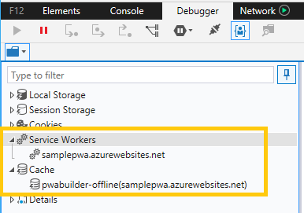
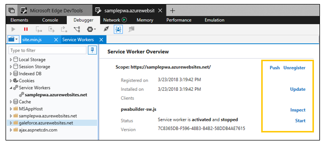

# Progressive Web App debugging

With the [latest release](../whats-new.md#pwa-debugging) of the Edge DevTools, support for debugging Progressive Web Apps (PWAs) is now enabled by default.

You can debug your [PWA as an installed Windows 10 app](../../progressive-web-apps/get-started.md#pwas-on-windows-10) by selecting it from the list of [**Local**](../../devtools-guide.md#local-debugging) targets (browser tab/PWA/webview) in the chooser of the [standalone DevTools app](../../devtools-guide.md#microsoft-store-app).

 If a site makes use of **Service Workers** and/or the **Cache** API,  DevTools will populate entries in the **Debugger** panel for each origin, similar to how [web storage](./web-storage.md) and [cookies](./cookies.md) inspection work:



The DevTools also provide an [Indexed DB manager](./indexed-db.md) for working with the structured data used by your PWA.

## Service Workers manager

Clicking on a specific service worker entry will open up the **Service Worker Overview**, where you can force **Update** and manage the service worker registration (**Unregister**) for the given scope and send a test **Push** notification. You can also **Stop**/**Start** individual service workers and **Inspect** them from a separate debugger window:




Please note the following about service worker debugging in Edge DevTools:

 - Debugging a service worker will launch a new instance of the  DevTools separate from the page's tools because service workers can be shared across multiple tabs.
 - The [**Elements**](../elements.md) and [**Emulation**](../emulation.md) panels are absent from the service worker debugger, given that service workers run in the background and do not directly control the front-end of your app.
 - Currently network traffic for a service worker is only reported from the  DevTools debugging instance for that worker, and not from the debugger instance for the page itself.
 - To simulate a **Push** from the DevTools, you'll need to add a *push* event listener to your service worker in order to observe its effect. The following example will print "Test push message from DevTools" in your service worker **Console**.
   ```JavaScript
   self.addEventListener('push', function(event){
       console.log(event.data.text());
   });
   ```

Here are some general things to keep in mind when using service workers:

- **HTTPS-only.** Service workers will not work in HTTP; you will need to use HTTPS. However, you can register service workers on `localhost` for testing purposes.

- **No DOM access allowed.** As with web workers, you don’t get access to the page’s object model. This means that if you need to change something about the page, you’ll need to use [`postMessage`](https://developer.mozilla.org/en-US/docs/Web/API/Worker/postMessage) from the service worker to the page so that you can handle it DOM changes from the page.

- **Executes separate from page.** Because these scripts are not tied to the lifetime of a page, it’s important to understand that they do not share the same context as the page. Aside from not having access to the DOM (as stated earlier), they won’t have access to the same variables available on the page.

- **Overrides *App Cache*.** App Cache will be ignored when service workers are in use. The Service Worker API is intended to entirely supplant App Cache  by giving more granular control to the web developer.

  - **Script can’t be on CDN.** The JavaScript file for the service worker can’t be hosted on a Content Distribution Network (CDN), it must be on the same domain as the page. However, if you like, you can import scripts from your CDN.

- **Can be terminated any time.** Service workers are meant to be short-lived and their lifetime is tied to events. In particular, service workers have a time limit in which they must finish executing their event handlers. In other cases, the browser or the operating system may choose to terminate a service worker that impacts the battery, CPU, or memory consumption. In either case, avoid relying on global variables in the service worker script in case a different service worker instance is used on a subsequent event that’s being handled.

- **Only asynchronous requests allowed.** Synchronous XHR is not allowed here! Neither is localStorage, so it’s best to make use of Indexed DB and the new Caches API described earlier.

- **Service worker to scope is 1:1.** You’ll only be able to have one service worker per scope. That means if you try to register a different service worker for a scope that already has a service worker, that service worker will be updated.

## Cache manager

Clicking on a specific cache entry will open up the **Cache** manager, where you can inspect and optionally delete cache entries (*Request* and *Response* key/value pairs):


## Shortcuts

### Cache manager

| Action              | Shortcut      |
|:--------------------|:--------------|
| Refresh             | `Ctrl` + `F5` |
| Delete item         | `Del`         |
| Copy selected items | `Ctrl` + `C`  |
| Select all          | `Ctrl` + `A`  |

