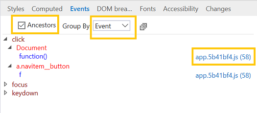

# Events 

View the event listeners registered on the selected element and (optionally, using the checkbox toggle) its ancestors. This is useful for tracking down rogue event listeners. 

You can group the event listeners by either **Event** or **Element**. Clicking the blue hyperlink next to the event handler name will open the debugger to the location of that function.

