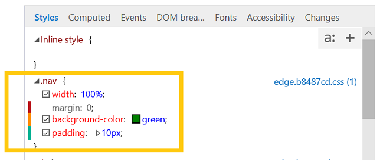

# Styles
View and edit the currently applied styles, organized by stylesheet.  As you make changes to your properties, a colored indicator bar will appear for changed (yellow), added (green), and deleted (red) properties.

You can display the pseudo states panel by clicking the "**a:**" button. Define a new style rule by clicking the "**+**" button or right-clicking anywhere in the **Styles** pane to open the context menu.

## Editing pseudo elements

Use the [Styles](#styles) pane to add, edit, and delete pseudo elements and pseudo states. To apply a CSS pseudo state to the selected element, open the *Pseudo states panel* (**a:** button) and tick the desired class.

To add a pseudo element, click the **+** (*New style rule*) button and edit as you would a regular stylesheet.

Pseudo elements are grouped under their own headings in the *Styles* pane.