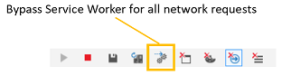
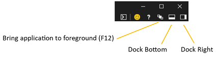

# DevTools in the latest Windows 10 update (EdgeHTML 17)

This release of the DevTools ships in two ways: as the traditional in-browser (`F12`) tools for Edge, and now as a standalone [Windows 10 app](#devtools-windows-10-app) from the Microsoft Store!

The tools have been updated with a number of major features, including basic support for [remote debugging](#remote-debugging) (via our new [DevTools Protocol](#devtools-protocol)), [PWA debugging features](#pwa-debugging), [IndexedDB cache management](#indexeddb-management), [vertical docking](#vertical-window-docking) and more! We also continued the overall [refactoring effort](./whats-new/edgehtml-16.md) started last release as part of ongoing investments in performance and reliability.

Here are the latest Microsoft Edge DevTools features coming with the next [Windows 10 update]() and available now on [Windows Insider Preview](https://insider.windows.com/) builds.

## DevTools Windows 10 app

 

The [**Microsoft Edge DevTools**](https://www.microsoft.com/en-us/store/p/microsoft-edge-devtools-preview/9mzbfrmz0mnj?activetab=pivot%3aoverviewtab) are now available as a standalone Windows 10 app from the Microsoft Store. With the store version comes a *chooser* panel for attaching to open local and remote page targets and a tabbed layout for easy switching between DevTools instances. The Edge DevTools are also still available (`F12`) from within the browser (without the chooser panel).

Decoupling the DevTools from Edge provides these UX and architectural advantages:

- The DevTools run in a separate app container sandbox from Microsoft Edge, providing better reliability for both.
- The app provides easy switching between active DevTools instance tabs (rather than having to switch between open Edge tabs)
- We're able to instrument the *EdgeHTML* browser engine and open it to the larger devtools ecosystem with [cross-browser APIs](https://github.com/WICG/devtools-protocol/).
- We can ship DevTools updates independently from the Windows (and EdgeHTML) release cycle.

Check out the *DevTools guide* for more on [local and remote debugging using the DevTools app](../devtools-guide.md).

## DevTools Protocol

Developer tools can use the [**Microsoft Edge DevTools Protocol**](../devtools-protocol/index.md) to inspect and debug the Microsoft Edge browser. It provides a set of methods and events that are organized into different [Domains](0.1/domains/index.md) of EdgeHTML engine instrumentation.

 Tooling clients can call these methods and monitor these events through JSON web socket messages exchanged with the *DevTools Server* hosted by Edge or the [Windows Device Portal](https://docs.microsoft.com/en-us/windows/mixed-reality/using-the-windows-device-portal). 
 
 Microsoft Edge DevTools uses this protocol to enable [remote debugging](../devtools-protocol/0.1/clients.md#microsoft-edge-devtools-preview) of a host machine running Microsoft Edge from the [standalone DevTools client](https://www.microsoft.com/en-us/store/p/microsoft-edge-devtools-preview/9mzbfrmz0mnj) available from the Microsoft Store.
 
 The latest [**Visual Studio Preview**](https://www.visualstudio.com/vs/preview/) builds (Visual Studio 15.7 Preview 1 or later) use the DevTools Protocol to enable launching and debugging Edge (JavaScript code) from within the Visual Studio IDE of any ASP.NET or .NET Core project.

## IndexedDB inspection

New to the [**Debugger**](./debugger.md) this release is an [Indexed DB Manager](./debugger/indexed-db.md) with support for inspecting and refreshing your object stores and deleting individual key-value entries. Expect even more functionality in future releases.

## PWA debugging

Support for [debugging Progressive Web Apps (PWAs)](./debugger/progressive-web-apps.md) is now enabled by default, providing tool tabs for [**Service Workers**](./debugger/progressive-web-apps.md#service-workers-manager), [**Cache API**](./debugger/progressive-web-apps.md#cache-manager), and [**Indexed DB**](./debugger/indexed-db.md) management.

Additionally, the [Network panel toolbar](./network.md#toolbar) has a new button, **Bypass Service Worker for all network requests**, to toggle on/off your registered service workers as network proxies:

You can debug your [PWA as an installed Windows 10 app](../../progressive-web-apps/get-started.md#test-and-debug-your-pwa-on-windows) by selecting it from the list of [**Local**](../../devtools-guide.md#local-debugging) targets (browser tab/PWA/webview) in the chooser of the [standalone DevTools app](../../devtools-guide.md#microsoft-store-app).

## Vertical window docking

You can now vertically dock the DevTools beside the page you're debugging from within Microsoft Edge, in addition to docking at the bottom and undocking the DevTools from the browser window. Use `Ctrl+Shift+D` to toggle between the **Dock Bottom**, **Dock Right**, and **Undock** states, or the UI controls at the top-left corner of the DevTools:

 