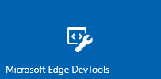

# Microsoft Edge DevTools Protocol Version 0.2 Clients (EdgeHTML)  

> [!NOTE]
> Version 0.2 of the Microsoft Edge DevTools Protocol works only on the [Windows 10 October 2018 Update](/windows/uwp/whats-new/windows-10-build-17763) and later [Windows Insider Preview](https://insider.windows.com/en-us/getting-started/) builds.  

**DevTools Protocol 0.2** supports the following tooling clients.

[](#microsoft-edge-devtools-preview) [](#visual-studio-code) [](#microsoft-visual-studio)

## Microsoft Edge DevTools Preview

You can use the standalone [**Microsoft Edge DevTools Preview**](https://www.microsoft.com/store/p/microsoft-edge-devtools-preview/9mzbfrmz0mnj?activetab=pivot%3aoverviewtab) Windows 10 app from the Microsoft Store to remotely debug a host device running Microsoft Edge ([EdgeHTML 17](../../dev-guide.md) or later).

Version 0.2 of the DevTools Protocol provides new domains for style and layout debugging and console APIs, in addition to the core script debugging functionality introduced in Version 0.1. In the Edge DevTools UI, this translates to functionality available in the [**Elements**](../../devtools-guide/elements.md), [**Console**](../../devtools-guide/console.md) and [**Debugger**](../../devtools-guide/debugger.md) panels. Currently Microsoft Edge remote debugging is limited to desktop hosts, with support for other Windows 10 devices coming in future releases.

Here's how to set up remote debugging with the Microsoft Edge DevTools Preview app. The DevTools Protocol version 0.2 requires [Windows 10 October 2018 Update](/windows/uwp/whats-new/windows-10-build-17763) or a later Windows Insider Preview build on the host (debugee) machine. The Edge DevTools Preview app (used on the debugger machine) will run on Windows 10 version 16299 (Windows 10 Fall Creators Update, 10/2017) or higher.

**On the host (debugee) machine...**

1. If you're on a WiFi network, ensure the network is marked as either **Domain** or **Private**. You can verify this by opening the [**Windows Defender Security Center**](/windows/security/threat-protection/windows-defender-security-center/windows-defender-security-center) app, clicking on **Firewall & network protection** and checking if your network is listed as a *Domain network* or *Private network*. 

    If its listed as *Public*, go to **Settings** > **Network & Internet** > **Wi-Fi**, click on your network and toggle the *Network profile* button to **Private**.

2. Open the **For developers** control panel in Windows *Settings* (search for *developer* and click on *Use developer features*), and: 

    a. Toggle on **Developer Mode**. This will install the *Developer Mode* package, enabling remote tooling for desktop.

    b. Enable [**Device Portal**](/windows/uwp/debug-test-perf/device-portal) (*Turn on remote diagnostics over local area network connections*) and **Device discovery** (*Make your device visible to USB connections and your local network*).

    c. Turn on **Authentication** and supply a username / password.

    d. Note the machine IP address and connection port (50443) displayed.

3. Open tabs in Microsoft Edge that you wish to debug from the client machine.

**On the client (debugger) machine...**

1.  Install and launch the standalone [Microsoft Edge DevTools Preview](https://www.microsoft.com/store/p/microsoft-edge-devtools-preview/9mzbfrmz0mnj?activetab=pivot%3aoverviewtab) app from the Microsoft Store.

2. Open the **Remote** panel and enter the network location (URL and port) of the host machine and click **Connect**.

3. **Install** the host machine's certificate from the *Untrusted Certificate* dialog that appears.

4. Supply the username/password you designated for Device Portal authentication.

5. The *Remote* panel will load a list of debuggable page targets on the host machine. Select one to start debugging.

6. Use the **Refresh** button to update and reload the list of remote page targets on the host machine. Click the **Disconnect** button to return to the *Connect to a remote device* screen and attach to a different host.

## Visual Studio Code

With the [Debugger for Edge](https://marketplace.visualstudio.com/items?itemName=msjsdiag.debugger-for-edge) VS Code extension, you can debug script running in Microsoft Edge directly in Visual Studio Code. The extension requires you to be serving your web application from localhost, which you can start from either command-line or a [Task](https://code.visualstudio.com/docs/editor/tasks).

To get started:

1. Install the [Debugger for Edge](https://marketplace.visualstudio.com/items?itemName=msjsdiag.debugger-for-edge) VS Code extension.

2. Restart VS Code, open the folder containing the project you wish to debug and set breakpoints in your code.

3. Configure a localhost [launch task](https://code.visualstudio.com/docs/editor/debugging#_launch-configurations) to open the desired page of your project: **Debug** > **Add Configuration...**. For example:

    ```json
    {
        "version": "0.2.0",
        "configurations": [

            {
                "name": "Launch localhost",
                "type": "edge",
                "request": "launch",
                "url": "http://localhost/mypage.html",
                "webRoot": "${workspaceFolder}/wwwroot"
            }
        ]
    }
    ```

    [*Using the debugger*](https://github.com/Microsoft/vscode-edge-debug2#using-the-debugger) has more on launch configuration settings. 

4. Start your server on localhost and press the **Start Debugging** (play) button or `F5` to launch Microsoft Edge. When a breakpoint is hit, you'll break into VS Code and can further inspect and step through code from there.

For more, check out the [VS Code - Debugger for Microsoft Edge](https://github.com/Microsoft/vscode-edge-debug2#----vs-code---debugger-for-microsoft-edge--) documentation.

## Microsoft Visual Studio

Using the latest [**Visual Studio**](https://www.visualstudio.com) version (Visual Studio 15.8 or later) running on [Windows 10 October 2018 Update](/windows/uwp/whats-new/windows-10-build-17763), you can launch and debug Microsoft Edge from the IDE on any ASP.NET or .NET Core project.

Here's how to set up Microsoft Edge debugging with Visual Studio:

1.  Install and launch the latest [**Visual Studio**](https://www.visualstudio.com/) (Visual Studio 15.8 or later).

2. Open an existing ASP.NET or .NET Core project or **Create new project...** using one of the **Visual C#** .NET templates.

3. In the project **Solution Explorer**, open the JavaScript files you wish to debug and set breakpoints within the IDE just as you would with server-side code.

4. Press `F5` to launch Microsoft Edge running the DevTools Server. When a breakpoint is hit, you'll break into Visual Studio and can further inspect and step through the code from there.
