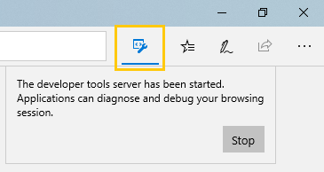

# Microsoft Edge DevTools Protocol

Developer tools can use the **Microsoft Edge DevTools Protocol** to inspect and debug the Microsoft Edge browser and other EdgeHTML hosts, such as Progressive Web Apps (PWAs that run in the *WWAHost.exe* process) and the Universal Windows Platform [webview](../webview.md) control. It provides a set of methods and events that are organized into different [Domains](0.1/domains/index.md) of EdgeHTML engine instrumentation.

 Tooling clients can call these methods and monitor these events through JSON web socket messages exchanged with the *DevTools server* hosted on the EdgeHTML process to be debugged. Microsoft Edge DevTools uses this protocol to enable [remote debugging](0.1/clients.md#microsoft-edge-devtools-preview) of a host machine running Microsoft Edge from the standalone DevTools client available from the [Microsoft Store](https://www.microsoft.com/en-us/store/p/microsoft-edge-devtools-preview/9mzbfrmz0mnj).

The Microsoft Edge DevTools Protocol is designed to be interoperable with the [Chrome DevTools Protocol](https://chromedevtools.github.io/devtools-protocol/).

## Using the protocol

> [!NOTE]
> The Microsoft Edge DevTools Protocol is currently in preview and works only on [Windows Insider Preview](https://insider.windows.com/en-us/getting-started/) builds. 

Here's how to attach a custom tooling client to the DevTools Server in Microsoft Edge. See the [remote debugging](0.1/clients.md#microsoft-edge-devtools-preview) instructions if you're using Microsoft Edge DevTools as your client.

1. Launch Microsoft Edge with the remote debugging port open, specifying the URL you wish to open. For example:

    ```
    MicrosoftEdge.exe --devtools-server-port 9222 https://www.bing.com
    ```

    If Edge is already launched, the URL parameter is optional. A button will appear next to the browser address bar to indicate the **Developer tools server** has started:

     

2. Use this [HTTP endpoint](0.1/http.md) to get a list of attachable page targets:

    ```
    http://localhost:9222/json/list
    ```

3. Connect to the listed `webSocketDebuggerUrl` of the desired page to issue further [protocol commands](0.1/domains/index.md) and receive event messages through the devtools socket server.

## Status and feedback

The preliminary release ([Version 0.1](0.1/index.md)) of the Microsoft Edge DevTools Protocol provides core debugging functionality, such as setting breakpoints, stepping through code, and exploring stack traces. In the Edge DevTools UI, this translates to functionality available in the [**Debugger**](../devtools-guide/debugger.md) panel, minus cache inspection (for Web storage, Service worker, Cache API, and IndexedDB).

Further platform instrumentation will be available in future releases of the protocol.

Thanks for trying the Edge DevTools Protocol! We'd love to hear your feedback at:

 - [**Microsoft Edge Developer UserVoice**](https://wpdev.uservoice.com/forums/257854-microsoft-edge-developer?category_id=84475): DevTools feature ideas and requests

 - [**EdgeHTML Issue Tracker**](https://developer.microsoft.com/en-us/microsoft-edge/platform/issues/): Protocol, DevTools, and EdgeHTML platform bugs and issues

 - [**Microsoft Edge DevTools Feedback Hub**](feedback-hub:?referrer=microsoftEdge&tabID=2&newFeedback=true&ContextId=344): Protocol and DevTools problems and suggestions through the Feedback Hub app

## FAQ

#### Can multiple clients connect to the same DevTools Server?
Yes, but not simultanously. The last client to connect will kick off the previous one.

#### Do I have to use 9222 as the DevTools Server port?
No. You can specify any port, though be sure to pick one that isn't already in use. Port 9222 for remote debugging is used by convention.

#### How do I connect my custom tooling client to Microsoft Edge running the DevTools Server?
See [*Using the protocol*](#using-the-protocol) instructions above for attaching to Edge running on the local machine. If you're looking to support remote debugging, you'll need to devise a user workflow for installing the host machine's SSL certificate on the client, for example with an install dialog as [Microsoft Edge DevTools Preview](./0.1/clients.md#microsoft-edge-devtools-preview) uses.

#### If I'm remote debugging using Edge DevTools, do I need to start the host browser process with *--devtools-server-port* cmd line switch? 
No. If you're setting up [remote debugging using Microsoft Edge DevTools Preview](./0.1/clients.md#microsoft-edge-devtools-preview), the `--devtools-server-port` command line switch is not necessary for starting Edge. In this case, Windows *Device Portal* is hosting the DevTools socket server on behalf of the browser.

#### Can I use the DevTools Server to remotely debug a WWAHost.exe or webview process?
Not yet, but stay tuned...
