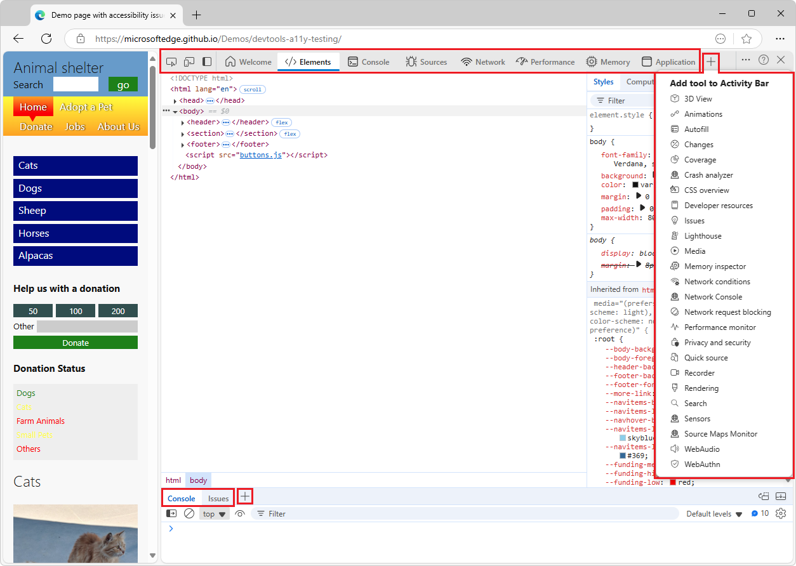
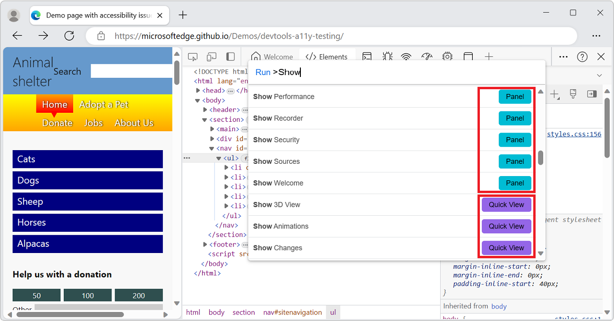
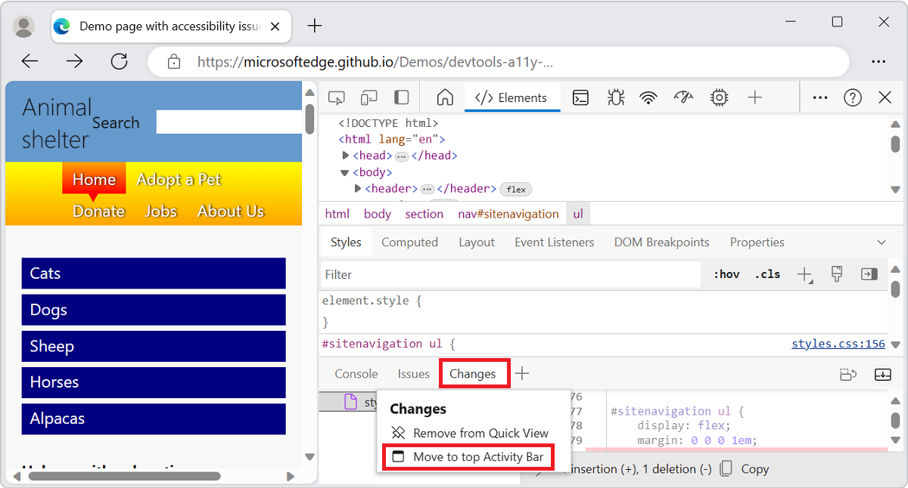
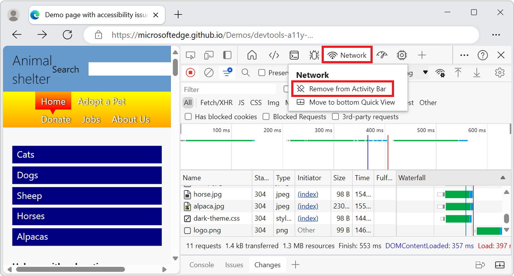

# About the list of tools

DevTools provides more than 30 tools, consisting of _Default tools_ and _More tools_.

<!-- ====================================================================== -->
## Default tools

By default, the following tools are listed in the **Activity Bar** at the top of DevTools:

*  **Inspect tool**
*  **Device Emulation**
*  **Welcome**
*  **Elements**
*  **Console**
*  **Sources**
*  **Network**
*  **Performance**
*  **Memory**
*  **Application**

<!-- ------------------------------ -->
#### Overview of the default tools

| Tool | Purpose | Article |
| --- | --- | --- |
|  **Inspect** | Use the **Inspect** tool to see information about an item within a rendered webpage.  When the **Inspect** tool is active, you _hover_ over items in the webpage, and DevTools adds an information overlay and grid highlighting on the webpage. | [Analyze pages using the Inspect tool](css/inspect.md) |
|  **Device Emulation** | Use the **Device Emulation** tool, also called _Device Simulation Mode_ or _Device Mode_, to approximate how your page looks and responds on a mobile device. | [Emulate mobile devices (Device Emulation)](device-mode/index.md) |
|  **Welcome** | The **Welcome** tool opens when you first open DevTools.  It displays links to developer docs, latest features, release notes, and an option to contact the Microsoft Edge DevTools team. | [Welcome tool](welcome/welcome-tool.md) |
|  **Elements** | Inspect, edit, and debug your HTML and CSS.  You can edit in the tool while displaying the changes live in the browser.  Debug your HTML using the DOM tree, and inspect and work on the CSS for your webpage. | [Inspect, edit, and debug HTML and CSS with the Elements tool](elements-tool/elements-tool.md) |
|  **Console** | An intelligent, rich command line within DevTools.  A great companion tool to use with others tools.  Provides a powerful way to script functionality, inspect the current webpage, and manipulate the current webpage using JavaScript. | [Console overview](console/index.md) |
|  **Sources** | Use the **Sources** tool to view, modify, and debug front-end JavaScript code, and inspect and edit the HTML and CSS files that make up the current webpage. | [Sources tool overview](sources/index.md) |
|  **Network** | Use the **Network** tool to make sure that resources are being downloaded or uploaded as expected.  Inspect the properties of an individual resource, such as the HTTP headers, content, or size. | [Inspect network activity](network/index.md) |
|  **Performance** | Analyze runtime performance, which is how your page performs when it's running, as opposed to loading. | [Analyze runtime performance (tutorial)](./performance/index.md) |
|  **Memory** | Find memory issues that affect page performance, including memory leaks, memory bloat, and frequent garbage collections. | [Fix memory problems](memory-problems/index.md) |
|  **Application** | Use the **Application** tool to manage storage for web app pages, including manifest, service workers, local storage, cookies, cache storage, and background services. | [The Application tool, to manage storage](storage/application-tool.md) |

The **Elements**, **Console**, and **Sources** tools (tabs) are permanent, in the **Activity Bar**.  The other tool tabs can be removed, or moved down to the **Quick View** toolbar.

<!-- ====================================================================== -->
## More tools

The **More tools** () button on the **Activity Bar** lists additional, optional tools that can be added to the **Activity Bar**.

There's also a **More tools** () button on the **Quick View** toolbar at the bottom of DevTools.  To show or hide the **Quick View** panel, press **Esc**; or click **Customize and control DevTools** (**...**) in the upper right, and then click **Toggle Quick View panel**.

<!-- ------------------------------ -->
#### Overview of tools in the More tools menu

| Tool | Purpose | Article |
| --- | --- | --- |
| **3D View** | Explore the webpage translated into a 3D perspective.  Debug your webpage by navigating through the DOM or z-index stacking context. | [Navigate webpage layers, z-index, and DOM using the 3D View tool](3d-view/index.md) |
| **Animations** | Inspect and modify CSS animation effects by using the **Animation Inspector** in the **Animations** tool. | [Inspect and modify CSS animation effects](inspect-styles/animations.md) |
| **Changes** | Tracks any changes you've made to CSS or JavaScript in DevTools.  Shows you what changes to make to your actual source files after you use DevTools to modify your webpage files sent from the server. | [Track changes to files using the Changes tool](changes/changes-tool.md) |
| **Coverage** | Help you find unused JavaScript and CSS code, to speed up your page load and save your mobile users cellular data. | [Find unused JavaScript and CSS code with the Coverage tool](coverage/index.md) |
| **Crash analyzer** | Analyze crashes of your web app.  You can input a JavaScript production stack trace, such as for non-fatal JavaScript exceptions, and then have your source maps applied to the stack trace so that you can debug faster. | [Crash analyzer tool](./crash-analyzer/index.md) |
| **CSS overview** | Help you better understand your page's CSS and identify potential improvements. | [CSS overview tool](css/css-overview-tool.md) |
| **Developer resources** | Shows resource URLs for the webpage. | [Developer resources tool](developer-resources/developer-resources.md) |
| **Issues** | The **Issues** tool automatically analyzes the current webpage, reports issues grouped by type, and provides documentation to help explain and resolve the issues. | [Find and fix problems using the Issues tool](issues/index.md) |
| **Lighthouse** | Use the Lighthouse tool to identify and fix common problems that affect your site's performance, accessibility, and user experience. | [Lighthouse tool](lighthouse/lighthouse-tool.md) |
| **Media** | Use this tool to view information and debug the media players per browser tab. | [View and debug media players information](media-panel/index.md) |
| **Memory inspector** | Inspect JavaScript ArrayBuffer with the Memory inspector. | [Inspect a JavaScript ArrayBuffer with the Memory inspector tool](memory-inspector/memory-inspector-tool.md) |
| **Network conditions** | Use the **Network conditions** tool to disable the browser cache, set network throttling, set the user agent string, and set Content-Encodings such as deflate, gzip, and br. | [Network conditions tool](network-conditions/network-conditions-tool.md) |
| **Network Console** | Use the **Network Console** tool to make changes to network requests (network calls) to see why they fail.  Change and replay any of the network requests, and make detailed network API calls.  | [Network Console tool](network-console/network-console-tool.md) |
| **Network request blocking** | Use the **Network request blocking** tool to test blocking network requests to a specified URL pattern and see how a webpage behaves. | [Network request blocking tool](network-request-blocking/network-request-blocking-tool.md) |
| **Performance monitor** | Provides a real-time view of the runtime performance of a webpage, to determine where performance problems come from, making a website run slowly.  Finds whether problems are from high memory or CPU usage, too-frequent layout and style calculations, or too many DOM nodes and event listeners. | [Measure runtime performance of a page using the Performance monitor tool](performance-monitor/performance-monitor-tool.md) |
| **Quick source** | Use the **Quick source** tool to display or edit source files when using a tool other than the **Sources** tool. | [Display or edit source files using the Quick source tool](quick-source/quick-source-tool.md) |
| **Recorder** | Use the **Recorder** tool to record user flows manually, and then replay them automatically to speed up testing and performance investigations. | [Record and replay user flows and measure performance](recorder/index.md) |
| **Rendering** | Use the **Rendering** tool to see what your webpage looks like with different display options or vision deficiencies. | [Rendering tool, to see what a webpage looks like with different display options or vision deficiencies](rendering-tools/rendering-tool.md) |
| **Search** | Use the **Search** tool to find specific source files for a webpage, including HTML, CSS, JavaScript, and image files. | [Find source files for a page using the Search tool](search/search-tool.md) |
| **Security** | Inspects the security of a page. | [Understand security issues using the Security tool](security/index.md) |
| **Sensors** | Override geolocation, simulate device orientation, force touch events when clicking, and emulate device idle state. | [Emulate device sensors](./sensors/index.md) |
| **Source Maps Monitor** | Use the **Source Maps Monitor** tool to monitor your source maps. | [Source Maps Monitor tool](source-maps-monitor/source-maps-monitor-tool.md) |
| **WebAudio** | Use the **WebAudio** tool to monitor WebAudio traffic.  The **WebAudio** tool uses the WebAudio API. | [WebAudio tool](webaudio/webaudio-tool.md) |
| **WebAuthn** | Use the **WebAuthn** tool to create and interact with software-based virtual authenticators. | [Emulate authenticators and debug WebAuthn](webauthn/index.md) |

The **More tools** (**+**) menu in the **Activity Bar** and in the **Quick View** toolbar is dynamic: it omits any tab tools that are open on that toolbar.

<!-- ====================================================================== -->
## Additional ways to access the tools

The following features are additional ways to access the tools:

* The **Quick View** panel is an additional toolbar and area to hold tools, below or to the right of the **Activity Bar** panel.

* The **Command Menu** is a way to directly use features of tools.

* The **Settings** pages can turn on additional features of tools.

<!-- ====================================================================== -->
## Experimental tools

Microsoft Edge DevTools potentially includes additional tools, if you select the experiment's check box in DevTools **Settings > Experiments**.  For example:

| Tool | Purpose | Article |
| --- | --- | --- |
| **Protocol monitor** | Displays the DevTools protocol messages that are sent and received by DevTools, to debug the inspected page. | [Protocol Monitor](./experimental-features/index.md#protocol-monitor) in _Experimental features_. |
<!-- 2025/02/19: exists: Experiments > **Protocol Monitor** checkbox  -->

<!-- ====================================================================== -->
## Activity Bar tools vs. Quick View tools

_Activity Bar tools_ are tools that open in the **Activity Bar** (the upper pane) by default.  _Quick View_ tools are tools that open in the **Quick View** panel (the lower pane) by default.  To show or hide the **Quick View** panel: when focus is on DevTools, press **Esc**.

The **Command Menu** first lists the **Activity Bar** tools (indicated by the **Panel** label), and then the **Quick View** tools:

To move a tool to the other toolbar, right-click the tool's tab and then select **Move to bottom Quick View**, **Move to side Quick View**, **Move to top Activity Bar**, or **Move to left Activity Bar**:

To open the **Command Menu**, press **Ctrl+Shift+P** (Windows, Linux) or **Command+Shift+P** (macOS).  Or, click the **Customize and control DevTools** () button and then select **Run command**.

<!-- ====================================================================== -->
## Closing tool tabs

To close a tool tab that's on a toolbar, right-click the tab, and then select **Remove from Activity Bar** or **Remove from Quick View**:

The **Elements**, **Console**, and **Sources** tools are permanent tabs and cannot be closed or moved from the **Activity Bar** to the **Quick View** panel.  You can drag their tabs to reorder them in the **Activity Bar**.

The **Console** tool is also a permanent tab on the **Quick View** toolbar.  In contrast, the **Issues** tool on the **Quick View** toolbar can be removed.

<!-- ====================================================================== -->
## Restoring the default tool tabs

To restore all of the default tool tabs in the **Activity Bar** and **Quick View**:

1. In DevTools, select **Customize and control DevTools** () > **Settings** () > **Preferences**.

1. Click the **Restore defaults and refresh** button.  DevTools restarts, and the default tabs appear in both toolbars.

<!-- ====================================================================== -->
## See also
 
* [Overview of DevTools](overview.md) - Similar to the present article, but broader coverage, with a top-level introduction to DevTools.
