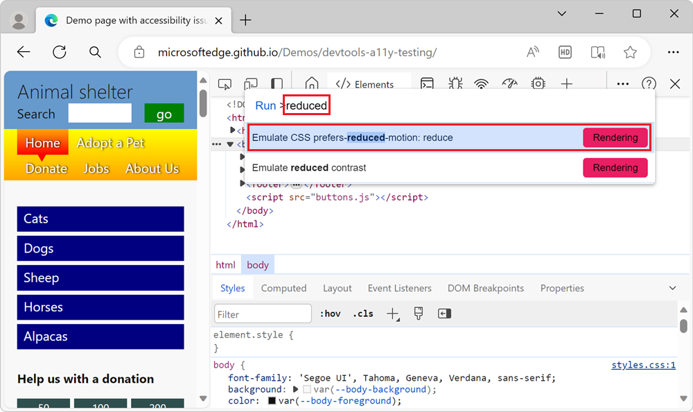

# Simulate reduced motion

CSS animation can be an accessibility problem.  Operating systems deal with this problem by including an option to turn off animations to avoid user confusion and potential health-related problems, such as triggering seizures.

On a webpage, you can use the [prefers-reduced-motion](https://developer.mozilla.org/docs/Web/CSS/@media/prefers-reduced-motion) CSS media query to detect the user's preference for animations.  Then wrap your animation code in a test, to conditionally run animations.  For example:

```css
header {
  /* The header element is animated */
  animation: slidein 1s ease-in-out;
}

@media (prefers-reduced-motion: reduce) {
  /* The user prefers reduced motion */
  .header {
    /* Turn off the animation for the header element */
    animation: none;
  }
}
```

To test that your code works as expected, without having to change your operating system setting, simulate the operating system's reduced motion setting in DevTools:

1. To open DevTools, right-click the webpage, and then select **Inspect**.  Or, press **Ctrl+Shift+I** (Windows, Linux) or **Command+Option+I** (macOS).  DevTools opens.

1. In DevTools, press **Ctrl+Shift+P** (Windows/Linux) or **Command+Shift+P** (macOS) to open the **Command Menu**.

1. Start typing **reduced**, select the **Emulate CSS prefers-reduced-motion** option, and then press **Enter**:

    

1. Refresh the webpage and check whether your animations run.


<!-- ====================================================================== -->
## See also

*  [Verify that the page is usable with UI animation turned off](./test-reduced-ui-motion.md) - A walkthrough using a demo page.
