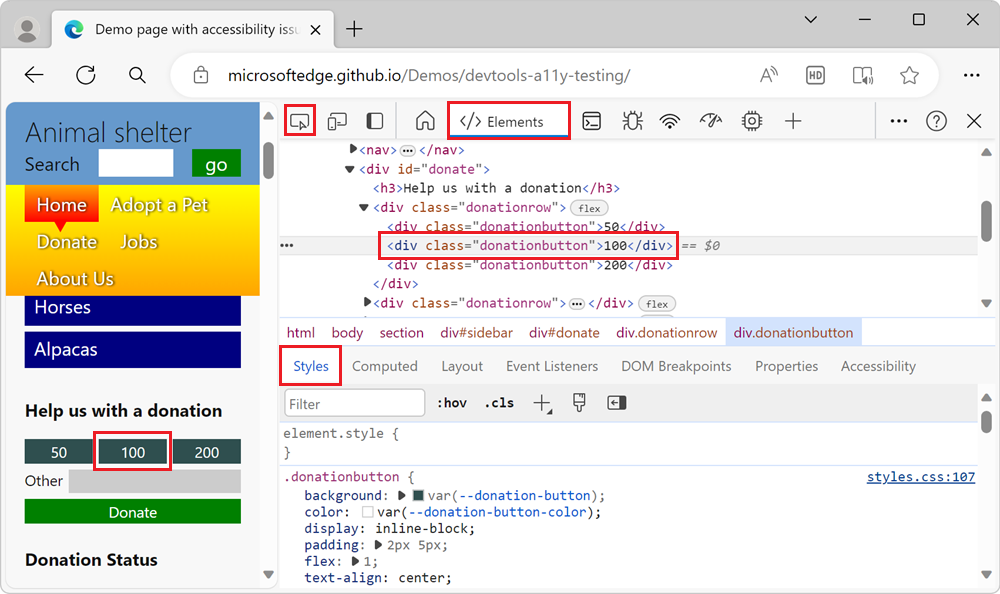
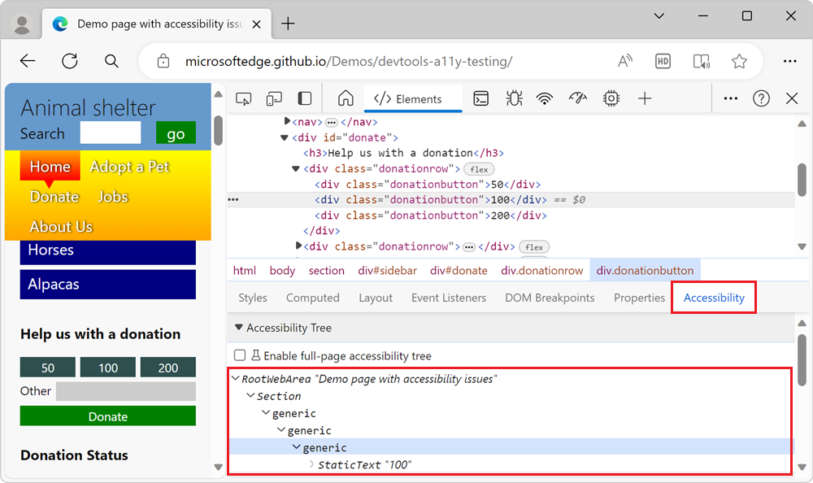

# Check the Accessibility Tree for keyboard and screen reader support

<!-- Accessibility tab: Accessibility Tree -->

Several DevTools features check for keyboard and screen reader support.  Using the **Inspect** tool to check the accessibility of each page element individually can become pretty time-consuming.  An alternative way to check a webpage is to use the **Accessibility Tree**.  The **Accessibility Tree** indicates what information the page provides to assistive technology such as screen readers.

The **Accessibility Tree** is a subset of the DOM tree, which contains elements from the DOM tree that are relevant and useful for displaying the contents of a page in a screen reader.  The **Accessibility Tree** is in the **Accessibility** tab of the **Elements** tool (near the **Styles** tab).

To explore using the Accessibility Tree:

1. Open the [accessibility-testing demo webpage](https://microsoftedge.github.io/Demos/devtools-a11y-testing/) in a new window or tab.

1. To open DevTools, right-click the webpage, and then select **Inspect**.  Or, press **Ctrl+Shift+I** (Windows, Linux) or **Command+Option+I** (macOS).  DevTools opens.

1. Select the **Inspect** () button in the top-left corner of DevTools so that the button is highlighted (blue).

1. In the rendered webpage, in the **Donation** section, hover over the **100** button.  The **Inspect** tool overlay appears.

1. In the rendered webpage, click the **100** button.  In DevTools, the **Elements** tool is displayed.  The DOM tree shows the `
100
` element for the **100** button.  The **Styles** pane shows the CSS rules that apply to the element.

   

1. To the right of the **Styles** tab, select the **Accessibility** tab.  The **Accessibility Tree** for the element is displayed, and is expanded:

   

Any element in the tree that doesn't have a name, or has a role of `generic` (such as the `
100
` element) is a problem, because that element won't be available to keyboard users, or to users who are using assistive technology.

<!-- ====================================================================== -->
## See also

*  [View the position of an element in the Accessibility Tree](accessibility-tab.md#view-the-position-of-an-element-in-the-accessibility-tree)
