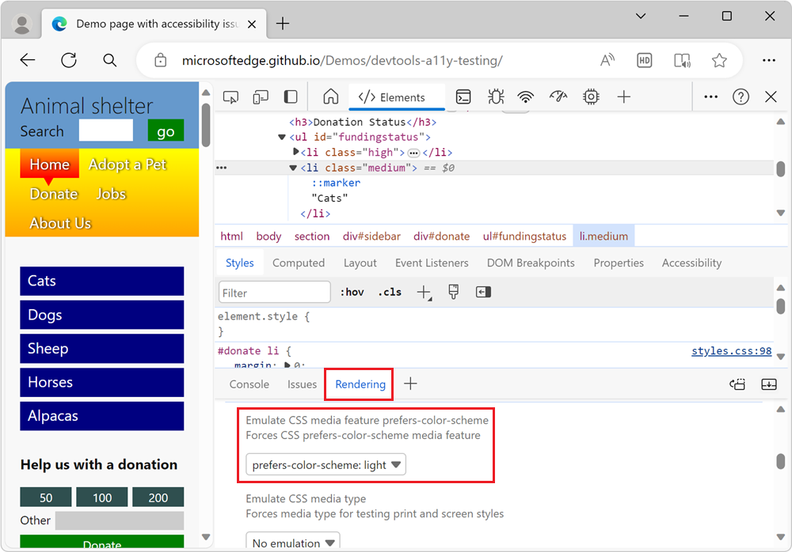
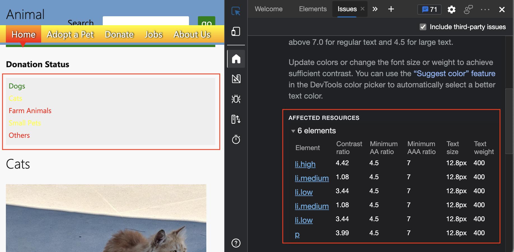
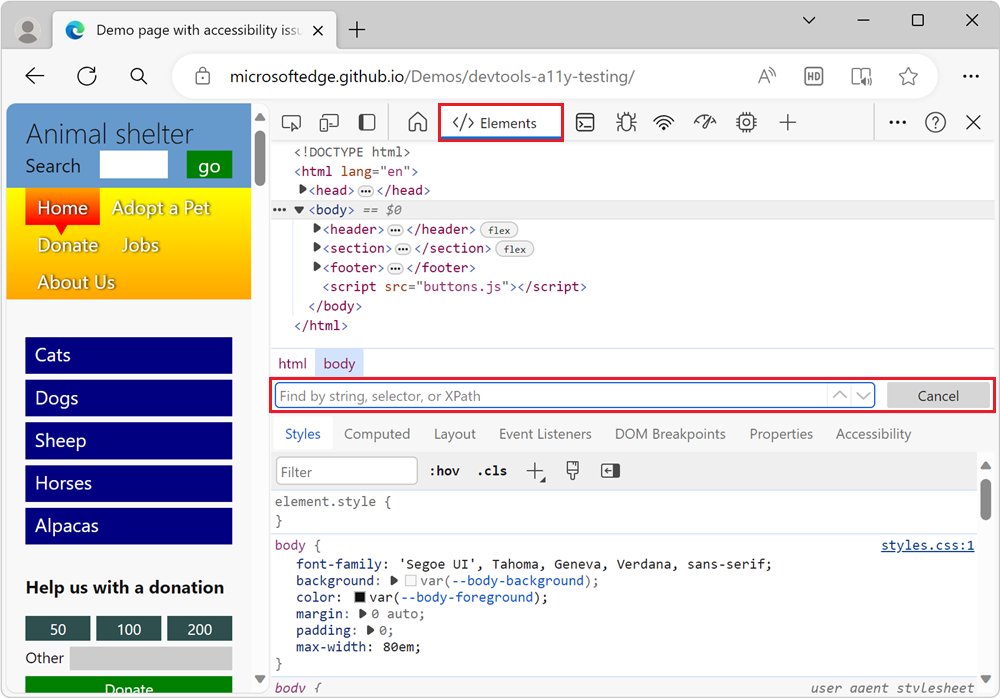

# Check for contrast issues with dark theme and light theme

<!-- Rendering tool: Emulate CSS media feature prefers-color-scheme -->

When testing color accessibility, there could be different display color themes that you need to test for contrast issues.

Most operating systems come with a dark mode and a light mode.  Your webpage can react to this operating system setting, by using a CSS media query.  You can test these themes and test your CSS media query without having to change your operating system setting, by using the **Emulate CSS media feature prefers-color-scheme** section in the **Rendering** tool.

As an example, the [accessibility-testing demo webpage](https://microsoftedge.github.io/Demos/devtools-a11y-testing/) includes a light theme and a dark theme.  The demo page inherits the dark or light theme setting from the operating system.  If we use DevTools to simulate the operating system being set to a light scheme and then refresh the demo webpage, the **Issues** tool shows six color-contrast problems instead of two.  (You might see different numbers.)

To emulate a user's selection of preferred color theme:

1. Open the [accessibility-testing demo webpage](https://microsoftedge.github.io/Demos/devtools-a11y-testing/) in a new window or tab.

1. Right-click anywhere in the webpage and then select **Inspect**.  Or, press **F12**.  DevTools opens next to the webpage.

1. Press **Esc** to open the **Quick View** panel at the bottom of DevTools.

1. In the **Quick View** toolbar, click the **More tools** () button, and then select **Rendering**.  The **Rendering** tool opens in the **Quick View** panel.

1. Scroll down to the **Emulate CSS media feature prefers-color-scheme** dropdown list, and then select **prefers-color-scheme: light**.  The webpage is re-rendered using `light-theme.css`:

   

1. In the **Quick View** panel, select the **Issues** tool, and then expand the **Accessibility** section.  Depending on various factors, you might get `Insufficient color contrast` warnings.  In the **AFFECTED RESOURCES** section of the issue, there are 6 elements that have insufficient color contrast:

   

   On the demo webpage, the **Donation status** section of the page is unreadable in light mode, and needs to change:

   

1. In DevTools, open the **Elements** tool, and then press **Ctrl+F** on Windows/Linux or **Command+F** on macOS.  The **Find** text box appears, to search within the HTML DOM tree:

   

1. Enter **scheme**.  The following CSS media queries are found, and the corresponding CSS files can now be updated:

    ```html
    <link rel="stylesheet" href="css/light-theme.css" media="(prefers-color-scheme: light), (prefers-color-scheme: no-preference)">
    <link rel="stylesheet" href="css/dark-theme.css" media="(prefers-color-scheme: dark)">
    ```


<!-- ====================================================================== -->
## See also

*  [Emulate dark or light schemes in the rendered page](preferred-color-scheme-simulation.md)
