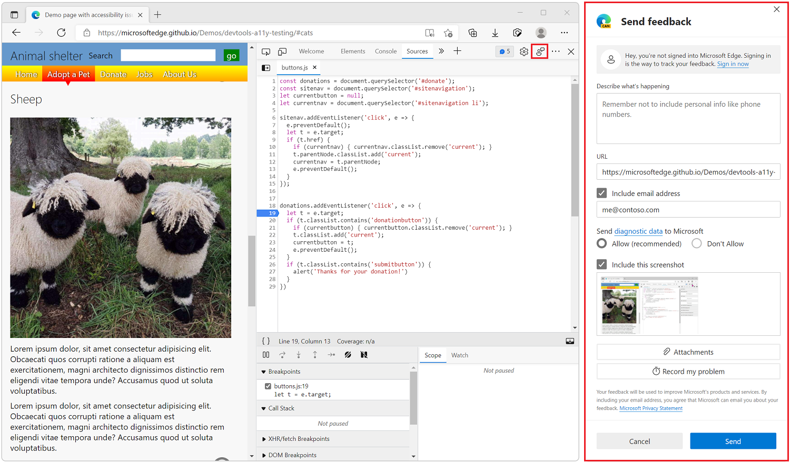

# Contact the Microsoft Edge DevTools team

Send your feedback to help improve Microsoft Edge DevTools.  Contact the Microsoft Edge DevTools team to submit feature requests or bug reports, or ask questions about Microsoft Edge DevTools.

There are several ways to get in touch with the Microsoft Edge DevTools team:

* To quickly report bugs from DevTools, use the **Send feedback** window.
* To submit feature requests, questions, and have longer conversations with the team, use the **DevTools** repo.
* To submit cross-browser suggestions, use the **Web Web Want** initiative.
* To submit documentation issues, use the **edge-developer** repo.

<!-- ====================================================================== -->
## Use the Send feedback window

To report a bug or request a feature while you are using DevTools:

1. Click the **Help** () icon, and then click **Send Feedback** () (or press **Alt+Shift+I** on Windows and Linux or **Option+Shift+I** on macOS) to open the **Send feedback** window.
1. In the **Send feedback** window, describe your bug or feature request. You can also attach a screenshot to help the team understand the problem better and add your email address so we can follow-up with you.
1. Press **Send** to create a tracked issue for the Microsoft Edge development team.

<!-- ====================================================================== -->
## Use the DevTools repo

To have longer discussions with the DevTools team and community about bugs or features, use the DevTools repository on GitHub.

You can [create a new issue](https://github.com/MicrosoftEdge/DevTools/issues/new/choose) on the repo or [search for existing issues](https://github.com/MicrosoftEdge/DevTools/issues) and join conversations.

Use the DevTools repo to have longer conversations, especially when you need to do more than report a bug. In the repo, you can share ideas and tips with others, explain your workflows and use cases in detail with the team, and generally have more meaningful interactions with the community.

<!-- ====================================================================== -->
## Submit a cross-browser suggestion to the Web We Want

To make a feature request across browser teams or standards bodies, submit a request at [The Web We Want initiative](../web-we-want/index.md).

The Web We Want is a cross-browser initiative to identify missing features for web standards or browsers.  Use this communication channel to let browser vendors and standards groups know your request.

*  Submit web platform or developer tool features.
*  View the list of submitted Wants, and vote on them.
*  Participate in discussions.
*  Use the links to resources.

You can follow the Web We Want initiative on Twitter or LinkedIn, and participate in surveys to prioritize submitted Wants.

<!-- ====================================================================== -->
## File a documentation issue

To enter a GitHub issue from within a documentation article, in the **Feedback** section at the bottom of an article, select the **This page** button.

Or you can [file an issue](https://github.com/MicrosoftDocs/edge-developer/issues/new?title=[DevTools%20Docs%20Feedback]) against the Microsoft Edge Developer documentation, directly in the **edge-developer** repo.
