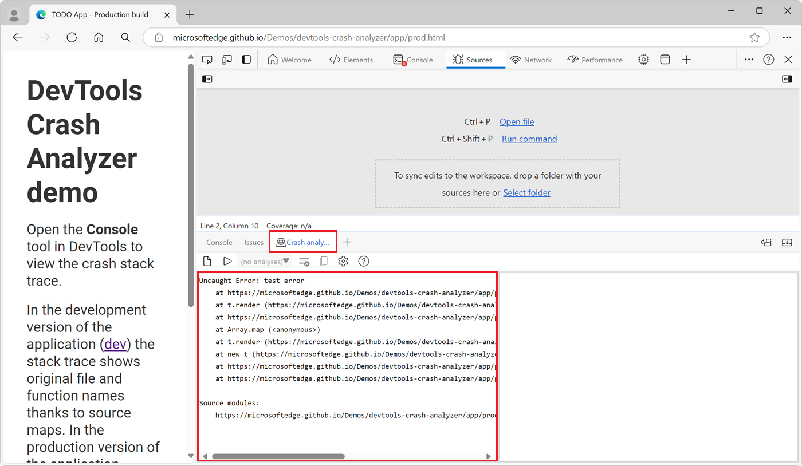
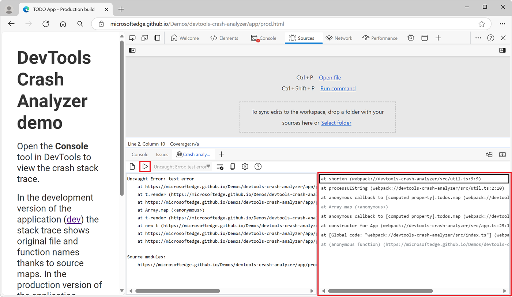
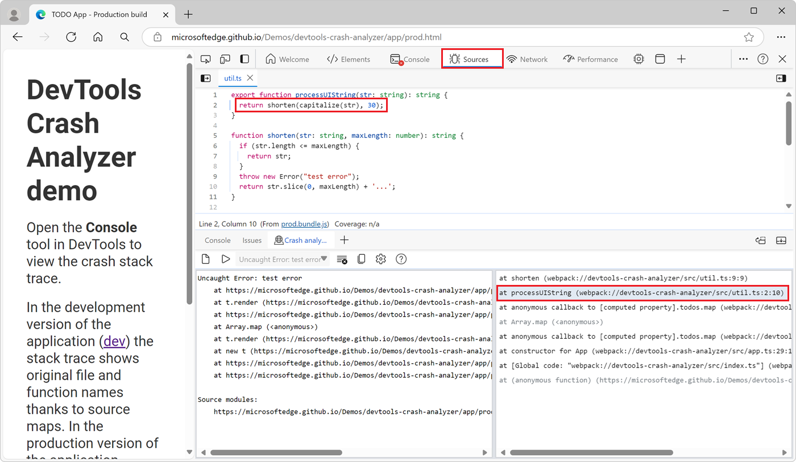

# Crash analyzer tool

Use the **Crash analyzer** tool to analyze and quickly diagnose crashes of your web app in production.  In the **Crash analyzer** tool, you can input a JavaScript stack trace that you collected in production and then have your source maps applied to unminify the stack trace so that you can debug faster.  The **Crash analyzer** tool enables you to take a minified JavaScript stack trace and rapidly work backwards to determine what lines of code caused the error.


When a web app crashes or hangs unexpectedly, this can result in data loss and a poor experience for your users.  Collecting information about the crashes that your users experience is helpful to diagnose and fix the root cause of the crashes. However, code that's running in production is often minified, which causes the JavaScript stack traces that are logged on crashes to also be minified.  The **Crash analyzer** tool helps you map minified stack traces collected in production back to the original source code, so that you can quickly identify the root cause of the crashes.

Here is an example of a minified stack trace that you might collect from your web app in production:

```
Uncaught Error: test error
    at https://microsoftedge.github.io/Demos/devtools-crash-analyzer/app/prod.bundle.js:1:1344
    at t.render (https://microsoftedge.github.io/Demos/devtools-crash-analyzer/app/prod.bundle.js:1:1368)
    at https://microsoftedge.github.io/Demos/devtools-crash-analyzer/app/prod.bundle.js:1:2278
    at Array.map (<anonymous>)
    at t.render (https://microsoftedge.github.io/Demos/devtools-crash-analyzer/app/prod.bundle.js:1:2252)
    at new t (https://microsoftedge.github.io/Demos/devtools-crash-analyzer/app/prod.bundle.js:1:2063)
    at https://microsoftedge.github.io/Demos/devtools-crash-analyzer/app/prod.bundle.js:1:2857
    at https://microsoftedge.github.io/Demos/devtools-crash-analyzer/app/prod.bundle.js:1:2896
```

Variable and function names are often shortened, like the variable `t` above. Script URLs often point to a built single-line bundle file, like the `prod.bundle.js` file above.

By comparison, here is an example of an unminified stack trace, with original variable and function names, and original source file names and line numbers:

```
Uncaught Error: test error
    at shorten (util.ts:9:9)
    at processUIString (util.ts:2:10)
    at todoMarkupBuilder (todo.ts:35:41)
    at Todo.render (todo.ts:24:12)
    at app.ts:36:39
    at Array.map (<anonymous>)
    at App.render (app.ts:36:22)
    at new App (app.ts:29:10)
    at index.ts:9:13
    at index.ts:9:33
```

There are two steps to analyze minified production stack traces in the **Crash analyzer** tool:

1. First, you collect specially formatted stack traces from your web app in production.

   There are many ways to collect stack traces from the browsers your users are using.  The section [Collect stack traces in production](#collect-stack-traces-in-production), below, provides examples and recommendations.  It also explains how to format the stack traces so that they can be analyzed in the **Crash analyzer** tool.

1. Next, you analyze the stack traces in the **Crash analyzer** tool.

   The section [Analyze stack traces in the Crash analyzer tool](#analyze-stack-traces-in-the-crash-analyzer-tool), below, explains how to first make source maps accessible in DevTools, and then how to use the **Crash analyzer** tool to analyze the stack traces.

<!-- TODO: add a diagram explaining how the system works -->


<!-- ====================================================================== -->
## Collect stack traces in production

The **Crash analyzer** tool doesn't collect stack traces for you.  You must first collect stack traces from your web app by using the tools and services that are available to you.  Here are some ways to collect stack traces in production:

* We recommend using a telemetry system such as [Azure Monitor Application Insights](/azure/azure-monitor/app/app-insights-overview) that can capture information about unhandled errors from your JavaScript code.

* You can also write JavaScript code to capture unhandled errors in your web app.  The following example shows how to use the `window.onerror` event handler to capture unhandled errors in a web app:

  ```javascript
  window.onerror = function (message, source, line, column, error) {
    // Get the stack trace from the error object.
    const stackTrace = error.stack;

    // Send the stack trace to your telemetry system.
    // Code not shown.
  };
  ```


<!-- ------------------------------ -->
#### Format the stack traces for the Crash analyzer tool

Collecting stack traces in production is not enough. The **Crash analyzer** tool needs stack traces to include a section called **Source modules**.

Here's an example of a stack trace that includes the **Source modules** section:

```
Uncaught Error: test error
    at https://microsoftedge.github.io/Demos/devtools-crash-analyzer/app/prod.bundle.js:1:1344
    at t.render (https://microsoftedge.github.io/Demos/devtools-crash-analyzer/app/prod.bundle.js:1:1368)
    at https://microsoftedge.github.io/Demos/devtools-crash-analyzer/app/prod.bundle.js:1:2278
    at Array.map (<anonymous>)
    at t.render (https://microsoftedge.github.io/Demos/devtools-crash-analyzer/app/prod.bundle.js:1:2252)
    at new t (https://microsoftedge.github.io/Demos/devtools-crash-analyzer/app/prod.bundle.js:1:2063)
    at https://microsoftedge.github.io/Demos/devtools-crash-analyzer/app/prod.bundle.js:1:2857
    at https://microsoftedge.github.io/Demos/devtools-crash-analyzer/app/prod.bundle.js:1:2896

Source modules:
    https://microsoftedge.github.io/Demos/devtools-crash-analyzer/app/prod.bundle.js 8b544e37b35d920a39d0e10f70fddc29b25d0db362741f3071eff86cef8613e9
```

The **Source modules** section includes the URLs of the JavaScript files that are involved in the stack trace, and a hash of the content of each file.  The hash is a 64-character string of hexadecimal characters that corresponds to the SHA-256 hash of the script being executed.  This is a byte-for-byte hash of the content for each JavaScript file.  The URLs and hashes make it possible for the **Crash analyzer** tool to later retrieve the source maps that were used to unminify the stack trace.

To add the **Source modules** section to your error stack traces, use the [Edge DevTools Crash Analyzer Support](https://www.npmjs.com/package/@microsoft/edge-devtools-crash-analyzer-support) library in your web app, as follows:

1. Add the Edge DevTools Crash Analyzer Support library in your project by using npm:

   ```bash
   npm install @microsoft/edge-devtools-crash-analyzer-support
   ```

1. Import the library in your JavaScript code, and then call the `installErrorStackModuleAnnotations` function:

   ```javascript
   import { installErrorStackModuleAnnotations } from '@microsoft/edge-devtools-crash-analyzer-support';

   installErrorStackModuleAnnotations(Error);
   ```


<!-- ====================================================================== -->
## Analyze stack traces in the Crash analyzer tool

The **Crash analyzer** tool in DevTools unminifies the specially formatted stack traces that you collected from users in production. If your source maps also contain the original source code, the **Crash analyzer** tool will show you the original file names and function names that make up the stack trace.


<!-- ------------------------------ -->
#### Make source maps accessible in DevTools

The **Crash analyzer** tool uses the **Source module** information that's in the stack trace to retrieve the source maps that correspond to the script files in the stack trace.  This means that you first need to make your source maps accessible in DevTools.

The **Crash analyzer** tool works best if your source maps are securely stored using Azure Artifacts Symbol Server.  This is because DevTools can retrieve source maps from Azure Artifacts Symbol Server on demand when analyzing your error.  See [Securely debug original code by publishing source maps to the Azure Artifacts symbol server](../javascript/publish-source-maps-to-azure.md).

If you're not using Azure Artifacts Symbol Server, you can still use the **Crash analyzer** tool, by making sure that the source maps that correspond to the stack trace are accessible to DevTools.  For example, if you've loaded source maps before by using the `//# sourceMappingURL=` comment, DevTools caches the source maps for later reuse.  To learn more, see [Source maps in DevTools](../javascript/source-maps.md#source-maps-in-devtools) in _Map the processed code to your original source code, for debugging_.

DevTools doesn't cache source maps when the domain name is `localhost`.  This means that if you're not using Azure Artifacts Symbol Server, the **Crash analyzer** tool will only work for stack traces that are collected from production environments, not from local development environments that use the `localhost` domain.


<!-- ------------------------------ -->
#### Open the Crash analyzer tool

The **Crash analyzer** tool is a Quick View tool; by default, it opens in the **Quick View** panel, so that you can use it alongside the other tools that are open in the **Activity Bar**.


<!-- ---------- -->
###### From the More tools menu

To open the **Crash analyzer** tool by using the DevTools **More tools** menu:

1. In Microsoft Edge, select **Settings and more** () > **More tools** > **Open Developer tools** (**Ctrl+Shift+I** (Windows, Linux) or **Command+Option+I** (macOS)).  DevTools opens.

1. In DevTools, press **Esc** to open the **Quick View** toolbar at the bottom (if not open already).  In the **Quick View** toolbar, click the **More tools** () button, and then select **Crash analyzer**.


<!-- ---------- -->
###### From the Command Menu

To open the **Crash analyzer** tool by using the **Command Menu**:

1. In Microsoft Edge, select **Settings and more** () > **More tools** > **Open Developer tools** (**Ctrl+Shift+I** (Windows, Linux) or **Command+Option+I** (macOS)).  DevTools opens.

1. In DevTools, click the **Customize and control DevTools** () button, and then select **Run command**.  Or, when DevTools has focus, press **Ctrl+Shift+P** (Windows, Linux) or **Command+Shift+P** (macOS).  The **Command Menu** opens.

1. Start typing **crash analyzer**, and then select the **Show Crash analyzer [Quick View]** command.  The **Crash analyzer** tool opens in the **Quick View** panel.


<!-- ------------------------------ -->
#### Enter a stack trace in the Crash analyzer tool

If you want to test the **Crash analyzer** tool but you don't have a stack trace to analyze, follow these steps to collect a sample stack trace:

1. In Microsoft Edge, open the [DevTools Crash analyzer demo](https://microsoftedge.github.io/Demos/devtools-crash-analyzer/app/prod.html) in a new window or tab.

1. To open DevTools, right-click the webpage, and then select **Inspect**.  Or, press **Ctrl+Shift+I** (Windows, Linux) or **Command+Option+I** (macOS).  DevTools opens.

1. In DevTools, on the **Activity Bar**, click **Console** ().  The **Console** tool opens.

1. Select the error stack trace that's displayed in the **Console** tool and copy it.

To use the **Crash analyzer** tool in DevTools:

1. Open the **Crash analyzer** tool of DevTools, as described in [Open the Crash analyzer tool](#open-the-crash-analyzer-tool), above.

1. Enter your specially formatted stack trace into the left pane of the **Crash analyzer** tool:

   

1. In the **Crash analyzer** tool, click the **Analyze** () button (or press **Ctrl+Enter**).

   The right-hand pane shows the original file names and function names that make up the stack trace:

   

   This loads the source maps that correspond to the source modules, and attempts to unminify any stack frames for which JavaScript or TypeScript source content was contained in the source map.

1. If the source code is available in your source maps for a frame, click the frame to display the source code.

   The original source code appears in the **Sources** tool, and the line in question is highlighted:

   

1. To copy the unminified stack trace, in the **Crash analyzer** tab's toolbar, click the **Copy unminified stack trace** () button.  That produces and copies to the clipboard the full, unminified stack trace, as a stack trace in the conventional stack trace format, except with information that matches your original code, including function names, source file names, and line and column numbers:

```
Uncaught Error: test error
    at shorten (webpack://devtools-crash-analyzer/src/util.ts:9:9)
    at processUIString (webpack://devtools-crash-analyzer/src/util.ts:2:10)
    at anonymous callback to [computed property].todos.map (webpack://devtools-crash-analyzer/src/app.ts:36:39)
    at Array.map (<anonymous>)
    at anonymous callback to [computed property].todos.map (webpack://devtools-crash-analyzer/src/app.ts:36:22)
    at constructor for App (webpack://devtools-crash-analyzer/src/app.ts:29:10)
    at [Global code: "webpack://devtools-crash-analyzer/src/index.ts"] (webpack://devtools-crash-analyzer/src/index.ts:9:13)
    at (anonymous function) (https://microsoftedge.github.io/Demos/devtools-crash-analyzer/app/prod.bundle.js:2:2897)
```


<!-- ====================================================================== -->
## UI features

The **Crash analyzer** tool has the following UI features:

| UI item | Description |
|---|---|
| Left pane | The stack trace to analyze. |
| Right pane | Displays the original file names and function names that make up the stack trace. |
| The **New analysis** () button | Creates a new blank left pane, to paste a new stack trace. |
| The **Analyze** () button | Creates a new analysis in the right-hand pane, based on the stack trace in the left pane. |
| The **Analyses** () dropdown list | Shows the list of analyses. |
| The **Remove this analysis** () button | Removes the present analysis. |
| The **Copy unminified stack trace** () button | Produces and copies to the clipboard the full, unminified stack trace, as a stack trace in the conventional stack trace format, except with information that matches your original code, including function names, source file names, and line and column numbers. |
| The **Open Symbol Server settings** () button | Display or modify the Azure Artifacts Symbol Server settings. |
| The **How to use** () button | Opens the present article. |


<!-- ====================================================================== -->
## Provide feedback

Leave feedback in the [MicrosoftEdge / DevTools](https://github.com/microsoftedge/devtools) feedback repo and let us know what works well, what doesn't, and what you'd like for such features.


<!-- ====================================================================== -->
## See also

<!-- all these links are used in .md above: -->
* [Securely debug original code by publishing source maps to the Azure Artifacts symbol server](../javascript/publish-source-maps-to-azure.md)
* [Source maps in DevTools](../javascript/source-maps.md#source-maps-in-devtools) in _Map the processed code to your original source code, for debugging_.

External links:
* [DevTools Crash analyzer demo](https://microsoftedge.github.io/Demos/devtools-crash-analyzer/app/prod.html)
* [MicrosoftEdge / DevTools](https://github.com/microsoftedge/devtools) - feedback repo.
* [Azure Monitor Application Insights](/azure/azure-monitor/app/app-insights-overview) in Azure Monitor docs.
* [Edge DevTools Crash Analyzer Support](https://www.npmjs.com/package/@microsoft/edge-devtools-crash-analyzer-support) - npm package.

<!--
not used in .md above:
What's new entries:
* [Crash analyzer tool is available by default](../whats-new/2024/03/devtools-123.md#crash-analyzer-tool-is-available-by-default) in _What's new in DevTools (Microsoft Edge 123)_.
* [Debug JavaScript error stack traces by using the Crash Analyzer tool](../whats-new/2023/05/devtools-113.md#debug-javascript-error-stack-traces-by-using-the-crash-analyzer-tool) in _What's new in DevTools (Microsoft Edge 113)_.
-->
