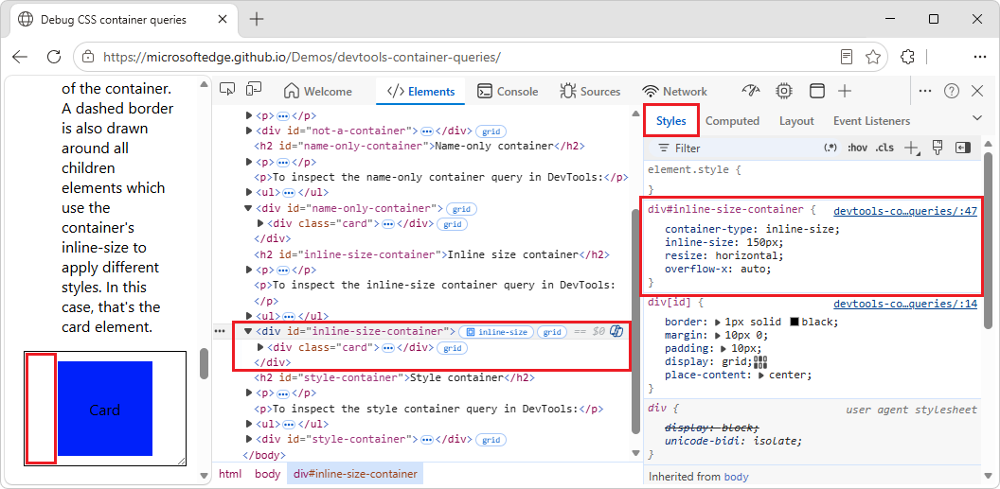
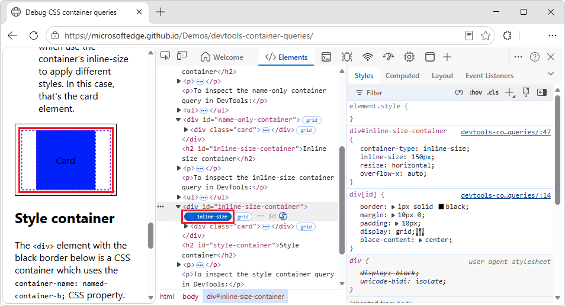
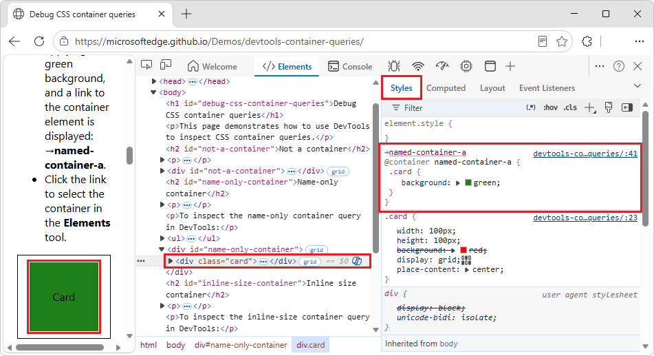
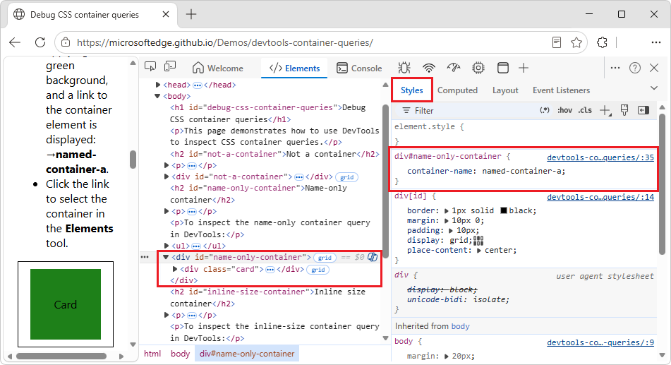
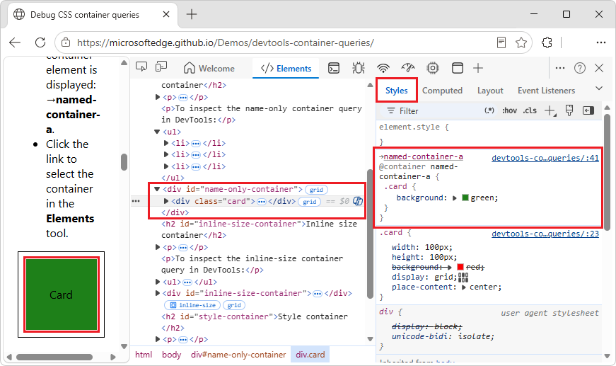
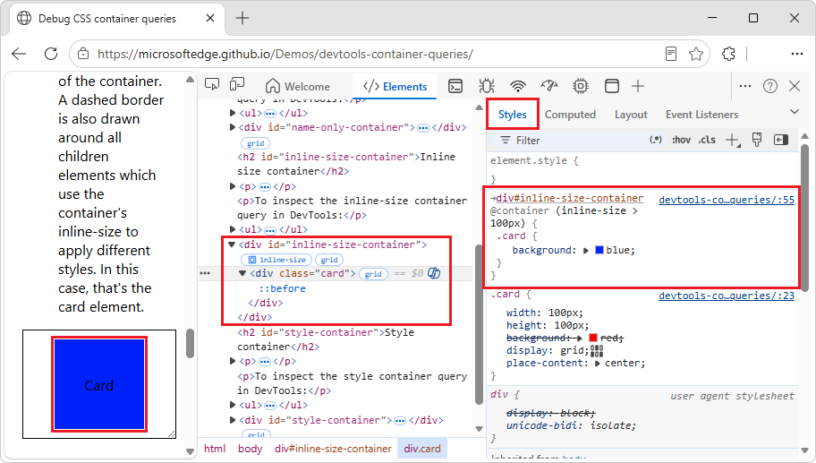
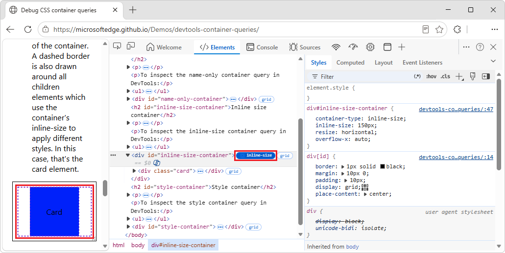
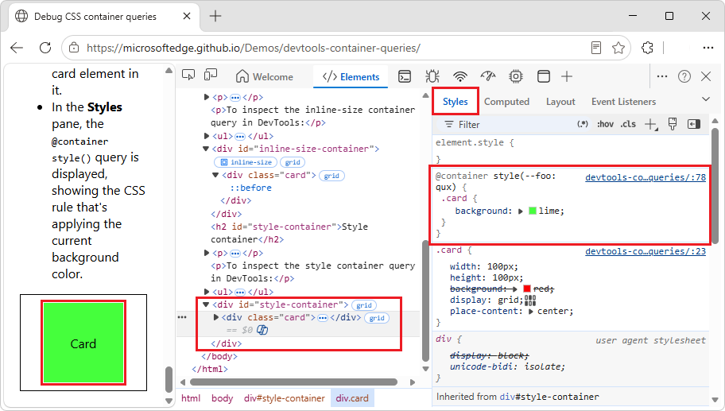
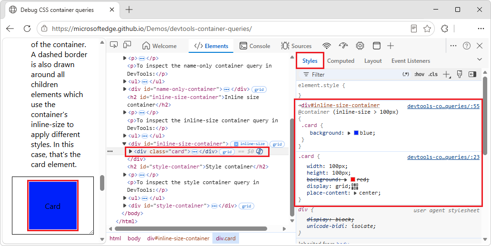
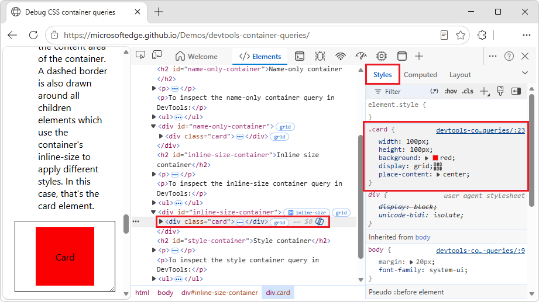

# Inspect and debug CSS container queries
<!-- https://developer.chrome.com/docs/devtools/css/container-queries -->

<!-- https://developer.chrome.com/docs/devtools/css/grid/ -->
<!-- Copyright Sofia Emelianova and Jecelyn Yeen

   Licensed under the Apache License, Version 2.0 (the "License");
   you may not use this file except in compliance with the License.
   You may obtain a copy of the License at

       https://www.apache.org/licenses/LICENSE-2.0

   Unless required by applicable law or agreed to in writing, software
   distributed under the License is distributed on an "AS IS" BASIS,
   WITHOUT WARRANTIES OR CONDITIONS OF ANY KIND, either express or implied.
   See the License for the specific language governing permissions and
   limitations under the License.  -->

You can inspect and debug CSS container queries in the **Elements** tool in DevTools.

CSS container queries allow you to manipulate an element's styles based on its parent container's CSS properties.  This capability shifts the concept of responsive web design from page-based to container-based.

See also:
* [Responsive web design](https://developer.mozilla.org/docs/Learn_web_development/Core/CSS_layout/Responsive_Design) at MDN.
* [CSS container queries](https://developer.mozilla.org/docs/Web/CSS/Guides/Containment/Container_queries) at MDN.
* [Debug CSS container queries](https://microsoftedge.github.io/Demos/devtools-container-queries/) demo.

<!-- ====================================================================== -->
## Discover a container and its descendants
<!-- Discover containers and their descendants  https://developer.chrome.com/docs/devtools/css/container-queries#discover-descendants -->

An element that's defined as a CSS container query can have no badge, or either of the following badges, next to it in the DOM tree in the **Elements** tool:
* The **inline-size** container badge  (`container-type: inline-size`).
* The **size** container badge  (`container-type: size`).

Clicking the **inline-size** badge or **size** badge displays (or hides) a dotted-line overlay of the container and its descendants.

To display the dotted-line overlay of the container and its descendants:

1. Go to the [Debug CSS container queries](https://microsoftedge.github.io/Demos/devtools-container-queries/) demo in a new window or tab.

1. In the **Inline size container** section, right-click to the left of the **Card** element, within the black box, and then select **Inspect**.

   DevTools opens, with the **Elements** tool selected:

   

   In the DOM tree, the element `
` is selected, and has an **inline-size** container badge: 

   In the **Styles** tab, the CSS rule `div#inline-size-container` is displayed.  Within that CSS rule, the CSS property `container-type: inline-size` defines the container element.  A contained descendant element can query this container's `inline-size` dimension (horizontal axis) and change the contained descendant element's styles based on the width of the container.

1. In the DOM tree, click the **inline-size** badge :

   

   A dotted-line box is displayed around the contained element, and the **inline-size** badge has inverted foreground text color and background color.

1. Click the **inline-size** badge again.

   The dotted-line box is hidden, and the **inline-size** badge has its original foreground text color and background color.

<!-- ------------------------------ -->
#### Find a container element
<!-- Find container elements  https://developer.chrome.com/docs/devtools/css/container-queries#find-containers -->

todo: merge w/ above section?

To find and select the container element that caused the CSS container query to take effect:

1. Go to the [Debug CSS container queries](https://microsoftedge.github.io/Demos/devtools-container-queries/) demo in a new window or tab.

1. In the **Name-only container** section, right-click the **Card** element, and then select **Inspect**.

   DevTools opens, with the **Elements** tool selected:

   

   In the DOM tree, the `
` element is selected, within the `
` element.

   In the **Styles** tab, the `@container named-container-a` CSS rule is displayed, defining the `background` color for a `card`.

1. In the **Styles** tab, at the top of the `@container named-container-a` CSS rule, click the **→named-container-a** link.

   DevTools finds and selects the container element that caused the CSS container query to take effect:

   

   In the DOM tree, the `
` element is selected.

   In the **Styles** tab, the `div#name-only-container` CSS rule is displayed, defining the CSS property `container-name: named-container-a;`.

<!-- ====================================================================== -->
## Inspect a CSS container query
<!-- Inspect container queries  https://developer.chrome.com/docs/devtools/css/container-queries#inspect-container-queries -->

The **Elements** tool shows the CSS properties that apply to the descendent element and that are defined inside of an `@container` query.

<!-- ====================================================================== -->
## Inspect a name-only CSS container query

In this section of the demo, the `
` element with a black border is a CSS container that uses the `container-name: named-container-a;` CSS property.

The `
` element that's within that CSS named-container uses a `@container` query to change its background to green when it's inside a container named `named-container-a`.

To inspect a name-only CSS container query in DevTools:

1. Go to the [Debug CSS container queries](https://microsoftedge.github.io/Demos/devtools-container-queries/) demo in a new window or tab.

1. In the **Name-only container** section, right-click the **Card** element, and then select **Inspect**.

   DevTools opens, with the **Elements** tool selected:

   

   In the DOM tree, the `
` element is selected, within `
`.

   In the **Styles** tab, the `@container` query `named-container-a` shows the CSS rule that's applying the green background.

   At the top of the CSS rule is a link to the container element: `→named-container-a`.

1. Click the `→named-container-a` link.

   In the DOM tree, the element `
` is selected.

<!-- ====================================================================== -->
## Inspect an inline-size CSS container query

In this section of the demo, the `
` element with a black border is a CSS container of type inline-size, because it uses the `container-type: inline-size;` CSS property.

The `
` element that's within the inline-size CSS container uses a `@container` query to change its background to different colors depending on the size of its container.  You can resize the container by using the handle in the bottom-right corner of the container, and observe the card's background color change.

To inspect an inline-size CSS container query in DevTools:

1. Go to the [Debug CSS container queries](https://microsoftedge.github.io/Demos/devtools-container-queries/) demo in a new window or tab.

1. In the **Inline size container** section, right-click the **Card** element, and then select **Inspect**.

   DevTools opens, with the **Elements** tool selected:

   

   In the DOM tree, the `
` element is selected, within `
`.

   In the **Styles** tab, the `@container` query `named-container-a` shows the CSS rule that's applying the green background.

   At the top of the CSS rule is a link to the container element: `→div#inline-size-container`.

1. Click the `→div#inline-size-container` link.

   In the DOM tree, the element `
` is selected, and an **inline-size** container badge is displayed next to it.

1. Click the **inline-size** container badge .

   In the demo page, a dashed border is added around the content area of the container:

   

   The **inline-size** container badge has inverted foreground text color and background color.

   A dashed border is also displayed around all children elements which use the container's inline-size to apply different styles.  In this case, that's the `
` element (the inner dashed border).

1. Click the **inline-size** container badge  again.

   In the demo page, the dashed border is removed.

1. In the demo page, in the **Inline size container** section, resize the **Card** container by dragging the handle that's in the bottom-right corner of the container.

   The card's background color changes.

<!-- ====================================================================== -->
## Inspect a style CSS container query

In this section of the demo, the `
` element with a black border is a CSS container that uses the `container-name: named-container-b;` CSS property.

The `
` element that's within that CSS container uses a `@container style()` query to change its background to a different color, depending on the value of its container's `--foo` custom CSS property.

The container changes the value of `--foo` over time by using a CSS animation.  Observe the card's background change over time.

To inspect a style CSS container query in DevTools:

1. Go to the [Debug CSS container queries](https://microsoftedge.github.io/Demos/devtools-container-queries/) demo in a new window or tab.

1. In the **Style container** section, right-click the **Card** element, and then select **Inspect**.

   DevTools opens, with the **Elements** tool selected:

   

   In the DOM tree, the `
` element is selected, within `
`.

   In the **Styles** tab, the `@container style()` query shows the CSS rule that's applying the current background color.

<!-- ====================================================================== -->
## Modify a CSS container query
<!-- Modify container queries  https://developer.chrome.com/docs/devtools/css/container-queries#modify -->

To debug a CSS container query, you can modify the CSS container query in the same way as modifying any other CSS property in the **Styles** tab, as described in [Get started viewing and changing CSS](./index.md).

To modify a CSS container query:

1. Go to the [Debug CSS container queries](https://microsoftedge.github.io/Demos/devtools-container-queries/) demo in a new window or tab.

1. In the **Inline size container** section, right-click the **Card** element, which is initially blue, and then select **Inspect**.

   DevTools opens, with the **Elements** tool selected:

   

   In the DOM tree, the `
` element is selected, within the `
` element, which has an **inline-size** container badge  next to it.

   In the **Styles** tab, the `@container (inline size > 100px)` CSS rule is displayed, defining the `background` color for a `card`.

1. In the **Styles** tab, click `(inline size > 100px)`, edit the value to `200px`, and then press **Enter**.

  The card turns red, because the container is smaller than 200px (it's 150px by default):

   

<!-- ====================================================================== -->
> [!NOTE]
> Portions of this page are modifications based on work created and [shared by Google](https://developers.google.com/terms/site-policies) and used according to terms described in the [Creative Commons Attribution 4.0 International License](https://creativecommons.org/licenses/by/4.0).
> The original page is found [here](https://developer.chrome.com/docs/devtools/css/container-queries) and is authored by Sofia Emelianova and Jecelyn Yeen.

This work is licensed under a [Creative Commons Attribution 4.0 International License](https://creativecommons.org/licenses/by/4.0).
