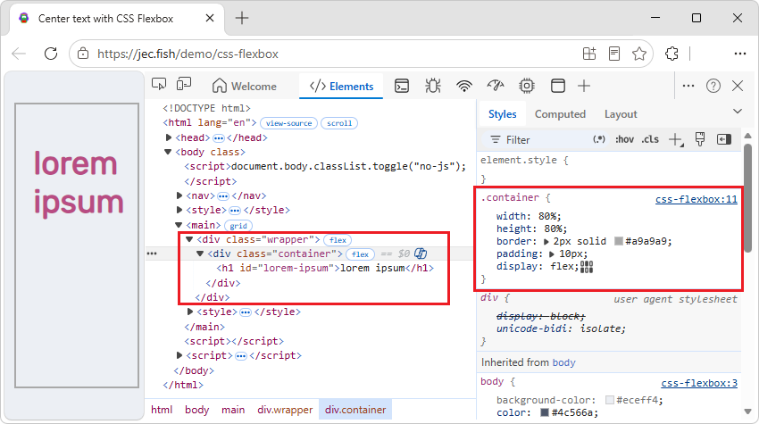

# Inspect and debug CSS flexbox layouts
<!-- https://developer.chrome.com/docs/devtools/css/flexbox -->
<!-- Copyright Jecelyn Yeen

   Licensed under the Apache License, Version 2.0 (the "License");
   you may not use this file except in compliance with the License.
   You may obtain a copy of the License at

       https://www.apache.org/licenses/LICENSE-2.0

   Unless required by applicable law or agreed to in writing, software
   distributed under the License is distributed on an "AS IS" BASIS,
   WITHOUT WARRANTIES OR CONDITIONS OF ANY KIND, either express or implied.
   See the License for the specific language governing permissions and
   limitations under the License.  -->

This guide shows you how to discover flexbox elements on a page, as well as inspect and modify the flexbox layouts in the **Elements** tool.

The screenshots appearing in this article are from this webpage: [Centering a text element with Flexbox](http://jec.fish/demo/css-flexbox). todo Demos repo demo(s) 

todo:
* \Demos\css-gap-decorations\README.md
   * CSS Gap Decorations demos -- Draws line decorations within gaps in CSS Grid, **Flexbox**, and Multi-column layouts.
   * [/css-gap-decorations/]( https://github.com/MicrosoftEdge/Demos/tree/main/css-gap-decorations )
   * [CSS Gap Decorations demos]( https://microsoftedge.github.io/Demos/css-gap-decorations/ )

todo:
1. dup the article using upstream demos, links, pngs
1. convert demos to local
1. convert pngs to local
1. convert links to local

<!-- ====================================================================== -->
## The flex badge in the DOM tree
<!-- Discover CSS flexbox  https://developer.chrome.com/docs/devtools/css/flexbox#discover -->

When an HTML element on a page has `display: flex` or `display: inline-flex` applied to it, a **flex** badge is displayed next to the element in the DOM tree in the **Elements** tool:

See also: (todo: local links)
* [Elements] 
* [DOM]

<!-- ====================================================================== -->
## Modify layouts with the flexbox editor
<!-- https://developer.chrome.com/docs/devtools/css/flexbox#modify -->

You can modify flexbox layouts visually with the **flexbox editor**.  For example, here is how you can center the text `<h1>` of this [demo page](http://jec.fish/demo/css-flexbox) within its container `
`.

1. Inspect the container element.

1. In the **Styles** tab of the **Elements** tool, you can see the flexbox editor button next to the display: flex declaration:

   ![flexbox editor button] todo png

1. Click the **flexbox editor** button to open the flexbox editor.

   The editor displays a list of flexbox properties.  Each property's value options are displayed as icon buttons.

   ![flexbox editor] todo png

1. To center the text on the screen, you can click the `justify-content: center` and `align-items: center` buttons.

   ![Center the text in its container] todo png

   The text are centered now.  The `justify-content: center` and `align-items: center` declarations are added in the **Styles** tab.

<!-- ====================================================================== -->
## Examine the flexbox layout
<!-- https://developer.chrome.com/docs/devtools/css/flexbox#examine -->

You can hover over the flexbox element in the **Elements** tool to visualize the layout.  The overlay appears over the element, laid out with dotted lines to show the position of its content and items.

hover over a flexbox element

Alternatively, you can click the **flex** badge to toggle the display of the flexbox overlay:

![change justify-content to flex-end] todo png

Try changing the value to `justify-content: flex-end`.  The overlay is changed accordingly:

![justify-content: flex-end] todo png

The icons in the **flex editor** are context-aware.  It will change according to the layout direction.  For example, when you change the `flex-direction` to `column`, the icons in the **flex editor** are rotated accordingly.  The overlay is updated immediately too:

![video] todo png for video

<!-- ====================================================================== -->
## Adjust the flexbox overlay color
<!-- https://developer.chrome.com/docs/devtools/css/flexbox#layout -->

Click the **Layout** tab in the **Elements** tool, and then scroll down to the **Flexbox** section.  You can view all the flexbox elements of the page here:

![Layout pane] todo png

You can toggle the overlay of each flexbox element with the checkbox next to it.  It is the same as you click on the badge in the **DOM tree**.

Apart from that, you can change the color of the overlay by clicking on the color icon next to it.  For example, the color of the `container` overlay is changed to black.

![change overlay color] todo png

To navigate to a flexbox element in the DOM tree, you can click on the selector icon next to it:

![video] todo png for video

<!-- ====================================================================== -->
> [!NOTE]
> Portions of this page are modifications based on work created and [shared by Google](https://developers.google.com/terms/site-policies) and used according to terms described in the [Creative Commons Attribution 4.0 International License](https://creativecommons.org/licenses/by/4.0).
> The original page is found [here](https://developer.chrome.com/docs/devtools/css/flexbox) and is authored by Jecelyn Yeen.

This work is licensed under a [Creative Commons Attribution 4.0 International License](https://creativecommons.org/licenses/by/4.0).
