# Inspect CSS Grid layouts
<!-- https://developer.chrome.com/docs/devtools/css/grid/ -->
<!-- Copyright Jecelyn Yeen

   Licensed under the Apache License, Version 2.0 (the "License");
   you may not use this file except in compliance with the License.
   You may obtain a copy of the License at

       https://www.apache.org/licenses/LICENSE-2.0

   Unless required by applicable law or agreed to in writing, software
   distributed under the License is distributed on an "AS IS" BASIS,
   WITHOUT WARRANTIES OR CONDITIONS OF ANY KIND, either express or implied.
   See the License for the specific language governing permissions and
   limitations under the License.  -->

This article walks you through identifying CSS grids on a website and debugging grid layout issues using customizable grid overlays.

**Detailed contents:**
* [Display the grid overlay in a rendered webpage](#display-the-grid-overlay-in-a-rendered-webpage)
* [Align grid items and their content: the Grid Editor popup](#align-grid-items-and-their-content-the-grid-editor-popup)
* [Grid viewing options](#grid-viewing-options)
* [Overlay display settings](#overlay-display-settings)
   * [Show line numbers](#show-line-numbers)
   * [Hide line labels](#hide-line-labels)
   * [Show line names](#show-line-names)
   * [Show track sizes](#show-track-sizes)
   * [Show area names](#show-area-names)
   * [Extend grid lines](#extend-grid-lines)
* [Grid overlays](#grid-overlays)
   * [Enable overlay views of multiple grids](#enable-overlay-views-of-multiple-grids)
   * [Customize the grid overlay color](#customize-the-grid-overlay-color)
   * [Highlight the grid element in the webpage and DOM tree](#highlight-the-grid-element-in-the-webpage-and-dom-tree)
* [See also](#see-also)


<!-- ====================================================================== -->
## Display the grid overlay in a rendered webpage
<!-- Discover CSS grids  https://developer.chrome.com/docs/devtools/css/grid/#discover -->

CSS Grid is a powerful layout paradigm for the web.  A good webpage to learn about CSS Grid and its features is [CSS grid layout](https://developer.mozilla.org/docs/Web/CSS/CSS_Grid_Layout) at MDN.

To use the grid overlay in a rendered webpage:

1. Go to a page that uses CSS Grid layout, such as the [Inspect CSS Grid layouts](https://microsoftedge.github.io/Demos/devtools-grid/) demo page, in a new window or tab.

1. Right-click the webpage, and then select **Inspect**.

   DevTools opens, with the **Elements** tool selected, showing the DOM tree.

1. In the DOM tree, expand **body** > **main**.

   The `<div>` elements have a **grid** badge:

   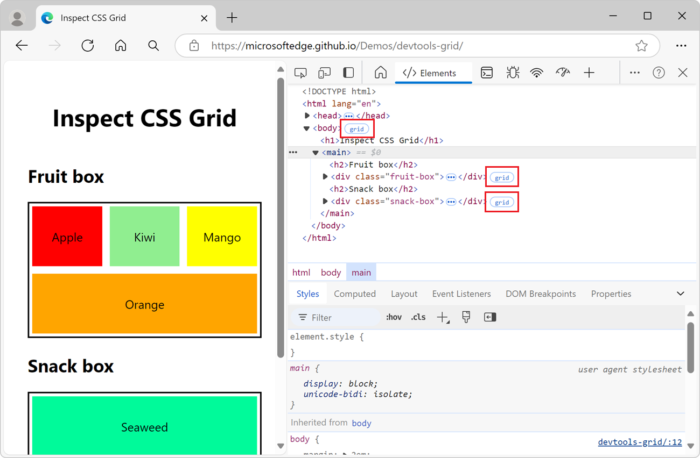

   When an HTML element in the webpage has `display: grid` or `display: inline-grid` applied to it, a **grid** badge is displayed next to the element in the DOM tree in the **Elements** tool.

1. Click the **grid** badge next to an element, such as `<div class="fruit-box">`:

   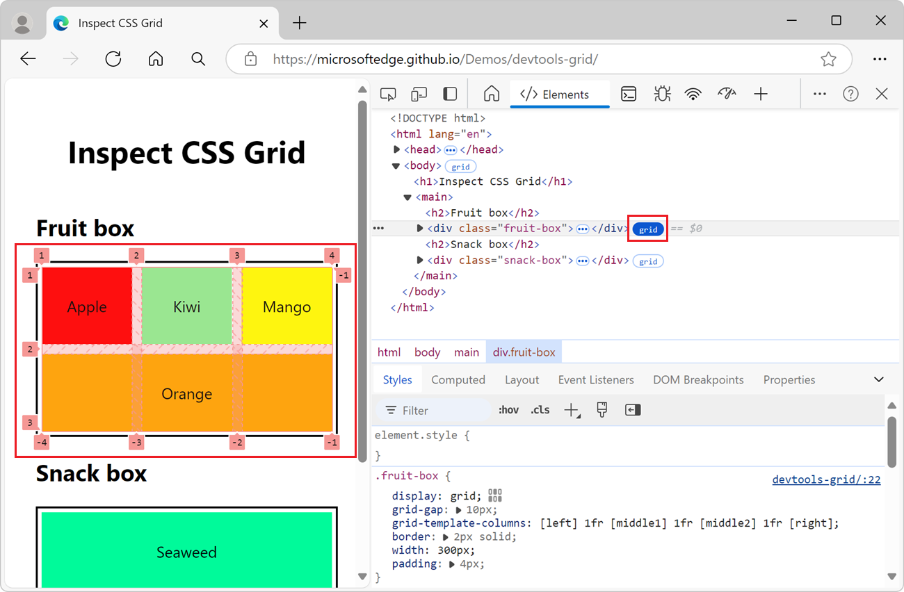

   A grid overlay is displayed over the element in the rendered webpage.  The **grid** badge changes from blue text on white background, to white text on blue background.

   In the rendered webpage, the CSS Grid overlay appears on a layer in front of the webpage element.  The CSS Grid overlay shows the position of the grid lines (rows and columns) and tracks.

   If you click the **grid** badge multiple times, it turns on and off.

   Similarly, sometimes there's a **subgrid** badge.  You can toggle the GSS Grid overlay on a subgrid, by clicking the **subgrid** badge.  See [Subgrid](https://developer.mozilla.org/docs/Web/CSS/CSS_grid_layout/Subgrid) at MDN.<!-- [Subgrid](https://developer.chrome.com/docs/devtools/elements/badges#subgrid) in _Badges reference_ in Chrome DevTools docs. -->

1. Click the **Layout** tab, which is grouped with the **Styles** tab in the **Elements** tool:

   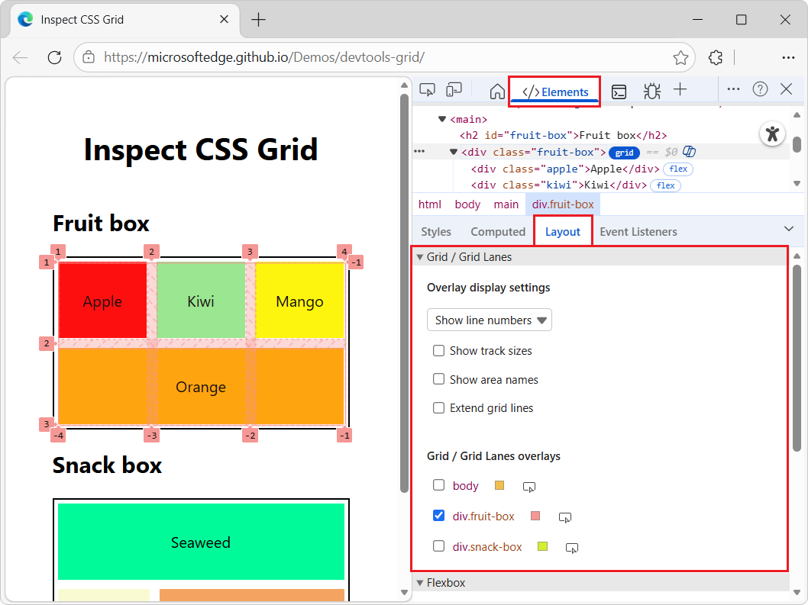

   The **Layout** tab includes a **Grid / Grid Lanes** section, which includes:

   * A dropdown list.
   * Checkboxes for display options.
   * A checkbox for each element that contains a CSS grid.

   When a webpage uses a CSS grid, the **Layout** tab includes the **Grid / Grid Lanes** section.  Use the **Grid / Grid Lanes** section to configure which information to display in grid overlays on the rendered webpage.


<!-- ====================================================================== -->
## Align grid items and their content: the grid editor popup
<!-- https://developer.chrome.com/docs/devtools/css/grid/#grid-editor -->

You can align CSS grid items and their content by just clicking a button (to open the grid editor popup), rather than having to directly define CSS rules.

To align CSS grid items and their content:

1. Do the steps in [Display the grid overlay in a rendered webpage](#display-the-grid-overlay-in-a-rendered-webpage), above.

   As a result, the **Layout** tab is selected, for an element in the DOM tree (such as `<div class="fruit-box">`) that has a **grid** badge.

1. Select the **Styles** tab.

1. Find a CSS rule that has the **Open grid editor** button, such as the `.fruit-box` rule:

   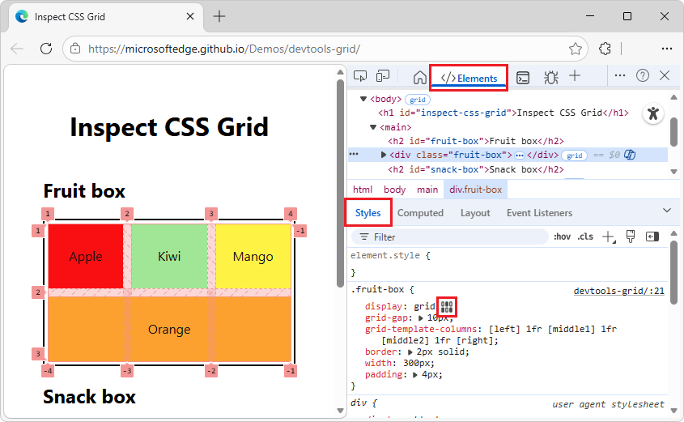

1. In the CSS rule, next to `display: grid`, click the **Open grid editor** button.

   The **grid editor** popup opens:

   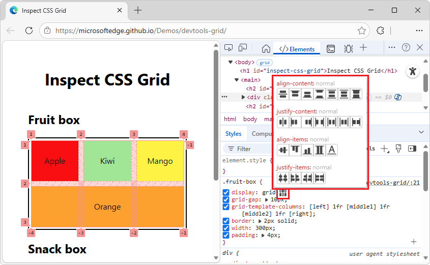

   The **grid editor** popup contains four sets of buttons as options:
   * **align-content**
   * **justify-content**
   * **align-items**
   * **justify-items**

   Within each set of buttons, the buttons are mutually exclusive option buttons.  If you click an option button twice, no option button is selected in that set, and the value returns to **normal**.

1. In the **grid editor** popup, in any set of buttons, click a button.  To return to **normal**, click a button twice.

   The button's foreground color changes from black to blue, and the value changes from **normal** to the selected value.

   The grid items and content are re-rendered in the viewport.


<!-- ====================================================================== -->
## Grid viewing options
<!-- https://developer.chrome.com/docs/devtools/css/grid/#options -->

The **Grid / Grid Lanes** section in the **Layout** pane contains two subsections:

* [Overlay display settings](#overlay-display-settings)
* [Grid overlays](#grid-overlays)

Details are below.


<!-- ====================================================================== -->
## Overlay display settings
<!-- https://developer.chrome.com/docs/devtools/css/grid/#display-settings -->

In the **Element** tool's **Layout** pane, in the expandable **Grid / Grid Lanes** section, there' an **Overlay display settings** subsection:

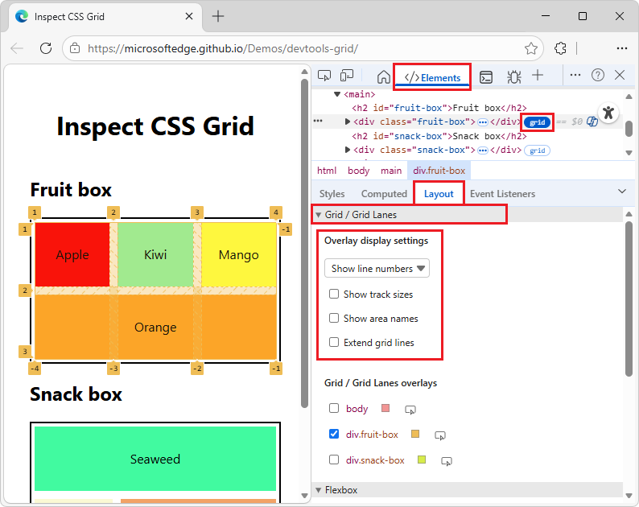

The **Overlay display settings** subsection consists of two parts:

* A dropdown list, containing the following commands:

   * [Hide line labels](#hide-line-labels) - Hide the line labels for each grid overlay.
   * [Show line numbers](#show-line-numbers) - Show the line numbers for each grid overlay (selected by default).
   * [Show line names](#show-line-names) - Show the line names for each grid overlay in the case of grids with line names.

* Checkboxes:

   * [Show track sizes](#show-track-sizes) - Toggle to show or hide track sizes.
   * [Show area names](#show-area-names) - Toggle to show or hide area names, in the case of grids with named grid areas.
   * [Extend grid lines](#extend-grid-lines) - By default, grid lines are only shown inside the element that has `display: grid` or `display: inline-grid` set on it.  When you turn on this option, the grid lines extend to the edge of the viewport along each axis.

Details are below.


<!-- ------------------------------ -->
#### Show line numbers
<!-- https://developer.chrome.com/docs/devtools/css/grid/#line-numbers -->

You can show or hide line numbers (rows and columns) in the grid overlay in the rendered webpage.  In CSS Grid, _line numbers_ are used to identify the vertical and horizontal lines that separate rows and columns of a CSS grid.  These line numbers are not for the lines of code in the HTML source file.

To show or hide line numbers (rows and columns) in the grid overlay:

1. Do the steps in [Display the grid overlay in a rendered webpage](#display-the-grid-overlay-in-a-rendered-webpage), above.

1. In the **Grid / Grid Lanes** section > **Overlay display settings** subsection > **Show line labels** dropdown list, select **Show line numbers**.  This is selected by default.

   The numbers of the lines (rows and columns) for each grid overlay are displayed:

   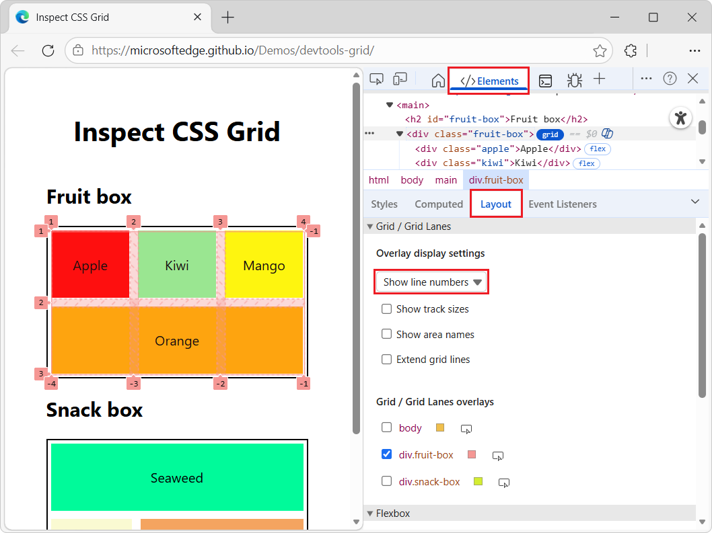

<!-- start of upstream: -->
By default, the positive and negative line numbers (rows and columns) are displayed on the grid overlay.  For information about negative numbers in the grid overlay, see [Counting backwards](https://developer.mozilla.org/docs/Web/CSS/CSS_grid_layout/Grid_layout_using_line-based_placement#counting_backwards) in _Grid layout using line-based placement_ at MDN.


<!-- ------------------------------ -->
#### Hide line labels
<!-- https://developer.chrome.com/docs/devtools/css/grid/#line-labels -->

To hide line labels in the grid overlay:

1. Do the steps in [Display the grid overlay in a rendered webpage](#display-the-grid-overlay-in-a-rendered-webpage), above.

1. In the **Grid / Grid Lanes** section > **Overlay display settings** subsection > **Show line labels** dropdown list, select **Hide line labels**:

   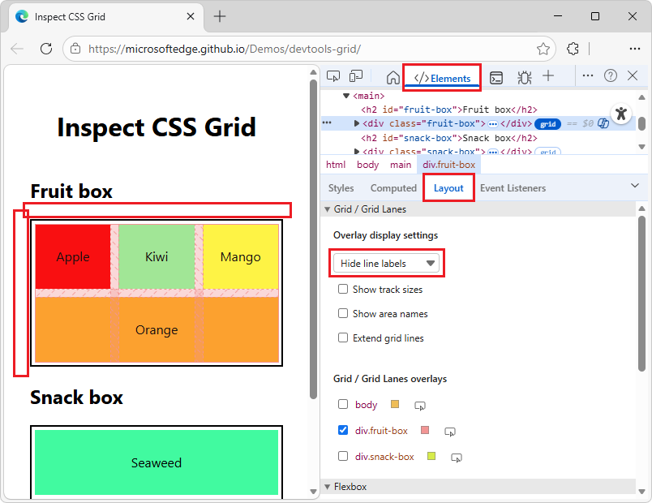

   The labels of the lines (rows/columns) are hidden, on every grid overlay.


<!-- ------------------------------ -->
#### Show line names
<!-- https://developer.chrome.com/docs/devtools/css/grid/#line-names -->

In the grid overlay in the rendered webpage, you can show line names.  This makes it easier to visualize the start and end position of an element.

To show line names in the grid overlay:

1. Do the steps in [Display the grid overlay in a rendered webpage](#display-the-grid-overlay-in-a-rendered-webpage), above.

1. In the **Grid / Grid Lanes** section > **Overlay display settings** subsection > **Show line labels** dropdown list, select **Show line names**:

   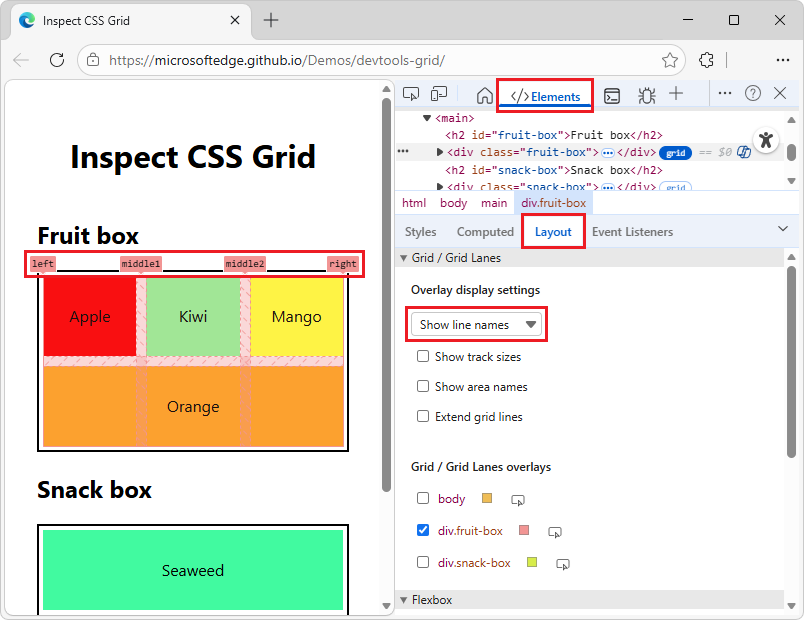

   Line names instead of numbers are displayed.  This option displays the names of the lines for each grid overlay, if names are provided.

   In the above example, 4 lines have names: `left`, `middle1`, `middle2`, and `right`.

   In the demo, the **Orange** element spans from left to right, via `grid-column: left` and `grid-column: right` CSS rules.

See also:
* [Layout using named grid lines](https://developer.mozilla.org/docs/Web/CSS/CSS_Grid_Layout/Layout_using_Named_Grid_Lines) at MDN.
   

<!-- ------------------------------ -->
#### Show track sizes
<!-- https://developer.chrome.com/docs/devtools/css/grid/#track-sizes -->

In the grid overlay in the rendered webpage, you can show track sizes.

To show track sizes in the grid overlay:

1. Do the steps in [Display the grid overlay in a rendered webpage](#display-the-grid-overlay-in-a-rendered-webpage), above.

1. In the **Elements** tool's **Layout** tab, in the **Grid / Grid Lanes** section, in the **Grid / Grid Lanes overlays** subsection, select the checkbox for each element on which to show the grid overlay.  For example, select the checkbox next to `div.fruit-box` and `div.snack-box`.

1. In the **Grid / Grid Lanes** section > **Overlay display settings** subsection, select the **Show track sizes** checkbox:

   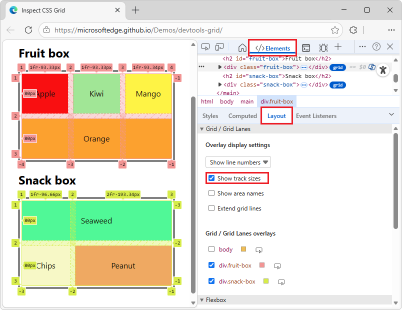

   The `[authored size]` and `[computed size]` are then displayed in each line label.

   | Size | Details |
   |:--- |:--- |
   | **authored size** | The size defined in stylesheet (omitted if not defined). |
   | **computed size** | The actual size on screen. |

  In the demo, the column sizes are defined as follows, in the CSS property `grid-template-columns`:

   ```css
   .fruit-box {
   display: grid;
   grid-template-columns: [left] 1fr [middle1] 1fr [middle2] 1fr [right];
   ...
   }

   .snack-box {
   display: grid;
   grid-template-columns: 1fr 2fr;
   ...
   }
   ```

   Line labels on the grid columns, for the demo's element `<div class="snack-box">`:

   | Track size | Authored size | Computed size |
   |:--- |:--- |:--- |
   | **1fr** &#x2022; **48.33px** | 1fr | 48.33px |
   | **2fr** &#x2022; **96.67px** | 2fr | 96.67px |

   The line labels on the grid columns display both authored and computed sizes, because column sizes have been authored (specified), in the CSS property `grid-template-columns`.

   Line labels on the grid rows, for the demo's element `<div class="snack-box">`:

   | Track size | Authored size | Computed size |
   |:--- |:--- |:--- |
   | **40px** | n/a | 40px |
   | **40px** | n/a | 40px |

   The line labels on the grid rows display only computed sizes, not authored sizes, since there are no row sizes defined in the CSS stylesheet (via the CSS property `grid-template-rows`)

See also:
* [grid-template-columns](https://developer.mozilla.org/docs/Web/CSS/Reference/Properties/grid-template-columns) at MDN.
* [grid-template-rows](https://developer.mozilla.org/docs/Web/CSS/Reference/Properties/grid-template-rows) at MDN.


<!-- ------------------------------ -->
#### Show area names
<!-- https://developer.chrome.com/docs/devtools/css/grid/#area-names -->

In the grid overlay in the rendered webpage, you can show area names, such as **top**, **bottom1** and **bottom2**.

To show area names:

1. Do the steps in [Display the grid overlay in a rendered webpage](#display-the-grid-overlay-in-a-rendered-webpage), above.

1. In the **Grid / Grid Lanes** section > **Overlay display settings** subsection, select the **Show area names** checkbox:

   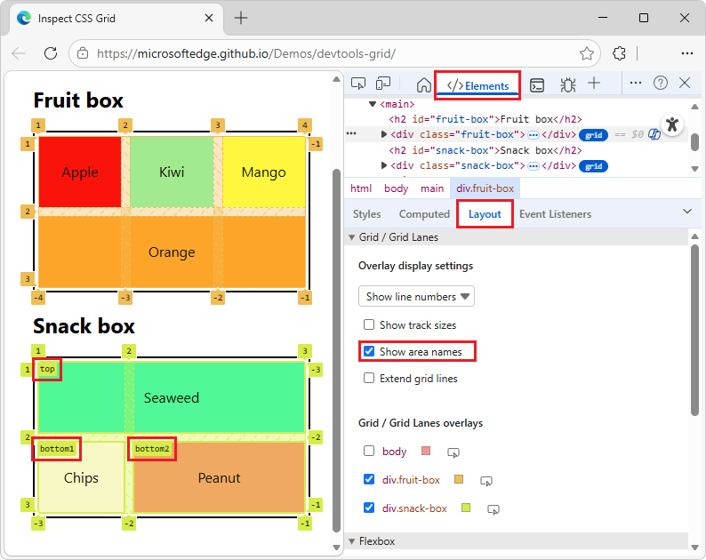


<!-- ------------------------------ -->
#### Extend grid lines
<!-- https://developer.chrome.com/docs/devtools/css/grid/#extend-grid-lines -->

You can extend the grid overlay's grid lines to the edge of the viewport, along each axis.

To extend the grid lines:

1. Do the steps in [Display the grid overlay in a rendered webpage](#display-the-grid-overlay-in-a-rendered-webpage), above.

1. In the **Grid / Grid Lanes** section > **Overlay display settings** subsection, select the **Extend grid lines** checkbox:

   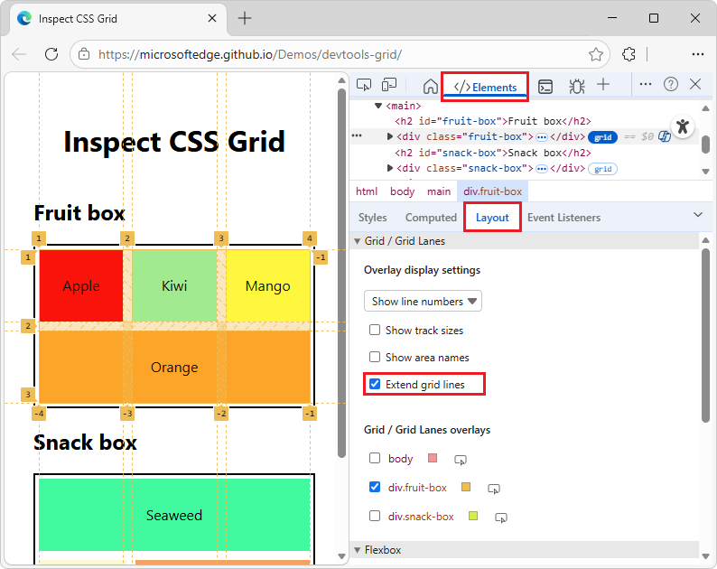


<!-- ====================================================================== -->
## Grid overlays
<!-- https://developer.chrome.com/docs/devtools/css/grid/#overlays -->

In the **Elements** tool's **Layout** tab (grouped with the **Styles** tab), the **Grid / Grid Lanes overlays** section contains a list of elements that have a CSS grid.  Each grid has checkbox, along with various options.

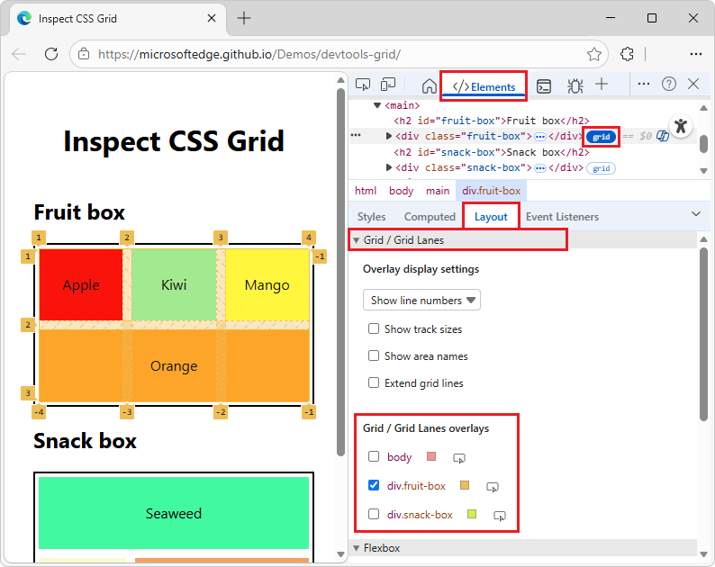


<!-- ------------------------------ -->
#### Enable overlay views of multiple grids
<!-- https://developer.chrome.com/docs/devtools/css/grid/#view-multiple-grids -->

To enable overlay views of multiple grids:

1. Do the steps in [Display the grid overlay in a rendered webpage](#display-the-grid-overlay-in-a-rendered-webpage), above.

1. In the **Grid / Grid Lanes** section > **Grid / Grid Lanes overlays** subsection, select the checkbox next to each name of multiple grids:

   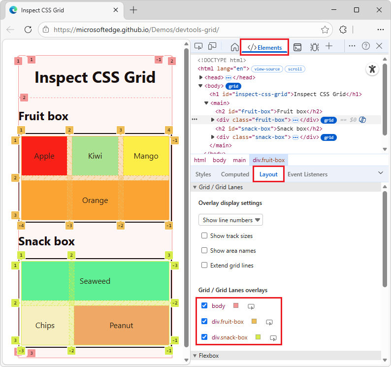

   A CSS Grid overlay is displayed for each selected element that has a CSS grid.  In the above example, three grid overlays are enabled.  Each CSS grid has a different color in the rendered webpage:

   * `body` - the gold grid overlay.
   * `div.fruit-box` - the pink grid overlay.
   * `div.snack-box` - the blue grid overlay.


<!-- ------------------------------ -->
#### Customize the grid overlay color
<!-- https://developer.chrome.com/docs/devtools/css/grid/#customize-overlay-color -->

To customize the grid overlay color:

1. Do the steps in [Display the grid overlay in a rendered webpage](#display-the-grid-overlay-in-a-rendered-webpage), above.

1. In the **Grid / Grid Lanes** section > **Grid / Grid Lanes overlays** subsection, click the **Choose the overlay color for this element** box next to an element name:

   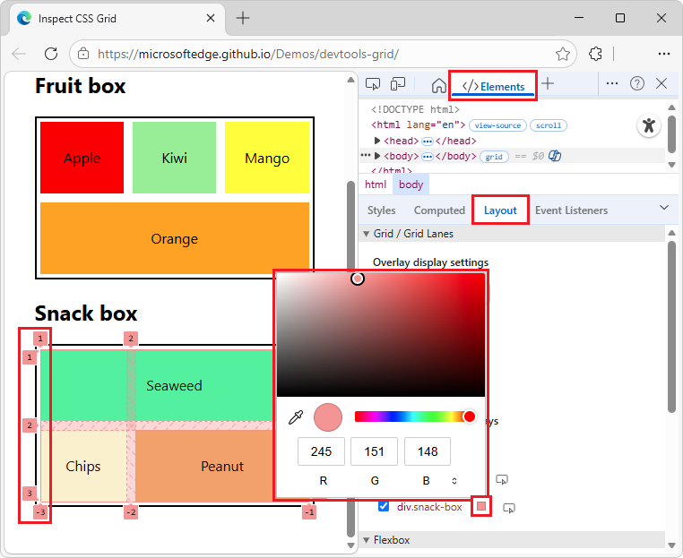

   The Color Picker opens.

See also:
* [Change colors with the Color Picker](../css/reference.md#change-colors-with-the-color-picker) in _CSS features reference_.


<!-- ------------------------------ -->
#### Highlight the grid element in the webpage and DOM tree
<!-- https://developer.chrome.com/docs/devtools/css/grid/#highlight-grid -->

For any element that has a CSS grid layout, you can automatically scroll to the element in the rendered webpage, and automatically select the element in the DOM tree.

To scroll to a grid-using element in the webpage and select the element in the DOM tree:

1. Do the steps in [Display the grid overlay in a rendered webpage](#display-the-grid-overlay-in-a-rendered-webpage), above.

1. In the **Grid / Grid Lanes** section > **Grid / Grid Lanes overlays** subsection, click the **Show element in the Elements panel** () button next to an element name:

   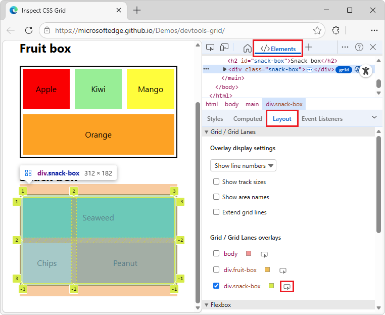

   * The rendered webpage is scrolled to the element that uses CSS grid layout, and the element is briefly highlighted in the rendered webpage.

   * In the **Elements** tool, the DOM tree automatically scrolls to the element, and the element is selected.

   This automatic scrolling and highlighting works regardless of whether the element's checkbox is selected or cleared.


<!-- ====================================================================== -->
## See also
<!-- all links in article, in order of article: -->

Demo webpages:
* [Inspect CSS Grid layouts](https://microsoftedge.github.io/Demos/devtools-grid/)

MDN:
* [CSS grid layout](https://developer.mozilla.org/docs/Web/CSS/CSS_Grid_Layout)
   * [Grid layout using line-based placement](https://developer.mozilla.org/docs/Web/CSS/CSS_Grid_Layout/Line-based_Placement_with_CSS_Grid)
   * [Layout using named grid lines](https://developer.mozilla.org/docs/Web/CSS/CSS_Grid_Layout/Layout_using_Named_Grid_Lines)
* [grid-template-columns](https://developer.mozilla.org/docs/Web/CSS/Reference/Properties/grid-template-columns)
* [grid-template-rows](https://developer.mozilla.org/docs/Web/CSS/Reference/Properties/grid-template-rows)


<!-- ====================================================================== -->
> [!NOTE]
> Portions of this page are modifications based on work created and [shared by Google](https://developers.google.com/terms/site-policies) and used according to terms described in the [Creative Commons Attribution 4.0 International License](https://creativecommons.org/licenses/by/4.0).
> The original page is found [here](https://developer.chrome.com/docs/devtools/css/grid/) and is authored by Jecelyn Yeen.

[](https://creativecommons.org/licenses/by/4.0)
This work is licensed under a [Creative Commons Attribution 4.0 International License](https://creativecommons.org/licenses/by/4.0).
