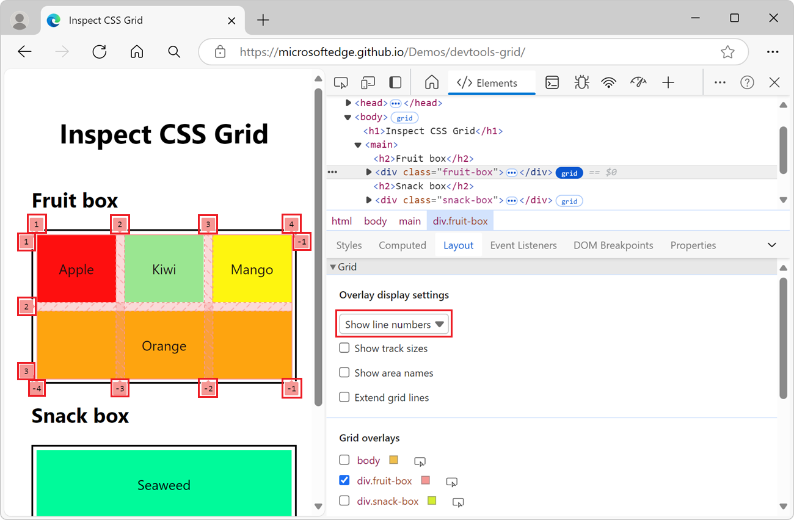
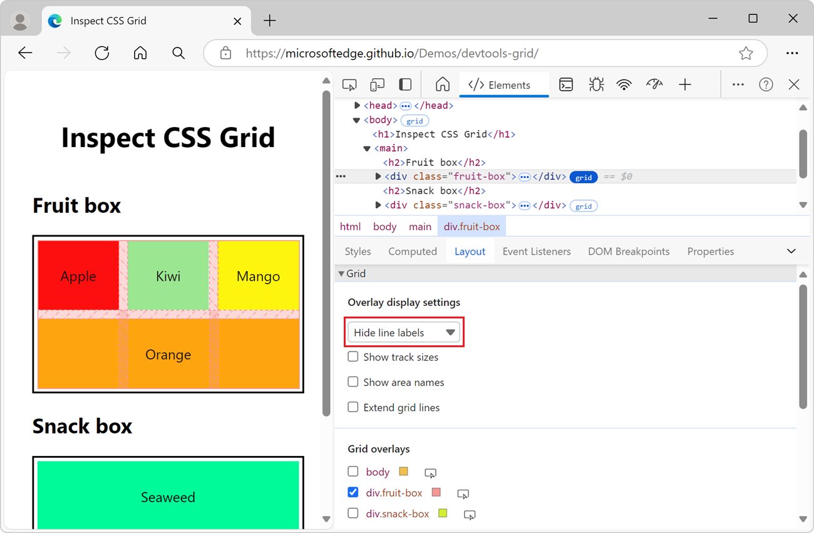
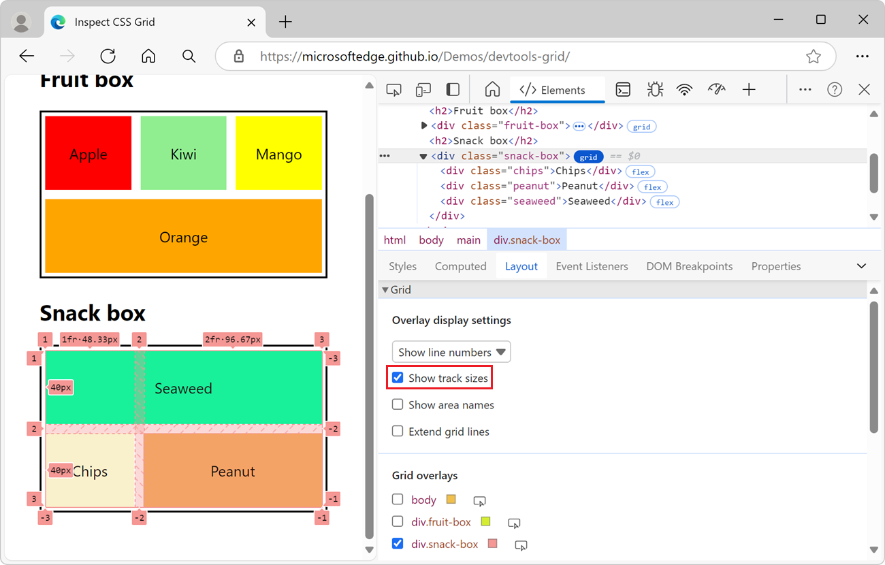

# Inspect CSS Grid layouts
<!-- https://developer.chrome.com/docs/devtools/css/grid/ -->
<!-- Copyright Jecelyn Yeen

   Licensed under the Apache License, Version 2.0 (the "License");
   you may not use this file except in compliance with the License.
   You may obtain a copy of the License at

       https://www.apache.org/licenses/LICENSE-2.0

   Unless required by applicable law or agreed to in writing, software
   distributed under the License is distributed on an "AS IS" BASIS,
   WITHOUT WARRANTIES OR CONDITIONS OF ANY KIND, either express or implied.
   See the License for the specific language governing permissions and
   limitations under the License.  -->

This article walks you through identifying CSS grids on a website and debugging grid layout issues using customizable grid overlays.

**Detailed contents:**
* [Display the grid overlay in a rendered webpage](#display-the-grid-overlay-in-a-rendered-webpage)
* [Align grid items and their content with the Grid Editor](#align-grid-items-and-their-content-with-the-grid-editor)
* [Grid viewing options](#grid-viewing-options)
* [Overlay display settings](#overlay-display-settings)
   * [Dropdown list](#dropdown-list)
      * [Show line numbers](#show-line-numbers)
      * [Hide line labels](#hide-line-labels)
      * [Show line names](#show-line-names)
   * [Checkboxes](#checkboxes)
      * [Show track sizes](#show-track-sizes)
      * [Show area names](#show-area-names)
      * [Extend grid lines](#extend-grid-lines)
* [Grid / Grid Lanes overlays](#grid--grid-lanes-overlays)
   * [Enable overlay views of multiple grids](#enable-overlay-views-of-multiple-grids)
   * [Customize the grid overlay color](#customize-the-grid-overlay-color)
   * [Highlight the grid element in the webpage and DOM tree](#highlight-the-grid-element-in-the-webpage-and-dom-tree)
* [See also](#see-also)

<!-- ====================================================================== -->
## Display the grid overlay in a rendered webpage
<!-- Discover CSS grids  https://developer.chrome.com/docs/devtools/css/grid/#discover -->

CSS Grid is a powerful layout paradigm for the web.  A good webpage to learn about CSS Grid and its features is [CSS grid layout](https://developer.mozilla.org/docs/Web/CSS/CSS_Grid_Layout) at MDN.

To use the grid overlay in a rendered webpage:

1. Go to a page that uses CSS Grid layout, such as the [Inspect CSS Grid layouts](https://microsoftedge.github.io/Demos/devtools-grid/) demo page, in a new window or tab.

1. Right-click the webpage, and then select **Inspect**.

   DevTools opens, with the **Elements** tool selected, showing the DOM tree.

1. In the DOM tree, expand **body** > **main**.

   `<body>` and a couple of `
` elements have a **grid** badge on them.

   When an HTML element in the webpage has `display: grid` or `display: inline-grid` applied to it, a **grid** badge is displayed next to the element in the DOM tree in the **Elements** tool:

   

1. Click the **grid** badge next to an element, such as `
`.
      
   A grid overlay is displayed over that element in the rendered webpage.  The overlay appears over the element, and shows the position of the grid lines (rows and columns) and tracks:

   

   Similarly, you can toggle the overlay of a subgrid with the **subgrid** badge.  See [Subgrid](https://developer.mozilla.org/docs/Web/CSS/CSS_grid_layout/Subgrid) at MDN.
   <!--
   * [Subgrid](https://developer.chrome.com/docs/devtools/elements/badges#subgrid) in _Badges reference_ in Chrome DevTools docs.
   -->

   When a CSS grid is included on a webpage, the **Layout** tab in the **Elements** tool includes a **Grid / Grid Lanes** section that lists the grid containers:

   <!-- todo: give steps to repro this screenshot on user's machine: -->

Use the **Grid / Grid Lanes** section to configure which information to display in grid overlays on the rendered webpage.

<!-- ====================================================================== -->
## Align grid items and their content with the Grid Editor
<!-- https://developer.chrome.com/docs/devtools/css/grid/#grid-editor -->

You can align grid items and their content with a click of a button instead of typing CSS rules.

To align grid items and their content:

1. Do the steps in [Display the grid overlay in a rendered webpage](#display-the-grid-overlay-in-a-rendered-webpage), above.

1. In the DOM tree, select a node that has a **grid** badge, such as `
`.

1. In the **Elements** > **Styles** pane, find a CSS rule that has the **Open grid editor** button, such as the `.fruit-box` rule.

1. In the CSS rule, next to `display: grid`, click the **Open grid editor** button.

   

   The **Grid editor** pop-up opens, containing four sets of buttons as options:
   * **align-content**
   * **justify-content**
   * **align-items**
   * **justify-items**

1. In the **Grid editor**, click the corresponding buttons to set the `align-*` and `justify-*` CSS properties for the grid items and their content.

   

1. Observe the adjusted grid items and content in the viewport.

<!-- ====================================================================== -->
## Grid viewing options
<!-- https://developer.chrome.com/docs/devtools/css/grid/#options -->

The **Grid / Grid Lanes** section in the **Layout** pane contains two subsections:

* [Overlay display settings](#overlay-display-settings)
* [Grid / Grid Lanes overlays](#grid--grid-lanes-overlays)

Details are below.

<!-- ====================================================================== -->
## Overlay display settings
<!-- https://developer.chrome.com/docs/devtools/css/grid/#display-settings -->

In the **Layout** pane, in the expandable **Grid / Grid Lanes** section, the **Overlay display settings** section contains the following UI:

* [Dropdown list](#dropdown-list)
* [Checkboxes](#checkboxes)

Details are below.

To get started, see [Display the grid overlay in a rendered webpage](#display-the-grid-overlay-in-a-rendered-webpage), above.

<!-- ------------------------------ -->
#### Dropdown list
<!-- https://developer.chrome.com/docs/devtools/css/grid/#display-settings -->

Select one of the following options from the dropdown list:

| List item | Description |
|:--- |:--- |
| **Hide line labels** | Hides the labels of the lines for each grid overlay. |
| **Show line numbers** | Displays the numbers of the rows and columns for each grid overlay.  Selected by default. |
| **Show line names** | Displays the names of the lines for each grid overlay when names are provided. |

In CSS Grid, _line numbers_ are used to identify the vertical and horizontal lines that separate rows and columns of a grid.  These line numbers are not for the lines of code in the HTML source file.

The following sections explain the **Overlay display settings** dropdown list commands.

<!-- ---------- -->
###### Show line numbers
<!-- https://developer.chrome.com/docs/devtools/css/grid/#line-numbers -->

In CSS Grid, _line numbers_ are used to identify the vertical and horizontal lines that separate rows and columns of a grid.  These line numbers are not for the lines of code in the HTML source file.

To show or hide line numbers (rows and columns):

1. Do the steps in [Display the grid overlay in a rendered webpage](#display-the-grid-overlay-in-a-rendered-webpage), above.

1. In **Elements** tool, select the **Layout** tab.

1. In the **Grid / Grid Lanes** section > **Overlay display settings** subsection > **Show line labels** dropdown list, select **Show line numbers**.  This is selected by default.

   The numbers of the lines (rows and columns) for each grid overlay are displayed:

   

<!-- start of upstream: -->
By default, the positive and negative line numbers (rows and columns) are displayed on the grid overlay.  For information about negative numbers in the grid overlay, see [Counting backwards](https://developer.mozilla.org/docs/Web/CSS/CSS_grid_layout/Grid_layout_using_line-based_placement#counting_backwards) in _Grid layout using line-based placement_ at MDN.

<!-- ---------- -->
###### Hide line labels
<!-- https://developer.chrome.com/docs/devtools/css/grid/#line-labels -->

In the dropdown list, select **Hide line labels** to hide the labels of the lines for each grid overlay:

<!-- todo: give steps to repro this screenshot on user's machine: -->

<!-- ---------- -->
###### Show line names
<!-- https://developer.chrome.com/docs/devtools/css/grid/#line-names -->

In the dropdown list, select **Show line names** to view the line names instead of numbers; this displays the names of the lines for each grid overlay when names are provided:

<!-- todo: give steps to repro this screenshot on user's machine: -->

In the above example, 4 lines have names: `left`, `middle1`, `middle2`, and `right`.

For more information about line names in the grid overlay, see [Layout using named grid lines](https://developer.mozilla.org/docs/Web/CSS/CSS_Grid_Layout/Layout_using_Named_Grid_Lines) at MDN.

<!--In the demo, **orange** element spans from left to right, with `grid-column: left` and `grid-column: right` CSS.  Showing line names makes it easier to visualize the start and end position of the element.  -->

<!-- ------------------------------ -->
#### Checkboxes
<!-- https://developer.chrome.com/docs/devtools/css/grid/#display-settings -->

The **Overlay display settings** section within the **Grid / Grid Lanes** section in the **Layout** pane contains the following checkboxes:

| Checkbox | Description |
|:--- |:--- |
| **Show track sizes**  | Displays or hides the sizes of the tracks. |
| **Show area names** | Displays or hides the names of the area, when names are provided. |
| **Extend grid lines** | Displays or hides the extensions of the grid dimensions along each axis.  By default, grid lines are only shown inside the element with `display: grid` or `display: inline-grid` CSS set on it. |

The following sections explain these checkboxes.

<!-- ---------- -->
###### Show track sizes
<!-- https://developer.chrome.com/docs/devtools/css/grid/#track-sizes -->

To view the track sizes of the grid, select the **Show track sizes** checkbox:

<!-- todo: give steps to repro this screenshot on user's machine: -->

The `[authored size]` and `[computed size]` are then displayed in each line label.

| Size | Details |
|:--- |:--- |
| **authored size** | The size defined in stylesheet (omitted if not defined). |
| **computed size** | The actual size on screen. |

In the demo, the `snack-box` column sizes are defined in the `grid-template-columns:1fr 2fr;` CSS.  Therefore, the column line labels display both authored and computed sizes:

| Track size | Authored size | Computed size |
|:--- |:--- |:--- |
| **1fr** &#x2022; **48.33px** | 1fr | 48.33px |
| **2fr** &#x2022; **96.67px** | 2fr | 96.67px |

The line labels on the rows display only computed sizes, since there are no row sizes defined in the stylesheet:

| Track size | Authored size | Computed size |
|:--- |:--- |:--- |
| **40px** | &nbsp;| 40px |
| **40px** | &nbsp;| 40px |

<!-- ---------- -->
###### Show area names
<!-- https://developer.chrome.com/docs/devtools/css/grid/#area-names -->

To view the area names, select the **Show area names** checkbox:

<!-- todo: give steps to repro this screenshot on user's machine: -->

In the above example, there are 3 areas in the grid: **top**, **bottom1** and **bottom2**.

<!-- ---------- -->
###### Extend grid lines
<!-- https://developer.chrome.com/docs/devtools/css/grid/#extend-grid-lines -->

To extend the grid lines to the edge of the viewport along each axis, select the **Extend grid lines** checkbox:

<!-- todo: give steps to repro this screenshot on user's machine: -->

<!-- ====================================================================== -->
## Grid / Grid Lanes overlays
<!-- https://developer.chrome.com/docs/devtools/css/grid/#overlays -->

The **Grid / Grid Lanes overlays** section contains a list of grids that are present on the webpage, each with a checkbox, along with various options.

To get started, see [Display the grid overlay in a rendered webpage](#display-the-grid-overlay-in-a-rendered-webpage), above.

<!-- ------------------------------ -->
#### Enable overlay views of multiple grids
<!-- https://developer.chrome.com/docs/devtools/css/grid/#view-multiple-grids -->

To display the overlay grid for multiple grids, select the checkbox next to each name of the grid:

<!-- todo: give steps to repro this screenshot on user's machine: -->

In the above example, there are three grid overlays enabled, each grid represented with a different color in the rendered webpage:

*  `body` - the gold grid overlay.
*  `div.fruit-box` - the pink grid overlay.
*  `div.snack-box` - the blue grid overlay.

<!-- ------------------------------ -->
#### Customize the grid overlay color
<!-- https://developer.chrome.com/docs/devtools/css/grid/#customize-overlay-color -->

To open the color picker and customize the grid overlay color, click the box next to the name of the grid overlay:

<!-- todo: give steps to repro this screenshot on user's machine: -->

<!-- ------------------------------ -->
#### Highlight the grid element in the webpage and DOM tree
<!-- https://developer.chrome.com/docs/devtools/css/grid/#highlight-grid -->

To scroll to a grid layout in the rendered webpage and select the element that has the grid layout in the DOM tree:

* In the **Grid / Grid Lanes overlays** section, click the **Show element in the Elements panel** () button next to the element name:

<!-- todo: give steps to repro this screenshot on user's machine: -->

This works regardless of whether the element's checkbox is selected or cleared.

<!-- ====================================================================== -->
## See also
<!-- all links in article, in order of article: -->

Demo webpages:
* [Inspect CSS Grid layouts](https://microsoftedge.github.io/Demos/devtools-grid/)

MDN:
* [CSS grid layout](https://developer.mozilla.org/docs/Web/CSS/CSS_Grid_Layout)
   * [Grid layout using line-based placement](https://developer.mozilla.org/docs/Web/CSS/CSS_Grid_Layout/Line-based_Placement_with_CSS_Grid)
   * [Layout using named grid lines](https://developer.mozilla.org/docs/Web/CSS/CSS_Grid_Layout/Layout_using_Named_Grid_Lines)

<!-- ====================================================================== -->
> [!NOTE]
> Portions of this page are modifications based on work created and [shared by Google](https://developers.google.com/terms/site-policies) and used according to terms described in the [Creative Commons Attribution 4.0 International License](https://creativecommons.org/licenses/by/4.0).
> The original page is found [here](https://developer.chrome.com/docs/devtools/css/grid/) and is authored by Jecelyn Yeen.

This work is licensed under a [Creative Commons Attribution 4.0 International License](https://creativecommons.org/licenses/by/4.0).
