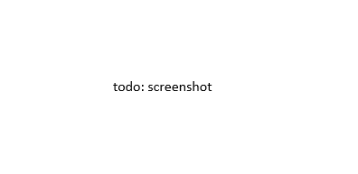
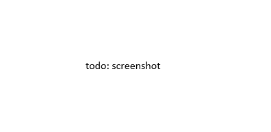
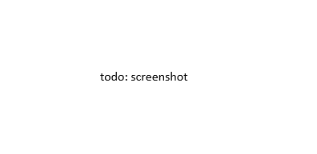
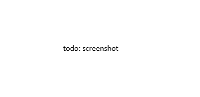
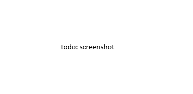
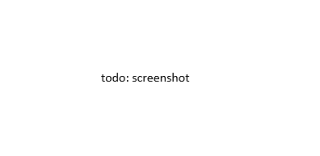
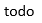
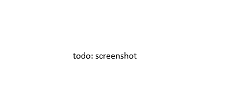
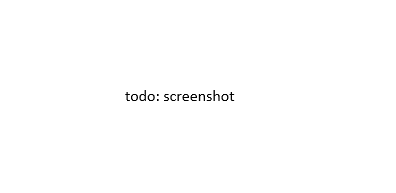
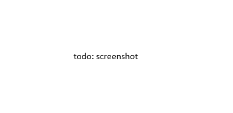

<!-- Copyright Sofia Emelianova

   Licensed under the Apache License, Version 2.0 (the "License");
   you may not use this file except in compliance with the License.
   You may obtain a copy of the License at

       https://www.apache.org/licenses/LICENSE-2.0

   Unless required by applicable law or agreed to in writing, software
   distributed under the License is distributed on an "AS IS" BASIS,
   WITHOUT WARRANTIES OR CONDITIONS OF ANY KIND, either express or implied.
   See the License for the specific language governing permissions and
   limitations under the License.  -->
# Find invalid, overridden, inactive, and other CSS
<!-- https://developer.chrome.com/docs/devtools/css/issues -->

This guide assumes that you're familiar with inspecting CSS in Chrome DevTools.  To learn the basics, see [Get started viewing and changing CSS](./index.md).

**Detailed contents:**
* [Inspect the CSS you author](#inspect-the-css-you-author)
* [Understand CSS in the Styles tab](#understand-css-in-the-styles-tab)
   * [Matched and unmatched selectors](#matched-and-unmatched-selectors)
   * [Invalid values and declarations](#invalid-values-and-declarations)
   * [Overridden](#overridden)
   * [Inactive](#inactive)
   * [Inherited and non-inherited](#inherited-and-non-inherited)
   * [Shorthand](#shorthand)
   * [Non-editable](#non-editable)
* [Inspect an element that still isn't styled the way you think](#inspect-an-element-that-still-isnt-styled-the-way-you-think)
* [Understand CSS in the Computed tab](#understand-css-in-the-computed-tab)
   * [Declared and inherited](#declared-and-inherited)
   * [Runtime](#runtime)
   * [Non-inherited and custom](#non-inherited-and-custom)
* [Search for duplicate CSS properties](#search-for-duplicate-css-properties)
* [Find unused CSS](#find-unused-css)

<!-- ====================================================================== -->
## Inspect the CSS you author
<!-- https://developer.chrome.com/docs/devtools/css/issues#styles -->

Suppose that you added some CSS to an element and want to make sure the new styles are applied properly. When you refresh the page, the element looks the same as before. Something is wrong.

The first thing to do is inspect the element and make sure that your new CSS is actually applied to the element.  See [Select an element](./reference.md#select-an-element) in _CSS features reference_.

Sometimes, you'll see your new CSS in the **Elements** > **Styles** tab but your new CSS is in pale font, non-editable, crossed out, or has a warning or hint icon next to it.

<!-- ====================================================================== -->
## Understand CSS in the Styles tab
<!-- https://developer.chrome.com/docs/devtools/css/issues#css-in-styles -->

The **Styles** tab recognizes many kinds of CSS issues and highlights them in different ways.

<!-- ------------------------------ -->
#### Matched and unmatched selectors
<!-- https://developer.chrome.com/docs/devtools/css/issues#selectors -->

The **Styles** tab shows matched selectors in regular text and unmatched ones in pale text.

 todo

_strategy: quickly create pngs showing chrome, then redo w edge_

<!-- ------------------------------ -->
#### Invalid values and declarations
<!-- https://developer.chrome.com/docs/devtools/css/issues#invalid -->

The **Styles** tab crosses out and displays Warning.  todo warning icons next to the following:

* An entire CSS declaration (property and value) when the CSS property is invalid or unknown.
* Just the value when the CSS property is valid but the value is invalid.

 todo

<!-- ------------------------------ -->
#### Overridden
<!-- https://developer.chrome.com/docs/devtools/css/issues#overridden -->

The **Styles** tab crosses out properties that are overridden by other properties according to the cascading order.  See [Cascading order](https://developer.mozilla.org/docs/Web/CSS/Cascade#cascading_order) in _Introduction to the CSS cascade_ at MDN.

 todo - upstream is animation not png

In this example, the `width: 300px;` style attribute on the element overrides `width: 100%` on the `.youtube` class.

<!-- ------------------------------ -->
#### Inactive
<!-- https://developer.chrome.com/docs/devtools/css/issues#inactive -->

The **Styles** tab displays in pale text and puts  todo information icons next to properties that are valid but have no effect because of other properties.

These pale properties are inactive because of CSS logic, not the cascading order.  See also [Cascading order](https://developer.mozilla.org/docs/Web/CSS/Cascade#cascading_order) in _Introduction to the CSS cascade_ at MDN.

**Key point:** The pale inactive properties differ from pale non-inherited properties; see [Inherited and non-inherited](#inherited-and-non-inherited) below.  Inactive properties have icons.  Hover over the  Information icon to get a hint about what went wrong.

 todo

In this example, the `display: block;` property disables `justify-content` and `align-items` that control flex or grid layouts.

<!-- ------------------------------ -->
#### Inherited and non-inherited
<!-- https://developer.chrome.com/docs/devtools/css/issues#inherited-and-non-inherited -->

The **Styles** tab lists properties in `Inherited from <element-name>` sections depending on their default inheritance:

* Inherited by default are in regular text.
* Non-inherited by default are in pale text.

See [Inheritance](https://developer.mozilla.org/docs/Web/CSS/Guides/Cascade/Inheritance) at MDN.

**Key point:**

* The pale non-inherited properties differ from pale inactive properties; see [Inactive](#inactive), above.  Non-inherited properties don't have icons and are in the corresponding sections.

* Overriding default inheritance doesn't affect the way the **Styles** tab displays the properties: pale or not.

 todo

See also:
* [Overriding inheritance, an example](https://developer.mozilla.org/docs/Web/CSS/Guides/Cascade/Inheritance#overriding_inheritance_an_example) in _Inheritance_ at MDN.

<!-- ------------------------------ -->
#### Shorthand
<!-- https://developer.chrome.com/docs/devtools/css/issues#shorthand -->

Shorthand (concise) properties let you set multiple CSS properties at once and can make your stylesheet more readable.  However, due to the short nature of such properties, you may miss a longhand (precise) property that overrides a property implied by the shorthand.

See also:
* [Shorthand properties](https://developer.mozilla.org/docs/Web/CSS/Guides/Cascade/Shorthand_properties) at MDN.

The **Styles** tab displays shorthand properties as  todo drop-down lists that contain all the properties that are shortened.

 todo

In this example, two of four shortened properties are actually overridden.

<!-- ------------------------------ -->
#### Non-editable
<!-- https://developer.chrome.com/docs/devtools/css/issues#non-editable -->

The **Styles** tab displays properties that can't be edited in _italic text_.  For example, the CSS from the following sources can't be edited:

* `user agent stylesheet`—Microsoft Edge's default stylesheet.

    todo

* Style-related HTML attributes on the element, such as height, width, or color.  You can edit them in the DOM tree and this updates the CSS in the **Styles** tab, but not the other way around.

    todo (upstream is anim)

   In the above example, the `height="48"` attribute on an `<svg>` element is set to `50`.  This updates the corresponding property under `svg[Attributes Style]` in the **Styles** tab.

<!-- ====================================================================== -->
## Inspect an element that still isn't styled the way you think
<!-- https://developer.chrome.com/docs/devtools/css/issues#computed -->

To try to find what goes wrong, you may want to check:

* CSS documentation and selector specificity in the tooltips in the **Styles** tab.  See also:
   * [View CSS documentation](./reference.md#view-css-documentation) in _CSS features reference_.
   * [View selector specificity](./reference.md#view-selector-specificity) in _CSS features reference_.
* The **Computed** tab in the **Elements** tool, to see the "final" CSS that's applied to an element, and compare that to the CSS rules that you declared.  See also:
   * [View only the CSS that's actually applied to an element](./reference.md#view-only-the-css-thats-actually-applied-to-an-element) in _CSS features reference_.

The **Styles** tab in the **Elements** tool displays the exact set of CSS rules as they are written in various stylesheets.  In contrast, the **Elements** > **Computed** tab lists the resolved CSS values that Chrome uses to render an element:
* CSS that's derived from inheritance.  See [Inheritance](https://developer.mozilla.org/docs/Web/CSS/inheritance) at MDN.
* Cascade winners.  See [Introduction to the CSS cascade](https://developer.mozilla.org/docs/Web/CSS/Guides/Cascade/Introduction) at MDN.
* Longhand properties (precise), not shorthand (concise).
* Computed values.  For example, `font-size: 14px` instead of `font-size: 70%`.

<!-- ====================================================================== -->
## Understand CSS in the Computed tab
<!-- https://developer.chrome.com/docs/devtools/css/issues#css-in-computed -->

The **Computed** tab also displays various properties differently.

<!-- ------------------------------ -->
#### Declared and inherited
<!-- https://developer.chrome.com/docs/devtools/css/issues#declared -->

The **Computed** tab lists the properties declared in any stylesheet in regular font, both element's own and inherited.  To see the source of a CSS property, click the expand icon ( todo) next to a CSS property.

 todo

To see the declaration in the **Styles** tab, hover over the expanded property and click the  todo arrow button.

 todo

To see the declaration in the **Sources** pane, click the link to the source file.

 todo

For properties with multiple sources, the **Computed** tab shows the cascade winner first.  See also [Cascading order](https://developer.mozilla.org/docs/Web/CSS/Cascade#cascading_order) in _Introduction to the CSS cascade_ at MDN.

 todo

<!-- ------------------------------ -->
#### Runtime
<!-- https://developer.chrome.com/docs/devtools/css/issues#runtime -->

The **Computed** tab lists property values calculated at runtime in pale text.

 todo

In this example, Microsoft Edge calculated the following for the `<ul>` element:
* The `width` relative its parent, a `
`.
* The `height` relative to its children, the two `<li>` elements.

<!-- ------------------------------ -->
#### Non-inherited and custom
<!-- https://developer.chrome.com/docs/devtools/css/issues#inherited-and-default -->

To make the **Computed** tab show _all_ properties and their values, check  todo **Show all**.  All properties include:
* Initial values for non-inherited properties in pale text.
* Custom properties—with a -- prefix in regular text. Such properties are inherited by default.

**Key point:** Overriding default inheritance doesn't affect the way the **Computed** tab displays the properties: pale or not.  See also [Overriding inheritance, an example](https://developer.mozilla.org/docs/Web/CSS/Guides/Cascade/Inheritance#overriding_inheritance_an_example) in _Inheritance_ at MDN.

To break this big list into categories, check  **Group**.

 todo

This example shows the initial values for non-inherited properties under **Animation** and custom properties under **CSS Variables**.

<!-- ====================================================================== -->
## Search for duplicate CSS properties
<!-- Search for duplicates  https://developer.chrome.com/docs/devtools/css/issues#filter -->

To investigate a specific CSS property and its potential duplicates, type that CSS property name in the **Filter** textbox.  You can do this both in the **Styles** and **Computed** tabs.

 todo

See [Search and filter an element's CSS](./reference.md#search-and-filter-an-elements-css) in _CSS features reference_.

<!-- ====================================================================== -->
## Find unused CSS code
<!-- https://developer.chrome.com/docs/devtools/css/issues#coverage -->

See [Find unused JavaScript and CSS code with the Coverage tool](../coverage/index.md).

<!-- ====================================================================== -->
> [!NOTE]
> Portions of this page are modifications based on work created and [shared by Google](https://developers.google.com/terms/site-policies) and used according to terms described in the [Creative Commons Attribution 4.0 International License](https://creativecommons.org/licenses/by/4.0).
> The original page is found [here](https://developer.chrome.com/docs/devtools/css/issues) and is authored by Sofia Emelianova.

This work is licensed under a [Creative Commons Attribution 4.0 International License](https://creativecommons.org/licenses/by/4.0).
