<!-- Copyright Kayce Basques

   Licensed under the Apache License, Version 2.0 (the "License");
   you may not use this file except in compliance with the License.
   You may obtain a copy of the License at

       https://www.apache.org/licenses/LICENSE-2.0

   Unless required by applicable law or agreed to in writing, software
   distributed under the License is distributed on an "AS IS" BASIS,
   WITHOUT WARRANTIES OR CONDITIONS OF ANY KIND, either express or implied.
   See the License for the specific language governing permissions and
   limitations under the License.  -->
# CSS features reference
<!-- https://developer.chrome.com/docs/devtools/css/reference/ -->

<!-- todo:
change from https://developer.chrome.com/docs/ links to local links
-->

Discover new workflows in the following comprehensive reference of Microsoft Edge DevTools features related to viewing and changing CSS.

To learn the basics, see [Get started viewing and changing CSS](../css/index.md).

**Detailed contents:**<!-- https://github.com/captainbrosset/WebToc -->
* [Select an element](#select-an-element)
* [View CSS](#view-css)
   * [Navigate with links](#navigate-with-links)
   * [View tooltips with CSS documentation, specificity, and custom property values](#view-tooltips-with-css-documentation-specificity-and-custom-property-values)
      * [View CSS documentation](#view-css-documentation)
      * [View selector specificity](#view-selector-specificity)
      * [View the values of custom properties](#view-the-values-of-custom-properties)
   * [View the external stylesheet where a rule is defined](#view-the-external-stylesheet-where-a-rule-is-defined)
   * [View invalid, overridden, inactive, and other CSS](#view-invalid-overridden-inactive-and-other-css)
   * [View only the CSS that is actually applied to an element](#view-only-the-css-that-is-actually-applied-to-an-element)
   * [View CSS properties in alphabetical order](#view-css-properties-in-alphabetical-order)
   * [View inherited CSS properties](#view-inherited-css-properties)
   * [View CSS at-rules](#view-css-at-rules)
      * [View `@property` at-rules](#view-property-at-rules)
      * [View `@supports` at-rules](#view-supports-at-rules)
      * [View `@scope` at-rules](#view-scope-at-rules)
      * [View `@font-palette-values` at-rules](#view-font-palette-values-at-rules)
      * [View `@position-try` at-rules](#view-position-try-at-rules)
   * [View an element's box model](#view-an-elements-box-model)
   * [Search and filter the CSS of an element](#search-and-filter-the-css-of-an-element)
   * [Emulate a focused page](#emulate-a-focused-page)
   * [Toggle a pseudo-class](#toggle-a-pseudo-class)
   * [View inherited highlight pseudo-elements](#view-inherited-highlight-pseudo-elements)
   * [View cascade layers](#view-cascade-layers)
   * [View a page in print mode](#view-a-page-in-print-mode)
   * [View used and unused CSS with the Coverage tool](#view-used-and-unused-css-with-the-coverage-tool)
   * [Force print preview mode](#force-print-preview-mode)
* [Copy CSS](#copy-css)
* [Change CSS](#change-css)
   * [Two ways to add a CSS declaration to an element](#two-ways-to-add-a-css-declaration-to-an-element)
      * [Adding an inline CSS declaration to an element](#adding-an-inline-css-declaration-to-an-element)
      * [Adding a CSS declaration to an existing style rule](#adding-a-css-declaration-to-an-existing-style-rule)
   * [Change a declaration name or value](#change-a-declaration-name-or-value)
   * [Change enumerable values with keyboard shortcuts](#change-enumerable-values-with-keyboard-shortcuts)
   * [Change length values](#change-length-values)
   * [Increment numerical declaration values](#increment-numerical-declaration-values)
   * [Add a class to an element](#add-a-class-to-an-element)
   * [Emulate light and dark theme preferences and enable automatic dark mode](#emulate-light-and-dark-theme-preferences-and-enable-automatic-dark-mode)
   * [Toggle a class](#toggle-a-class)
   * [Add a style rule](#add-a-style-rule)
      * [Select a stylesheet to add a rule to](#select-a-stylesheet-to-add-a-rule-to)
      * [Add a style rule to a specific location](#add-a-style-rule-to-a-specific-location)
   * [Toggle a declaration](#toggle-a-declaration)
   * [Edit the `::view-transition` pseudo-elements during an animation](#edit-the-view-transition-pseudo-elements-during-an-animation)
   * [Align grid items and their content with the Grid Editor](#align-grid-items-and-their-content-with-the-grid-editor)
   * [Change colors with the Color Picker](#change-colors-with-the-color-picker)
   * [Sample a color off the page with the Eyedropper](#sample-a-color-off-the-page-with-the-eyedropper)
   * [Change angle value with the Angle Clock](#change-angle-value-with-the-angle-clock)
   * [Change box and text shadows with the Shadow Editor](#change-box-and-text-shadows-with-the-shadow-editor)
   * [Edit animation and transition timings with the Easing Editor](#edit-animation-and-transition-timings-with-the-easing-editor)
   * [Use presets to adjust timings](#use-presets-to-adjust-timings)
   * [Configure custom timings](#configure-custom-timings)
* [Copy CSS changes](#copy-css-changes)
* [See also](#see-also)


<!-- ====================================================================== -->
## Select an element
<!-- https://developer.chrome.com/docs/devtools/css/reference/#select -->

The **Elements** tool in DevTools lets you view or change the CSS of one element at a time.  The selected element is highlighted in the **DOM Tree**.  The styles of the element are shown in the **Styles** pane.  For a tutorial, see [View the CSS for an element](../css/index.md#view-the-css-for-an-element).

In the following figure, the `h1` element that is highlighted in the **DOM Tree** is the selected element.  On the right, the styles of the element are shown in the **Styles** pane.  On the left, the element is highlighted in the viewport, but only because the mouse is currently hovering over it in the **DOM Tree**:

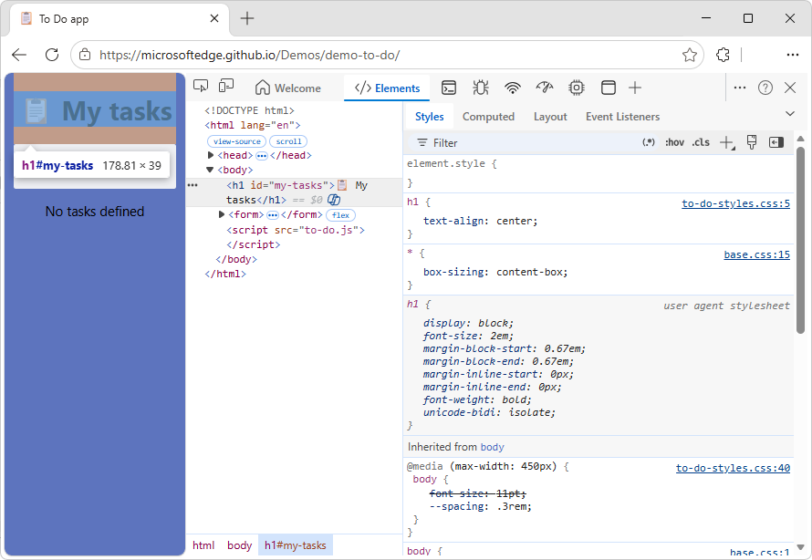

There are many ways to select an element:

*  In a rendered webpage, right-click a page element, and then click **Inspect**.

*  In DevTools, click **Select an element** () or press **Ctrl+Shift+C** (Windows, Linux) or **Command+Shift+C** (macOS), and then click the element in the viewport.

*  In DevTools, click the element in the **DOM Tree**.

*  In DevTools, run a query such as `document.querySelector('p')` in the **Console**, right-click the result, and then select **Reveal in Elements panel**.


<!-- ====================================================================== -->
## View CSS
<!-- https://developer.chrome.com/docs/devtools/css/reference/#view -->

Use the **Elements** > **Styles** and **Computed** tabs to view CSS rules and diagnose CSS issues.


<!-- ------------------------------ -->
#### Navigate with links
<!-- https://developer.chrome.com/docs/devtools/css/reference/#links -->

<!-- todo: format, link, pngs -->

The Styles tab displays links in various places to various other places, including but not limited to:

Next to CSS rules, to style sheets and CSS sources. Such links open the Sources panel. If the style sheet is minified, see Make a minified file readable.

In the Inherited from ... sections, to parent elements.

In var() calls, to custom property declarations.

In animation shorthand properties, to @keyframes.

Learn more links in documentation tooltips.

And more.

Here are some of them highlighted:

Various links highlighted.

Links may be styled differently. If you're not sure if something is a link, try clicking it to find out.


<!-- ------------------------------ -->
#### View tooltips with CSS documentation, specificity, and custom property values
<!-- https://developer.chrome.com/docs/devtools/css/reference/#tooltips -->

<!-- todo: format, link, pngs -->

Elements > Styles shows tooltips with useful information when you hover over specific elements.


<!-- ---------- -->
###### View CSS documentation
<!-- https://developer.chrome.com/docs/devtools/css/reference/#view-docs -->

<!-- todo: format, link, pngs -->

To see a tooltip with a short CSS description, hover over the property name in the Styles tab.

DevTools pulls the descriptions for tooltips from VS Code Custom Data.

The tooltip with documentation on a CSS property.

Click Learn more to go to an MDN CSS Reference on this property.

To turn the tooltips off, check Checkbox. Don't show.

To turn them back on, check Settings. Settings > Preferences > Elements > Checkbox. Show CSS documentation tooltip.


<!-- ---------- -->
###### View selector specificity
<!-- https://developer.chrome.com/docs/devtools/css/reference/#selector-specificity -->

<!-- todo: format, link, pngs -->

Hover over a selector to see a tooltip with its specificity weight.

The tooltip with specificity weight of a matched selector.


<!-- ---------- -->
###### View the values of custom properties
<!-- https://developer.chrome.com/docs/devtools/css/reference/#custom-css -->

<!-- todo: format, link, pngs -->

Hover over a --custom-property to see its value in a tooltip.

The value of a custom property in a tooltip.


<!-- ------------------------------ -->
#### View the external stylesheet where a rule is defined
<!-- not upstream -->

In the **Styles** pane, click the link next to a CSS rule to open the external stylesheet that defines the rule.  The stylesheet opens in the **Editor** pane of the **Sources** tool.

If the stylesheet is minified, click the **Format** () button, at the bottom of the **Editor** pane.  For more information, see [Reformat a minified JavaScript file with pretty-print](../javascript/reference.md#reformat-a-minified-javascript-file-with-pretty-print).

In the following figure, after you click
`https://learn.microsoft.com/_themes/docs.theme/master/en-us/_themes/styles/b66bc881.site-ltr.css:2`<!-- :2 at end causes not to work. --><!--keep /en-us--> you are taken to line 2 of
`https://learn.microsoft.com/_themes/docs.theme/master/_themes/styles/b66bc881.site-ltr.css`, where the `.content h1:first-of-type` CSS rule is defined.<!-- /master/ works but lines concated.  /main/ doesn't work -->

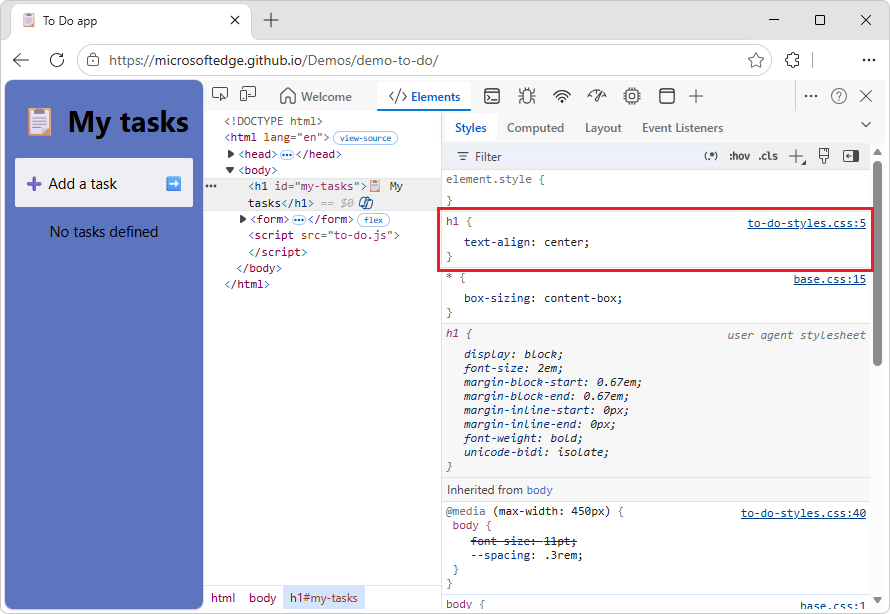


<!-- ------------------------------ -->
#### View invalid, overridden, inactive, and other CSS
<!-- https://developer.chrome.com/docs/devtools/css/reference/#css-issues -->

<!-- todo: format, link, pngs -->

The Styles tab recognizes many kinds of CSS issues and highlights them in different ways.

See Understand CSS in the Styles tab.


<!-- ------------------------------ -->
#### View only the CSS that is actually applied to an element
<!-- https://developer.chrome.com/docs/devtools/css/reference/#computed -->

The **Styles** pane shows you all of the rules that apply to an element, including declarations that have been overridden.  When you aren't interested in overridden declarations, use the **Computed** pane to view only the CSS that is actually being applied to an element.

1. [Select an element](#select-an-element).

1. Go to the **Computed** pane in the **Elements** tool.

   On a wide DevTools window, the **Computed** pane doesn't exist.  The contents of the **Computed** pane are shown on the **Styles** pane.

   Inherited properties are opaque.

1. To display all inherited values, select the **Show All** checkbox.

   In the following figure, the **Computed** pane shows the CSS properties being applied to the currently selected `h1` element:

   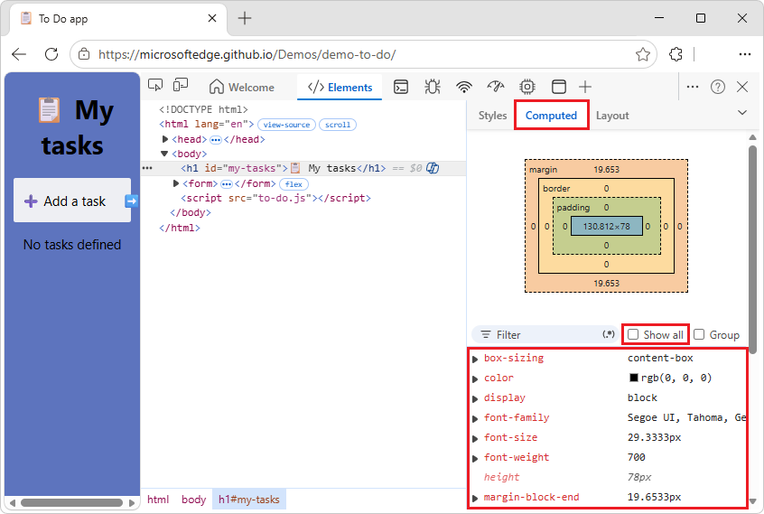

See also:
* [Understand CSS in the Computed tab]<!-- todo: link --> in _Find invalid, overridden, inactive, and other CSS_.


<!-- ------------------------------ -->
#### View CSS properties in alphabetical order
<!-- https://developer.chrome.com/docs/devtools/css/reference/#alphabetical -->

Use the **Computed** pane.  See [View only the CSS that is actually applied to an element](#view-only-the-css-that-is-actually-applied-to-an-element).


<!-- ------------------------------ -->
#### View inherited CSS properties
<!-- https://developer.chrome.com/docs/devtools/css/reference/#inherited -->

Check the **Show All** checkbox in the **Computed** pane.  See [View only the CSS that is actually applied to an element](#view-only-the-css-that-is-actually-applied-to-an-element).


<!-- ------------------------------ -->
#### View CSS at-rules
<!-- https://developer.chrome.com/docs/devtools/css/reference/#at-rules -->

<!-- todo: format, link, pngs -->

At-rules are CSS statements that let you control CSS behavior. Elements > Styles shows the following at-rules in dedicated sections:

@property
@supports
@scope
@font-palette-values
@position-try


<!-- ---------- -->
###### View `@property` at-rules
<!-- https://developer.chrome.com/docs/devtools/css/reference/#property -->

<!-- todo: format, link, pngs -->

The @property CSS at-rule lets you define CSS custom properties explicitly and register them in a style sheet without running any JavaScript.

Hover over the name of such property in the Styles tab, to see a tooltip with the property's value, descriptors, and a link to its registration in the collapsible @property section at the bottom of the Styles tab.

To edit an @property rule, double-click its name or value.


<!-- ---------- -->
###### View `@supports` at-rules
<!-- https://developer.chrome.com/docs/devtools/css/reference/#supports -->

<!-- todo: format, link, pngs -->

The Styles tab shows you the @supports CSS at-rules if they are applied to an element. For example, inspect the following element:

View @supports at-rules.

If your browser supports the lab() function, the element is green, otherwise it's purple.

Only Safari supports the CIELAB color space. https://caniuse.com/?search=lab


<!-- ---------- -->
###### View `@scope` at-rules
<!-- https://developer.chrome.com/docs/devtools/css/reference/#scope -->

<!-- todo: format, link, pngs -->

The Styles tab shows you CSS @scope at-rules if they are applied to an element.

The new @scope at-rules are a part of the CSS Cascading and Inheritance Level 6 specification. These rules allow you to scope CSS styles, in other words, explicitly apply styles to specific elements.

The @scope at-rule feature is experimental. To test it, enable the Experimental Web Platform features flag in chrome://flags/#enable-experimental-web-platform-features. Otherwise, the next preview doesn't work.

View the @scope rule in the following preview:


Inspect the text on the card in the preview.

On the Styles tab, find the @scope rule.

The @scope rule.

In this example, the @scope rule overrides the global CSS background-color declaration for all <p> elements inside elements with a card class.

To edit the @scope rule, double-click it.


<!-- ---------- -->
###### View `@font-palette-values` at-rules
<!-- https://developer.chrome.com/docs/devtools/css/reference/#font-palette-values -->

<!-- todo: format, link, pngs -->

The @font-palette-values CSS at-rule lets you customize the default values of the font-palette property. Elements > Styles shows this at-rule in a dedicated section.

View the @font-palette-values section in the next preview:

Inspect the second line of text in the preview.

In Styles, find the @font-palette-values section.

The @font-palette-values rule.

In this example, the --New font palette values override the default ones of the colored font.

To edit your custom values, double-click them.


<!-- ---------- -->
###### View `@position-try` at-rules
<!-- https://developer.chrome.com/docs/devtools/css/reference/#filter -->

<!-- todo: format, link, pngs -->

The @position-try CSS rule along with the position-try-options property lets you define alternative anchor positions for elements. To learn more, see Introducing the CSS anchor positioning API.

Elements > Styles resolves and links the following:

position-try-options property values to a dedicated @position-try --name section.

position-anchor property values and anchor() arguments to the corresponding elements with popovertarget attributes.

Inspect the position-try-options values and @position-try sections in the next preview:

Demo using anchor with popover

In the preview, open the submenu, that is, click YOUR ACCOUNT then STOREFRONT.

Inspect the element with id="submenu" in the preview.

In Styles, find the position-try-options property and click its --bottom value. The Styles tab takes you to the corresponding @position-try section.

Click the position-anchor value link or the same anchor() arguments. The Elements panel selects the element with the corresponding popovertarget attribute and the Styles tab shows the element's CSS.

The position-try-options property, the @position-try section, and the element with the popover target attribute.

To edit values, double-click them.


<!-- ------------------------------ -->
#### View an element's box model
<!-- https://developer.chrome.com/docs/devtools/css/reference/#box-model -->

To view [the box model](https://developer.mozilla.org/docs/Learn/CSS/Introduction_to_CSS/Box_model) of an element, go to the **Styles** pane.  If your DevTools window is narrow, the **Box Model** diagram is at the bottom of the panel.

To change a value, double-click it.

In the following figure, the **Box Model** diagram in the **Styles** pane shows the box model for the currently selected `h1` element.

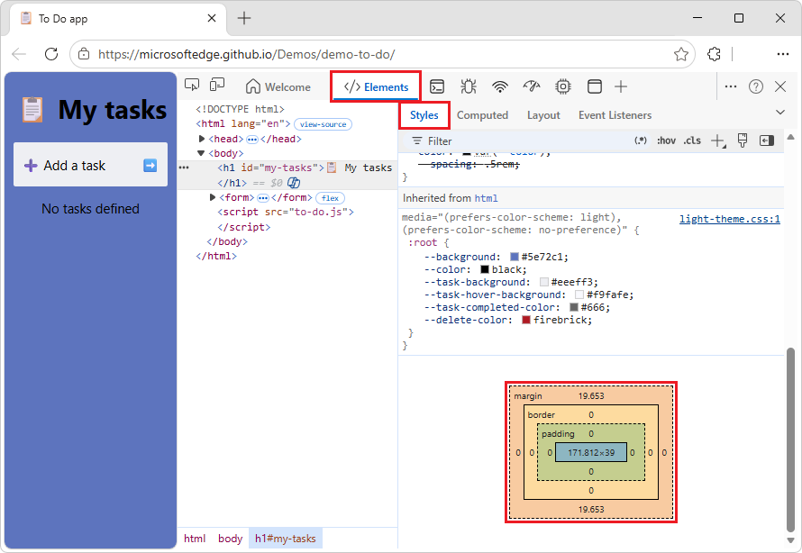


<!-- ------------------------------ -->
#### Search and filter the CSS of an element
<!-- Search and filter an element's CSS  https://developer.chrome.com/docs/devtools/css/reference/#filter -->

Use the **Filter** text box on the **Styles** and **Computed** panes to search for specific CSS properties or values.

To also search inherited properties in the **Computed** pane, check the **Show All** checkbox.

In the following figure, the **Styles** pane is filtered to only show rules that include the search query `color`.

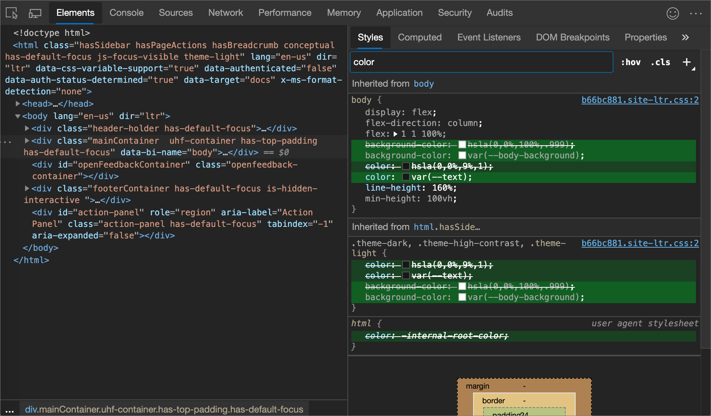

In the following figure, the **Computed** pane is filtered to only show declarations that include the search query `100%`.

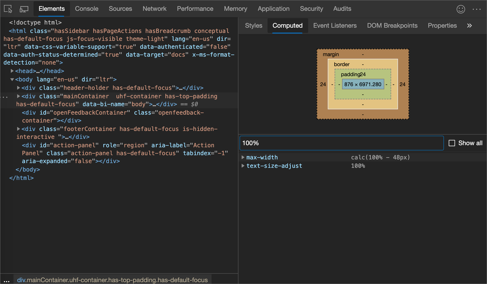


<!-- ------------------------------ -->
#### Emulate a focused page
<!-- https://developer.chrome.com/docs/devtools/css/reference/#focus -->

<!-- todo: format, link, pngs -->

If you switch focus from the page to DevTools, some overlay elements automatically hide if they are triggered by focus. For example, drop-down lists, menus, or date pickers. The check_box Emulate a focused page option lets you debug such an element as if it is in focus.

Caution: With this option turned on, the document.visibilityState is set to visible and the visibilitychange event doesn't fire. For more information, see Page Visibility API.

Try emulating a focused page on this demo page:

Focus the input element. Another element appears under it.

Open DevTools. The DevTools window is now in focus instead of the page, so the element disappears again.

In Elements > Styles, click :hov, check check_box Emulate a focused page, and make sure the input element is selected. You can now inspect the element under it.

Before and after turning on the 'Emulate a focused page' option.

You can also find the same option on the Rendering panel.

To discover more ways to freeze an element, see Freeze screen and inspect disappearing elements.


<!-- ------------------------------ -->
#### Toggle a pseudo-class
<!-- https://developer.chrome.com/docs/devtools/css/reference/#pseudo-class -->

To toggle a pseudo-class:

1. Go to a webpage, such as [To Do app](https://microsoftedge.github.io/Demos/demo-to-do/), in a new window or tab.

1. Enter a task, such as **task 1**.

1. Right-click the webpage, and then select **Inspect**.

   DevTools opens.

1. Select the **Elements** tool.

1. In the DOM tree, select the `<li class="task">` element.

1. Select the **Styles** tab.

1. In the upper right, click **:hov**.

   Checkboxes are displayed.

1. Select the checkbox for the pseudo-class that you want to enable, such as `:hover`:

   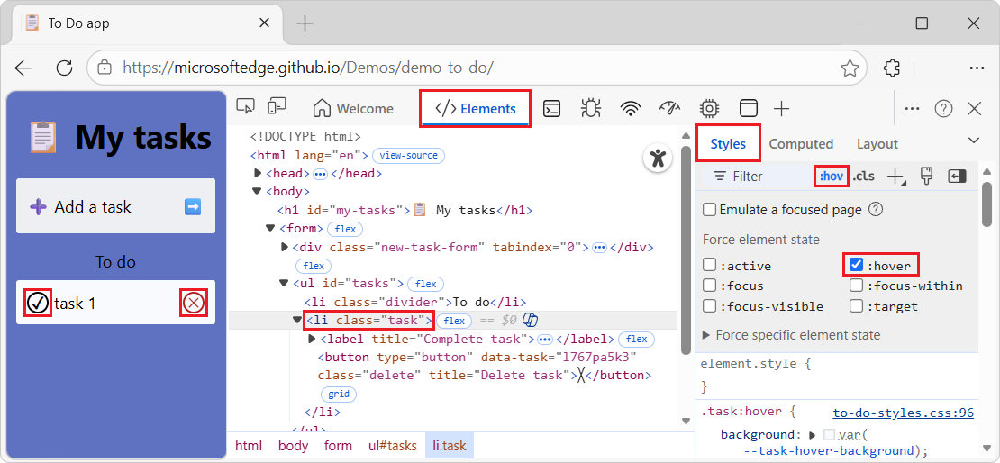

   In the rendered webpage, the circle next to the task name is filled with a checkmark, and a red X in a red circle appears in the right side of the task, as if the element is being hovered over, even though the element isn't actually being hovered over.

The **Styles** tab shows the following pseudo-classes for all elements:
* [`:active`](https://developer.mozilla.org/docs/Web/CSS/:active) - MDN.
* [`:focus`](https://developer.mozilla.org/docs/Web/CSS/:focus)
* [`:focus-within`](https://developer.mozilla.org/docs/Web/CSS/:focus-within)
* [`:target`](https://developer.mozilla.org/docs/Web/CSS/:target)
* [`:hover`](https://developer.mozilla.org/docs/Web/CSS/:hover)
* [`:focus-visible`](https://developer.mozilla.org/docs/Web/CSS/:focus-visible)

Additionally, some elements might have element-specific pseudo-classes.  When you select such an element, the **Styles** tab shows a **Force specific element state** section that you can expand and turn on pseudo-classes that are specific to the element, such as a **:read-write** checkbox:


For an interactive tutorial, see [Add a pseudo-state to a class](../css/index.md#add-a-pseudostate-to-a-class).


<!-- ------------------------------ -->
#### View inherited highlight pseudo-elements
<!-- https://developer.chrome.com/docs/devtools/css/reference/#view-inherited-highlight-pseudo-elements -->

<!-- todo: format, link, pngs -->

Pseudo-elements let you style specific parts of elements. Highlight pseudo-elements are document portions with a "selected" status and they are styled as "highlighted" to indicate this status to the user. For example, such pseudo-elements are ::selection, ::spelling-error, ::grammar-error, and ::highlight.

As mentioned in the specification, when multiple styles conflict, cascade determines the winning style.

To enable this feature, run Chrome with the --enable-blink-features=HighlightInheritance flag.

To better understand the inheritance and priority of the rules, you can view the inherited highlight pseudo-elements:

Inspect the text below.

I inherited the style of my parent's highlight pseudo-element. Select me!

Select a portion of the text above.

In the Styles tab, scroll down to find the Inherited from ::selection pseudo of... section.

View the Inherited section of the Styles tab.


<!-- ------------------------------ -->
#### View cascade layers
<!-- https://developer.chrome.com/docs/devtools/css/reference/#cascade-layers -->

<!-- todo: format, link, pngs -->

Cascade layers enable more explicit control of your CSS files to prevent style-specificity conflicts. This is useful for large codebases, design systems, and when managing third-party styles in applications.

To view cascade layers, inspect the next element and open Elements > Styles.

In the Styles tab, view the 3 cascade layers and their styles: page, component and base.

Cascade layers.

To view the layer order, click the layer name or the Toggle layers. Toggle CSS layers view button.

The page layer has the highest specificity, therefore the element's background is green.


<!-- ------------------------------ -->
#### View a page in print mode
<!-- https://developer.chrome.com/docs/devtools/css/reference/#print-mode -->

To view a page in print mode:

1. Open the [Command Menu](../command-menu/index.md).

1. Start typing `rendering`, and then select **Show Rendering**.

1. Click the **Emulate CSS Media** dropdown list, and then select **print**.


<!-- ------------------------------ -->
#### View used and unused CSS with the Coverage tool
<!-- https://developer.chrome.com/docs/devtools/css/reference/#coverage -->

The **Coverage** tool shows you what CSS a page actually uses.

1. Open the [Command Menu](../command-menu/index.md) by pressing **Ctrl+Shift+P** (Windows, Linux) or **Command+Shift+P** (macOS), while DevTools has focus.

1. Start typing `coverage`, and then select **Show Coverage**:
   
   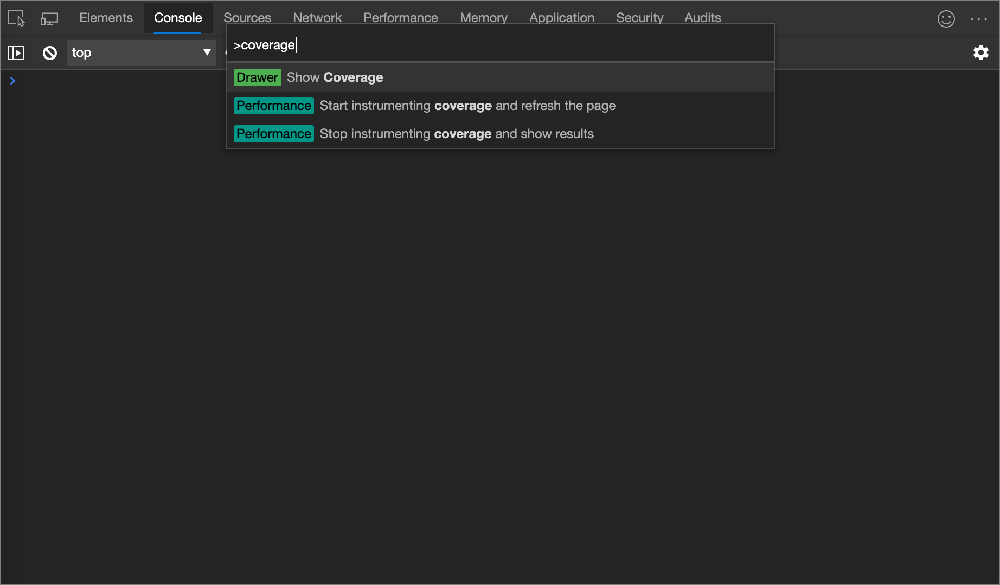
   
   The **Coverage** tool appears:
   
   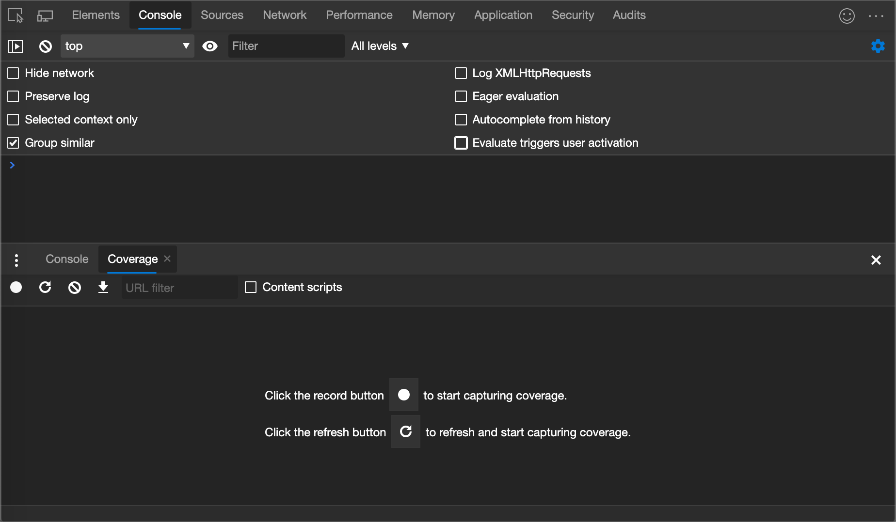

1. Click **Start instrumenting coverage and refresh the page** ().  The page refreshes and the **Coverage** tool provides an overview of how much CSS (and JavaScript) is used from each file that the browser loads.  Green represents used CSS.  Red represents unused CSS.

   An overview of how much CSS (and JavaScript) is used and unused:

   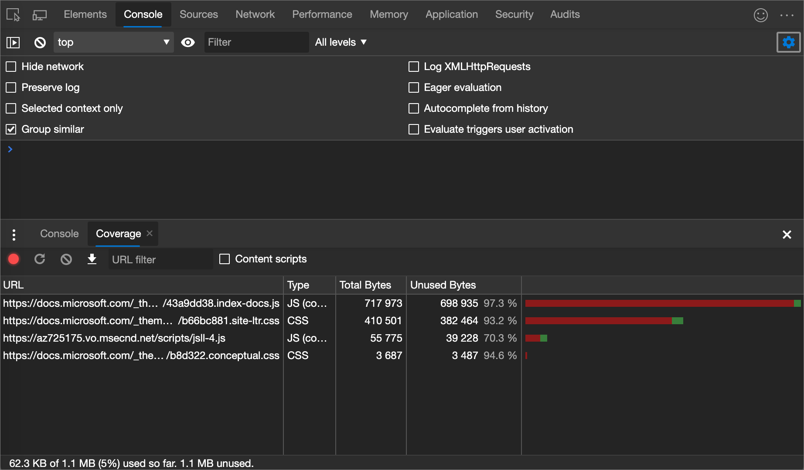

1. To display a line-by-line breakdown of what CSS is used, click a CSS file.

   In the following figure, lines 145 to 147 and 149 to 151 of `b66bc881.site-ltr.css` are unused, whereas lines 163 to 166 are used:

   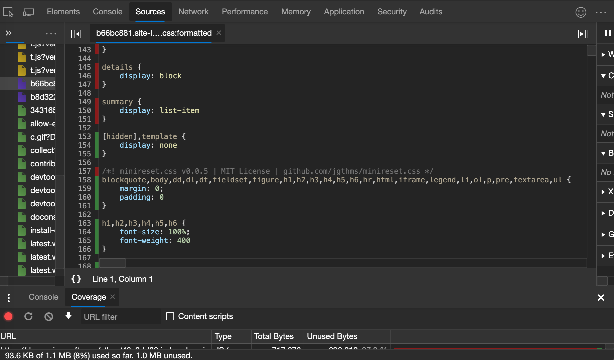


<!-- ------------------------------ -->
#### Force print preview mode
<!-- https://developer.chrome.com/docs/devtools/css/reference/#print - links to https://developer.chrome.com/docs/devtools/css/print-preview -->

See [Force DevTools into Print Preview mode](../css/print-preview.md).


<!-- ====================================================================== -->
## Copy CSS
<!-- https://developer.chrome.com/docs/devtools/css/reference/#copy-css -->

<!-- todo: format, link, pngs -->

From a single drop-down menu in the Styles tab, you can copy separate CSS rules, declarations, properties, values

Additionally, you can copy CSS properties in JavaScript syntax. This option is handy if you're using CSS-in-JS libraries.

To copy CSS:

Select an element.

In the Elements > Styles tab, right-click a CSS property. Copy CSS drop-down menu.

Select one of the following options from the drop-down menu:

Copy declaration. Copies the property and its value in CSS syntax: css property: value;

Copy property. Copies only the property name.

Copy value. Copies only the value.

Copy rule. Copies the entire CSS rule: css selector[, selector] { property: value; property: value; ... }

Copy declaration as JS. Copies the property and its value in JavaScript syntax: js propertyInCamelCase: 'value'

Copy all declarations. Copies all properties and their values in the CSS rule: css property: value; property: value; ...

Copy all declarations as JS. Copies all properties and their values in JavaScript syntax: ```js propertyInCamelCase: 'value', propertyInCamelCase: 'value', ...

Copy all CSS changes. Copies the changes you make in the Styles tab across all declarations.

View computed value. Takes you to the Computed tab.


<!-- ====================================================================== -->
## Change CSS
<!-- https://developer.chrome.com/docs/devtools/css/reference/#change -->

This section lists all the ways you can change CSS in **Elements** > **Styles**.

Additionally, you can:

* Override CSS across page loads.  See [Override webpage resources with local copies (Overrides tab)](../javascript/overrides.md).

* Save modified CSS to your local sources in a workspace.  See [Edit and save files in a workspace (Sources tool Workspace tab)](../workspaces/index.md).


<!-- ------------------------------ -->
#### Two ways to add a CSS declaration to an element
<!-- Add a CSS declaration to an element  https://developer.chrome.com/docs/devtools/css/reference/#add-declaration -->

The order of declarations affects how an element is styled.  You can add declarations either by adding an inline declaration, or by adding a declaration to a style rule.  These two approaches are described in the following sections.


<!-- ---------- -->
###### Adding an inline CSS declaration to an element
<!-- Add an inline declaration  https://developer.chrome.com/docs/devtools/css/reference/#add-declaration-inline -->

Adding a inline declaration is equivalent to adding a `style` attribute to the HTML of an element.  For most scenarios, you probably want to use inline declarations.

Inline declarations have higher specificity than external declarations, so using inline declarations ensures that the changes take effect in your specific, expected element.  For more information about specificity, see [Selector Types](https://developer.mozilla.org/docs/Web/CSS/Specificity#Selector_Types).

To add an inline declaration:

1. [Select an element](#select-an-element).

1. In the **Styles** pane, click between the brackets of the **element.style** section.  The cursor focuses, allowing you to enter text.

1. Enter a property name and press **Enter**.

1. Enter a valid value for that property and press **Enter**.  In the **DOM Tree**, a `style` attribute has been added to the element.

Alternatively, enter the value in the property field, and DevTools will then suggest a list of matching **property: value** pairs to select from. For example, if you enter `bold` in the property field, DevTools suggests `font-weight: bold` and `font-weight: bolder` as the possible rules. Press **Enter** to apply the rule.

In the following figure, the `margin-top` and `background-color` properties have been applied to the selected element.  In the **DOM Tree**, the declarations are reflected in the element's `style` attribute.

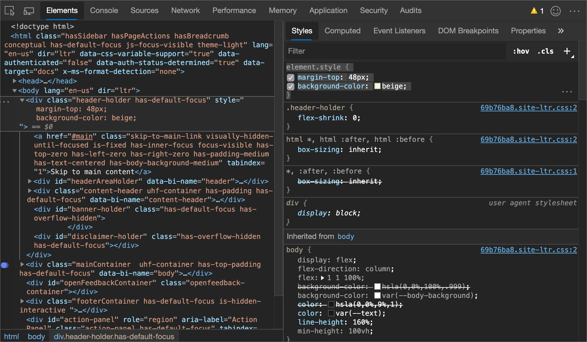


<!-- ---------- -->
###### Adding a CSS declaration to an existing style rule
<!-- Add a declaration to a style rule  https://developer.chrome.com/docs/devtools/css/reference/#add-declaration-to-rule -->

If you're debugging an element's styles and you need to specifically test what happens when a declaration is defined in different places, add a declaration to an existing style rule.

To add a declaration to an existing style rule:

1. [Select an element](#select-an-element).

1. In the **Styles** pane, click between the brackets of the style rule to which you want to add the declaration.  The cursor focuses, allowing you to enter text.

1. Enter a property name and press **Enter**.

1. Enter a valid value for that property and press **Enter**.

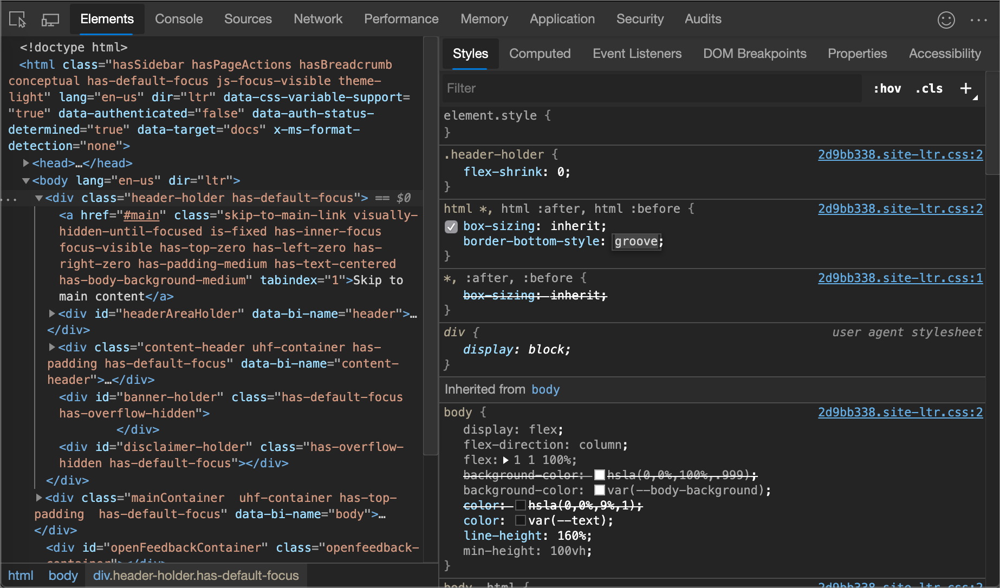


<!-- ------------------------------ -->
#### Change a declaration name or value
<!-- https://developer.chrome.com/docs/devtools/css/reference/#change-declaration -->

To change the name of a CSS declaration, double-click the declaration's name.

To change the value of a CSS declaration, double-click the declaration's value.  The following screenshot shows selecting a value from a list:

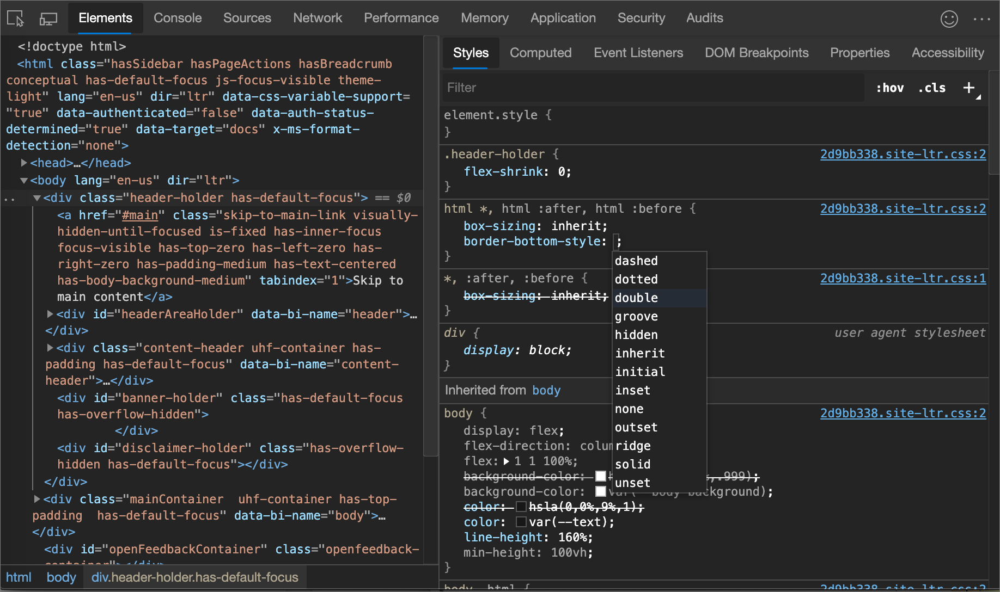

To change a numerical value, type in the value, or use the arrow keys, per the next section.


<!-- ------------------------------ -->
#### Change enumerable values with keyboard shortcuts
<!-- https://developer.chrome.com/docs/devtools/css/reference/#values-shortcuts -->

<!-- todo: format, link, pngs -->

While editing an enumerable value of a declaration, for example, font-size, you can use the following keyboard shortcuts to increment the value by a fixed amount:

Option+Up (Mac) or Alt+Up (Windows, Linux) to increment by 0.1.

Up to change the value by 1, or by 0.1 if the current value is between -1 and 1.

Shift+Up to increment by 10.

Shift+Command+Up (Mac) or Control+Shift+Page Up (Windows, Linux) to increment the value by 100.

Decrementing also works. Just replace each instance of Up mentioned earlier with Down.


<!-- ------------------------------ -->
#### Change length values
<!-- https://developer.chrome.com/docs/devtools/css/reference/#change-length-value -->

<!-- todo: format, link, pngs -->

Deprecated: This feature is deprecated in Chrome 123. To temporarily turn it back on again, clear the settings Settings > Experiments > check_box Deprecate CSS <length> authoring tool in the Styles tab. Feel free to leave feedback in crbug/1522657.

You can use your pointer to change any property with length, such as width, height, padding, margin, or border.

To change the length unit:

Hover over the unit name and notice that it's underlined.

Click the unit name to select a unit from the drop-down.

To change the length value:

Hover over the unit value and notice that your pointer changes to a horizontal double-headed arrow.

Drag horizontally to increase or decrease the value.

To adjust the value by 10, hold Shift when dragging.


<!-- ------------------------------ -->
#### Increment numerical declaration values
<!-- not upstream -->

To change a numerical value of a CSS declaration, type in the value, or use the arrow keys to increment the value by a specific amount:

| Keyboard shortcut | Increments by |
|---|---|
| **Alt+Up Arrow** (Windows, Linux) or **Option+Up Arrow** (macOS) | 0.1 |
| **Up Arrow** | 1 (or 0.1, if the current value is between -1 and 1) |
| **Shift+Up Arrow** | 10 |
| **Shift+Page Up** (Windows, Linux) or **Shift+Command+Up Arrow** (macOS) | 100 |

To decrement, press the **Down Arrow** (or **Page Down**) key instead of the **Up Arrow** (or **Page Up**) key.


<!-- ------------------------------ -->
#### Add a class to an element
<!-- https://developer.chrome.com/docs/devtools/css/reference/#add-class -->

To add a class to an element:

1. [Select the element](#select-an-element) in the **DOM Tree**.

1. Click **.cls**.

1. Enter the name of the class in the **Add new class** text box.

1. Press **Enter**.

   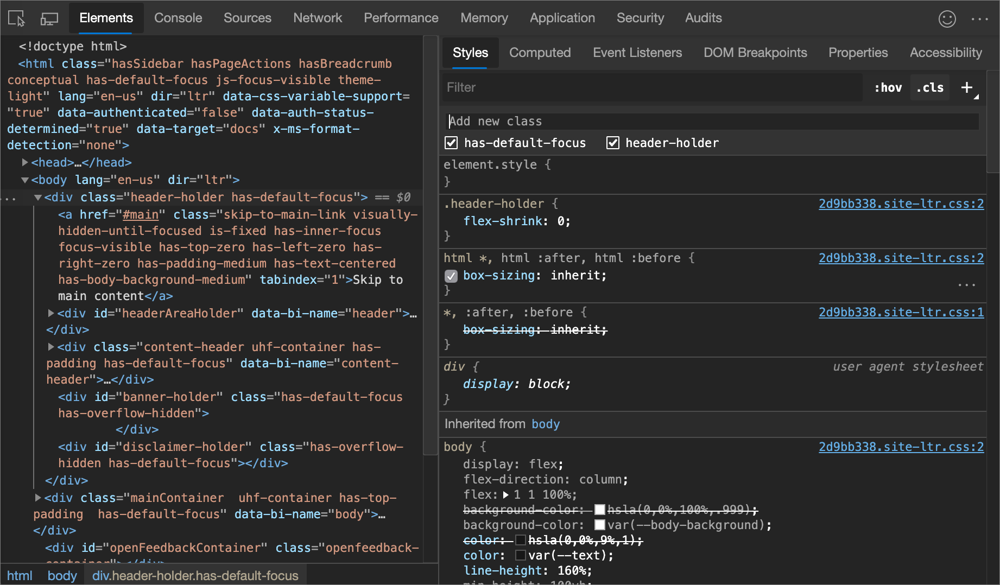


<!-- ------------------------------ -->
#### Emulate light and dark theme preferences and enable automatic dark mode

<!-- todo: format, link, pngs -->

To toggle automatic dark mode or emulate the user's preference of light or dark themes:

On the Elements > Styles tab, click Toggle common rendering emulations.Toggle common rendering emulations. Toggle common rendering emulations.

Select one of the following from the drop-down list:

prefers-color-scheme: light. Indicates that the user prefers the light theme.

prefers-color-scheme: dark. Indicates that the user prefers the dark theme.

Automatic dark mode. Displays your page in dark mode even if you didn't implement it. Additionally, sets prefers-color-scheme to dark automatically.

This drop-down is a shortcut for Emulate CSS media feature prefers-color-scheme and Enable automatic dark mode options of the Rendering tab.


<!-- ------------------------------ -->
#### Toggle a class
<!-- https://developer.chrome.com/docs/devtools/css/reference/#toggle-class -->

To enable or disable a class on an element:

1. [Select the element](#select-an-element) in the **DOM Tree**.

1. Open the **Element Classes** pane.  See [Add a class to an element](#add-a-class-to-an-element).  Below the **Add New Class** text boxes are all of the classes that are being applied to this element.

1. Toggle the checkbox next to the class that you want to enable or disable.


<!-- ------------------------------ -->
#### Add a style rule
<!-- https://developer.chrome.com/docs/devtools/css/reference/#style-rule -->

To add a new style rule:

1. [Select an element](#select-an-element).

1. Click **New Style Rule** ().  DevTools inserts a new rule beneath the **element.style** rule.

   In the following figure, DevTools adds the `h1.devsite-page-title` style rule after you click **New Style Rule**.

   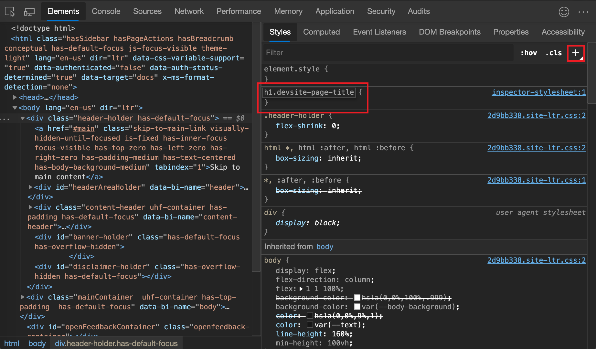


<!-- ---------- -->
###### Select a stylesheet to add a rule to
<!-- Choose which style sheet to add a rule to  https://developer.chrome.com/docs/devtools/css/reference/#style-rule-stylesheet -->

By default, when adding a style rule, DevTools creates a new stylesheet named `inspector-stylesheet` in the document and then adds the new style rule in this stylesheet.

To instead add the rule in an existing stylesheet:

*  Click and hold **New Style Rule** () and then select a stylesheet from the list to add the style rule to.

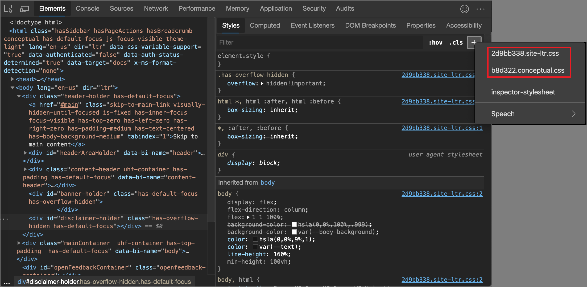


<!-- ---------- -->
###### Add a style rule to a specific location
<!-- not upstream - todo: merge w/ above section? -->

By default, adding a style rule by clicking on **New Style Rule** inserts the new rule beneath the **element.style** rule in the `inspector-stylesheet` stylesheet.

To add a style rule in a specific location of the **Styles** pane instead:

1. Hover on the style rule that is directly above where you want to add your new style rule.

1. Click **Insert Style Rule Below** ().

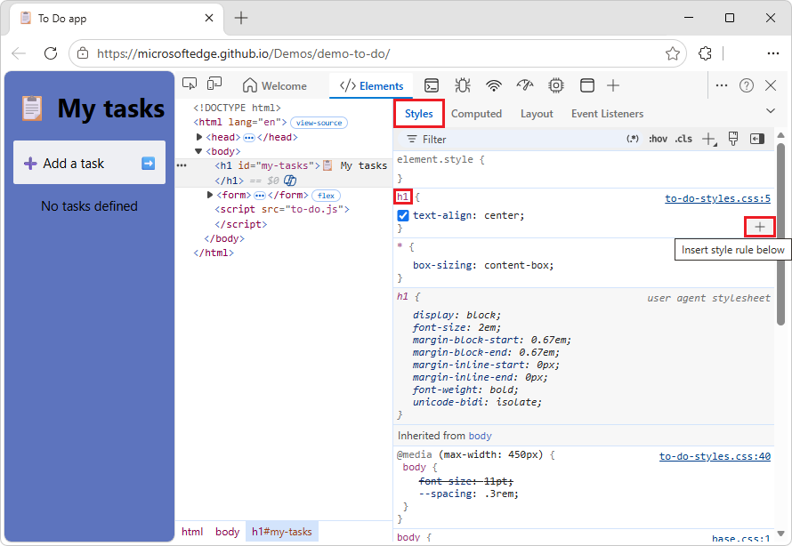


<!-- ------------------------------ -->
#### Toggle a declaration
<!-- https://developer.chrome.com/docs/devtools/css/reference/#toggle-declaration -->

To toggle a single declaration on or off:

1. [Select an element](#select-an-element).

1. In the **Styles** pane, hover on the rule that defines the declaration.  A checkbox appears next to each declaration.

1. Select or clear the checkbox next to the declaration.  When you clear a declaration, DevTools crosses it out, to indicate that it is no longer active.

   In the following figure, the `margin-top` property for the currently selected element has been toggled off.

   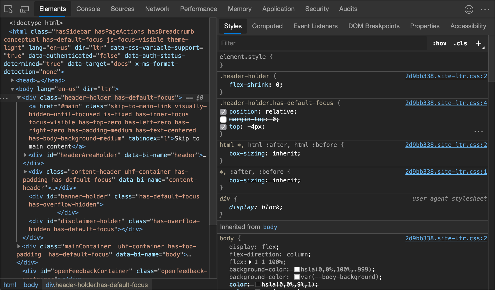


<!-- ------------------------------ -->
#### Edit the `::view-transition` pseudo-elements during an animation
<!-- https://developer.chrome.com/docs/devtools/css/reference/#view-transition -->

<!-- todo: format, link, pngs -->

See the corresponding section in Animations. https://developer.chrome.com/docs/devtools/css/animations#view-transition

For more information, see Smooth and simple transitions with the View Transitions API. https://developer.chrome.com/docs/web-platform/view-transitions


<!-- ------------------------------ -->
#### Align grid items and their content with the Grid Editor
<!-- https://developer.chrome.com/docs/devtools/css/reference/#grid-editor -->

<!-- todo: format, link, pngs -->

See the corresponding section in Inspect CSS grid. https://developer.chrome.com/docs/devtools/css/grid#grid-editor


<!-- ------------------------------ -->
#### Change colors with the Color Picker
<!-- https://developer.chrome.com/docs/devtools/css/reference/#color-picker -->
<!-- todo: replace content by a link to https://developer.chrome.com/docs/devtools/css/color -->

The **Color Picker** provides a user interface for changing `color` and `background-color` declarations.

To open the **Color Picker**:

1. [Select an element](#select-an-element).

1. In the **Styles** pane, find the `color`, `background-color`, or similar declaration that you want to change.  To the left of the `color`, `background-color`, or similar value, there is a small square, which is a preview of the color.

   In the following figure, the small square to the left of `rgba(0, 0, 0, 0.7)` is a preview of that color.

   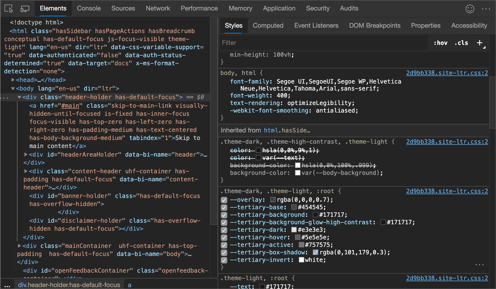

1. Click the preview to open the **Color Picker**.

   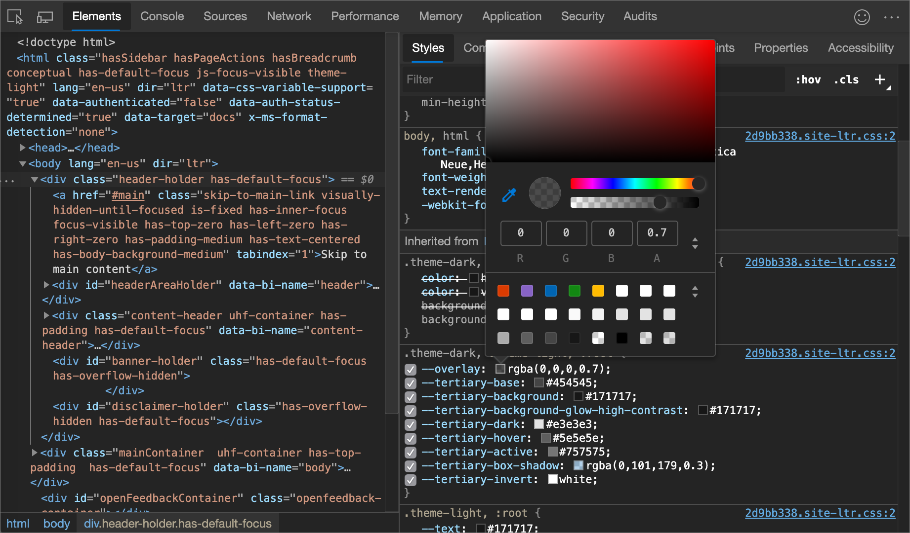

The following figure and list describes of each of the UI elements of the **Color Picker**.

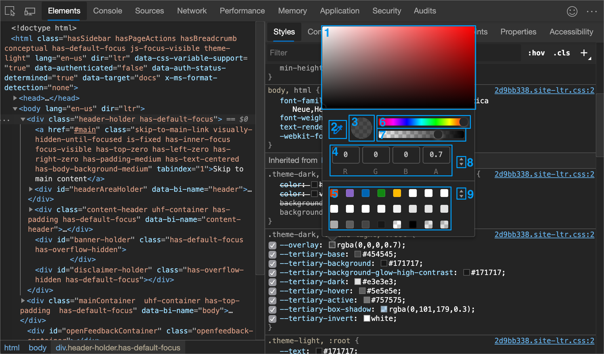

| Callout | Component | Description |
|---|---|---|
| 1 | **Shades** |  |
| 2 | **Eyedropper** | [Sample a color off the page with the Eyedropper](#sample-a-color-off-the-page-with-the-eyedropper) |
| 3 | **Copy To Clipboard** | Copy the **Display Value** to your clipboard. |
| 4 | **Display Value** | The RGBA, HSLA, or Hex representation of the color. |
| 5 | **Color Palette** | Click a square to change the color. |
| 6 | **Hue** |  |
| 7 | **Opacity** |  |
| 8 | **Display Value Switcher** | Toggle between the RGBA, HSLA, and Hex representations of the current color. |
| 9 | **Color Palette Switcher** | Toggle between the [Material Design palette](https://material.io/guidelines/style/color.html#color-color-palette), a custom palette, or a page colors palette.  DevTools generates the page color palette based on the colors that it finds in your stylesheets. |


<!-- ------------------------------ -->
#### Sample a color off the page with the Eyedropper
<!-- not upstream, moved to https://developer.chrome.com/docs/devtools/css/color#eyedropper -->

To change the selected color to some other color on the page:

1. Click the **Eyedropper** icon (). Your cursor changes to a magnifying glass.

1. Hover on the pixel that has the color you want to sample, anywhere on your screen.

1. Click to confirm.

   In the following figure, the **Color Picker** shows a current color value of `rgba(0,0,0,0.7)`, which is close to black.  The specific color changes to the version of black that is currently highlighted in the viewport after you clicked it.

   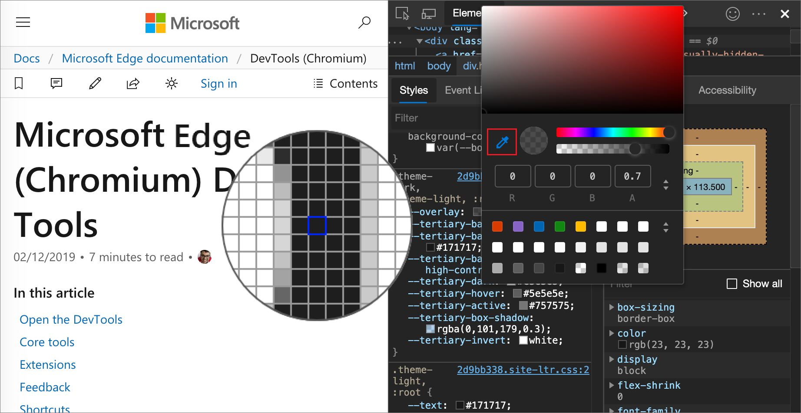

See also:
* [Test text-color contrast using the Color Picker](../accessibility/color-picker.md)


<!-- ------------------------------ -->
#### Change angle value with the Angle Clock
<!-- https://developer.chrome.com/docs/devtools/css/reference/#angle-clock -->

The **Angle Clock** provides a user interface for changing the angle amounts in CSS property values.

To open the **Angle Clock**:

1. Select an element which includes an angle declaration. <!-- For example, select the text below. -->

1. In the **Styles** pane, find the `transform` or `background` declaration that you want to change.  Click the **Angle Preview** box next to the angle value.

   In the following figure, the small clock to the left of `100deg` is a preview of the angle.

1. Click the preview to open the **Angle Clock**:

   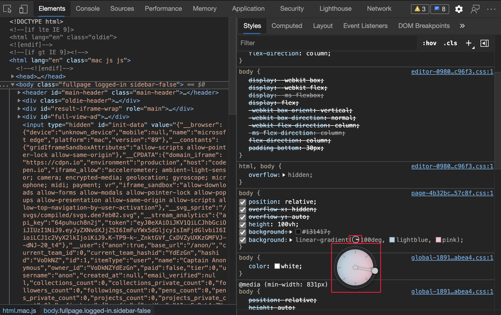

1. Change the angle value by clicking on the **Angle Clock** circle, or scroll your mouse to increase or decrease the angle value by 1.

There are more keyboard shortcuts to change the angle value.  Find out more in the [Styles pane keyboard shortcuts](../shortcuts/index.md#styles-pane-keyboard-shortcuts).


<!-- ------------------------------ -->
#### Change box and text shadows with the Shadow Editor
<!-- https://developer.chrome.com/docs/devtools/css/reference/#shadow-editor -->

Use the **Shadow Editor** to change the value of the `box-shadow` or `text-shadow` CSS property on an HTML element:

1. [Select an element](#select-an-element) with a `box-shadow` or `text-shadow` declaration.

   For example, open [the 1DIV demo page](https://microsoftedge.github.io/Demos/1DIV/dist/) in a new tab or window, right-click the page and select **Inspect** to open DevTools, and then in the **Elements** tool, select the `<div class="demos">` element.

1. In the **Styles** pane, in the `.demos` CSS rule, find the `box-shadow` declaration, and then click its **Open shadow editor** () button.

   The **Shadow Editor** opens:

   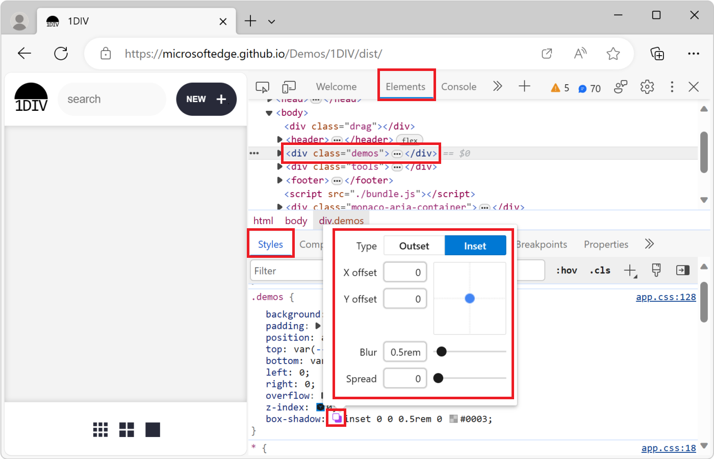

1. Change the shadow properties, as follows:

   | Property | How to change |
   |---|---|
   | **Type** | Select **Outset** or **Inset**.  Only for `box-shadow`. |
   | **X offset** | Specify a value in the text box, or drag the blue dot. |
   | **Y offset** | Specify a value in the text box, or drag the blue dot. |
   | **Blur** | Specify a value in the text box, or drag the slider. |
   | **Spread** | Specify a value in the text box, or drag the slider.  Only for `box-shadow`. |
   <!-- todo: explain the meaning of each property, not only how to change the value.  change column heading to:
   | Property | Description |
   | Property | Description and how to change |
   -->

   The changes are applied to the element in the rendered webpage in real time:

   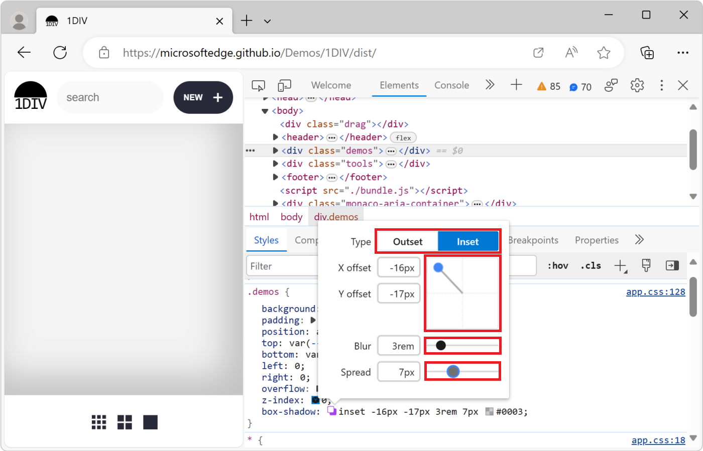


<!-- ------------------------------ -->
#### Edit animation and transition timings with the Easing Editor
<!-- https://developer.chrome.com/docs/devtools/css/reference/#edit-easing -->

Use the **Easing Editor** to change the value of the [animation-timing-function](https://developer.mozilla.org/docs/Web/CSS/animation-timing-function) or [transition-timing-function](https://developer.mozilla.org/docs/Web/CSS/transition-timing-function) property on an HTML element:

1. [Select an element](#select-an-element) that has a CSS animation or transition applied.

   For example, open the [animated property demo page](https://microsoftedge.github.io/Demos/devtools-animated-property-issue/) in a new tab or window, right-click the page and select **Inspect** to open DevTools, and then in the **Elements** tool, press **Ctrl+F** and find "spinner", and then select the `<div class="spinner">` element.

   The red and green boxes on this demo page are two different CSS animations. Both animations run with CSS by using the `animation` CSS property, and define an `ease-in-out` timing function.

1. In the **Styles** pane, find the `animation` declaration in the `.bad .spinner` CSS rule, and click the **Open cubic bezier editor** () button.

   The **Easing Editor** opens:

   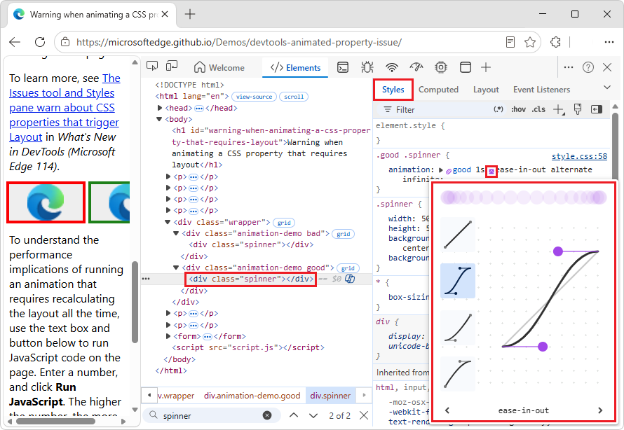

1. Change the properties of the animation timing function:

   * Choose one of the pre-defined timing functions from the list.
   * Create your own timing function by dragging the cubic-bezier curve handles.

   The changes are applied to the element in the rendered webpage in real time:

   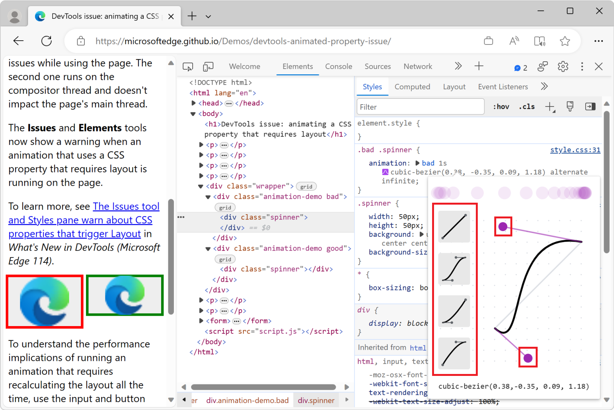


<!-- ------------------------------ -->
#### Use presets to adjust timings
<!-- https://developer.chrome.com/docs/devtools/css/reference/#presets -->

<!-- todo: format, link, pngs -->

Use presets to adjust timings
To adjust timings with a click, use the presets in the Easing Editor:

In the Easing Editor, to set a keyword value, click one of the picker buttons:
linear The linear button.
ease-in-out The ease-in-out button.
ease-in The ease-in button.
ease-out The ease-out button.
In the Presets switcher, click Left. or Right. buttons to pick one of the following presets:

Linear presets: elastic, bounce, or emphasized.
Cubic Bezier presets:

<!-- table: -->
Timing keyword   Preset   Cubic Bezier

<!-- row, or 5 rows: -->
ease-in-out   In Out, Sine   cubic-bezier(0.45, 0.05, 0.55, 0.95)
In Out, Quadratic   cubic-bezier(0.46, 0.03, 0.52, 0.96)
In Out, Cubic   cubic-bezier(0.65, 0.05, 0.36, 1)
Fast Out, Slow In   cubic-bezier(0.4, 0, 0.2, 1)
In Out, Back   cubic-bezier(0.68, -0.55, 0.27, 1.55)

<!-- row, or 5 rows: -->
ease-in   In, Sine   cubic-bezier(0.47, 0, 0.75, 0.72)
In, Quadratic   cubic-bezier(0.55, 0.09, 0.68, 0.53)
In, Cubic   cubic-bezier(0.55, 0.06, 0.68, 0.19)
In, Back   cubic-bezier(0.6, -0.28, 0.74, 0.05)
Fast Out, Linear In   cubic-bezier(0.4, 0, 1, 1)

<!-- row, or 5 rows: -->
ease-out   Out, Sine   cubic-bezier(0.39, 0.58, 0.57, 1)
Out, Quadratic   cubic-bezier(0.25, 0.46, 0.45, 0.94)
Out, Cubic   cubic-bezier(0.22, 0.61, 0.36, 1)
Linear Out, Slow In   cubic-bezier(0, 0, 0.2, 1)
Out, Back   cubic-bezier(0.18, 0.89, 0.32, 1.28)


<!-- ------------------------------ -->
#### Configure custom timings
<!-- https://developer.chrome.com/docs/devtools/css/reference/#custom-timings -->

<!-- todo: format, link, pngs -->

To set custom values for timing functions, use the control points on the lines:

For linear functions, click anywhere on the line to add a control point and drag it. Double-click to remove the point.

Dragging a control point of a linear function.

For Cubic Bezier functions, drag one of the control points.

Dragging the control points of a Cubic Bezier function.

Any change triggers a ball animation in the Preview at the top of editor.


<!-- ====================================================================== -->
## Copy CSS changes
<!-- https://developer.chrome.com/docs/devtools/css/reference/#copy-css-changes -->

<!-- todo: format, link, pngs -->

The **Styles** tab in the **Elements** tool highlights your CSS changes in green.

To copy a single CSS declaration change:

* Hover over the highlighted declaration and click the [todo: Copy icon] **Copy** button:

   todo

To copy all CSS changes across declarations at once:

* Right-click on any declaration and then select **Copy all CSS changes**:

    todo

You can additionally track changes that you make, by using the **Changes** tool.  See [Changes: Track your HTML, CSS, and JavaScript changes](https://developer.chrome.com/docs/devtools/changes).


<!-- ====================================================================== -->
## See also

Demos repo:
* [To Do app](https://microsoftedge.github.io/Demos/demo-to-do/)
   * [/demo-to-do/](https://github.com/MicrosoftEdge/Demos/tree/main/demo-to-do/) - Readme and source code.
* [1DIV](https://microsoftedge.github.io/Demos/1DIV/dist/) - Window Controls Overlay demo.
   * [/1DIV/](https://github.com/MicrosoftEdge/Demos/tree/main/1DIV/) - Readme and source code.
* [Animated CSS Property demo](https://microsoftedge.github.io/Demos/devtools-animated-property-issue/)
   * [/devtools-animated-property-issue/](https://github.com/MicrosoftEdge/Demos/tree/main/devtools-animated-property-issue/) - Readme and source code.


<!-- ====================================================================== -->
> [!NOTE]
> Portions of this page are modifications based on work created and [shared by Google](https://developers.google.com/terms/site-policies) and used according to terms described in the [Creative Commons Attribution 4.0 International License](https://creativecommons.org/licenses/by/4.0).
> The original page is found [here](https://developer.chrome.com/docs/devtools/css/reference/) and is authored by Kayce Basques.

[](https://creativecommons.org/licenses/by/4.0)
This work is licensed under a [Creative Commons Attribution 4.0 International License](https://creativecommons.org/licenses/by/4.0).
