<!-- Copyright Kayce Basques

   Licensed under the Apache License, Version 2.0 (the "License");
   you may not use this file except in compliance with the License.
   You may obtain a copy of the License at

       https://www.apache.org/licenses/LICENSE-2.0

   Unless required by applicable law or agreed to in writing, software
   distributed under the License is distributed on an "AS IS" BASIS,
   WITHOUT WARRANTIES OR CONDITIONS OF ANY KIND, either express or implied.
   See the License for the specific language governing permissions and
   limitations under the License.  -->
# CSS features reference
<!-- https://developer.chrome.com/docs/devtools/css/reference/ -->

_todolink: clean up incoming links; change from https://developer.chrome.com/docs/ links to local links_

_todopng: the remaining incoming CodePen demos or other demos' screenshots: create Demos repo sample/dir_

Discover new workflows in the following comprehensive reference of Microsoft Edge DevTools features related to viewing and changing CSS.

To learn the basics, see [Get started viewing and changing CSS](../css/index.md).

**Detailed contents:**<!-- https://github.com/captainbrosset/WebToc -->
* [Select an element](#select-an-element)
* [View CSS](#view-css)
   * [Navigate with links](#navigate-with-links)
   * [View tooltips with CSS documentation, specificity, and custom property values](#view-tooltips-with-css-documentation-specificity-and-custom-property-values)
      * [View CSS documentation](#view-css-documentation)
      * [View selector specificity](#view-selector-specificity)
      * [View the values of custom properties](#view-the-values-of-custom-properties)
   * [View the external stylesheet where a rule is defined](#view-the-external-stylesheet-where-a-rule-is-defined)
   * [View invalid, overridden, inactive, and other CSS](#view-invalid-overridden-inactive-and-other-css)
   * [View only the CSS that is actually applied to an element](#view-only-the-css-that-is-actually-applied-to-an-element)
   * [View CSS properties in alphabetical order](#view-css-properties-in-alphabetical-order)
   * [View inherited CSS properties](#view-inherited-css-properties)
   * [View CSS at-rules](#view-css-at-rules)
      * [View `@property` at-rules](#view-property-at-rules)
      * [View `@supports` at-rules](#view-supports-at-rules)
      * [View `@scope` at-rules](#view-scope-at-rules)
      * [View `@font-palette-values` at-rules](#view-font-palette-values-at-rules)
      * [View `@position-try` at-rules](#view-position-try-at-rules)
   * [View an element's box model](#view-an-elements-box-model)
   * [Search and filter the CSS of an element](#search-and-filter-the-css-of-an-element)
   * [Emulate a focused page](#emulate-a-focused-page)
   * [Toggle a pseudo-class](#toggle-a-pseudo-class)
   * [View inherited highlight pseudo-elements](#view-inherited-highlight-pseudo-elements)
   * [View cascade layers](#view-cascade-layers)
   * [View a page in print mode](#view-a-page-in-print-mode)
   * [View used and unused CSS with the Coverage tool](#view-used-and-unused-css-with-the-coverage-tool)
   * [Force print preview mode](#force-print-preview-mode)
* [Copy CSS](#copy-css)
* [Change CSS](#change-css)
   * [Two ways to add a CSS declaration to an element](#two-ways-to-add-a-css-declaration-to-an-element)
      * [Adding an inline CSS declaration to an element](#adding-an-inline-css-declaration-to-an-element)
      * [Adding a CSS declaration to an existing style rule](#adding-a-css-declaration-to-an-existing-style-rule)
   * [Change a declaration name or value](#change-a-declaration-name-or-value)
   * [Change enumerable values with keyboard shortcuts](#change-enumerable-values-with-keyboard-shortcuts)
   * [Change length values](#change-length-values)
   * [Increment numerical declaration values](#increment-numerical-declaration-values)
   * [Add a class to an element](#add-a-class-to-an-element)
   * [Emulate light and dark theme preferences and enable automatic dark mode](#emulate-light-and-dark-theme-preferences-and-enable-automatic-dark-mode)
   * [Toggle a class](#toggle-a-class)
   * [Add a style rule](#add-a-style-rule)
      * [Select a stylesheet to add a rule to](#select-a-stylesheet-to-add-a-rule-to)
      * [Add a style rule to a specific location](#add-a-style-rule-to-a-specific-location)
   * [Toggle a declaration](#toggle-a-declaration)
   * [Edit the `::view-transition` pseudo-elements during an animation](#edit-the-view-transition-pseudo-elements-during-an-animation)
   * [Align grid items and their content with the Grid Editor](#align-grid-items-and-their-content-with-the-grid-editor)
   * [Change colors with the Color Picker](#change-colors-with-the-color-picker)
   * [Sample a color off the page with the Eyedropper](#sample-a-color-off-the-page-with-the-eyedropper)
   * [Change angle value with the Angle Clock](#change-angle-value-with-the-angle-clock)
   * [Change box and text shadows with the Shadow Editor](#change-box-and-text-shadows-with-the-shadow-editor)
   * [Edit animation and transition timings with the Easing Editor](#edit-animation-and-transition-timings-with-the-easing-editor)
      * [Use presets to adjust timings](#use-presets-to-adjust-timings)
      * [Configure custom timings](#configure-custom-timings)
* [Copy CSS changes](#copy-css-changes)
* [See also](#see-also)


<!-- ====================================================================== -->
## Select an element
<!-- https://developer.chrome.com/docs/devtools/css/reference/#select -->

The **Elements** tool in DevTools lets you view or change the CSS of one element at a time.  The selected element is highlighted in the **DOM Tree**.  The styles of the element are shown in the **Styles** pane.  For a tutorial, see [View the CSS for an element](../css/index.md#view-the-css-for-an-element).

In the following figure, the `h1` element that is highlighted in the **DOM Tree** is the selected element.  On the right, the styles of the element are shown in the **Styles** pane.  On the left, the element is highlighted in the viewport, but only because the mouse is currently hovering over it in the **DOM Tree**:


There are many ways to select an element:

*  In a rendered webpage, right-click a page element, and then click **Inspect**.

*  In DevTools, click **Select an element** () or press **Ctrl+Shift+C** (Windows, Linux) or **Command+Shift+C** (macOS), and then click the element in the viewport.

*  In DevTools, click the element in the **DOM Tree**.

*  In DevTools, run a query such as `document.querySelector('p')` in the **Console**, right-click the result, and then select **Reveal in Elements panel**.


<!-- ====================================================================== -->
## View CSS
<!-- https://developer.chrome.com/docs/devtools/css/reference/#view -->

Use the **Elements** > **Styles** and **Computed** tabs to view CSS rules and diagnose CSS issues.


<!-- ------------------------------ -->
#### Navigate with links
<!-- https://developer.chrome.com/docs/devtools/css/reference/#links -->

The **Styles** tab displays links in various places to various other places, including but not limited to:

* Next to CSS rules, to style sheets and CSS sources.  Such links open the **Sources** tool.  If the style sheet is minified, see [Reformat a minified JavaScript file with pretty-print](../javascript/reference.md#reformat-a-minified-javascript-file-with-pretty-print) in _JavaScript debugging features_.

* In the **Inherited from** sections, to parent elements.

* In `var()` calls, to custom property declarations.  See [Using CSS custom properties (variables)](https://developer.mozilla.org/docs/Web/CSS/Using_CSS_custom_properties) at MDN.

* In `animation` shorthand properties, to `@keyframes`.

* **Learn more** links in documentation tooltips.

Links may be styled differently.  If you're not sure if something is a link, try clicking it to find out.

For example:

1. Go to [To Do app](https://microsoftedge.github.io/Demos/demo-to-do/) in a new window or tab.

1. Right-click white space above the string "Add a task", and then click **Inspect**.

   DevTools opens, with the **Elements** tool selected.

1. Select the **Styles** tab.

   Various types of links are displayed:

   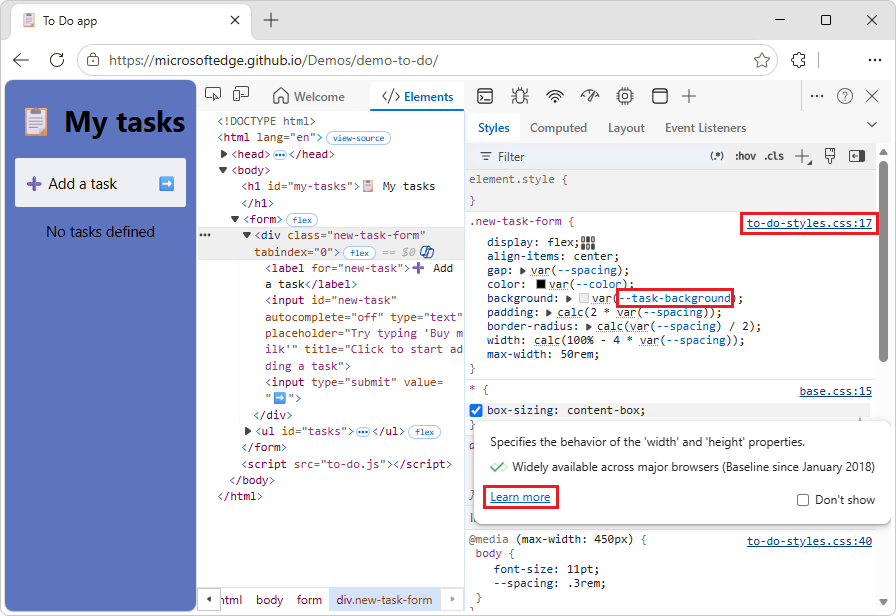


<!-- ------------------------------ -->
#### View tooltips with CSS documentation, specificity, and custom property values
<!-- https://developer.chrome.com/docs/devtools/css/reference/#tooltips -->

In the **Elements** tool, the **Styles** tab shows tooltips with useful information when you hover over specific elements.


<!-- ---------- -->
###### View CSS documentation
<!-- https://developer.chrome.com/docs/devtools/css/reference/#view-docs -->

To display the description of a CSS property, in a tooltip:

1. Go to a webpage, such as [To Do app](https://microsoftedge.github.io/Demos/demo-to-do/), in a new window or tab.

1. Right-click white space above the string "Add a task", and then click **Inspect**.

   DevTools opens, with the **Elements** tool selected.

1. Select the **Styles** tab.

1. Hover over a CSS property name, such as `padding:`.

   A tooltip is displayed:

   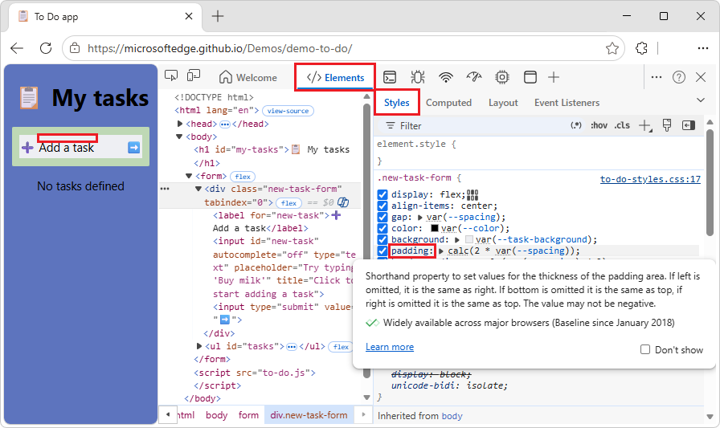

   DevTools pulls the descriptions for tooltips from the [VS Code Custom Data](https://github.com/microsoft/vscode-custom-data) repo.

1. In the tooltip, click the **Learn more** link.

   The CSS reference page for the property at MDN is displayed, such as [padding CSS property](https://developer.mozilla.org/docs/Web/CSS/Reference/Properties/padding).


To turn the CSS tooltips off:

* In the tooltip, select the **Don't show** checkbox.


To turn CSS tooltips on again:

1. In DevTools, select **Customize and control DevTools**, and then select **Settings**.

1. In the outline on the left, select **Preferences**, and then scroll down to the **Elements** section.

1. Select the **Show CSS documentation tooltip** checkbox.


<!-- ---------- -->
###### View selector specificity
<!-- https://developer.chrome.com/docs/devtools/css/reference/#selector-specificity -->

Hover over a CSS selector, to display a tooltip that shows the selector's specificity weight, such as: **Specificity: (0,0,1)**:

For example:

1. Go to a webpage, such as [To Do app](https://microsoftedge.github.io/Demos/demo-to-do/), in a new window or tab.

1. Right-click the webpage, and then click **Inspect**.

   DevTools opens, with the **Elements** tool selected.

1. In the DOM tree, select the `<body>` element.

1. In the **Styles** tab, hover over the `body` CSS selector.

   A tooltip is displayed, showing **Specificity: (0,0,1)**:

   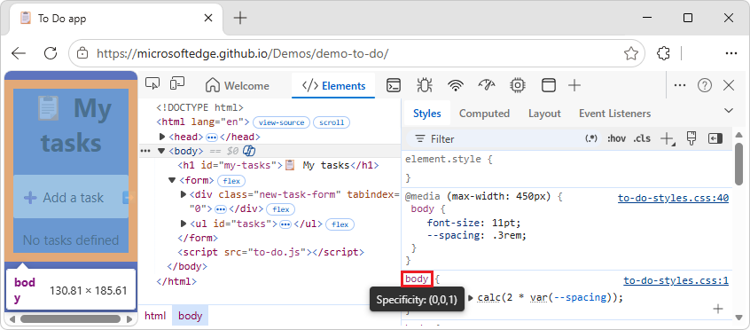

See also:
* [Specificity](https://developer.mozilla.org/docs/Web/CSS/Specificity) - MDN.


<!-- ---------- -->
###### View the values of custom properties
<!-- https://developer.chrome.com/docs/devtools/css/reference/#custom-css -->

Hover over a `--custom-property` to see its value in a tooltip.

For example:

1. Go to a webpage, such as [To Do app](https://microsoftedge.github.io/Demos/demo-to-do/), in a new window or tab.

1. Right-click the webpage, and then click **Inspect**.

   DevTools opens, with the **Elements** tool selected.

1. In the DOM tree, select the `<body>` element.

1. In the **Styles** tab, in the `body` CSS rule, hover over `--spacing`.

   The value `.3rem` is displayed in a tooltip:

   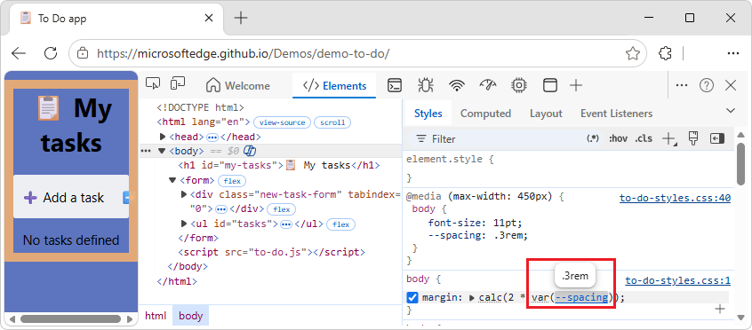

See also:
* [Custom properties (--*): CSS variables](https://developer.mozilla.org/docs/Web/CSS/--*) - MDN.


<!-- ------------------------------ -->
#### View the external stylesheet where a rule is defined
<!-- not upstream -->

In the **Styles** pane, click the link next to a CSS rule to open the external stylesheet that defines the rule.  The stylesheet opens in the **Editor** pane of the **Sources** tool.

If the stylesheet is minified, click the **Format** () button, at the bottom of the **Editor** pane.  For more information, see [Reformat a minified JavaScript file with pretty-print](../javascript/reference.md#reformat-a-minified-javascript-file-with-pretty-print).

In the following figure, after you click
`https://learn.microsoft.com/_themes/docs.theme/master/en-us/_themes/styles/b66bc881.site-ltr.css:2`<!-- :2 at end causes not to work. --><!--keep /en-us--> you are taken to line 2 of
`https://learn.microsoft.com/_themes/docs.theme/master/_themes/styles/b66bc881.site-ltr.css`, where the `.content h1:first-of-type` CSS rule is defined.<!-- /master/ works but lines concated.  /main/ doesn't work -->


<!-- ------------------------------ -->
#### View invalid, overridden, inactive, and other CSS
<!-- https://developer.chrome.com/docs/devtools/css/reference/#css-issues -->

The **Styles** tab recognizes many kinds of CSS issues and highlights them in different ways.

See:
* [Understand CSS in the Styles tab](https://developer.chrome.com/docs/devtools/css/issues#css-in-styles) in _Find invalid, overridden, inactive, and other CSS_ in Chrome docs.  _todolink: local link not found_


<!-- ------------------------------ -->
#### View only the CSS that is actually applied to an element
<!-- https://developer.chrome.com/docs/devtools/css/reference/#computed -->

The **Styles** pane shows you all of the rules that apply to an element, including declarations that have been overridden.  When you aren't interested in overridden declarations, use the **Computed** pane to view only the CSS that is actually being applied to an element.

For example:

1. Go to a webpage, such as [To Do app](https://microsoftedge.github.io/Demos/demo-to-do/), in a new window or tab.

1. Right-click the heading **My tasks**, and then click **Inspect**.

   DevTools opens, with the **Elements** tool selected, with the `<h1>` element selected in the DOM tree.

1. In the **Elements** tool, select the **Computed** tab.

   The CSS properties that are applied to the selected element are displayed:

   

   A property name and value in italics indicates a value that's calculated at runtime.

1. To display all properties, select the **Show all** checkbox.

See:
* [Understand CSS in the Computed tab](https://developer.chrome.com/docs/devtools/css/issues#css-in-computed) in _Find invalid, overridden, inactive, and other CSS_ in Chrome docs.  _todolink: local link not found_


<!-- ------------------------------ -->
#### View CSS properties in alphabetical order
<!-- https://developer.chrome.com/docs/devtools/css/reference/#alphabetical -->

Use the **Computed** pane.  See [View only the CSS that is actually applied to an element](#view-only-the-css-that-is-actually-applied-to-an-element).


<!-- ------------------------------ -->
#### View inherited CSS properties
<!-- https://developer.chrome.com/docs/devtools/css/reference/#inherited -->

Check the **Show All** checkbox in the **Computed** pane.  See [View only the CSS that is actually applied to an element](#view-only-the-css-that-is-actually-applied-to-an-element).


<!-- ------------------------------ -->
#### View CSS at-rules
<!-- https://developer.chrome.com/docs/devtools/css/reference/#at-rules -->

At-rules are CSS statements that let you control CSS behavior.

In the **Elements** tool, the **Styles** tab shows the following at-rules in dedicated sections:

* `@property` - see [View `@property` at-rules](#view-property-at-rules), below.
* `@supports` - see [View `@supports` at-rules](#view-supports-at-rules), below.
* `@scope` - see [View `@scope` at-rules](#view-scope-at-rules), below.
* `@font-palette-values` - see [View `@font-palette-values` at-rules](#view-font-palette-values-at-rules), below.
* `@position-try` - see [View `@position-try` at-rules](#view-position-try-at-rules), below.


<!-- ---------- -->
###### View `@property` at-rules
<!-- https://developer.chrome.com/docs/devtools/css/reference/#property -->

The `@property` CSS at-rule lets you define CSS custom properties explicitly and register them in a style sheet without running any JavaScript.

Hover over the name of such a property in the **Styles** tab, to see a tooltip that contains:
* The property's value, such as `20%`.
* The property's descriptors, such as: `initial value: 40%`
* A **View registered property** link to its registration in the collapsible `@property` section at the bottom of the **Styles** tab.

For example:

_todo: maybe replace this code that's from `https://developer.mozilla.org/en-US/docs/Web/CSS/Reference/Properties/--*#basic_example`_

1. Go to a page that uses the `@property` at-rule, such as [View `@property` at-rules](https://microsoftedge.github.io/Demos/at-rules-property/), in a new window or tab.

1. Right-click the **Item three** paragraph, and then click **Inspect**.

   DevTools opens, with the **Elements** tool selected.

1. In the **Styles** tab, hover over the name of a CSS custom property that's defined by the `@property` CSS at-rule:

   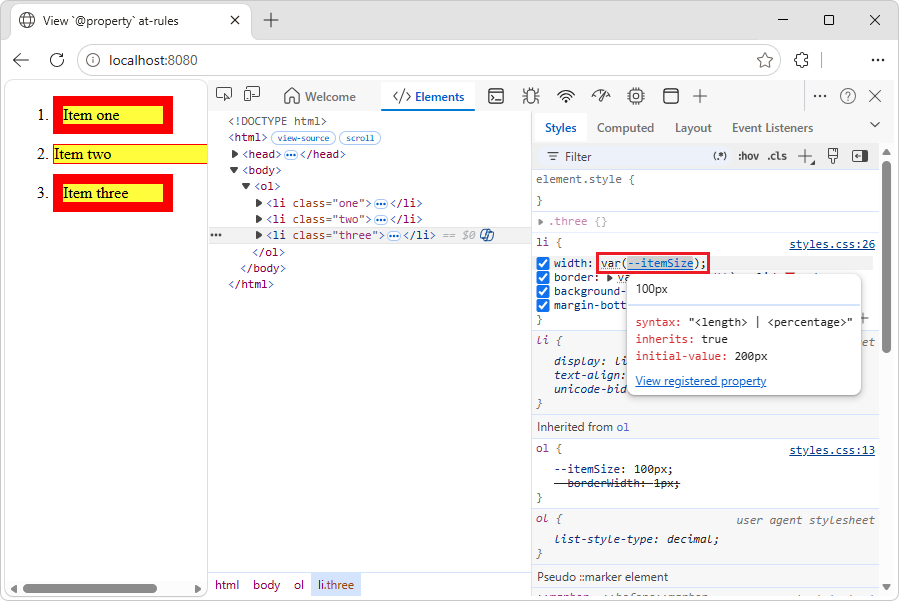

   The tooltip contains:
   * The property's value, such as `100px`.
   * The property's descriptors, such as initial value.
   * A **View registered property** link.

1. Click the **View registered property** link.

   The expanded **@property** section is displayed, further down in the **Styles** tab:

   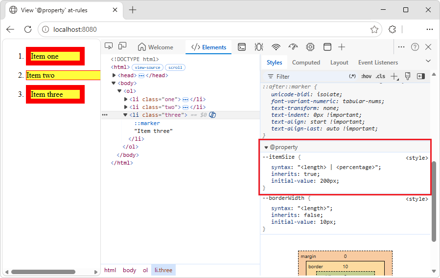

To edit an `@property` rule, double-click its name or value.  See [Change a declaration name or value](#change-a-declaration-name-or-value), below.

See also:
* [@property: giving superpowers to CSS variables](https://web.dev/articles/at-property) at Web.dev.
* [Custom properties (--*): CSS variables](https://developer.mozilla.org/docs/Web/CSS/Reference/Properties/--*) at MDN.


<!-- ---------- -->
###### View `@supports` at-rules
<!-- https://developer.chrome.com/docs/devtools/css/reference/#supports -->

The **Styles** tab shows you the `@supports` CSS at-rules, if they are applied to an element.

For example, to view the `@supports` rule:

1. In a new window or tab, go to a page that uses the `@supports` at-rule, such as [View `@supports` at-rules](https://microsoftedge.github.io/Demos/at-rules-supports/):

   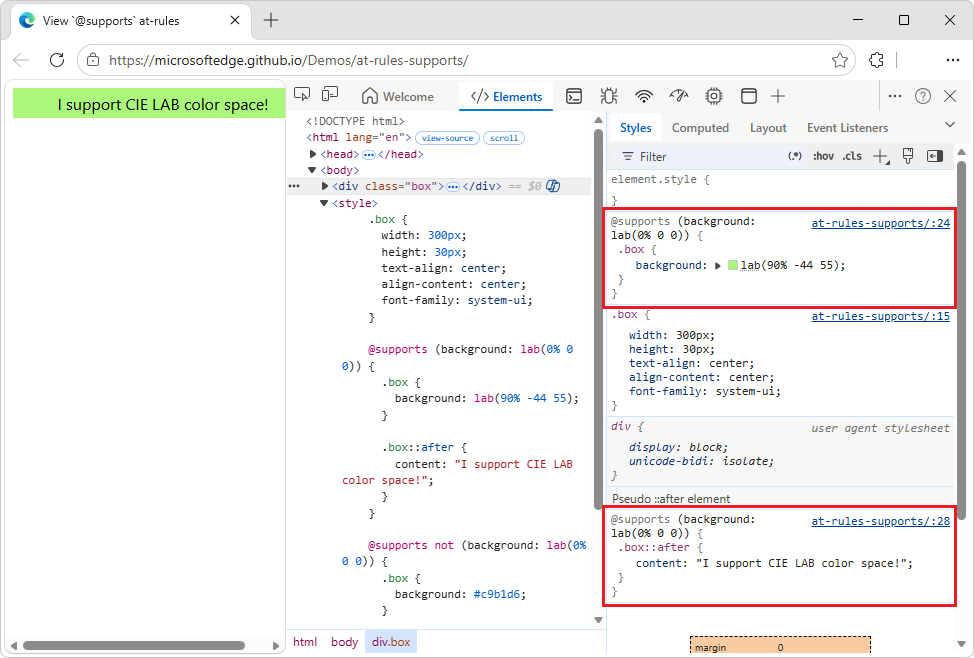

   _todopng: address bar in png should show https://microsoftedge.github.io/Demos/at-rules-supports/ not localhost:8080_

* If your browser supports the `lab()` function, the element is green.

* If your browser doesn't support the `lab()` function, the element is purple.

To see which browser versions support the CIE LAB color space, [search Caniuse.com for "lab"](https://caniuse.com/?search=lab).


<!-- ---------- -->
###### View `@scope` at-rules
<!-- https://developer.chrome.com/docs/devtools/css/reference/#scope -->

The **Styles** tab displays CSS @scope at-rules if they are applied to an element.

See also:
* [Scoping Styles: the @scope rule](https://drafts.csswg.org/css-cascade-6/#scope-atrule) at W3C.

The `@scope` at-rules are a part of the [CSS Cascading and Inheritance Module Level 6](https://drafts.csswg.org/css-cascade-6/) specification at W3C.  These rules allow you to scope CSS styles; that is, explicitly apply styles to specific elements.

To view the `@scope` rule:

1. In a new window or tab, go to `edge://flags/#enable-experimental-web-platform-features`, and then enable the **Experimental Web Platform features** flag.

1. In a new window or tab, go to a page that uses the `@scope` at-rule, such as the [View `@scope` at-rules](https://microsoftedge.github.io/Demos/at-rules-scope/) demo:

   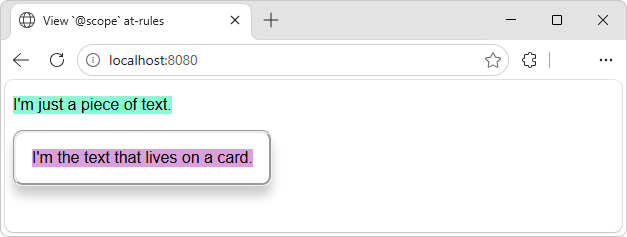

1. Right-click "I'm the text that lives on a card", and then select **Inspect**.

   DevTools opens, with the **Elements** tool selected.

1. Select the **Styles** tab.

1. Examine the `@scope` rule:

   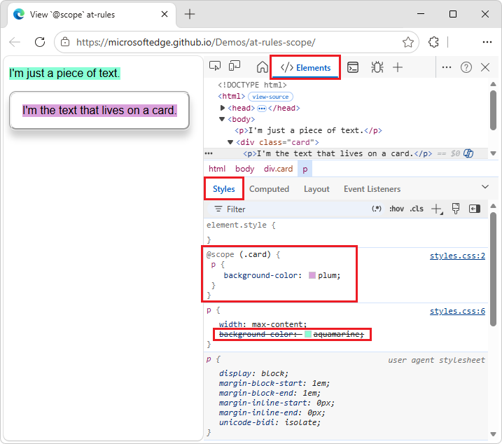

   In this example, the `@scope` rule (background color = plum) overrides the global CSS `background-color` declaration (aquamarine), for any `<p>` element that's inside an element (such as a `<div>`) that has a `card` class.

   From `index.html`:

   ```html
   <p>I'm just a piece of text.</p>
   <div class="card">
     <p>I'm the text that lives on a card.</p>
   </div>
   ```
   
   From `styles.css`:
   
   ```css
   @scope (.card) {
     p {
       background-color: plum;
     }
   }
   p {
     width: max-content;
     background-color: aquamarine;
   }
   .card {
     box-shadow: 0 10px 10px 0 rgba(0,0,0,0.2);
     border-style: groove;
     transition: 0.3s;
     border-radius: 10px;
     padding: 0px 16px;
   }
   ```

   To edit the `@scope` rule, you double-click in the rule:

1. In the **Styles** tab, double-click **plum**, press **Delete**, and then select **beige**.

   The text in the card in the demo webpage changes from plum background to beige background.

1. Cleanup: In a new window or tab, go to `edge://flags/#enable-experimental-web-platform-features`, and then disable the **Experimental Web Platform features** flag.


<!-- ---------- -->
###### View `@font-palette-values` at-rules
<!-- https://developer.chrome.com/docs/devtools/css/reference/#font-palette-values -->

The [@font-palette-values CSS at-rule](https://developer.mozilla.org/docs/Web/CSS/@font-palette-values) lets you customize (override) the default values of the `font-palette` property.  In the **Elements** tool, the **Styles** tab shows this at-rule in a dedicated section.

To view the `@font-palette-values` CSS rule:

1. In a new window or tab, go to `edge://flags/#enable-experimental-web-platform-features`, and then enable the **Experimental Web Platform features** flag.

1. In a new window or tab, go to a page that uses the `@font-palette-values` at-rule, such as the [View `@font-palette-values` at-rules](https://microsoftedge.github.io/Demos/at-rules-font-palette-values/) demo:

   _todo: the demo uses google font https://fonts.googleapis.com/css2?family=Foldit:wght@700_

   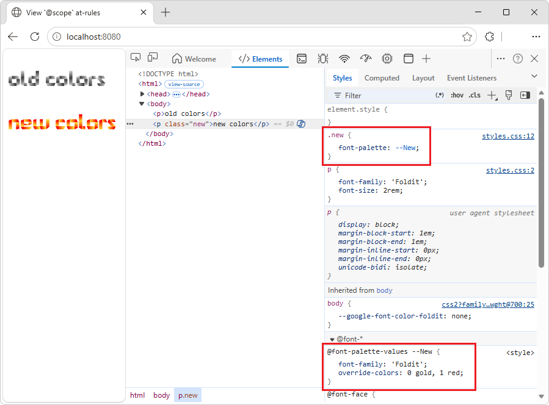

   _todopng: create the above png_

1. Right-click "new colors", and then select **Inspect**.

   DevTools opens, with the **Elements** tool selected.

1. In the **Styles** tab, find the `@font-palette-values` CSS rule:

   

   _todopng: fix tab title & localhost in Address bar_

   In this example, the `--New` font palette values override the default values of the colored font.

   To edit a custom value, double-click it, as follows:

1. In the `@font-palette-values` CSS rule, in the `override-colors` property, double-click `0 gold, 1 red`, and enter `0 blue, 1 red`.

   In the inspected webpage, "new colors" is rendered as blue and red.


<!-- ---------- -->
###### View `@position-try` at-rules
<!-- https://developer.chrome.com/docs/devtools/css/reference/#filter -->
<!-- upstream: the imported codepen code changed from using position-try-options to instead using position-try-fallbacks, but upstream article still says & shows position-try-options -->

_todo: when open these 5 at-rules samples, Console shows error: GET http://localhost:8080/favicon.ico 404 (Not Found), have to Clear Console to make screenshots_

The `@position-try` CSS rule along with the `position-try-fallbacks` property lets you define alternative anchor positions for elements.

In the **Elements** tool, the **Styles** tab resolves and links the following:

* The `position-try-fallbacks` property values (or `position-try-options` property values) link to a dedicated `@position-try --name` CSS rule section.

* The `position-anchor` property values and `anchor()` arguments link to the corresponding elements that have `popovertarget` attributes.

For example, inspect the `position-try-fallbacks` values and `@position-try` CSS rules, as follows:

1. In a new window or tab, go to a page that uses the  `position-try-fallbacks` values and `@position-try` at-rule, such as the [View `@position-try` at-rules](https://microsoftedge.github.io/Demos/at-rules-position-try/) demo:

   _todo: uses a google font, `https://fonts.googleapis.com/css2?family=Foldit:wght@700`_ 

1. In the rendered webpage, open the submenu; that is, click **YOUR ACCOUNT**, and then click **STOREFRONT**.

   The submenu is displayed, showing a list of commands: **LISTINGS**, **SPECIAL OFFERS**, **SIGN OUT**.

1. In the submenu, right-click above **LISTINGS**, and then select **Inspect**.

   DevTools opens, with the **Elements** tool selected.  The submenu element `<ul id="submenu">` is selected in the DOM tree:

   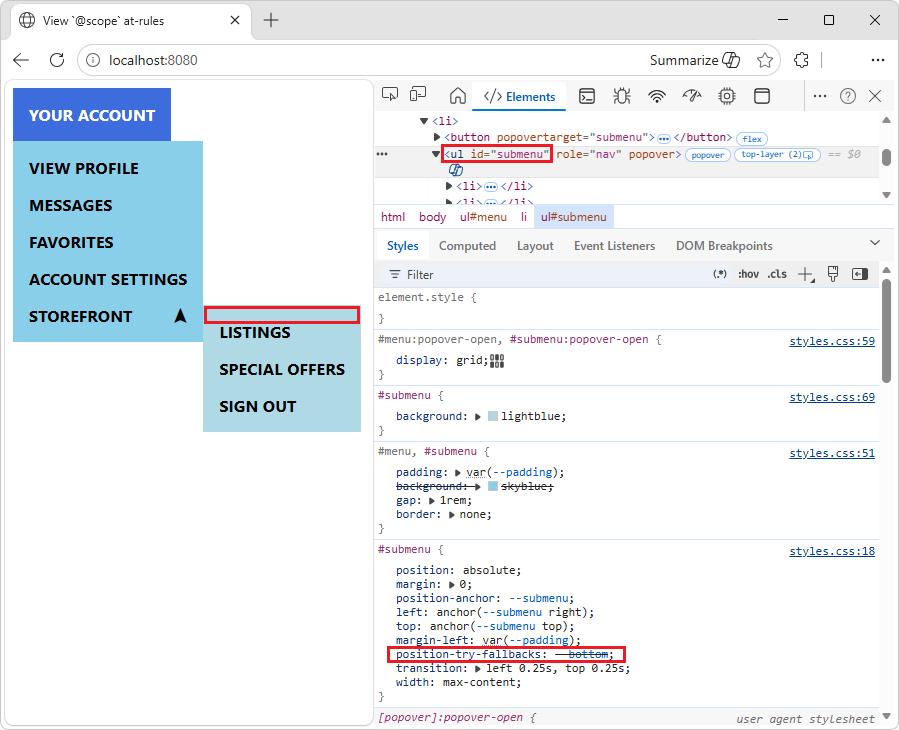

   _todopng: fix tab title and Addr bar_

1. In the DOM tree, select the `<ul id="submenu">` element.

1. In the **Styles** tab, in the `#submenu` CSS rule, find the `position-try-fallbacks` property, and click its `--bottom` value.

   _todo: devtools bug? hovering any --submenu value skips back & forth showing layout or not_

   The **Styles** tab scrolls down to the corresponding `@position-try` section:

   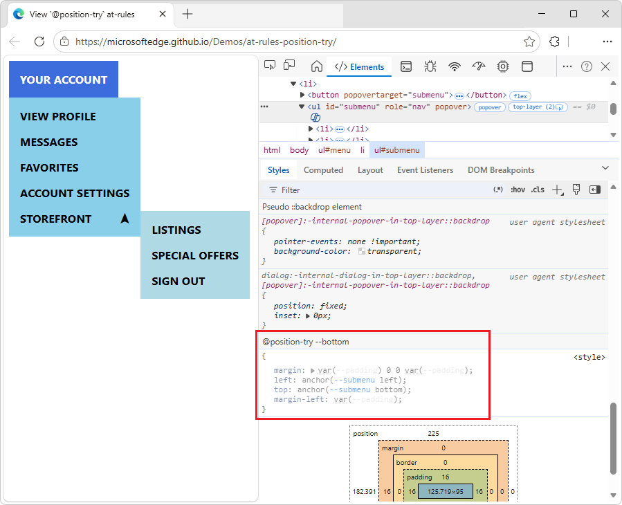

1. In the **Styles** tab, in the `#submenu` CSS rule, click the `--submenu` link in any of the following properties:

   ```css
   position-anchor: --submenu;
   left: anchor(--submenu right);
   top: anchor(--submenu top);
   ```

   The DOM tree selects the element (`<button popovertarget="submenu">`) that has the corresponding `popovertarget` attribute value (`popovertarget="submenu"`), and the **Styles** tab shows the element's CSS:

   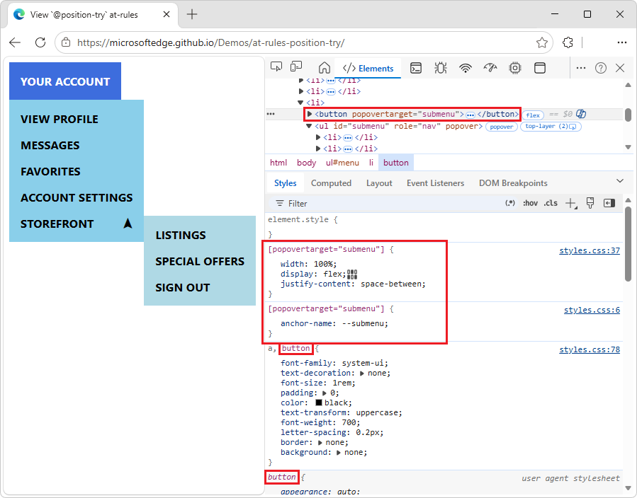

To edit a value, double-click the value.

See also:
* [The @position-try Rule](https://www.w3.org/TR/css-anchor-position-1/#fallback-rule) in _CSS Anchor Positioning Module Level 1_ at w3.org.
* [Introducing the CSS anchor positioning API](https://developer.chrome.com/blog/anchor-positioning-api)  _todolink: non-Chrome link_


<!-- ------------------------------ -->
#### View an element's box model
<!-- https://developer.chrome.com/docs/devtools/css/reference/#box-model -->

To view [the box model](https://developer.mozilla.org/docs/Learn/CSS/Introduction_to_CSS/Box_model) of an element, go to the **Styles** pane.  If your DevTools window is narrow, the **Box Model** diagram is at the bottom of the panel.

To change a value, double-click it.

In the following figure, the **Box Model** diagram in the **Styles** pane shows the box model for the currently selected `h1` element.


<!-- ------------------------------ -->
#### Search and filter the CSS of an element
<!-- Search and filter an element's CSS  https://developer.chrome.com/docs/devtools/css/reference/#filter -->

Use the **Filter** text box on the **Styles** and **Computed** panes to search for specific CSS properties or values.

To also search inherited properties in the **Computed** pane, check the **Show All** checkbox.

In the following figure, the **Styles** pane is filtered to only show rules that include the search query `color`.


In the following figure, the **Computed** pane is filtered to only show declarations that include the search query `100%`.


<!-- ------------------------------ -->
#### Emulate a focused page
<!-- https://developer.chrome.com/docs/devtools/css/reference/#focus -->

If you switch focus from the inspected webpage to DevTools, some overlay elements automatically hide, if they are triggered by focus.  For example:
* Dropdown lists.
* Menus.
* Date pickers.

To debug such an element as if the page has focus, do either of the following:
* In the **Elements** tool, in the **Styles** tab, click `:hov` (**Toggle Element State**), and then select the **Emulate a focused page** checkbox.
* In the **Rendering** tool, select the **Emulate a focused page** checkbox.

**Caution:** When this option is on, the `document.visibilityState` is set to `visible` and the `visibilitychange` event doesn't fire.  See [Page Visibility API](https://developer.mozilla.org/docs/Web/API/Page_Visibility_API) at MDN.

To try emulating a focused page:

1. Go to [disappearing-pop-up](https://jec.fish/demo/disappearing-pop-up) (at jec.fish) in a new window or tab.

   _todo: sample in Demos repo?  PR 135: new dir started: \Demos\focus\index.html_

1. Click the input text box, or press **Tab** to focus it.

   Another element appears under the input text box, saying "disappearing popup - try to inspect & debug me in DevTools."

1. Right-click the input text box, and then select **Inspect**.

   DevTools opens, and the "disappearing popup" element disappears.  The DevTools window is now in focus, instead of the inspected webpage, so the "disappearing popup" element disappears.

1. In the **Elements** tool, in the **Styles** tab, click `:hov` (**Toggle Element State**), and then select the **Emulate a focused page** checkbox.

1. Make sure the input text box element `<input id="query" type="text">` is still selected.

   Under the input text box, the element reappears, saying "disappearing popup - try to inspect & debug me in DevTools."

   You can now inspect and debug (in the **Sources** tool) the "disappearing popup" element that's below the input text box, even though DevTools, rather than the inspected page, has focus:

   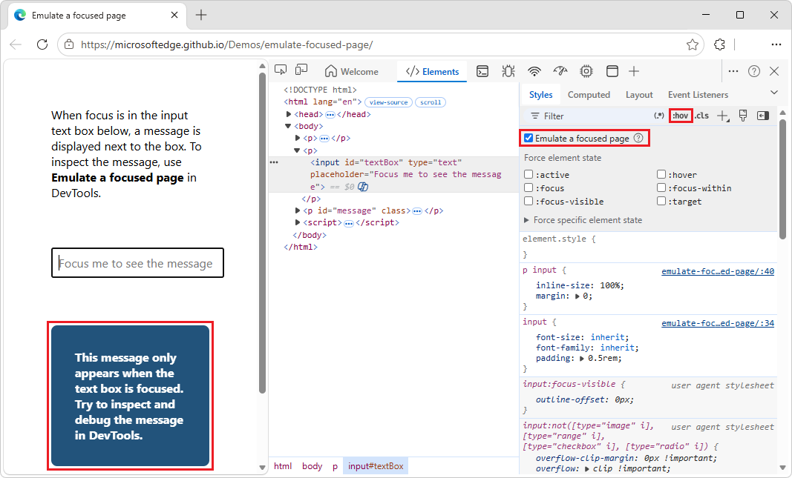

1. Cleanup: In the **Elements** tool, in the **Styles** tab, click `:hov` (**Toggle Element State**), and then clear the **Emulate a focused page** checkbox.

An **Emulate a focused page** checkbox also appears in the **Rendering** tool.

See also:
* [Rendering tool, to see what a webpage looks like with different display options or vision deficiencies](../rendering-tools/rendering-tool.md)
* [Emulate a focused page](https://developer.chrome.com/docs/devtools/rendering/apply-effects#emulate_a_focused_page) in _Apply other effects: enable automatic dark theme, emulate focus, and more_, in the Chrome docs.  _todolink: local link_
* [Freeze screen & inspect disappearing elements](https://developer.chrome.com/blog/devtools-tips-35), in the Chrome for Developers blog.  _todolink: local link_


<!-- ------------------------------ -->
#### Toggle a pseudo-class
<!-- https://developer.chrome.com/docs/devtools/css/reference/#pseudo-class -->

To toggle a pseudo-class:

1. Go to a webpage, such as [To Do app](https://microsoftedge.github.io/Demos/demo-to-do/), in a new window or tab.

1. Enter a task, such as **task 1**.

1. Right-click the webpage, and then select **Inspect**.

   DevTools opens.

1. Select the **Elements** tool.

1. In the DOM tree, select the `<li class="task">` element.

1. Select the **Styles** tab.

1. In the upper right, click **:hov**.

   Checkboxes are displayed.

1. Select the checkbox for the pseudo-class that you want to enable, such as `:hover`:

   

   In the rendered webpage, the circle next to the task name is filled with a checkmark, and a red X in a red circle appears in the right side of the task, as if the element is being hovered over, even though the element isn't actually being hovered over.

The **Styles** tab shows the following pseudo-classes for all elements:
* [`:active`](https://developer.mozilla.org/docs/Web/CSS/:active) - MDN.
* [`:focus`](https://developer.mozilla.org/docs/Web/CSS/:focus)
* [`:focus-within`](https://developer.mozilla.org/docs/Web/CSS/:focus-within)
* [`:target`](https://developer.mozilla.org/docs/Web/CSS/:target)
* [`:hover`](https://developer.mozilla.org/docs/Web/CSS/:hover)
* [`:focus-visible`](https://developer.mozilla.org/docs/Web/CSS/:focus-visible)

Additionally, some elements might have element-specific pseudo-classes.  When you select such an element, the **Styles** tab shows a **Force specific element state** section that you can expand and turn on pseudo-classes that are specific to the element, such as a **:read-write** checkbox:


For an interactive tutorial, see [Add a pseudo-state to a class](../css/index.md#add-a-pseudostate-to-a-class).


<!-- ------------------------------ -->
#### View inherited highlight pseudo-elements
<!-- https://developer.chrome.com/docs/devtools/css/reference/#view-inherited-highlight-pseudo-elements -->

Pseudo-elements let you style specific parts of elements.  Highlight pseudo-elements are document portions with a "selected" status and they are styled as "highlighted" to indicate this status to the user.

For example, such pseudo-elements are:
* `::selection`
* `::spelling-error`
* `::grammar-error`
* `::highlight`

When multiple styles conflict, cascade determines the winning style; see [3.5. Cascading and Per-Element Highlight Styles](https://drafts.csswg.org/css-pseudo-4/#highlight-cascade) in _CSS Pseudo-Elements Module Level 4_ at W3C.

To better understand the inheritance and priority of the rules, view the inherited highlight pseudo-element in the following demo.

To view the inherited highlight pseudo-elements:

1. Go to [Highlight pseudo-elements](https://microsoftedge.github.io/Demos/highlight-pseudo-elements/) in a new window or tab.

1. Select a portion of the text "I inherited the style of my parent's highlight pseudo-element. Select me!"

   The selected text changes to red text on yellow background.

1. Right-click the text "I inherited the style of my parent's highlight pseudo-element. Select me!", and then select **Inspect**.

   DevTools opens.  In the **Elements** tool, in the **Styles** tab, the section is displayed: **Inherited from ::selection pseudo of div.text-parent**:

   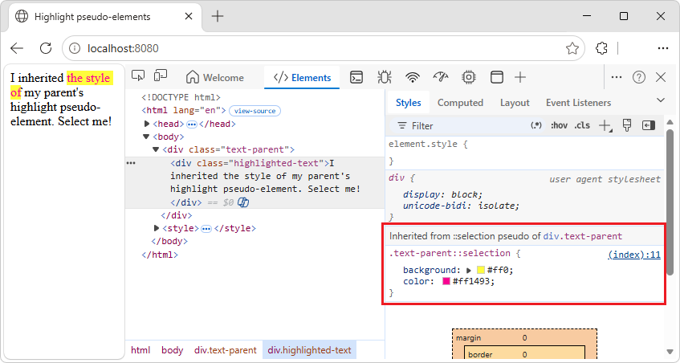

1. In the DOM tree, select the `<div class="text-parent">` element.

   In the **Styles** tab, the section is displayed: **Pseudo ::selection element**:

   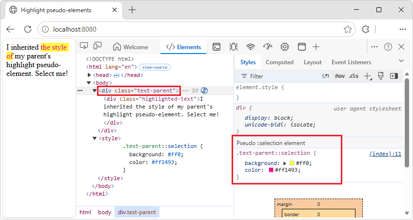

From `index.html`:

```html
<div class="text-parent">
  <div class="highlighted-text">I inherited the style of my parent's highlight pseudo-element.  Select me!</div>
</div>
<style>
  .text-parent::selection {
    background: #ff0;
    color: #ff1493;
  }
</style>
```

See also:
* [Pseudo-elements](https://developer.mozilla.org/docs/Web/CSS/Pseudo-elements) at MDN.


<!-- ------------------------------ -->
#### View cascade layers
<!-- https://developer.chrome.com/docs/devtools/css/reference/#cascade-layers -->

Cascade layers enable more explicit control of your CSS files, to prevent style-specificity conflicts.  This is useful for:
* Large codebases.
* System design.
* Managing third-party styles.

To view cascade layers:

1. Go to a webpage that uses cascade layers, such as the [Cascade layers](https://microsoftedge.github.io/Demos/cascade-layers/) demo.

1. Right-click the "My styles are layered!" element, and then select **Inspect**.

   DevTools opens.

1. In the **Elements** tool, select the **Styles** tab.

1. In the **Styles** tab, view the three cascade layers and their styles: `page`, `component` and `base`:

   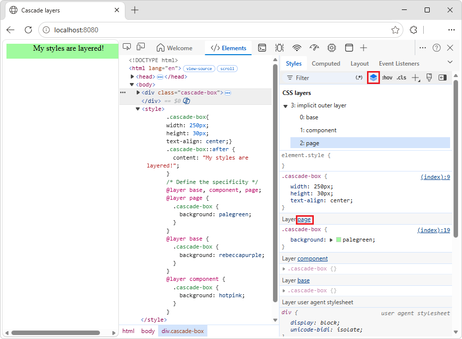

1. To view the layer order, click the layer name (**page**, **component**, or **base**).  Or, click the  **Toggle CSS Layers view** button.

   The `page` layer has the highest specificity, therefore the element's background is green.

See also:
* [Cascade layers are coming to your browser](https://developer.chrome.com/blog/cascade-layers) in the Chrome blog.  _todolink: local link?_


<!-- ------------------------------ -->
#### View a page in print mode
<!-- https://developer.chrome.com/docs/devtools/css/reference/#print-mode -->

To view a page in print mode:

1. Go to a webpage.

1. Right-click the webpage, and then select **Inspect**.

   DevTools opens.

1. Press **Esc** once or twice, so that the **Quick View** toolbar appears at the bottom of DevTools.

1. On the **Quick View** toolbar, select **More tools** (**+**).

1. Select the **Rendering** tool.

   The **Rendering** tool opens in the **Quick View** panel at the bottom of DevTools.

1. In the **Rendering** tool, click the **Emulate CSS media type** dropdown list, and then select **print**.

   The webpage is rendered as if printing.

1. When finished, in the **Rendering** tool, click the **Emulate CSS media type** dropdown list, and then select **No emulation**.


<!-- ------------------------------ -->
#### View used and unused CSS with the Coverage tool
<!-- https://developer.chrome.com/docs/devtools/css/reference/#coverage -->

The **Coverage** tool shows you what CSS a page actually uses.

1. Open the [Command Menu](../command-menu/index.md) by pressing **Ctrl+Shift+P** (Windows, Linux) or **Command+Shift+P** (macOS), while DevTools has focus.

1. Start typing `coverage`, and then select **Show Coverage**:

   

   The **Coverage** tool appears:

   

1. Click **Start instrumenting coverage and refresh the page** ().  The page refreshes and the **Coverage** tool provides an overview of how much CSS (and JavaScript) is used from each file that the browser loads.  Green represents used CSS.  Red represents unused CSS.

   An overview of how much CSS (and JavaScript) is used and unused:

   

1. To display a line-by-line breakdown of what CSS is used, click a CSS file.

   In the following figure, lines 145 to 147 and 149 to 151 of `b66bc881.site-ltr.css` are unused, whereas lines 163 to 166 are used:

   


<!-- ------------------------------ -->
#### Force print preview mode
<!-- https://developer.chrome.com/docs/devtools/css/reference/#print - links to https://developer.chrome.com/docs/devtools/css/print-preview -->

See [Force DevTools into Print Preview mode](../css/print-preview.md).


<!-- ====================================================================== -->
## Copy CSS
<!-- https://developer.chrome.com/docs/devtools/css/reference/#copy-css -->

_todo: format, link, pngs_

From a single dropdown menu in the **Styles** tab, you can copy separate CSS rules, declarations, properties, or values; see [CSS syntax basics](https://developer.mozilla.org/docs/Learn_web_development/Core/Styling_basics/What_is_CSS#css_syntax_basics) in _What is CSS?_ at MDN.

Additionally, you can copy CSS properties in JavaScript syntax.  This option is handy if you're using CSS-in-JS libraries; see [Style editing for CSS-in-JS frameworks](./css-in-js.md).

To copy CSS:

1. Go to a webpage that uses CSS, such as [To Do app](https://microsoftedge.github.io/Demos/demo-to-do/), in a new window or tab.

1. Right-click the webpage, and then click **Inspect**.

   DevTools opens, with the **Elements** tool selected.

1. In the DOM tree, select an element, such as `<h1>`.

1. In the **Styles** tab, within a CSS rule, right-click a CSS property, such as `text-align: center`:

   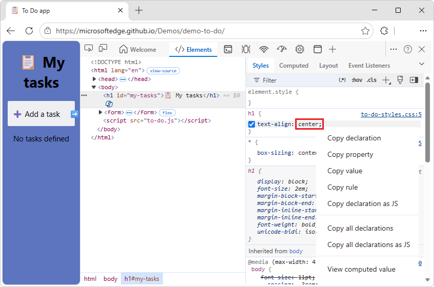

   The right-click menu contains the following menuitems:

   * **Copy declaration**. Copies the property and its value in CSS syntax: `css property: value;`

   * **Copy property**. Copies only the `property` name.

   * **Copy value**. Copies only the `value`.

   * **Copy rule**. Copies the entire CSS rule: `css selector[, selector] { property: value; property: value; ... }`

   * **Copy declaration as JS**. Copies the property and its value in JavaScript syntax: `js propertyInCamelCase: 'value'`

   * **Copy all declarations**. Copies all properties and their values in the CSS rule: `css property: value; property: value; ...`

   * **Copy all declarations as JS**. Copies all properties and their values in JavaScript syntax: `js propertyInCamelCase: 'value', propertyInCamelCase: 'value', ...`

   * **Copy all CSS changes**. Copies the changes that you make in the **Styles** tab across all declarations.  See [Copy CSS changes](#copy-css-changes), below.  This menuitem conditionally appears.

   * **View computed value**. Takes you to the **Computed** tab; see [View only the CSS that's actually applied to an element](#view-only-the-css-that-is-actually-applied-to-an-element), above.

1. Select a right-click menuitem.


<!-- ====================================================================== -->
## Change CSS
<!-- https://developer.chrome.com/docs/devtools/css/reference/#change -->

This section lists all the ways you can change CSS in **Elements** > **Styles**.

Additionally, you can:

* Override CSS across page loads.  See [Override webpage resources with local copies (Overrides tab)](../javascript/overrides.md).

* Save modified CSS to your local sources in a workspace.  See [Edit and save files in a workspace (Sources tool Workspace tab)](../workspaces/index.md).


<!-- ------------------------------ -->
#### Two ways to add a CSS declaration to an element
<!-- Add a CSS declaration to an element  https://developer.chrome.com/docs/devtools/css/reference/#add-declaration -->

The order of declarations affects how an element is styled.  You can add declarations either by adding an inline declaration, or by adding a declaration to a style rule.  These two approaches are described in the following sections.


<!-- ---------- -->
###### Adding an inline CSS declaration to an element
<!-- Add an inline declaration  https://developer.chrome.com/docs/devtools/css/reference/#add-declaration-inline -->

Adding a inline declaration is equivalent to adding a `style` attribute to the HTML of an element.  For most scenarios, you probably want to use inline declarations.

Inline declarations have higher specificity than external declarations, so using inline declarations ensures that the changes take effect in your specific, expected element.  For more information about specificity, see [Selector Types](https://developer.mozilla.org/docs/Web/CSS/Specificity#Selector_Types).

To add an inline declaration:

1. [Select an element](#select-an-element).

1. In the **Styles** pane, click between the brackets of the **element.style** section.  The cursor focuses, allowing you to enter text.

1. Enter a property name and press **Enter**.

1. Enter a valid value for that property and press **Enter**.  In the **DOM Tree**, a `style` attribute has been added to the element.

Alternatively, enter the value in the property field, and DevTools will then suggest a list of matching **property: value** pairs to select from. For example, if you enter `bold` in the property field, DevTools suggests `font-weight: bold` and `font-weight: bolder` as the possible rules. Press **Enter** to apply the rule.

In the following figure, the `margin-top` and `background-color` properties have been applied to the selected element.  In the **DOM Tree**, the declarations are reflected in the element's `style` attribute.


<!-- ---------- -->
###### Adding a CSS declaration to an existing style rule
<!-- Add a declaration to a style rule  https://developer.chrome.com/docs/devtools/css/reference/#add-declaration-to-rule -->

If you're debugging an element's styles and you need to specifically test what happens when a declaration is defined in different places, add a declaration to an existing style rule.

To add a declaration to an existing style rule:

1. [Select an element](#select-an-element).

1. In the **Styles** pane, click between the brackets of the style rule to which you want to add the declaration.  The cursor focuses, allowing you to enter text.

1. Enter a property name and press **Enter**.

1. Enter a valid value for that property and press **Enter**.


<!-- ------------------------------ -->
#### Change a declaration name or value
<!-- https://developer.chrome.com/docs/devtools/css/reference/#change-declaration -->

To change the name of a CSS declaration, double-click the declaration's name.

To change the value of a CSS declaration, double-click the declaration's value.  The following screenshot shows selecting a value from a list:


To change a numerical value, type in the value, or use the arrow keys, per the next section.


<!-- ------------------------------ -->
#### Change enumerable values with keyboard shortcuts
<!-- https://developer.chrome.com/docs/devtools/css/reference/#values-shortcuts -->

While editing an enumerable value of a declaration, for example, `font-size`, you can use the following keyboard shortcuts to increment the value by a fixed amount:

| Key combination | Action |
|---|---|
| **Alt+UpArrow** (Windows, Linux), **Option+UpArrow** (macOS) | Increment by 0.1. |
| **UpArrow** | Increment by 1, or by 0.1 if the current value is between -1 and 1. |
| **Shift+UpArrow** | Increment by 10. |
| **Ctrl+Shift+PgUp** (Windows, Linux), **Shift+Command+UpArrow** (macOS) | Increment by 100. |

To decrement, press **DownArrow** instead of **UpArrow**.


<!-- ------------------------------ -->
#### Change length values
<!-- https://developer.chrome.com/docs/devtools/css/reference/#change-length-value -->

_todo: format, link, pngs_

You can use your pointer to change any property that has a length value, such as `width`, `height`, `padding`, `margin`, or `border`.

_todo: is "length" correct?  any size measurement?_

To change the length unit:

1. Open a webpage that uses CSS, such as [To Do app](https://microsoftedge.github.io/Demos/demo-to-do/), in a new window or tab.

1. Right-click the text **Add a task**, and then select **Inspect**.

   DevTools opens, displaying the **Elements** tool.  The `<label>` element is selected in the DOM tree.

1. In the **Styles** tab, in the `.new-task-form` CSS rule, in the `max-width:` property, hover over `50rem`.

   A tooltip appears, showing the equivalent value and units: `800px`.

1. Click the value `50rem`.

   A tooltip appears: "Increment/decrement with mousewheel or up/down keys.  Ctrl: +/-100, Shift: +/-10, Alt: +/-0.1"

1. Move the mousewheel, or press **UpArrow** and **DownArrow** keys, while pressing a key:

   **Ctrl**: Increment by 100.
   **Shift**: Increment by 10.
   **Alt**: Increment by 0.1.

   In the inspected webpage, the **Add a task** input text box changes width as you change the value.

1. In the max-width property's value field, make the value `200px` (changing from `rem` units to `px` units).

1. Again move the mousewheel, or press **UpArrow** and **DownArrow** keys, while holding the **Ctrl** (+/-100), **Shift** (+/-10), or **Alt** (+/-0.1) key.

   In the inspected webpage, the **Add a task** input text box changes width as you change the value:

   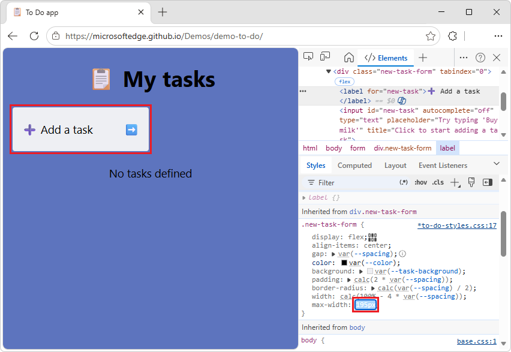


<!-- ------------------------------ -->
#### Increment numerical declaration values
<!-- not upstream -->

To change a numerical value of a CSS declaration, type in the value, or use the arrow keys to increment the value by a specific amount:

| Keyboard shortcut | Increments by |
|---|---|
| **Alt+Up Arrow** (Windows, Linux) or **Option+Up Arrow** (macOS) | 0.1 |
| **Up Arrow** | 1 (or 0.1, if the current value is between -1 and 1) |
| **Shift+Up Arrow** | 10 |
| **Shift+Page Up** (Windows, Linux) or **Shift+Command+Up Arrow** (macOS) | 100 |

To decrement, press the **Down Arrow** (or **Page Down**) key instead of the **Up Arrow** (or **Page Up**) key.


<!-- ------------------------------ -->
#### Add a class to an element
<!-- https://developer.chrome.com/docs/devtools/css/reference/#add-class -->

To add a class to an element:

1. [Select the element](#select-an-element) in the **DOM Tree**.

1. Click **.cls**.

1. Enter the name of the class in the **Add new class** text box.

1. Press **Enter**.

   


<!-- ------------------------------ -->
#### Emulate light and dark theme preferences and enable automatic dark mode
<!-- https://developer.chrome.com/docs/devtools/css/reference/#emulate-light-dark-themes -->

To toggle automatic dark mode, or emulate the user's preference of light or dark themes:

1. In the **Elements** tool, in the **Styles** tab, click [Paintbrush icon](./reference-images/toggle-common-rendering-emulations-icon.png) **Toggle common rendering emulations** in the upper right:

   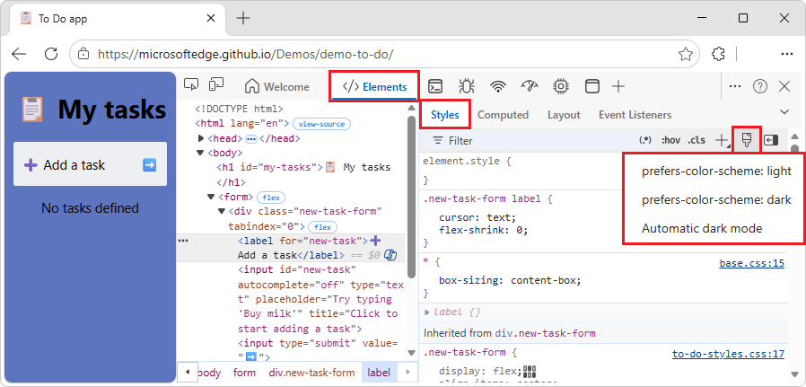

1. Select one of the following options from the dropdown list:

   * **prefers-color-scheme: light**.  Indicates that the user prefers the light theme.

   * **prefers-color-scheme: dark**.  Indicates that the user prefers the dark theme.

   * **Automatic dark mode**.  Displays your page in dark mode even if you didn't implement it.  Additionally, sets `prefers-color-scheme` to `dark` automatically.

This dropdown list is a shortcut for **Emulate CSS media feature `prefers-color-scheme`** and **Enable automatic dark mode** options of the **Rendering** tool.

See also:
* [Emulating dark or light mode using the Rendering tool](../accessibility/preferred-color-scheme-simulation.md#emulating-dark-or-light-mode-using-the-rendering-tool) in _Emulate dark or light schemes in the rendered page_.
* [Check for contrast issues with dark theme and light theme](../accessibility/test-dark-mode.md)
* [Auto Dark Theme](https://developer.chrome.com/blog/auto-dark-theme) in Chrome blog.  _todolink: link ok?_
* [prefers-color-scheme: Hello darkness, my old friend](https://web.dev/articles/prefers-color-scheme) at web.dev.


<!-- ------------------------------ -->
#### Toggle a class
<!-- https://developer.chrome.com/docs/devtools/css/reference/#toggle-class -->

To enable or disable a class on an element:

1. [Select the element](#select-an-element) in the **DOM Tree**.

1. Open the **Element Classes** pane.  See [Add a class to an element](#add-a-class-to-an-element).  Below the **Add New Class** text boxes are all of the classes that are being applied to this element.

1. Toggle the checkbox next to the class that you want to enable or disable.


<!-- ------------------------------ -->
#### Add a style rule
<!-- https://developer.chrome.com/docs/devtools/css/reference/#style-rule -->

To add a new style rule:

1. [Select an element](#select-an-element).

1. Click **New Style Rule** ().  DevTools inserts a new rule beneath the **element.style** rule.

   In the following figure, DevTools adds the `h1.devsite-page-title` style rule after you click **New Style Rule**.

   


<!-- ---------- -->
###### Select a stylesheet to add a rule to
<!-- Choose which style sheet to add a rule to  https://developer.chrome.com/docs/devtools/css/reference/#style-rule-stylesheet -->

By default, when adding a style rule, DevTools creates a new stylesheet named `inspector-stylesheet` in the document and then adds the new style rule in this stylesheet.

To instead add the rule in an existing stylesheet:

*  Click and hold **New Style Rule** () and then select a stylesheet from the list to add the style rule to.


<!-- ---------- -->
###### Add a style rule to a specific location
<!-- not upstream -->

_todo: merge this section (not upstream) w/ above section?_

By default, adding a style rule by clicking on **New Style Rule** inserts the new rule beneath the **element.style** rule in the `inspector-stylesheet` stylesheet.

To add a style rule in a specific location of the **Styles** pane instead:

1. Hover on the style rule that is directly above where you want to add your new style rule.

1. Click **Insert Style Rule Below** ().


<!-- ------------------------------ -->
#### Toggle a declaration
<!-- https://developer.chrome.com/docs/devtools/css/reference/#toggle-declaration -->

To toggle a single declaration on or off:

1. [Select an element](#select-an-element).

1. In the **Styles** pane, hover on the rule that defines the declaration.  A checkbox appears next to each declaration.

1. Select or clear the checkbox next to the declaration.  When you clear a declaration, DevTools crosses it out, to indicate that it is no longer active.

   In the following figure, the `margin-top` property for the currently selected element has been toggled off.

   


<!-- ------------------------------ -->
#### Edit the `::view-transition` pseudo-elements during an animation
<!-- https://developer.chrome.com/docs/devtools/css/reference/#view-transition -->

See:
* [Edit the ::view-transition pseudo-elements during an animation](https://developer.chrome.com/docs/devtools/css/animations#view-transition) in _Animations: Inspect and modify CSS animation effects_, in Chrome docs.  _todolink: is there a non-Chrome link instead?_
* [Smooth transitions with the View Transition API](https://developer.chrome.com/docs/web-platform/view-transitions) in Chrome docs.  _todolink: change to a non-Chrome link?_


<!-- ------------------------------ -->
#### Align grid items and their content with the Grid Editor
<!-- https://developer.chrome.com/docs/devtools/css/reference/#grid-editor -->

See:
* [Align grid items and their content: the grid editor popup](./grid.md#align-grid-items-and-their-content-the-grid-editor-popup) in _Inspect CSS Grid layouts_.


<!-- ------------------------------ -->
#### Change colors with the Color Picker
<!-- https://developer.chrome.com/docs/devtools/css/reference/#color-picker -->
<!-- todo: replace content by equiv of a link to https://developer.chrome.com/docs/devtools/css/color -->

The **Color Picker** provides a user interface for changing `color` and `background-color` declarations.

To open the **Color Picker**:

1. [Select an element](#select-an-element).

1. In the **Styles** pane, find the `color`, `background-color`, or similar declaration that you want to change.  To the left of the `color`, `background-color`, or similar value, there is a small square, which is a preview of the color.

   In the following figure, the small square to the left of `rgba(0, 0, 0, 0.7)` is a preview of that color.

   

1. Click the preview to open the **Color Picker**.

   

The following figure and list describes of each of the UI elements of the **Color Picker**.


| Callout | Component | Description |
|---|---|---|
| 1 | **Shades** |  |
| 2 | **Eyedropper** | [Sample a color off the page with the Eyedropper](#sample-a-color-off-the-page-with-the-eyedropper) |
| 3 | **Copy To Clipboard** | Copy the **Display Value** to your clipboard. |
| 4 | **Display Value** | The RGBA, HSLA, or Hex representation of the color. |
| 5 | **Color Palette** | Click a square to change the color. |
| 6 | **Hue** |  |
| 7 | **Opacity** |  |
| 8 | **Display Value Switcher** | Toggle between the RGBA, HSLA, and Hex representations of the current color. |
| 9 | **Color Palette Switcher** | Toggle between the [Material Design palette](https://material.io/guidelines/style/color.html#color-color-palette), a custom palette, or a page colors palette.  DevTools generates the page color palette based on the colors that it finds in your stylesheets. |


<!-- ------------------------------ -->
#### Sample a color off the page with the Eyedropper
<!-- not upstream, moved to https://developer.chrome.com/docs/devtools/css/color#eyedropper -->

To change the selected color to some other color on the page:

1. Click the **Eyedropper** icon (). Your cursor changes to a magnifying glass.

1. Hover on the pixel that has the color you want to sample, anywhere on your screen.

1. Click to confirm.

   In the following figure, the **Color Picker** shows a current color value of `rgba(0,0,0,0.7)`, which is close to black.  The specific color changes to the version of black that is currently highlighted in the viewport after you clicked it.

   

See also:
* [Test text-color contrast using the Color Picker](../accessibility/color-picker.md)


<!-- ------------------------------ -->
#### Change angle value with the Angle Clock
<!-- https://developer.chrome.com/docs/devtools/css/reference/#angle-clock -->

The **Angle Clock** provides a user interface for changing the angle amounts in CSS property values.

To open the **Angle Clock**:

1. Select an element which includes an angle declaration. <!-- For example, select the text below. -->

1. In the **Styles** pane, find the `transform` or `background` declaration that you want to change.  Click the **Angle Preview** box next to the angle value.

   In the following figure, the small clock to the left of `100deg` is a preview of the angle.

1. Click the preview to open the **Angle Clock**:

   

1. Change the angle value by clicking on the **Angle Clock** circle, or scroll your mouse to increase or decrease the angle value by 1.

There are more keyboard shortcuts to change the angle value.  Find out more in the [Styles pane keyboard shortcuts](../shortcuts/index.md#styles-pane-keyboard-shortcuts).


<!-- ------------------------------ -->
#### Change box and text shadows with the Shadow Editor
<!-- https://developer.chrome.com/docs/devtools/css/reference/#shadow-editor -->

Use the **Shadow Editor** to change the value of the `box-shadow` or `text-shadow` CSS property on an HTML element:

1. [Select an element](#select-an-element) with a `box-shadow` or `text-shadow` declaration.

   For example, open [the 1DIV demo page](https://microsoftedge.github.io/Demos/1DIV/dist/) in a new tab or window, right-click the page and select **Inspect** to open DevTools, and then in the **Elements** tool, select the `<div class="demos">` element.

1. In the **Styles** pane, in the `.demos` CSS rule, find the `box-shadow` declaration, and then click its **Open shadow editor** () button.

   The **Shadow Editor** opens:

   

1. Change the shadow properties, as follows:

   | Property | How to change |
   |---|---|
   | **Type** | Select **Outset** or **Inset**.  Only for `box-shadow`. |
   | **X offset** | Specify a value in the text box, or drag the blue dot. |
   | **Y offset** | Specify a value in the text box, or drag the blue dot. |
   | **Blur** | Specify a value in the text box, or drag the slider. |
   | **Spread** | Specify a value in the text box, or drag the slider.  Only for `box-shadow`. |

   The changes are applied to the element in the rendered webpage in real time:

   


<!-- ------------------------------ -->
#### Edit animation and transition timings with the Easing Editor
<!-- https://developer.chrome.com/docs/devtools/css/reference/#edit-easing -->

Use the **Easing Editor** to change the value of the [animation-timing-function](https://developer.mozilla.org/docs/Web/CSS/animation-timing-function) or [transition-timing-function](https://developer.mozilla.org/docs/Web/CSS/transition-timing-function) property on an HTML element.

To open the **Easing Editor**:

1. In DevTools, in the **Elements** tool, in the DOM tree, select an element that has a CSS animation or transition applied.

   For example, open the [animated property demo page](https://microsoftedge.github.io/Demos/devtools-animated-property-issue/) in a new tab or window, right-click the red box containing an animation, and then select **Inspect**.

   DevTools opens, displaying the **Elements** tool.

1. Press **Ctrl+F** and find "spinner", and then select the `<div class="spinner">` element that's inside `<div class="animation-demo bad">`.

   _todo: why use the bad spinner, do we want the good spinner instead?_

   The red and green boxes on this demo page are two different CSS animations.  Both animations run with CSS by using the `animation` CSS property, and define an `ease-in-out` timing function.

1. In the **Styles** tab, in the `.bad .spinner` CSS rule, in the `animation` declaration, to the left of `ease-in-out`, click the **Open cubic bezier editor** () button.

   The **Easing Editor** opens:

   


<!-- ---------- -->
###### Use presets to adjust timings
<!-- https://developer.chrome.com/docs/devtools/css/reference/#presets -->

To adjust timings by a simple mouse-click, use the presets in the **Easing Editor**:

1. Open the Easing Editor, as described in [Edit animation and transition timings with the Easing Editor](#edit-animation-and-transition-timings-with-the-easing-editor), above.

1. Click one of the four picker buttons:

   | Button | Function type | CSS keyword |
   |---|---|---|
   |  | Linear functions | `linear` |
   |  | Ease-in-out functions | `ease-in-out` |
   |  | Ease-in functions | `ease-in` |
   |  | Ease-out functions | `ease-out` |

   Selecting a button sets a keyword value in the CSS rule (which varies if you select a variant preset in the next step), and the **Presets switcher** opens at the bottom of the **Easing Editor**.

1. In the **Presets switcher**, click the **Left** **`<`** or **Right** **`>`** buttons to pick one of the following presets:

   * Linear presets: `elastic`, `bounce`, or `emphasized`.

   * Cubic Bezier presets:

   _todo: change col heading from Preset to Presets? (3x)_

   | Timing keyword | Preset | Cubic Bezier |
   |---|---|---|
   | ease-in-out | In Out, Sine | `cubic-bezier(0.45, 0.05, 0.55, 0.95)` |
   | ease-in-out | In Out, Quadratic | `cubic-bezier(0.46, 0.03, 0.52, 0.96)` |
   | ease-in-out | In Out, Cubic | `cubic-bezier(0.65, 0.05, 0.36, 1)` |
   | ease-in-out | Fast Out, Slow In | `cubic-bezier(0.4, 0, 0.2, 1)` |
   | ease-in-out | In Out, Back | `cubic-bezier(0.68, -0.55, 0.27, 1.55)` |

   | Timing keyword | Preset | Cubic Bezier |
   |---|---|---|
   | ease-in | In, Sine | `cubic-bezier(0.47, 0, 0.75, 0.72)` |
   | ease-in | In, Quadratic | `cubic-bezier(0.55, 0.09, 0.68, 0.53)` |
   | ease-in | In, Cubic | `cubic-bezier(0.55, 0.06, 0.68, 0.19)` |
   | ease-in | In, Back | `cubic-bezier(0.6, -0.28, 0.74, 0.05)` |
   | ease-in | Fast Out, Linear In | `cubic-bezier(0.4, 0, 1, 1)` |

   | Timing keyword | Preset | Cubic Bezier |
   |---|---|---|
   | ease-out | Out, Sine | `cubic-bezier(0.39, 0.58, 0.57, 1)` |
   | ease-out | Out, Quadratic | `cubic-bezier(0.25, 0.46, 0.45, 0.94)` |
   | ease-out | Out, Cubic | `cubic-bezier(0.22, 0.61, 0.36, 1)` |
   | ease-out | Linear Out, Slow In | `cubic-bezier(0, 0, 0.2, 1)` |
   | ease-out | Out, Back | `cubic-bezier(0.18, 0.89, 0.32, 1.28)` |
   
See also:
* [Bézier curve](https://developer.mozilla.org/docs/Glossary/Bezier_curve) at MDN.


<!-- ---------- -->
###### Configure custom timings
<!-- https://developer.chrome.com/docs/devtools/css/reference/#custom-timings -->

To set custom values for timing functions, use the control points on the lines:

* For linear functions, click anywhere on the line to add a control point and drag it.  To remove a control point, double-click it.

   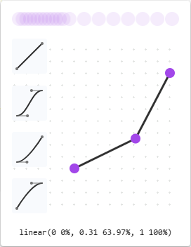

* For Cubic Bezier functions, drag one of the control points:

   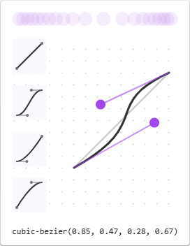

Any change triggers a ball animation in the **Preview** at the top of the **Easing Editor**.


<!-- ====================================================================== -->
## Copy CSS changes
<!-- (Experimental) Copy CSS changes  https://developer.chrome.com/docs/devtools/css/reference/#copy-css-changes -->

_todo: delete section?  no such experiment in Chrome or Edge.  changing max-width: 50rem doesn't cause a green highlight or a Copy button on right, see upstream [(Experimental) Copy CSS changes](https://developer.chrome.com/docs/devtools/css/reference/#copy-css-changes)_

The **Styles** tab in the **Elements** tool highlights your CSS changes with a light green background.

To copy a single CSS declaration change:

_todo: build on the use of demo-to-do that's in [Change length values](#change-length-values) section above_

* Hover over the highlighted declaration and click the **Copy** button:

   _todopng: create/insert Copy icon above mid-sentence_

   

   _todopng: create copy-css-declaration-change.png_

To copy all CSS changes across declarations at once:

* Right-click on any declaration and then select **Copy all CSS changes**:

   

   _todopng: create copy-css-changes.png_

See also:
* [Track changes to files using the Changes tool](../changes/changes-tool.md)


<!-- ====================================================================== -->
## See also

_todo: all links in article_

Demos repo:
* [To Do app](https://microsoftedge.github.io/Demos/demo-to-do/)
   * [/demo-to-do/](https://github.com/MicrosoftEdge/Demos/tree/main/demo-to-do/) - Readme and source code.
* [1DIV](https://microsoftedge.github.io/Demos/1DIV/dist/) - Window Controls Overlay demo.
   * [/1DIV/](https://github.com/MicrosoftEdge/Demos/tree/main/1DIV/) - Readme and source code.
* [Animated CSS Property demo](https://microsoftedge.github.io/Demos/devtools-animated-property-issue/)
   * [/devtools-animated-property-issue/](https://github.com/MicrosoftEdge/Demos/tree/main/devtools-animated-property-issue/) - Readme and source code.

W3C:
* [Scoping Styles: the @scope rule](https://drafts.csswg.org/css-cascade-6/#scope-atrule) at W3C.


<!-- ====================================================================== -->
> [!NOTE]
> Portions of this page are modifications based on work created and [shared by Google](https://developers.google.com/terms/site-policies) and used according to terms described in the [Creative Commons Attribution 4.0 International License](https://creativecommons.org/licenses/by/4.0).
> The original page is found [here](https://developer.chrome.com/docs/devtools/css/reference/) and is authored by Kayce Basques.

[](https://creativecommons.org/licenses/by/4.0)
This work is licensed under a [Creative Commons Attribution 4.0 International License](https://creativecommons.org/licenses/by/4.0).
