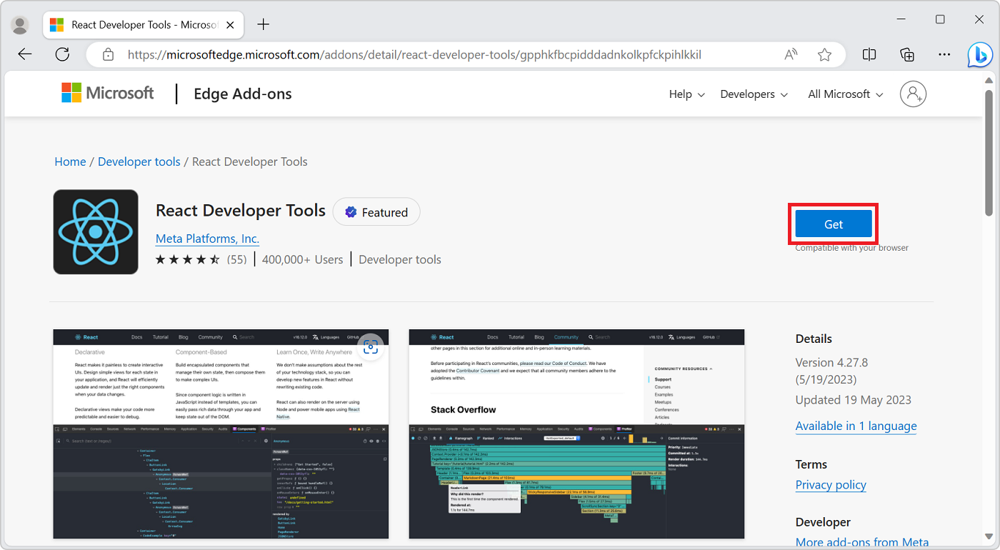
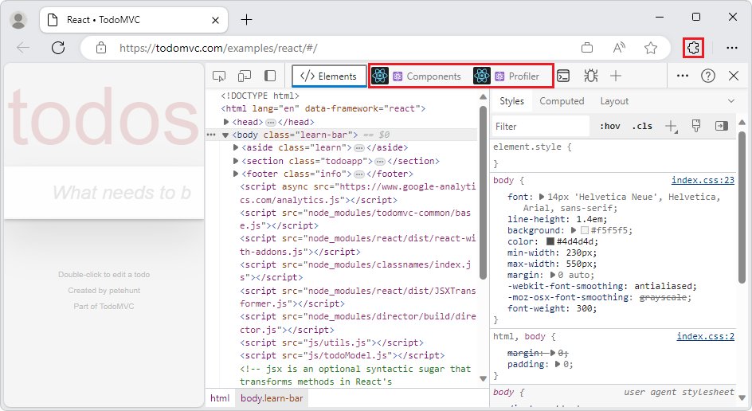
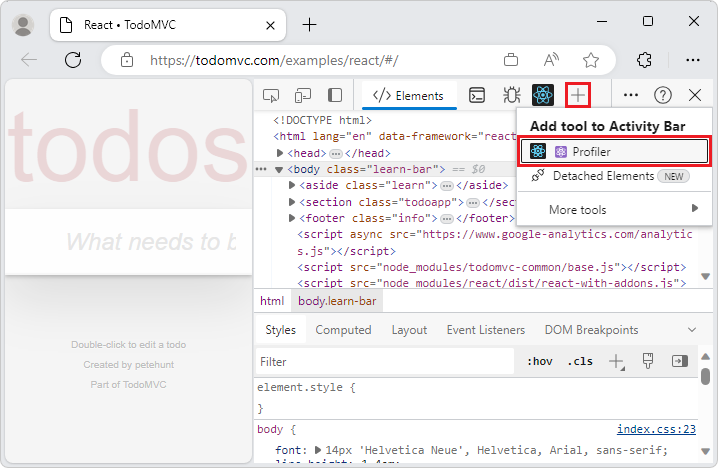

# Add custom UI to DevTools using extensions

In addition to the tools available in Microsoft Edge DevTools, you can add new tools by installing Microsoft Edge extensions, or build your own extensions for your specific use cases.  A Microsoft Edge extension often extends the Microsoft Edge user interface with new buttons and panels, but can also extend DevTools within Microsoft Edge, by adding a new tool tab in the **Activity Bar**.

<!-- ====================================================================== -->
## Find an extension that extends DevTools

The [Developer tools](https://microsoftedge.microsoft.com/addons/category/Developer-Tools) category at [Microsoft Edge Add-ons](https://microsoftedge.microsoft.com) contains extensions that typically extend DevTools.

There is no way to know whether an extension extends the DevTools **Activity Bar**, without running it or looking at its source code, but the **Developer tools** category at Microsoft Edge Add-ons is a good place to look.

<!-- ====================================================================== -->
## Install an extension in DevTools

To install a Microsoft Edge extension that extends DevTools:

1. Go to [Microsoft Edge Add-ons](https://microsoftedge.microsoft.com), such as the [Developer tools](https://microsoftedge.microsoft.com/addons/category/Developer-Tools) category, and go to the extension you want to install.

   For example, go to the [React Developer Tools](https://microsoftedge.microsoft.com/addons/detail/react-developer-tools/gpphkfbcpidddadnkolkpfckpihlkkil) extension, which is the example used for the steps below:

   

1. Click the **Get** button.  An installation dialog opens, **Add \<extension name\> to Microsoft Edge?**

1. Click the **Add extension** button.  A dialog indicates that the extension has been installed, and the Extensions () button now lists the extension.

1. Open a new tab or window, and then go to a page that contains content that's relevant for the DevTools extension.  For example, use the [TodoMVC React example page](https://todomvc.com/examples/react/dist/), or go to a live [Microsoft Edge Demos repo](https://github.com/MicrosoftEdge/Demos#demos) page, such as [demo-to-do](https://microsoftedge.github.io/Demos/demo-to-do/).

1. Open DevTools, such as by pressing **F12**.  In the case of this React extension, two new tabs are opened in the **Activity Bar**: **Components** and **Profiler**:

   

1. If the new tabs aren't displayed on the **Activity Bar**, make DevTools wider, or click the **More tools** () button, and then select the tool:

   

<!-- ====================================================================== -->
## Create a DevTools extension

You can create your own DevTools extension to add new tabs in the DevTools **Activity Bar**, and to interact with the inspected page.

See [Create a DevTools extension](../../extensions/developer-guide/devtools-extension.md).
