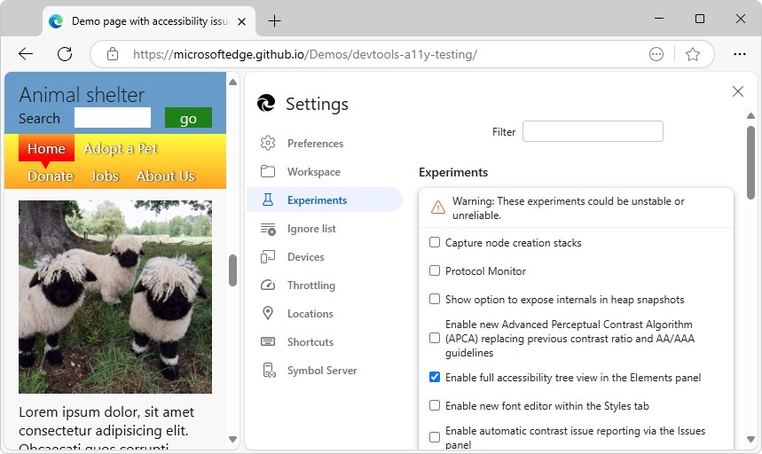
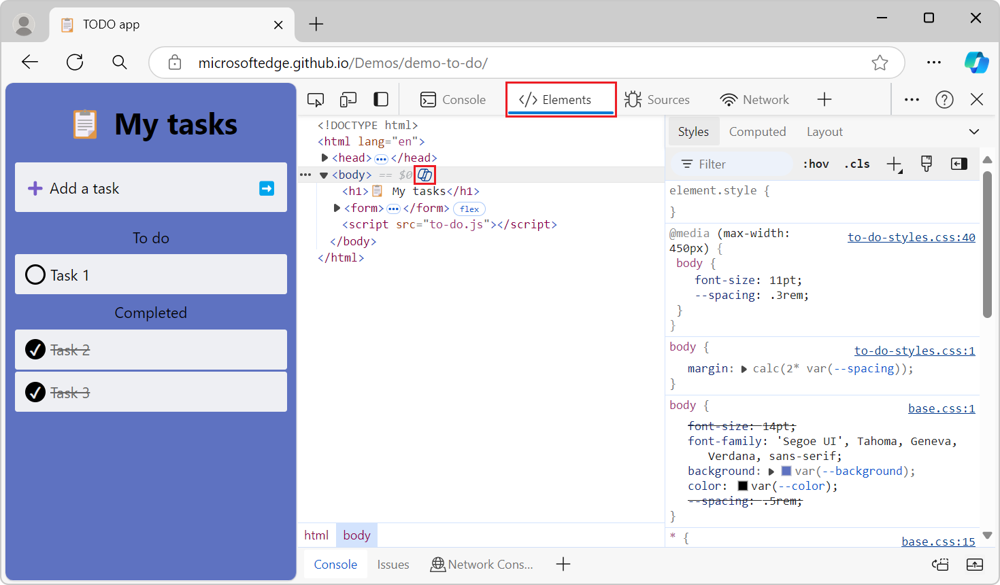
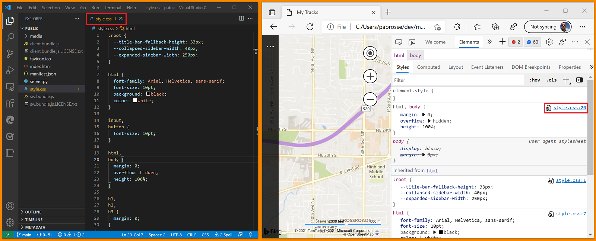
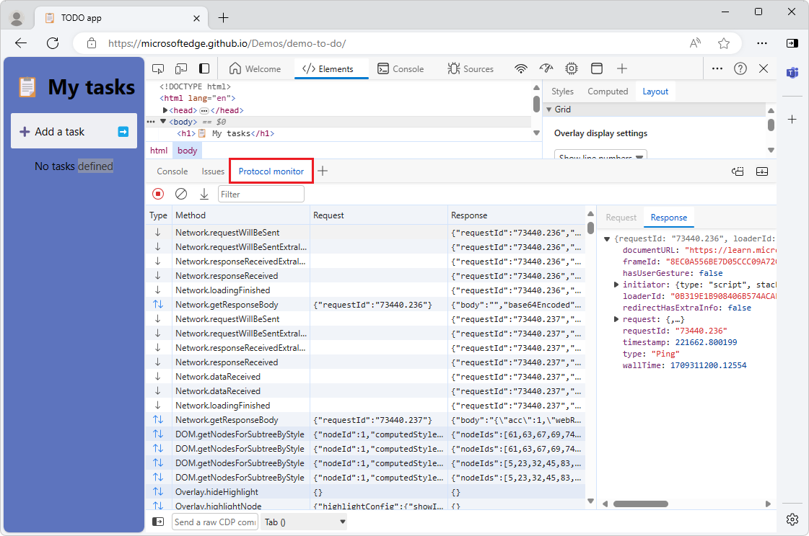

# Experimental features in Microsoft Edge DevTools
<!-- https://learn.microsoft.com/microsoft-edge/devtools/experimental-features/ -->

<!-- 
Maintenance:

First, inspect latest Canary and update sections: 
   * This checkbox is present in Microsoft Edge Canary 123.
b/c that might add new sections.
After that, inspect latest Stable and update sections: 
   * This checkbox is present in Microsoft Edge Stable 123.

*  Favor Canary over Stable re: sequencing.
*  Include a visible h2 section for every checkbox that's in public-facing Microsoft Edge DevTools > Experiments page.  If no info, write a tautology as a starting point.  Add as needed, each month.
*  Keep h2 sections in same order as DevTools > Settings > Experiments, in Canary.
*  In the heading and UI steps, keep the checkbox label UI string as it appears in the UI; do not revise or "fix" it.
*  Don't change h2 text, b/c that might break a link from UI.
*  When a checkbox is removed from Stable & Canary, remove its h2 section.

Steps to maintain this page monthly: For latest Canary, and for latest Stable:
1. In DevTools, select Settings > Preferences > Restore Defaults > Reload DevTools.
2. In DevTools, go to Settings > Experiments.
3. Make sure the article has an h2 for each checkbox.
4. In each h2 section, update the presence or absence of "not present", and update the version #:
This checkbox is|is not present in Microsoft Edge Canary 123.
This checkbox is|is not present in Microsoft Edge Stable 121.
5. Find old version #'s, inspect.
-->

Microsoft Edge DevTools provide access to experimental features that are still in development.  This article lists and describes the experimental features that are in either:
*  The latest version of the Canary preview channel of Microsoft Edge.
*  The latest version of the Stable release of Microsoft Edge.

All [channels of Microsoft Edge](/deployedge/microsoft-edge-channels) have experimental features. You can get the latest experimental features by using the [Microsoft Edge Canary channel](https://www.microsoft.com/edge/download/insider). To view the full list of experiments that are available in your version of Microsoft Edge, see the **Settings** > **Experiments** page in DevTools.

<!-- no Warning formatting, because UI already contains red "WARNING" at top -->
These experiments could be unstable or unreliable and may require you to restart DevTools.

<!-- ====================================================================== -->
## Turning an experiment on or off

Experimental features are constantly being updated and might cause performance issues.  This is one reason you might want to turn off an experiment.

To turn an experiment on or off in Microsoft Edge:

1. To open DevTools, right-click the webpage, and then select **Inspect**.  Or, press **Ctrl+Shift+I** (Windows, Linux) or **Command+Option+I** (macOS).  DevTools opens.

1. In DevTools, on the main toolbar, click the **Customize and control DevTools** () button, and then click the **Settings** () button.  Or, press **Shift+?**.

1. On the left side of the **Settings** panel, select the **Experiments** page:

   

1. Select or clear the checkbox for an experiment. Some experiments are selected by default.

1. Click **Close** () in the upper right of DevTools **Settings**.

1. Click the **Reload DevTools** button.

<!-- ====================================================================== -->
## Restoring defaults for which experiments are selected

To restore the default settings for which experimental features are turned on:

1. To open DevTools, right-click the webpage, and then select **Inspect**.  Or, press **Ctrl+Shift+I** (Windows, Linux) or **Command+Option+I** (macOS).  DevTools opens.

1. In DevTools, on the main toolbar, click the **Settings** () button.  Or, press **Shift+?**.  The **Settings** panel opens, with the **Preferences** page selected.

1. At the bottom of the **Preferences** page, click the **Restore defaults and refresh** button, and then click **Close** ().

<!-- For more information about customizing settings, see [Settings](../customize/index.md#settings) in _Customize Microsoft Edge DevTools_. -->

<!-- ====================================================================== -->
## Filtering the experiments

You can filter the experimental features by text included in the title.

1. To open DevTools, right-click the webpage, and then select **Inspect**.  Or, press **Ctrl+Shift+I** (Windows, Linux) or **Command+Option+I** (macOS).  DevTools opens.

1. In DevTools, on the main toolbar, click the **Settings** () button.  Or, press **Shift+?**.  The **Settings** panel opens, with the **Preferences** page selected.

1. On the left side of the **Settings** panel, select the **Experiments** page.

1. Click in the **Filter** text box and enter text, such as **timeline**.  As you type, only the matching checkboxes are shown in the **Experiments** page.

1. To end filtering, clear the **Filter** text box.

<!-- ====================================================================== -->
## Providing feedback about the experiments

We're eager to hear your feedback about experimental features.  To share feedback with us, [Contact the Microsoft Edge DevTools team](../contact.md).

<!-- ====================================================================== -->
## List of experiments

The experiments checkboxes that appear in the latest version of the Canary preview channel of Microsoft Edge are listed below.  The Stable release is also noted, following behind the addition or removal of checkboxes in Canary.

<!-- ============================================================================================================================================ -->
<!-- top of list of checkboxes -->
<!-- ============================================================================================================================================ -->

<!-- ====================================================================== -->
## AI Explain Console Error
<!-- checkbox has no "(?)" link pointing to this anchor wording -->

Controls whether the **Explain console** feature is on or off.  When the **Explain console** feature is on, clicking the Copilot icon opens the sidebar chat and explains the error.

See also:
* [Explain Console errors and warnings using Copilot in Edge](../console/copilot-explain-console.md)

Status:
* This checkbox is present in Microsoft Edge Canary 153.
* This checkbox is present in Microsoft Edge Stable 151.

<!-- ====================================================================== -->
## Durable Messages
<!-- checkbox has no "(?)" link pointing to this anchor wording -->

The **Durable Messages** experiment is an enhancement to the **Network** tool's **Preserve log** feature.

When the **Durable Messages** checkbox is selected, DevTools tells the browser to buffer network response bodies outside of the renderer process, so that requests and response bodies survive cross-process navigations.  This feature only takes effect when the **Preserve log** setting is enabled in the **Network** tool.

When the **Durable Messages** checkbox is cleared, the default behavior results: response bodies live in the renderer process, and are lost after cross-process navigation.

See also:
* [Save requests across page loads](../network/reference.md#save-requests-across-page-loads) in _Network features reference_.

Status:
* This checkbox is present in Microsoft Edge Canary 153.
* This checkbox is present in Microsoft Edge Stable 151.

<!-- ====================================================================== -->
## Enable CSS Copilot
<!-- https://learn.microsoft.com/microsoft-edge/devtools/experimental-features/#enable-css-copilot -->
<!-- https://go.microsoft.com/fwlink/?linkid=2274445 -->
<!-- checkbox has a "(?)" link pointing to this section heading -->

Enables using Copilot in the Microsoft Edge Sidebar to explain HTML elements and CSS styles to help you better understand a particular element or style rule that's displayed in the **Elements** tool.  To ask Copilot about an element or style rule, click the **Copilot** button next to it, and then ask follow-up questions.

This experiment is not available when the Sidebar is turned off.

See also:
* [Inspect, edit, and debug HTML and CSS with the Elements tool](../elements-tool/elements-tool.md)

Status:
* This checkbox is present in Microsoft Edge Canary 153.
* This checkbox is present in Microsoft Edge Stable 151.

<!-- ====================================================================== -->
## Enable symbol server extension support
<!-- https://learn.microsoft.com/microsoft-edge/devtools/experimental-features/#enable-symbol-server-extension-support -->
<!-- checkbox has a "(?)" link
end up at: https://www.bing.com/?ref=aka&shorturl=edge-devtools-symbol-server-extension  instead of present section - todo: bug -->

If this checkbox is selected, the [Edge DevTools Symbol Server Extension Test](https://microsoftedge.microsoft.com/addons/detail/edgedevtoolssymbolservere/cjfmbiajhehnmfdjnlmdmceolcdcblcp) extension is supported, giving the new experience for **Symbol Server** in an extension.  This extension is still in beta/test.  

If this checkbox is cleared, use DevTools > **Settings** > **Symbol Server** page. 

See also:
* [Securely debug original code by publishing source maps to the Azure Artifacts symbol server](../javascript/publish-source-maps-to-azure.md)
* [Securely debug original code by using Azure Artifacts symbol server source maps](../javascript/consume-source-maps-from-azure.md)
<!-- todo: create new article after testing is complete with the new experience in the extension, and a stable production version of the extension is available -->

Status:
* This checkbox is present in Microsoft Edge Canary 153.
* This checkbox is not present in Microsoft Edge Stable 151.

<!-- ====================================================================== -->
## Instrumentation breakpoints
<!-- checkbox has no "(?)" link pointing to this anchor wording -->

Whether to halt at test breakpoints.  This experiment makes breakpoints more reliable.

See also:
* [Enable synchronization on instrumentation breakpoints](https://chromium-review.googlesource.com/c/devtools/devtools-frontend/+/3470237)
* [The first time source files are loaded, breakpoints might not trigger](https://bugs.chromium.org/p/chromium/issues/detail?id=1133307&q=%22instrumentation%20breakpoints%22&can=2)

Status:
* This checkbox is present in Microsoft Edge Canary 153.
* This checkbox is present in Microsoft Edge Stable 151.

<!-- ====================================================================== -->
## JPEG XL support

When this checkbox is selected, the **Rendering** tool has a **Disable JPEG XL image format** checkbox.

<!--
See also:
* []
-->

Status:
* This checkbox is present in Microsoft Edge Canary 153.
* This checkbox is present in Microsoft Edge Stable 151.

<!-- ====================================================================== -->
## Log DevTools uncaught exceptions to Console
<!-- https://learn.microsoft.com/microsoft-edge/devtools/experimental-features/#log-devtools-uncaught-exceptions-to-console -->
<!-- checkbox has a "(?)" link pointing to this anchor heading -->

Controls whether to log DevTools uncaught exceptions in the **Console** tool.
<!-- todo old: need text -->

See also:
* [Console overview](../console/index.md)

Status:
* This checkbox is present in Microsoft Edge Canary 153.
* This checkbox is present in Microsoft Edge Stable 151.

<!-- ====================================================================== -->
## Open source files in Visual Studio Code
<!-- https://learn.microsoft.com/microsoft-edge/devtools/experimental-features/#open-source-files-in-visual-studio-code -->
<!-- checkbox has a "(?)" link pointing to this anchor heading -->

The **Open source files in Visual Studio Code** experiment replaces the code editor of the Sources tool with Visual Studio Code, for editing local files. When you turn on this experiment, Developer Tools detects when you edit a local file, and prompts you to select a folder to use as your Workspace.

When you select a folder to use as your Workspace, selecting any link to a file in DevTools opens the file in Visual Studio Code.  In previous versions of Microsoft Edge, this action opened the file in the code editor of the Sources tool in DevTools.

Any edits that you make in DevTools now change the file on the hard drive and sync live with Visual Studio Code.

See also:
* [Opening source files in Visual Studio Code](../sources/opening-sources-in-vscode.md) - setting up your workspace.

Status:
* This checkbox is present in Microsoft Edge Canary 153.
* This checkbox is present in Microsoft Edge Stable 151.

<!-- ====================================================================== -->
## Protocol Monitor
<!-- https://learn.microsoft.com/microsoft-edge/devtools/experimental-features/#protocol-monitor -->
<!-- checkbox has a "(?)" link, the link should point to the present section heading -->

Makes the **Protocol monitor** tool available in DevTools:

The **Protocol monitor** tool displays the messages that are sent and received by DevTools, to debug the inspected page.  DevTools communicates with the inspected page by using the Chrome DevTools Protocol (CDP).

To select this checkbox and then open the **Protocol monitor** tool:

1. Select this **Protocol Monitor** checkbox as described in [Turning an experiment on or off](#turning-an-experiment-on-or-off), above.

1. In **Quick View** at the bottom of DevTools, click the **More tools** (+) button, and then select **Protocol monitor**.

   Or, open the **Command Menu**, such as by pressing **Ctrl+Shift+P** (Windows/Linux) or **Command+Shift+P** (macOS), and then type **protocol** in the text box.  Then select **Show Protocol monitor**.  

   The **Protocol monitor** tool is displayed in the **Quick View** panel at the bottom of DevTools.

See also:
* [Use the Chrome DevTools Protocol (CDP) in WebView2 apps](../../webview2/how-to/chromium-devtools-protocol.md)
* [[Experimental] Protocol monitor](https://developer.chrome.com/blog/new-in-devtools-92#protocol-monitor) in _What's New In DevTools (Chrome 92)_.
<!--
* [Protocol monitor tool](../protocol-monitor/index.md) - article will exist if/when this Experimental Feature becomes non-experimental
-->

Status:
* This checkbox is present in Microsoft Edge Canary 153.
* This checkbox is present in Microsoft Edge Stable 151.

<!-- ====================================================================== -->
## See also

* [Release notes for Microsoft Edge web platform](../../web-platform/release-notes/index.md)
