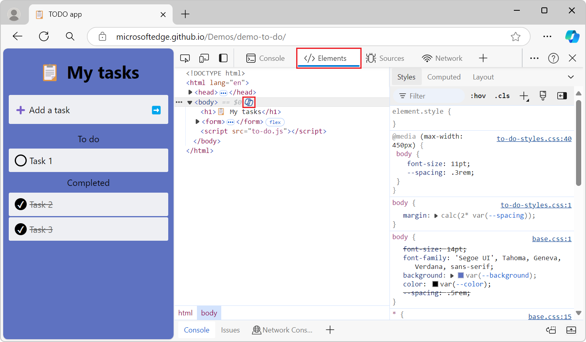

# Experimental features in Microsoft Edge DevTools

<!-- 
Policies to keep this page comprehensive and maintainable:

First, inspect latest Canary and update sections: 
   * This checkbox is present in Microsoft Edge Canary 123.
b/c that may add new sections.
After that, inspect latest Stable and update sections: 
   * This checkbox is present in Microsoft Edge Stable 123.

*  Favor Canary over Stable re: sequencing.
*  Include a visible h2 section for every checkbox that's in public-facing Microsoft Edge DevTools > Experiments page.  If no info, write a tautology as a starting point.  Add as needed, each month.
*  Keep h2 sections in same order as DevTools > Settings > Experiments.
*  In the heading and UI steps, keep the checkbox label UI string as it appears in the UI; do not revise or "fix" it.
*  Don't change h2 text, that might break a link from UI.
*  When a checkbox is removed from all the channels, remove its h2 section.

Steps to maintain this page monthly: For latest Canary, and for latest Stable:
1. Go to edge://settings/help, update if needed.
2. In DevTools, select Settings > Preferences > Restore Defaults > Reload DevTools.
3. In DevTools, go to Settings > Experiments.
4. Make sure the article has an h2 for each checkbox.
5. In each h2 section, update the presence or absence of "not present", and update the version #:
This checkbox is|is not present in Microsoft Edge Canary 140.
This checkbox is|is not present in Microsoft Edge Stable 138.
6. Find old version #'s, inspect.
-->

Microsoft Edge DevTools provide access to experimental features that are still in development.  This article lists and describes the experimental features that are in either:
*  The latest version of the Canary preview channel of Microsoft Edge.
*  The latest version of the Stable release of Microsoft Edge.

All [channels of Microsoft Edge](/deployedge/microsoft-edge-channels) have experimental features. You can get the latest experimental features by using the [Microsoft Edge Canary channel](https://www.microsoft.com/edge/download/insider). To view the full list of experiments that are available in your version of Microsoft Edge, see the **Settings** > **Experiments** page in DevTools.

<!-- no Warning formatting, because UI already contains red "WARNING" at top -->
These experiments could be unstable or unreliable and may require you to restart DevTools.

<!-- ====================================================================== -->
## Turning an experiment on or off

Experimental features are constantly being updated and might cause performance issues.  This is one reason you might want to turn off an experiment.

To turn an experiment on or off in Microsoft Edge:

1. To open DevTools, right-click the webpage, and then select **Inspect**.  Or, press **Ctrl+Shift+I** (Windows, Linux) or **Command+Option+I** (macOS).  DevTools opens.

1. In DevTools, on the main toolbar, click the **Customize and control DevTools** () button, and then click the **Settings** () button.  Or, press **Shift+?**.

1. On the left side of the **Settings** panel, select the **Experiments** page:

   

1. Select or clear the checkbox for an experiment. Some experiments are selected by default.

1. Click **Close** () in the upper right of DevTools **Settings**.

1. Click the **Reload DevTools** button.

<!-- ====================================================================== -->
## Restoring defaults for which experiments are selected

To restore the default settings for which experimental features are turned on:

1. To open DevTools, right-click the webpage, and then select **Inspect**.  Or, press **Ctrl+Shift+I** (Windows, Linux) or **Command+Option+I** (macOS).  DevTools opens.

1. In DevTools, on the main toolbar, click the **Settings** () button.  Or, press **Shift+?**.  The **Settings** panel opens, with the **Preferences** page selected.

1. At the bottom of the **Preferences** page, click the **Restore defaults and refresh** button, and then click **Close** ().

<!-- For more information about customizing settings, see [Settings](../customize/index.md#settings) in _Customize Microsoft Edge DevTools_. -->

<!-- ====================================================================== -->
## Filtering the experiments

You can filter the experimental features by text included in the title.

1. To open DevTools, right-click the webpage, and then select **Inspect**.  Or, press **Ctrl+Shift+I** (Windows, Linux) or **Command+Option+I** (macOS).  DevTools opens.

1. In DevTools, on the main toolbar, click the **Settings** () button.  Or, press **Shift+?**.  The **Settings** panel opens, with the **Preferences** page selected.

1. On the left side of the **Settings** panel, select the **Experiments** page.

1. Click in the **Filter** text box and enter text, such as **timeline**.  As you type, only the matching checkboxes are shown in the **Experiments** page.

1. To end filtering, clear the **Filter** text box.

<!-- ====================================================================== -->
## Providing feedback about the experiments

We're eager to hear your feedback about experimental features.  To share feedback with us, [Contact the Microsoft Edge DevTools team](../contact.md).

<!-- ====================================================================== -->
## List of experiments

The experiments checkboxes that appear in the latest version of the Canary preview channel of Microsoft Edge are listed below.  The Stable release is also noted, following behind the addition or removal of checkboxes in Canary.

<!-- ============================================================================================================================================ -->
<!-- top of list of checkboxes -->
<!-- ============================================================================================================================================ -->

<!-- ====================================================================== -->
## Capture node creation stacks
<!-- checkbox has no "(?)" link pointing to this anchor wording -->

To capture JavaScript stack traces when DOM nodes are added to the DOM at runtime, enable this experiment.  This experiment adds the **Stack Trace** tab in the **Elements** tool, grouped with the **Styles** tab:

After you enable the experiment, you can test it as follows:

1. In a new window or tab, open a webpage that creates DOM nodes dynamically via JavaScript, such as the [TODO demo app](https://microsoftedge.github.io/Demos/demo-to-do/).
1. In the rendered demo page, create a new todo item.
1. In the rendered demo page, right-click the new todo item, and then select **Inspect**.  DevTools opens, showing the **Elements** tool.
1. Click the **Stack Trace** tab, which is grouped with the **Styles** tab.

See also:
* [Get started viewing and changing the DOM](../dom/index.md)

Status:
* This checkbox is present in Microsoft Edge Canary 144.
* This checkbox is present in Microsoft Edge Stable 142.

<!-- ====================================================================== -->
## Protocol Monitor
<!-- checkbox has no "(?)" link pointing to this anchor wording -->

Makes the **Protocol monitor** tool available in DevTools:

The **Protocol monitor** tool displays the messages that are sent and received by DevTools, to debug the inspected page.  DevTools communicates with the inspected page by using the Chrome DevTools Protocol (CDP).

To select this checkbox and then open the **Protocol monitor** tool:

1. Select this **Protocol Monitor** checkbox as described in [Turning an experiment on or off](#turning-an-experiment-on-or-off), above.

1. In **Quick View** at the bottom of DevTools, click the **More tools** (+) button, and then select **Protocol monitor**.

   Or, open the **Command Menu**, such as by pressing **Ctrl+Shift+P** (Windows/Linux) or **Command+Shift+P** (macOS), and then type **protocol** in the text box.  Then select **Show Protocol monitor**.  

   The **Protocol monitor** tool is displayed in the **Quick View** panel at the bottom of DevTools.

See also:
* [Use the Chrome DevTools Protocol (CDP) in WebView2 apps](../../webview2/how-to/chromium-devtools-protocol.md)
* [[Experimental] Protocol monitor](https://developer.chrome.com/blog/new-in-devtools-92#protocol-monitor) in _What's New In DevTools (Chrome 92)_.
<!--
* [Protocol monitor tool](../protocol-monitor/index.md) - article will exist if/when this Experimental Feature becomes non-experimental
-->

Status:
* This checkbox is present in Microsoft Edge Canary 144.
* This checkbox is present in Microsoft Edge Stable 142.

<!-- ====================================================================== -->
## Show option to expose internals in heap snapshots
<!-- checkbox has no "(?)" link pointing to this anchor wording
[Heap snapshot improvements](../whats-new/2024/08/devtools-128.md#heap-snapshot-improvements) in _What's New in DevTools (Microsoft Edge 128)_ links to here -->

_new as of Microsoft Edge 105_

Whether to display a checkbox to expose internals in heap snapshots in the **Memory** tool.
<!-- todo old: need text -->

See also:
* [Record heap snapshots using the Memory tool ("Heap snapshot" profiling type)](../memory-problems/heap-snapshots.md)

Status:
* This checkbox is present in Microsoft Edge Canary 144.
* This checkbox is present in Microsoft Edge Stable 142.

<!-- ====================================================================== -->
## Enable new Advanced Perceptual Contrast Algorithm (APCA) replacing previous contrast ratio and AA/AAA guidelines
<!-- checkbox has no "(?)" link pointing to this anchor wording -->

The [Advanced Perceptual Contrast Algorithm (APCA)](https://w3c.github.io/silver/guidelines/methods/Method-font-characteristic-contrast.html) replaces the [AA](https://www.w3.org/WAI/WCAG21/quickref#contrast-minimum)/[AAA](https://www.w3.org/WAI/WCAG21/quickref#contrast-enhanced) guidelines contrast ratio in the Color Picker.  The Color Picker is used in the **Styles** tab in the **Elements** tool.

APCA is a new way to compute contrast.  It is based on modern research on color perception.  Compared to AA/AAA guidelines, APCA is more context-dependent.  The contrast is calculated based on the following spatial properties of the text, color, and context.

*  Spatial properties of text that include font weight and size.
*  Spatial properties of color that include perceived contrast between text and background.
*  Spatial properties of context that include ambient light, surroundings, and intended purpose.

See also:
* [New color contrast calculation - Advanced Perceptual Contrast Algorithm (APCA)](../whats-new/2021/01/devtools.md#new-color-contrast-calculation---advanced-perceptual-contrast-algorithm-apca) in _What's New in DevTools (Microsoft Edge 89)_.
* [Change colors with the Color Picker](../css/reference.md#change-colors-with-the-color-picker) in _CSS features reference_.
* [Test text-color contrast using the Color Picker](../accessibility/color-picker.md)

Status:
* This checkbox is present in Microsoft Edge Canary 144.
* This checkbox is present in Microsoft Edge Stable 142.

<!-- ====================================================================== -->
## Enable full accessibility tree view in the Elements panel
<!-- checkbox has no "(?)" link pointing to this anchor wording -->

Adds a **Switch to Accessibility Tree view** button in the **Elements** tool that toggles between the DOM tree and the accessibility tree.  The button label toggles to **Switch to DOM Tree view**.

If this Experiment checkbox is cleared, the **Elements** tool lacks the button:

If this Experiment checkbox is selected, the **Elements** tool has the button:

The Accessibility Tree view in the **Elements** tool:

See also:
* [Test accessibility using the Accessibility tab](../accessibility/accessibility-tab.md)
* [Full accessibility tree view in the Elements tool](../whats-new/2021/02/devtools.md#full-accessibility-tree-view-in-the-elements-tool) in _What's New in DevTools (Microsoft Edge 90)_.

Status:
* This checkbox is present in Microsoft Edge Canary 144.
* This checkbox is present in Microsoft Edge Stable 142.

<!-- ====================================================================== -->
## Enable new font editor within the Styles tab
<!-- checkbox has no "(?)" link pointing to this anchor wording -->

You can use the visual [Font Editor](../inspect-styles/edit-fonts.md) to edit fonts.  Use it define fonts and font characteristics.  The visual **Font Editor** helps you do the following:

*  Switch between units for different font properties
*  Switch between keywords for different font properties
*  Convert units
*  Generate accurate CSS code

To use the visual **Font Editor**:

1. To open DevTools, right-click the webpage, and then select **Inspect**.  Or, press **Ctrl+Shift+I** (Windows, Linux) or **Command+Option+I** (macOS).  DevTools opens.

1. In DevTools, on the main toolbar, select the **Elements** tab.  If the **Elements** tab isn't visible, click the **More tabs** () button, or else the **More Tools** () button.

1. In the **Styles** tab, select the **Font Editor** icon.

   

Some browser channels have the checkbox label **Enable new Font Editor tool within the Styles pane.**

See also:
* [Edit CSS font styles and settings in the Styles pane](../inspect-styles/edit-fonts.md)

Status:
* This checkbox is present in Microsoft Edge Canary 144.
* This checkbox is present in Microsoft Edge Stable 142.

<!-- ====================================================================== -->
## Enable automatic contrast issue reporting via the Issues panel
<!-- checkbox has no "(?)" link pointing to this anchor wording -->

Enables automatic contrast issue reporting in the **Issues** tool.
<!-- todo old: need text -->

See also:
* [Find and fix problems using the Issues tool](../issues/index.md)

Status:
* This checkbox is present in Microsoft Edge Canary 144.
* This checkbox is present in Microsoft Edge Stable 142.

<!-- ====================================================================== -->
## Enable experimental cookie features
<!-- checkbox has no "(?)" link pointing to this anchor wording -->

Enables experimental cookie features.
<!-- todo old: need text -->

See also:
* [View, edit, and delete cookies](../storage/cookies.md)

Status:
* This checkbox is present in Microsoft Edge Canary 144.
* This checkbox is present in Microsoft Edge Stable 142.

<!-- ====================================================================== -->
## Group sources into authored and deployed trees
<!-- checkbox has a "(?)" link pointing to this anchor wording -->

_new as of Microsoft Edge 104_
<!-- This experiment was shown in the What's New 104 video [Microsoft Edge | What's New in DevTools 104](https://www.youtube.com/watch?v=0_ZprFX8x0I&t=129s) at 2:09. -->

Controls whether to group resources into separate **Authored** and **Deployed** trees in the **Page** tab of the **Sources** tool.  This feature in the **Sources** tool allows you to group source files in two folders depending on whether these are:
*  Original source files (authored, that is, files with your local edits).
*  Production files (deployed files that are on the web server after compiling and bundling the source files).

See also:
* [Using the Page tab to explore resources that construct the current webpage](../sources/index.md#using-the-page-tab-to-explore-resources-that-construct-the-current-webpage) in _Sources tool overview_.

Status:
* This checkbox is present in Microsoft Edge Canary 144.
* This checkbox is present in Microsoft Edge Stable 142.

<!-- ====================================================================== -->
## Hide ignore-listed code in Sources tree view
<!-- checkbox has no "(?)" link pointing to this anchor wording -->

_new as of Microsoft Edge 106_

In the **Sources** tool's tree view, omits code that's included in the Ignore list.

See also:
* [Add content scripts to the Ignore List](../javascript/guides/mark-content-scripts-library-code.md)
* [Enhanced ignore listing](https://developer.chrome.com/blog/new-in-devtools-120#ignore-listing)
* [Improved Ignore list setting](https://developer.chrome.com/blog/new-in-devtools-108/#ignore-list)

Status:
* This checkbox is present in Microsoft Edge Canary 144.
* This checkbox is present in Microsoft Edge Stable 142.

<!-- ====================================================================== -->
## Performance panel: show postMessage dispatch and handling flows
<!-- checkbox has no "(?)" link pointing to this anchor wording -->

_new as of Microsoft Edge 124_

This experiment improves the **Performance** tool's **Main** section to help you quickly identify `postMessage` events and handlers, by distinguishing events that are triggered by the `postMessage` method from other events that are displayed in the **Performance** tool.  This experiment helps you investigate performance issues that are related to posting messages across various threads of an application, to view messages between windows, iframes, and dedicated workers.

Without this experiment, events that are triggered by dispatching and handling messages between threads of an application appear as generic scripting function-call events.  With this experiment enabled:
* `postMessage` dispatch events appear as **Schedule postMessage**.
* `postMessage` handler events appear as **On Message**:

This experiment helps you investigate when a `postMessage` call occurred, and how long the message was queued before the `postMessage` handler starts.  The dispatch events are linked to handler events by initiator arrows that appear when you click on either type of event:

See also:
* [View messages between windows, iframes, and dedicated workers](../performance/reference.md#view-messages-between-windows-iframes-and-dedicated-workers) in _Performance features reference_.
* [Performance recording event reference](../performance/performance-reference.md)
* [postMessage Trace Events demo (rendered)](https://microsoftedge.github.io/Demos/devtools-postmessage-perf-timeline/)
* [postMessage Trace Events demo (source code)](https://github.com/MicrosoftEdge/Demos/tree/main/devtools-postmessage-perf-timeline)
* [postMessage events and handlers are distinguished from other events](../whats-new/2024/04/devtools-124.md#postmessage-events-and-handlers-are-distinguished-from-other-events) in _What's New in DevTools (Microsoft Edge 124)_.

Status:
* This checkbox is present in Microsoft Edge Canary 144.
* This checkbox is present in Microsoft Edge Stable 142.

<!-- ====================================================================== -->
## Log DevTools uncaught exceptions to Console
<!-- checkbox has a "(?)" link
https://docs.microsoft.com/microsoft-edge/devtools/experimental-features/#log-devtools-uncaught-exceptions-to-console
pointing to this anchor wording -->

Controls whether to log DevTools uncaught exceptions in the **Console** tool.
<!-- todo old: need text -->

See also:
* [Console overview](../console/index.md)

Status:
* This checkbox is present in Microsoft Edge Canary 144.
* This checkbox is present in Microsoft Edge Stable 142.

<!-- ====================================================================== -->
## Enable webhint
<!-- checkbox has a "(?)" link
https://docs.microsoft.com/microsoft-edge/devtools/experimental-features/#enable-webhint
pointing to this anchor wording -->

[webhint](https://webhint.io) is an open-source tool that provides real-time feedback for websites and local webpages.  The type of feedback provided by [webhint](https://webhint.io) includes:

*  Accessibility
*  Cross-browser compatibility
*  Security
*  Performance
*  Progressive Web Apps (PWAs)
*  Other common web development issues

The [webhint](https://webhint.io) experiment displays webhint feedback in the **Issues** tool.  Select an issue to display documentation about the solution and a list of the affected resources on your website.  Select a resource link to open the relevant tool, such as **Network**, **Sources**, or **Elements**:

See also:
* [Find and fix problems using the Issues tool](../issues/index.md)

Status:
* This checkbox is present in Microsoft Edge Canary 144.
* This checkbox is present in Microsoft Edge Stable 142.

<!-- ====================================================================== -->
## Show issues in Elements
<!-- checkbox has a "(?)" link
https://docs.microsoft.com/microsoft-edge/devtools/experimental-features/#show-issues-in-elements
pointing to this anchor wording -->

Displays syntax errors as wavy underlines under DOM nodes in the **Elements** tool.

See also:
* [Wavy underlines highlight code issues and improvements in Elements tool](../whats-new/2021/04/devtools.md#wavy-underlines-highlight-code-issues-and-improvements-in-elements-tool) in _What's New in DevTools (Microsoft Edge 91)_.

Status:
* This checkbox is present in Microsoft Edge Canary 144.
* This checkbox is present in Microsoft Edge Stable 142.

<!-- ====================================================================== -->
## Open source files in Visual Studio Code
<!-- checkbox has a "(?)" link
https://docs.microsoft.com/microsoft-edge/devtools/experimental-features/#open-source-files-in-visual-studio-code
pointing to this anchor wording -->

The **Open source files in Visual Studio Code** experiment replaces the code editor of the Sources tool with Visual Studio Code, for editing local files. When you turn on this experiment, Developer Tools detects when you edit a local file, and prompts you to select a folder to use as your Workspace.

When you select a folder to use as your Workspace, selecting any link to a file in DevTools opens the file in Visual Studio Code.  In previous versions of Microsoft Edge, this action opened the file in the code editor of the Sources tool in DevTools.

Any edits that you make in DevTools now change the file on the hard drive and sync live with Visual Studio Code.

See also:
* [Opening source files in Visual Studio Code](../sources/opening-sources-in-vscode.md) - setting up your workspace.

Status:
* This checkbox is present in Microsoft Edge Canary 144.
* This checkbox is present in Microsoft Edge Stable 142.

<!-- ====================================================================== -->
## Enable CSS Copilot
<!-- checkbox has a "(?)" link
https://go.microsoft.com/fwlink/?linkid=2274445
pointing to this anchor wording -->

Enables using Copilot in the Microsoft Edge Sidebar to explain HTML elements and CSS styles to help you better understand a particular element or style rule that's displayed in the **Elements** tool.  To ask Copilot about an element or style rule, click the **Copilot** button next to it, and then ask follow-up questions.

This experiment is not available when the Sidebar is turned off.

See also:
* [Inspect, edit, and debug HTML and CSS with the Elements tool](../elements-tool/elements-tool.md)

Status:
* This checkbox is present in Microsoft Edge Canary 144.
* This checkbox is present in Microsoft Edge Stable 142.

<!-- ============================================================================================================================================ -->
<!-- >> [!WARNING]
> These experiments are particularly unstable. Enable at your own risk. -->

<!-- ====================================================================== -->
## Live heap profile
<!-- checkbox has no "(?)" link pointing to this anchor wording -->

Controls whether to live-update the heap profile.
<!-- todo old: need text -->

See also:
* [Record heap snapshots using the Memory tool ("Heap snapshot" profiling type)](../memory-problems/heap-snapshots.md)

Status:
* This checkbox is present in Microsoft Edge Canary 144.
* This checkbox is present in Microsoft Edge Stable 142.

<!-- ====================================================================== -->
## Sampling heap profiler timeline
<!-- checkbox has no "(?)" link pointing to this anchor wording -->

Controls whether to show the sampling heap profiler timeline in the **Performance** tool.

See also:
* [Analyze runtime performance (tutorial)](../performance/index.md)
* [Record heap snapshots using the Memory tool ("Heap snapshot" profiling type)](../memory-problems/heap-snapshots.md)

Status:
* This checkbox is present in Microsoft Edge Canary 144.
* This checkbox is present in Microsoft Edge Stable 142.

<!-- ====================================================================== -->
## Performance panel: invalidation tracking
<!-- checkbox has no "(?)" link pointing to this anchor wording -->

Adds an **Invalidations** section for **Recalculate Style** events in the **Summary** tab of the **Performance** tool.  The **Invalidations** section provides information about the root cause for a **Recalculate Style** event, which might be helpful when investigating long-running **Recalculate Style** events that are causing performance issues.

The **Invalidations** section lists the DOM nodes that were invalidated as a result of a change on the webpage, such as a DOM mutation, and which the browser engine had to restyle during the **Recalculate Style** event.

See also:
* [Analyze runtime performance (tutorial)](../performance/index.md)

Status:
* This checkbox is present in Microsoft Edge Canary 144.
* This checkbox is present in Microsoft Edge Stable 142.

<!-- ====================================================================== -->
## Performance panel: show all events
<!-- checkbox has no "(?)" link pointing to this anchor wording -->

Controls whether to show all events in the **Performance** tool.

See also:
* [Analyze runtime performance (tutorial)](../performance/index.md)

Status:
* This checkbox is present in Microsoft Edge Canary 144.
* This checkbox is present in Microsoft Edge Stable 142.

<!-- ====================================================================== -->
## Performance panel: V8 runtime call stats
<!-- checkbox has no "(?)" link pointing to this anchor wording -->

In the **Performance** tool, displays V8 JavaScript browser engine runtime call stats.

Status:
* This checkbox is present in Microsoft Edge Canary 144.
* This checkbox is present in Microsoft Edge Stable 142.

<!-- ====================================================================== -->
## Performance panel: Enable collecting enhanced traces
<!-- checkbox has no "(?)" link pointing to this anchor wording -->

_new as of Microsoft Edge 128_

This experiment makes the **Performance** tool capture newly added traces, to support enhanced traces v2.  This feature is being implemented in the upstream Chromium project.  This experiment doesn't affect the capabilities of Microsoft Edge to capture enhanced traces and doesn't impact DevTools user's experience.

Status:
* This checkbox is not present in Microsoft Edge Canary 144.
* This checkbox is present in Microsoft Edge Stable 142.

See also:
* [Share enhanced performance and memory traces](../experimental-features/share-traces.md)
* [Performance features reference](../performance/reference.md)
* [Performance recording event reference](../performance/performance-reference.md)

<!-- ====================================================================== -->
## Performance panel: Enable collecting source text for compiled script
<!-- checkbox has no "(?)" link pointing to this anchor wording -->

_new as of Microsoft Edge 128_

In the **Performance** tool, when exporting the trace file, stores the source code of compiled scripts in the trace file.

This experiment makes the **Performance** tool record script source text in traces.  This feature is being implemented in the upstream Chromium project.

Status:
* This checkbox is not present in Microsoft Edge Canary 144.
* This checkbox is present in Microsoft Edge Stable 142.

See also:
* [Share enhanced performance and memory traces](../experimental-features/share-traces.md)
* [Performance features reference](../performance/reference.md)
* [Performance recording event reference](../performance/performance-reference.md)

<!-- ====================================================================== -->
## Performance panel: Enable debug mode (trace event details, etc)
<!-- checkbox has no "(?)" link pointing to this anchor wording -->

_new as of Microsoft Edge 128_

Adds a **Trace Event** section to the **Summary** tab of the **Performance** tool.  The **Trace Event** section is displayed when you select an event in a recorded performance trace.  The **Trace Event** section displays debugging information about the selected trace event, such as its name and duration.

Status:
* This checkbox is present in Microsoft Edge Canary 144.
* This checkbox is present in Microsoft Edge Stable 142.

See also:
* [Share enhanced performance and memory traces](../experimental-features/share-traces.md)
* [Performance features reference](../performance/reference.md)
* [Performance recording event reference](../performance/performance-reference.md)

<!-- ====================================================================== -->
## Enable instrumentation breakpoints
<!-- checkbox has no "(?)" link pointing to this anchor wording -->

Whether to halt at test breakpoints.  This experiment makes breakpoints more reliable.

See also:
* [Enable synchronization on instrumentation breakpoints](https://chromium-review.googlesource.com/c/devtools/devtools-frontend/+/3470237)
* [The first time source files are loaded, breakpoints might not trigger](https://bugs.chromium.org/p/chromium/issues/detail?id=1133307&q=%22instrumentation%20breakpoints%22&can=2)

Status:
* This checkbox is present in Microsoft Edge Canary 144.
* This checkbox is present in Microsoft Edge Stable 142.

<!-- ====================================================================== -->
## Use scope information from source maps
<!-- checkbox has no "(?)" link pointing to this anchor wording -->

_new as of Microsoft Edge 118_

Whether to use scope information from source maps.
<!-- todo old: need text -->

See also:
* [Map the processed code to your original source code, for debugging](../javascript/source-maps.md)
* [Mapping minified code to your source code to show readable code](../sources/index.md#mapping-minified-code-to-your-source-code-to-show-readable-code) in _Sources tool overview_.

Status:
* This checkbox is present in Microsoft Edge Canary 144.
* This checkbox is present in Microsoft Edge Stable 142.

<!-- ====================================================================== -->
## See also

* [Release notes for Microsoft Edge web platform](../../web-platform/release-notes/index.md)
