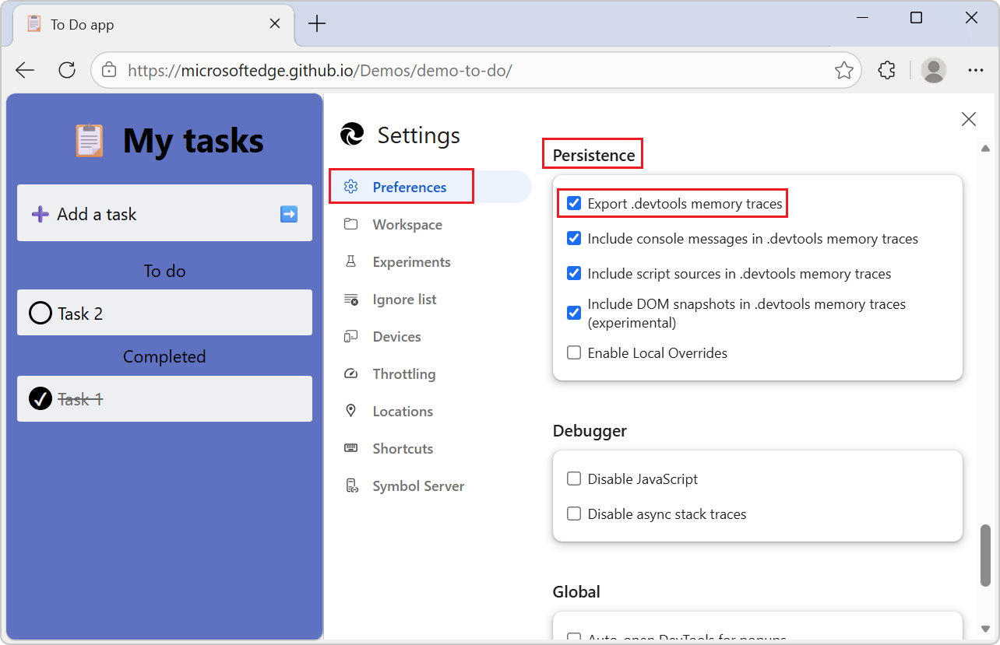
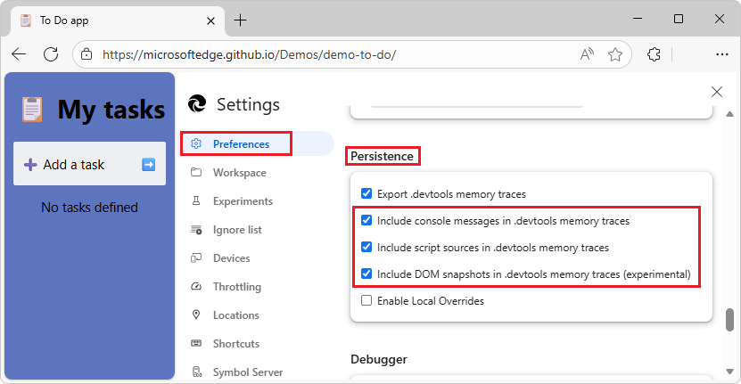
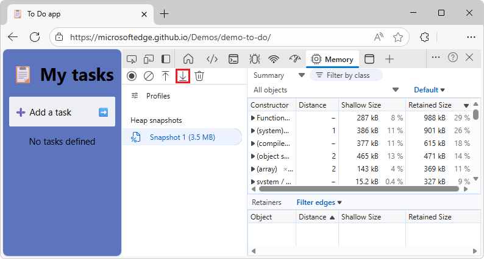
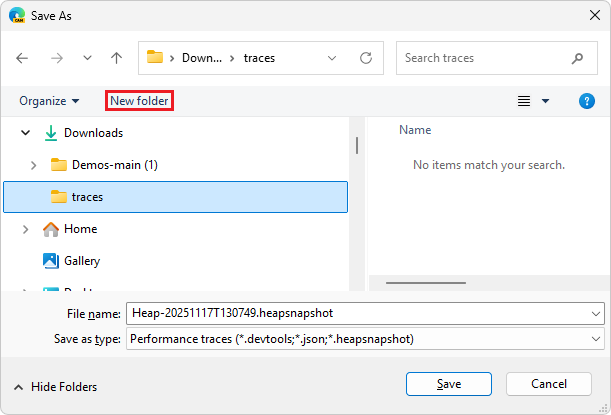
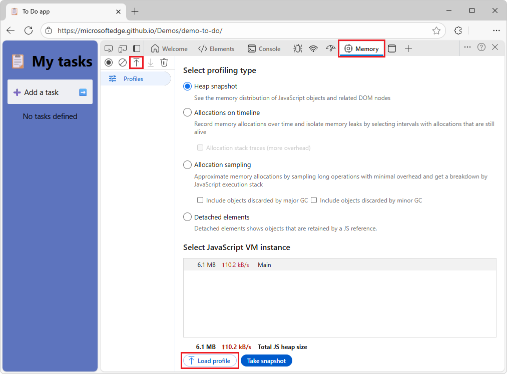
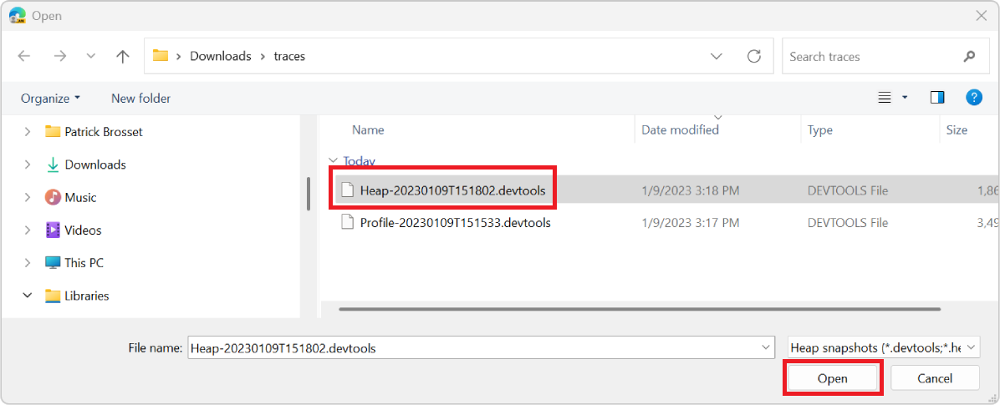

# Share a memory trace with more data

The **Memory** tool records runtime data about your webpage.  Exploring the recorded data makes it possible to improve your webpage's memory usage.

Additionally, the recorded data can be exported to files on disk.  The exported files are called _traces_.

Exporting memory traces is useful when you want to share these files with other people to get help with investigating issues.

<!-- ------------------------------ -->
#### File formats

A trace file can be imported in DevTools at any time.  By default, these traces contain minimal information about the runtime data from the traced webpage.

An exported trace can be a basic `.heapsnapshot`, `.heapprofile`, or `.heaptimeline` file.

A memory trace can also be saved as a `.devtools` file, which contains much more runtime data from the traced webpage.  Advantages of the `.devtools` file format:

* This makes it easier to resolve memory issues, by recreating the environment in which the trace was recorded, and by providing original source files.

* This makes it possible to reliably resolve source code references found in imported traces to the actual runtime code in the **Sources** tool.

* If source maps were present when a trace was recorded, or if they are stored on the [Azure Artifacts Symbol Server](../javascript/consume-source-maps-from-azure.md), it's also possible to resolve code references to their original source code.

<!-- ------------------------------ -->
#### Browser compatibility

* `.heapsnapshot`, `.heapprofile`, and `.heaptimeline` trace files are compatible with Microsoft Edge and other browsers that are based on the Chromium engine.

* `.devtools` traces can only be imported in Microsoft Edge.

<!-- ====================================================================== -->
## Set the default memory trace type

By default, the **Memory** tool exports data as `.heapsnapshot`, `.heapprofile`, or `.heaptimeline` trace files.

To change the default trace type to `.devtools`:

1. Open DevTools by pressing **Ctrl+Shift+I** (Windows, Linux) or **Command+Option+I** (macOS).

1. In DevTools, in the upper right, select **Customize and control DevTools** > **Settings** ().  **Settings** opens, with the **Preferences** page selected.

1. In the **Persistence** section of the **Preferences** page, use the **Export .devtools memory traces** checkbox to control the default type.

   

<!-- ====================================================================== -->
## Set the export options for memory traces

Memory traces that are `.devtools` files can optionally include console messages, script sources, and DOM elements.

To control whether console messages, script sources, or DOM elements are included in memory traces:

1. Open DevTools by pressing **Ctrl+Shift+I** (Windows, Linux) or **Command+Option+I** (macOS).

1. In DevTools, in the upper right, select **Customize and control DevTools** > **Settings** ().  **Settings** opens, with the **Preferences** page selected.

1. Scroll down to the **Persistence** section:

   

1. Use these checkboxes to control what to include:

   * **Include console messages in .devtools memory traces**

   * **Include script sources in .devtools memory traces**

   * **Include DOM snapshots in .devtools memory traces (experimental)**

1. In the upper right of DevTools, click the **Close** () button.

<!-- ====================================================================== -->
## Export a trace from the Memory tool

To export memory information from the **Memory** tool:

1. Open the **Memory** tool.

1. Select the option button for the type of memory recording you're interested in, such as the **Heap snapshot** option button.

   The following instructions are similar if you choose a different memory recording type, per [Fix memory problems](../memory-problems/index.md).

   **In the case of a heap snapshot:**

1. Click the **Take heap snapshot** () button at top, or the **Take snapshot** button at bottom.

   The snapshot is recorded and displayed.

1. In the toolbar, select the **Save profile** () button:

   

   Or, in the **Memory** tool sidebar, hover over the new snapshot's entry, and then select **Save profile**.

   The **Save As** dialog opens:

   

1. Navigate to a folder in which to save the trace file on your disk.

1. In the **File name** text box, adjust the file name if desired.

1. In the **File name** text box, keep or modify the extension that's specified after the file name.

   <!-- todo: expect the File type dropdown to have not just 1 item, but 2

   when DevTools Settings > **Export .devtools memory traces** checkbox is cleared, **Save as type**'s lone item is 
   **Performance traces (*.devtools; *.json; *.heapsnapshot)**

   when DevTools Settings > **Export .devtools memory traces** checkbox is selected, **Save as type**'s lone item is 
   **Performance traces (*.devtools; *.json; *.devtools)**
   -->

   * `.devtools` includes console messages, script sources, and DOM elements.

   * `.heapsnapshot`, `.heapprofile`, or `.heaptimeline` omits console messages, script sources, and DOM elements.

   Which extension is initially displayed is controlled by a DevTools setting; see [Set the default memory trace type](#set-the-default-memory-trace-type), above.

1. Click the **Save** button.

   The **Save As** dialog closes, and the file is saved to disk.

<!-- ====================================================================== -->
## Import a trace in the Memory tool

To import a trace in the **Memory** tool:

1. Open the **Memory** tool:

   

1. Click the **Load profile** () button at the top.  Or, click the **Load profile** button at the bottom.

   The **Open** dialog is displayed.

1. In the lower left dropdown list (a filter), select file types to display:

   * **Performance traces (*.devtools; *.json)** - _Used with the **Performance** tool._
   * **Heap snapshots (*.devtools; *.heapsnapshot)**
   * **Heap timelines (*.devtools; *.heaptimeline)**
   * **Sampled heap profiles (*.devtools; *.heapprofile)**

1. Locate the trace file on your disk, and then select it.

   The trace file is either a `.devtools` file, or a `.heapsnapshot`, `.heaptimeline`, or `.heapprofile` file.

   

1. Click the **Open** button.

   If it's a `.devtools` file, a new DevTools window appears, showing the memory information and the extra runtime information that was recorded displayed in the **Sources**, **Console**, and **Elements** tools.

   Otherwise, the memory information appears in the **Memory** tool, and the rest of the DevTools tabs continue to show information related to the current webpage.

<!-- ====================================================================== -->
## See also
<!-- all links in article -->

* [Share performance traces with more data](../performance/share-performance-traces.md)<!-- link not in article -->
* [Fix memory problems](../memory-problems/index.md)
* [Azure Artifacts Symbol Server](../javascript/consume-source-maps-from-azure.md)
