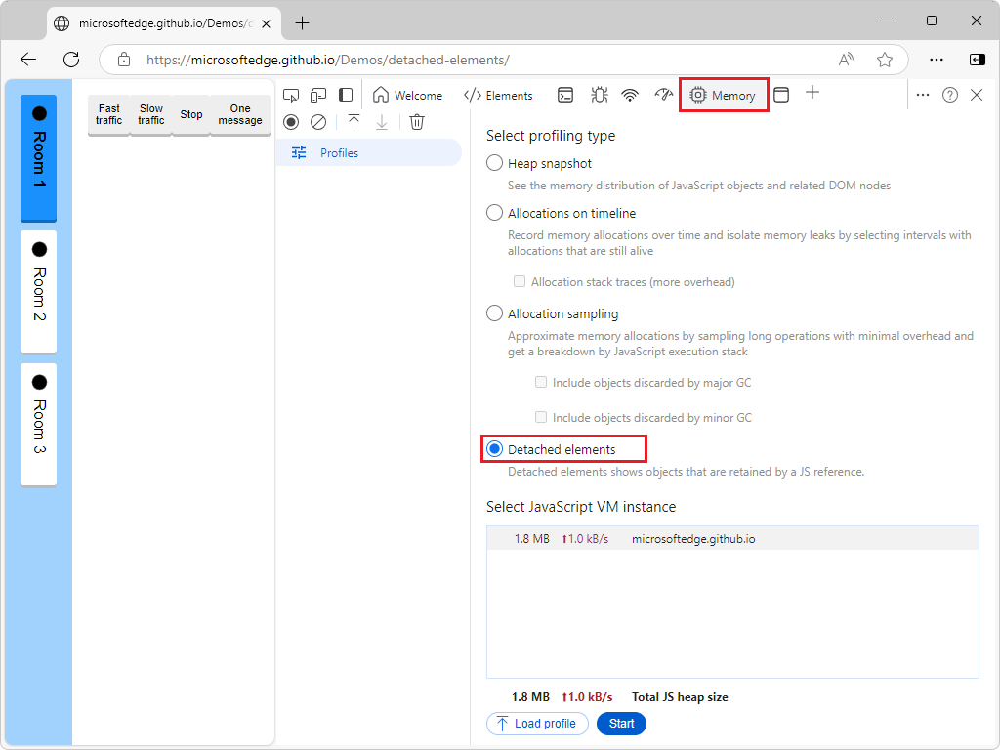
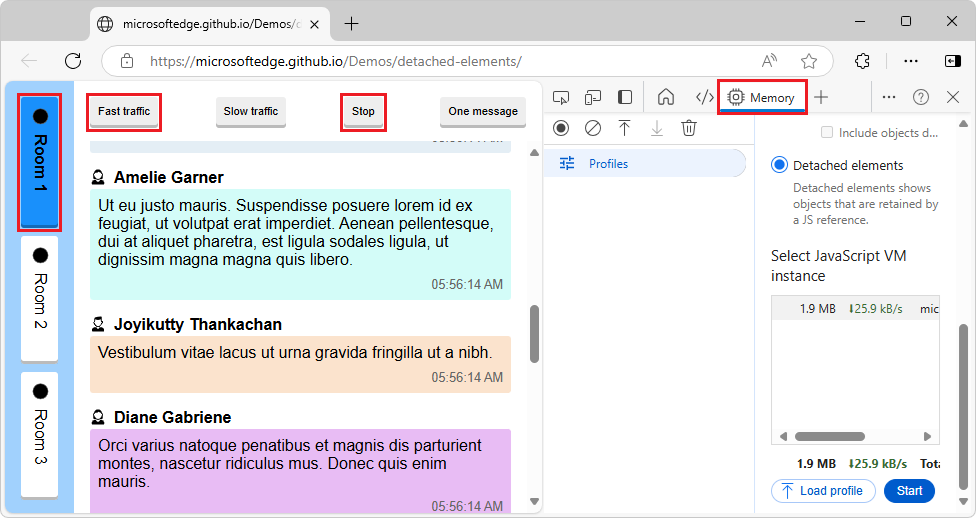
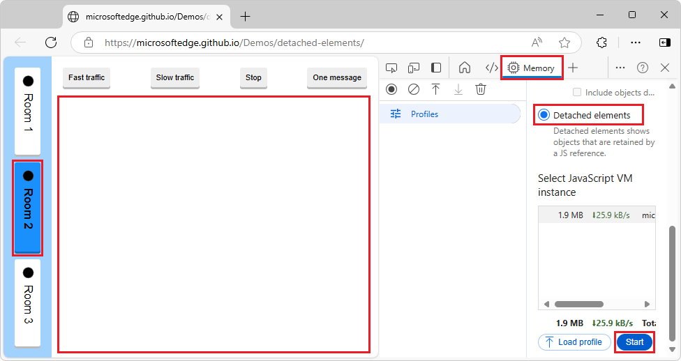
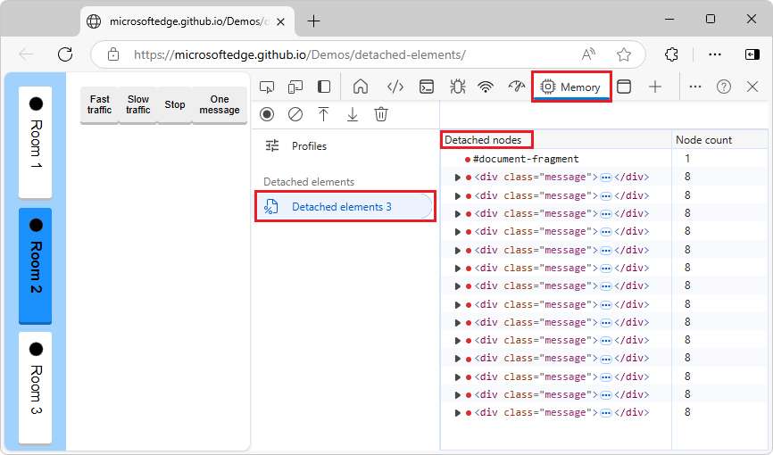
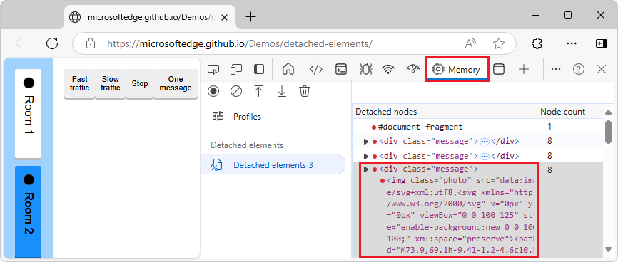

# Debug DOM memory leaks ("Detached elements" profiling type)

Use the **Memory** tool's **Detached elements** profiling type to find and display all of the detached elements on a webpage.  For a comparison of tools to view detached elements, see [Tools for investigating detached elements](./index.md#tools-for-investigating-detached-elements) in _Fix memory problems_.

The **Detached elements** profiling type helps you fix memory leaks due to detached DOM elements.  The resulting profile lists the detached objects that are retained by references in your JavaScript code.  This profiling type shows a view of the detached nodes to help you identify possible memory leaks on your webpage.

<!-- ====================================================================== -->
## Analyze a webpage's detached elements

To use the **Detached elements** profiling type to analyze a webpage's detached elements:

1. Open a webpage, such as the [Detached Elements demo webpage](https://microsoftedge.github.io/Demos/detached-elements/), in a new window or tab.

1. Right-click the webpage, and then select **Inspect**.  Or, press **Ctrl+Shift+I** (Windows, Linux) or **Command+Option+I** (macOS).

   DevTools opens.

1. In DevTools, in the **Activity Bar**, select the **Memory** () tool.

   If that tab isn't visible, click the **More Tools** () button, and then select **Memory**.  The **Memory** tool opens:

   

   If the **Detached elements** option button isn't shown, because a profile is already displayed, in the upper left, click **Profiles** ().

   You don't need to select the **Detached elements** option button at this point, because the webpage hasn't generated any detached elements yet.

   <!-- ------------------------------ -->
   **Generate messages, which will be stored by the JavaScript instance of the Room class:**

   The **Room 1** button is initially selected.  In the JavaScript code of the demo webpage, an instance of the `Room` class is used to manage the messages in Room 1.

1. In the demo webpage, click the **Fast traffic** button.

   The demo webpage begins generating messages and displaying them in the webpage:

   

1. After some messages are displayed, click the **Stop** button in the demo webpage.

   Each message is a `
` element that's referenced by the Room 1 instance of the `Room` class.  There are no detached elements in the webpage DOM tree, because all of the message elements are attached to the present, Room 1 instance of the **Room** class.

   <!-- ------------------------------ -->
   **Change to a different instance of the Room class, so elements become detached:**

1. In the demo webpage, click the **Room 2** button, which corresponds to another instance of the `Room` class.

   In the webpage, the messages disappear:

   

   The messages that were generated for the Room 1 instance of the **Room** class (`
` elements) are no longer attached to the DOM, but they're still referenced by the Room 1 instance of the **Room** class.  They are detached elements, which can cause memory leaks, unless they are going to be used again by the webpage.

   <!-- ------------------------------ -->
   **Get the list of detached elements:**

1. In DevTools, in the **Memory** tool, select the **Detached elements** option button, and then click the **Start** button.

   The list of detached nodes is displayed in the **Detached nodes** column of the generated **Detached elements** profile:

   

   The detached elements are displayed, as DOM nodes like in the DOM tree in the **Elements** tool.  In the **Profiles** list, in the **Detached elements** section, the profile is listed.

1. Expand a DOM node to display its child elements (DOM nodes):

   

   These detached elements (DOM nodes) are memory leaks, if they aren't going to be reused by the application.

If you want to return to the list of option buttons for profiling types, in the upper left of the **Memory** tool, click **Profiles** ().

For additional ways to assess memory leaks, see [Tools for investigating detached elements](./index.md#tools-for-investigating-detached-elements) in _Fix memory problems_.

<!-- ====================================================================== -->
## About detached elements and memory leaks

Detached elements aren't always an indication of a memory leak, and memory leaks aren't always caused by detached elements.  Memory leaks depend on the context of your application.

A memory leak can occur in your application when an element is no longer attached to the Document Object Model (DOM) tree, but is still referenced by some JavaScript running on the webpage. These elements are called *detached elements*.  For the browser to garbage-collect (GC) the detached element, the element must not be referenced from the DOM tree or from JavaScript code.

Memory issues affect webpage performance, including memory leaks, memory bloat, and frequent garbage collections.  Symptoms for your users include:

*  The performance of a webpage gets progressively worse over time.
*  The performance of a webpage is consistently bad.
*  The performance of a webpage is delayed or appears to pause frequently.

To increase the performance of your webpage, find the elements that are detached from the DOM tree and which you didn't expect to still be referenced by JavaScript code.  Find the detached elements that the browser can't garbage-collect because your code still references them, and then release the JavaScript code references to the detached elements.

<!-- ====================================================================== -->
## Re-attaching elements

For the Detached Elements demo webpage, it makes sense to retain the list of chat messages, so that if a user switches back to **Room 1**, the message log is preserved.  Similarly, a feed in social media might detach elements as users scroll past them, and reattach them to the DOM when users scroll back up.

When the **Detached elements** tool reports detached elements, it's not necessarily a memory leak.  It's up to you to decide what's a memory leak and what's not.  Maybe your app will re-attach those elements later (instead of having to re-create them, which could be slower).

Detaching DOM nodes is a useful approach, as long as you eventually reuse those detached elements (or delete them).  The value of the **Detached elements** tool is, when you suspect a memory leak, you can check whether there's an increasing number of unexpected detached DOM elements being reported by the tool.

<!-- ====================================================================== -->
## Long-running apps and unmounting components

Be sure to unmount components.  For long-running apps, small memory leaks of only a few kilobytes can noticeably degrade performance over time.  For webpages that use the React framework, React maintains a virtualized copy of the DOM.  Failing to properly unmount components can potentially lead to an application leaking large parts of the virtual DOM.

<!-- ====================================================================== -->
## See also

* [Tools for investigating detached elements](./index.md#tools-for-investigating-detached-elements) in _Fix memory problems_.
* [Detached Elements demo webpage](https://microsoftedge.github.io/Demos/detached-elements/)
   * [MicrosoftEdge/Demos > detached-elements](https://github.com/MicrosoftEdge/Demos/tree/main/detached-elements) repo folder - source code.<!-- link not in article -->

<!-- possibly uncomment after PR https://github.com/MicrosoftDocs/edge-developer/pull/3290 is merged
* [Detached Elements profiling type in Memory tool](../whats-new/2024/10/devtools-130.md#detached-elements-profiling-type-in-memory-tool) in _What's New in DevTools (Microsoft Edge 130)_.
-->
