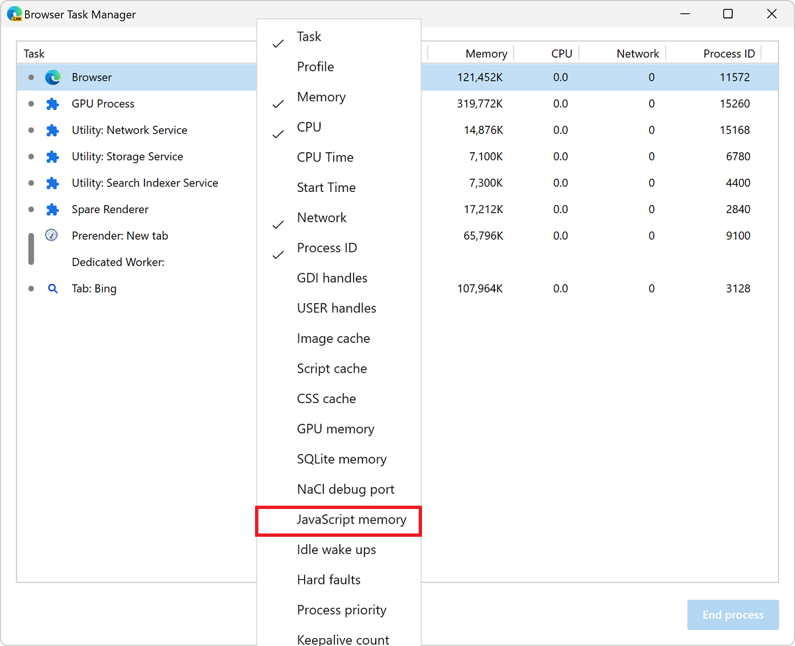
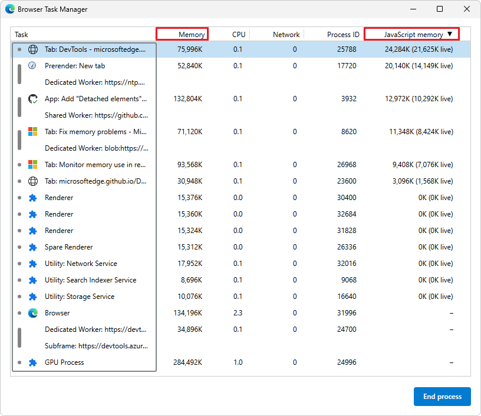

# Monitor memory use in realtime (Microsoft Edge Browser Task Manager)

Use the Microsoft Edge Browser Task Manager as a starting point to your memory issue investigation.  The Microsoft Edge Browser Task Manager is a realtime monitor that tells you how much memory a page is currently using.

1. In Microsoft Edge, press **Shift+Esc**.  Or, select **Settings and more** (**...**) > **More tools** > **Browser Task Manager**:

   

   Microsoft Edge Browser Task Manager opens.

1. Right-click the table header, and then enable **JavaScript memory**:

   

   The **JavaScript memory** column is displayed:

   

   *  The **Memory** column represents native memory.  DOM nodes are stored in native memory.  If this value is increasing, DOM nodes are getting created.

   *  The **JavaScript memory** column represents the JS heap.  This column contains two values.  The value you are interested in is the live number (the number in parentheses).  The live number represents how much memory the reachable objects on your page are using.  If this number is increasing, either new objects are being created, or the existing objects are growing.

<!--*  live number reference: https://groups.google.com/d/msg/google-chrome-developer-tools/aTMVGoNM0VY/bLmf3l2CpJ8J  -->

<!-- ============================================ -->
## See also

* [Fix memory problems](./index.md)
