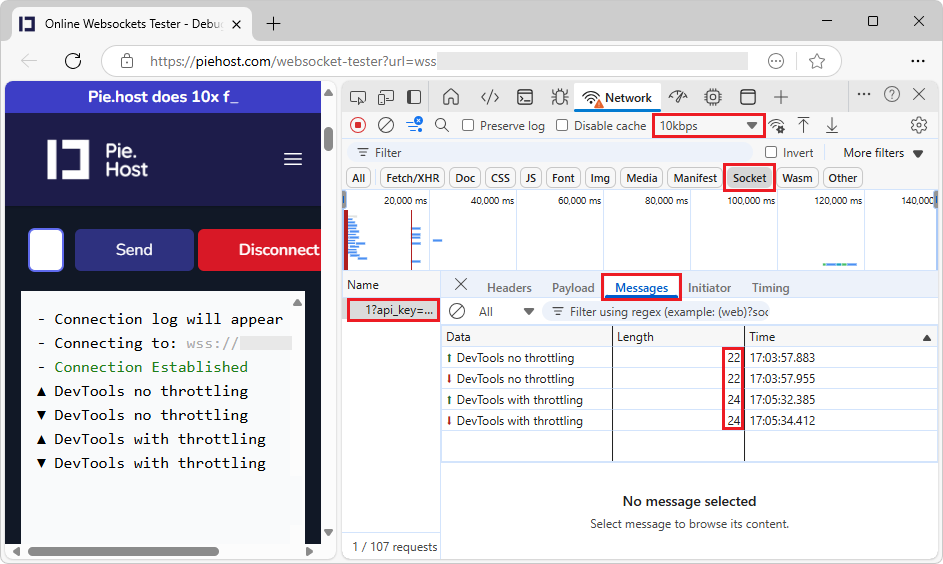
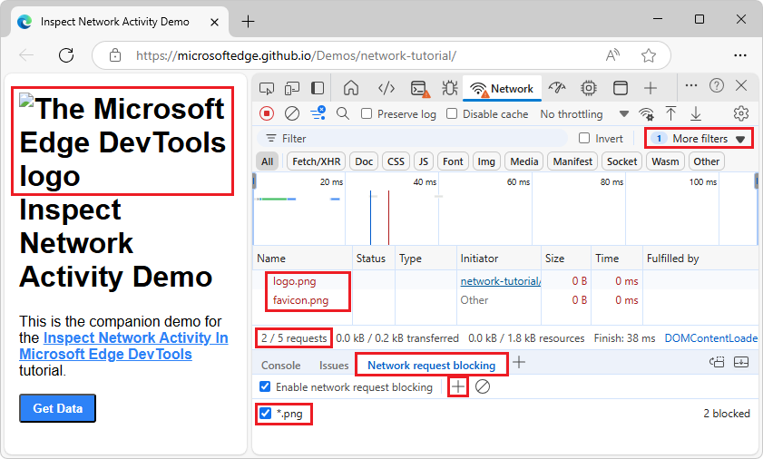
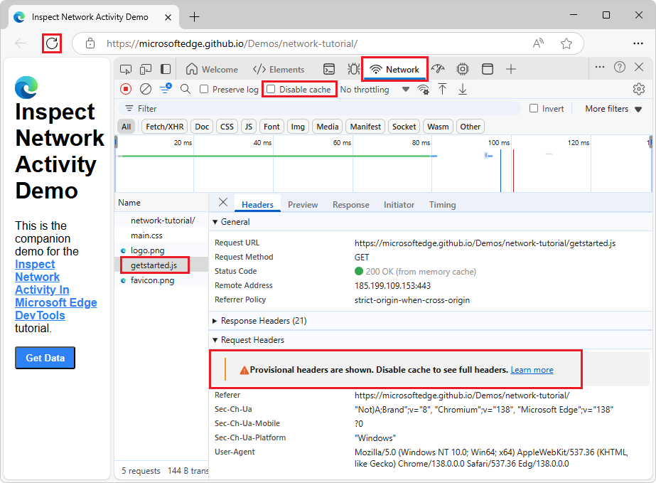
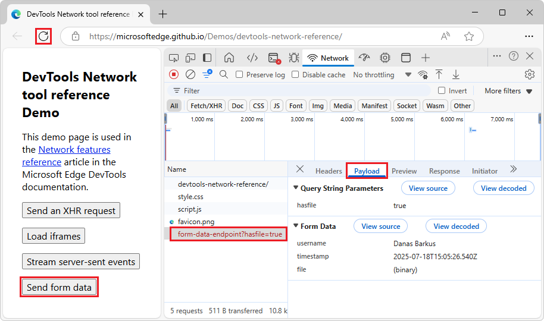
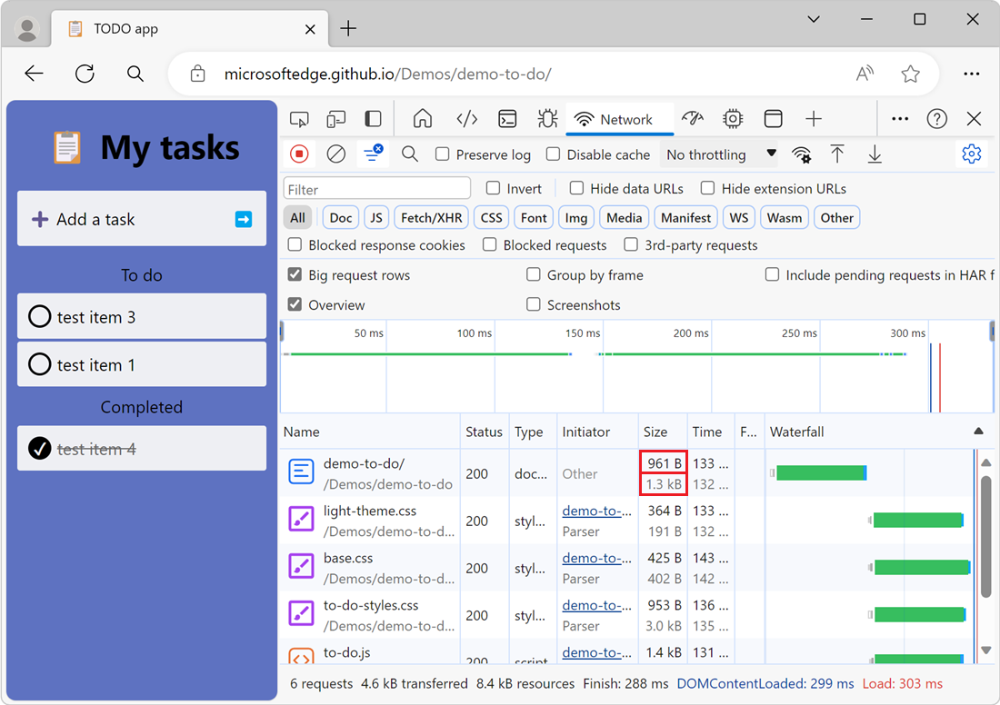

<!-- Copyright Kayce Basques

   Licensed under the Apache License, Version 2.0 (the "License");
   you may not use this file except in compliance with the License.
   You may obtain a copy of the License at

       https://www.apache.org/licenses/LICENSE-2.0

   Unless required by applicable law or agreed to in writing, software
   distributed under the License is distributed on an "AS IS" BASIS,
   WITHOUT WARRANTIES OR CONDITIONS OF ANY KIND, either express or implied.
   See the License for the specific language governing permissions and
   limitations under the License.  -->
# Network features reference
<!-- https://developer.chrome.com/docs/devtools/network/reference/ -->

<!-- for each png, decide whether to create screenshot -->

The **Network** tool has the following features, to inspect network activity for a webpage.  For a step-by-step walkthrough and introduction to the **Network** tool, see [Inspect network activity](index.md).


**Detailed contents:**

* [Record network requests](#record-network-requests)
   * [Stop recording network requests](#stop-recording-network-requests)
   * [Clear requests](#clear-requests)
   * [Save requests across page loads](#save-requests-across-page-loads)
   * [Capture screenshots during page load](#capture-screenshots-during-page-load)
   * [Replay XHR request](#replay-xhr-request)
* [Change loading behavior](#change-loading-behavior)
   * [Emulate a first-time visitor by disabling the browser cache](#emulate-a-first-time-visitor-by-disabling-the-browser-cache)
      * [Disable the browser cache from the Network conditions tool](#disable-the-browser-cache-from-the-network-conditions-tool)
   * [Manually clear the browser cache](#manually-clear-the-browser-cache)
   * [Emulate offline](#emulate-offline)
   * [Emulate slow network connections](#emulate-slow-network-connections)
      * [Create a custom throttling profile](#create-a-custom-throttling-profile)
      * [Throttle WebSocket connections](#throttle-websocket-connections)
      * [Emulate slow network connections from the Network Conditions tool](#emulate-slow-network-connections-from-the-network-conditions-tool)
   * [Manually clear browser cookies](#manually-clear-browser-cookies)
   * [Override HTTP response headers](#override-http-response-headers)
   * [Override the user agent](#override-the-user-agent)
* [Set user agent client hints](#set-user-agent-client-hints)
* [Search requests](#search-requests)
* [Filter requests](#filter-requests)
   * [Filter requests by properties](#filter-requests-by-properties)
   * [Filter requests by type](#filter-requests-by-type)
   * [Filter requests by time](#filter-requests-by-time)
   * [Hide data URLs](#hide-data-urls)
   * [Hide extension URLs](#hide-extension-urls)
   * [Show only the requests with blocked response cookies](#show-only-the-requests-with-blocked-response-cookies)
   * [Show only blocked requests](#show-only-blocked-requests)
   * [Show only third-party requests](#show-only-third-party-requests)
* [Sort requests](#sort-requests)
   * [Sort by column](#sort-by-column)
   * [Sort by activity phase](#sort-by-activity-phase)
* [Analyze requests](#analyze-requests)
   * [Display a log of requests](#display-a-log-of-requests)
      * [Add or remove columns](#add-or-remove-columns)
      * [Add custom columns for response headers](#add-custom-columns-for-response-headers)
   * [Group requests by inline frames](#group-requests-by-inline-frames)
   * [Display the timing relationship of requests](#display-the-timing-relationship-of-requests)
   * [Analyze the messages of a WebSocket connection](#analyze-the-messages-of-a-websocket-connection)
   * [Analyze events in a stream](#analyze-events-in-a-stream)
   * [Display a preview of a response body](#display-a-preview-of-a-response-body)
   * [Display a response body](#display-a-response-body)
   * [Display HTTP headers](#display-http-headers)
      * [View HTTP header source](#view-http-header-source)
      * [Provisional headers warning](#provisional-headers-warning)
   * [Display query string parameters](#display-query-string-parameters)
      * [View payload source](#view-payload-source)
      * [Display URL-encoded query string parameters](#display-url-encoded-query-string-parameters)
   * [Display cookies](#display-cookies)
   * [Display the timing breakdown of a request](#display-the-timing-breakdown-of-a-request)
      * [Preview a timing breakdown](#preview-a-timing-breakdown)
      * [Timing breakdown phases explained](#timing-breakdown-phases-explained)
   * [Display initiators and dependencies](#display-initiators-and-dependencies)
   * [Display load events](#display-load-events)
   * [Display the total number of requests](#display-the-total-number-of-requests)
   * [Display the total download size](#display-the-total-download-size)
   * [Display the stack trace that caused a request](#display-the-stack-trace-that-caused-a-request)
   * [Display the uncompressed size of a resource](#display-the-uncompressed-size-of-a-resource)
* [Export requests data](#export-requests-data)
   * [Save all network requests to a HAR file](#save-all-network-requests-to-a-har-file)
   * [Copy one or more requests to the clipboard](#copy-one-or-more-requests-to-the-clipboard)
   * [Copy formatted response JSON to the clipboard](#copy-formatted-response-json-to-the-clipboard)
   * [Copy property values from network requests to your clipboard](#copy-property-values-from-network-requests-to-your-clipboard)
* [Change the layout of the Network tool](#change-the-layout-of-the-network-tool)
   * [Hide the Filters pane](#hide-the-filters-pane)
   * [Use big request rows](#use-big-request-rows)
   * [Hide the Overview pane](#hide-the-overview-pane)
* [See also](#see-also)


<!-- ====================================================================== -->
## Record network requests
<!-- https://developer.chrome.com/docs/devtools/network/reference/#record -->

By default, DevTools records all network requests in the **Network** tool, so long as DevTools is open.

For example: 

1. Go to a webpage, such as the [Network tutorial](https://microsoftedge.github.io/Demos/network-tutorial/) demo page, in a new window or tab.

1. Right-click the webpage, and then select **Inspect**.

   DevTools opens.

1. In DevTools, select the **Network** tool.

1. Refresh the webpage.

   The **Stop recording network log** button is red and is available:


<!-- ------------------------------ -->
#### Stop recording network requests
<!-- https://developer.chrome.com/docs/devtools/network/reference/#stop-recording -->

To stop recording requests:

1. On the **Network** tool, click **Stop recording network log** ().  It turns grey to indicate that DevTools is no longer recording requests.

1. Press **Ctrl+E** (Windows, Linux) or **Command+E** (macOS) while the **Network** tool is in focus.


<!-- ------------------------------ -->
#### Clear requests
<!-- https://developer.chrome.com/docs/devtools/network/reference/#clear -->

To clear all requests from the **Requests** table, in the **Network** tool, click the **Clear network log** () button:


Or, press **Ctrl+L** (Windows, Linux, macOS) or **Command+K** (macOS) while the **Network** tool has focus.


<!-- ------------------------------ -->
#### Save requests across page loads
<!-- https://developer.chrome.com/docs/devtools/network/reference/#preserve-log -->

To save requests across page loads, on the **Network** tool, select the **Preserve log** checkbox:


DevTools saves all requests until you disable **Preserve log**.


<!-- ------------------------------ -->
#### Capture screenshots during page load
<!-- https://developer.chrome.com/docs/devtools/network/reference/#screenshots -->

You can capture screenshots to analyze what's displayed for users while waiting for your page to load.

To enable screenshots:

1. In DevTools, open the **Network** tool.

1. In the upper right within the **Network** tool, click the **Network settings** (gear) icon.  A row of checkboxes appears.

1. Select the **Capture screenshots** checkbox:

   

To capture a screenshot:

1. While the **Network** tool has focus, press **Ctrl+F5** to refresh the page.  Screenshots are captured during the page load and thumbnails are shown below the row of checkboxes.

   You can interact with the screenshots as follows.

1. Hover over a screenshot to display the point at which that screenshot was captured.  A yellow vertical line is displayed on the **Overview** chart pane.

   

1. Click the thumbnail of a screenshot to filter out any requests that occurred after the screenshot was captured.

1. Double-click a screenshot thumbnail to zoom-in and view the screenshot.
 
1. Press **Esc** to close the screenshot viewer.


<!-- ------------------------------ -->
#### Replay XHR request
<!-- https://developer.chrome.com/docs/devtools/network/reference/#replay-xhr -->

<!-- UI doesn't currently have a "Replay fetch" right-click menuitem -->

To replay an XHR request, in the **Requests** table:

* Right-click the request, and then select **Replay XHR**.

* Or, select the request, and then press **R**.

<!--
For example, the [Network tutorial](https://microsoftedge.github.io/Demos/network-tutorial/) demo page:


todo in later PR: add XHR to the demo
-->


<!-- ====================================================================== -->
## Change loading behavior
<!-- https://developer.chrome.com/docs/devtools/network/reference/#change_loading_behavior -->


<!-- ------------------------------ -->
#### Emulate a first-time visitor by disabling the browser cache
<!-- https://developer.chrome.com/docs/devtools/network/reference/#disable-cache -->

To emulate how a first-time user experiences your site, turn on the **Disable cache** checkbox.  DevTools disables the browser cache.  This feature more accurately emulates a first-time user's experience, because requests are served from the browser cache on repeat visits.

The **Disable Cache** checkbox:


<!-- ---------- -->
###### Disable the browser cache from the Network conditions tool
<!-- Disable the browser cache from the Network conditions drawer  https://developer.chrome.com/docs/devtools/network/reference/#disable-cache-network-conditions -->

From the **Network** tool, you can open the **Network conditions** tool in the **Quick View** panel at the bottom of DevTools, and then disable the browser cache from there:

1. In the **Network** tool, click the **More network conditions** ( button.  The **Network conditions** tool opens in the **Quick View** panel at the bottom of DevTools.

1. In the **Network conditions** tool, select the **Disable cache** checkbox:

   

See also:
* [Network conditions tool](../network-conditions/network-conditions-tool.md)


<!-- ------------------------------ -->
#### Manually clear the browser cache
<!-- https://developer.chrome.com/docs/devtools/network/reference/#clear-cache -->

To manually clear the browser cache at any time, right-click anywhere in the **Requests** table, and then select **Clear browser cache**:


<!-- ------------------------------ -->
#### Emulate offline
<!-- https://developer.chrome.com/docs/devtools/network/reference/#offline -->

A class of web apps, named [Progressive Web Apps](../progressive-web-apps/index.md) (PWA), are able to function offline with the help of **service workers**.<!-- [service workers](/web/fundamentals/getting-started/primers/service-workers) --> You may find it useful to quickly simulate a device that has no data connection, when you are building this type of app.

To simulate an offline network experience, select the **No throttling** dropdown menu > **Presets** > **Offline**.

The **Offline** dropdown menu:


<!-- ------------------------------ -->
#### Emulate slow network connections
<!-- https://developer.chrome.com/docs/devtools/network/reference/#throttling -->

To emulate fast 4G, slow 4G, or 3G, select the corresponding preset from the **Throttling** dropdown menu in the action bar at the top:


You can choose from different presets, such as:
* **Fast 4G**
* **Slow 4G**
* **3G**
* **Offline**

To add your own custom presets, click the **Throttling** menu, and then select **Custom** > **Add**.

A warning icon is displayed on the **Network** tool's tab, to remind you that throttling is enabled:


See also [Simulate a slower network connection](../network/index.md#simulate-a-slower-network-connection) in _Inspect network activity_.


<!-- ---------- -->
###### Create a custom throttling profile
<!-- Create custom throttling profiles  https://developer.chrome.com/docs/devtools/network/reference/#throttling-profile -->

In addition to presets, such as slow or fast 4G, you can also add your own custom throttling profiles.

To create a custom throttling profile:

1. Go to a webpage, such as the [Network tutorial](https://microsoftedge.github.io/Demos/network-tutorial/) demo page, in a new window or tab.

1. Right-click the webpage and then select **Inspect**.

   DevTools opens.

1. Select **Customize and control DevTools** (...) > **Settings** > **Throttling**.

   Or, at the top of the **Network** tool, click the **Throttling** dropdown menu, and then select **Custom** > **Add**.  The DevTools **Settings** page opens, with the **Throttling** page selected.

1. In the **Network throttling profiles** section, click the **Add profile** button.

1. In the **Profile Name** text box, enter **10kbps** (for example).

1. In the **Download** text box, enter **10** (for 10 kbit/s).

1. In the **Upload** text box, enter **10** (for 10 kbit/s).

1. In the **Latency** text box, enter **10** (for 10 ms).

1. In the **Packet Loss** text box, enter **1** (for 1%).

1. In the **Packet Queue Length** text box, enter **10**.

1. Select the **Packet Reordering** checkbox.

   

1. Click the **Add** button.

   The custom throttling profile is displayed:

   

1. In the **Settings** pane, click the **Close** (X) button.

1. Select the **Network** tool.

1. In the **Throttling** dropdown menu, in the **Custom** section, select your custom throttling profile, such as **10kbps**:

   

   A warning () icon is displayed in the **Network** tab, to remind you that throttling is enabled.

See also:
* [Set up custom network throttling profile](../settings/throttling.md#set-up-a-custom-network-throttling-profile) in _Throttling_.


<!-- ---------- -->
###### Throttle WebSocket connections
<!-- https://developer.chrome.com/docs/devtools/network/reference/#throttle-websocket -->

In addition to HTTP requests, DevTools throttles WebSocket connections.

We'll create a slow custom throttling profile, to show the difference between non-throttled and throttled WebSocket connections.

To observe WebSocket throttling:

1. Go to a WebSocket test page, such as [Online WebSocket Tester](https://www.piesocket.com/websocket-tester), in a new window or tab.

1. In the **Online WebSocket Tester** webpage, click the **Connect** button.

   If you didn't create a PieSocket account, the webpage displays "Connection Established - {"error":"Unknown api key"}".

   If you create a PieSocket account and go through the PieSocket account page, and then click the **Test online** button, the webpage simply displays "Connection Established".  More details are below, for this optional procedure.

1. Right-click the webpage and then select **Inspect**.

   DevTools opens.


   **Create a custom throttling profile:**

   These steps are the same as in [Create a custom throttling profile](#create-a-custom-throttling-profile), above:

1. Select the **Network** tool.

1. In the **Throttling** menu, in the **Custom** section, select **Add**.

   Or, select **Customize and control DevTools** > **Settings** > **Throttling**.

   The DevTools **Settings** page opens, with the **Throttling** page selected.

1. In the **Network throttling profiles** section, click the **Add profile** button.

1. In the **Profile Name** text box, enter **10kbps**, as shown below.

1. In the **Download** text box, enter **10** (for 10 kbit/s).

1. In the **Upload** text box, enter **10** (for 10 kbit/s).

1. In the **Latency** text box, enter **10** (for 10 ms).

1. In the **Packet Loss** text box, enter **1** (for 1%).

1. In the **Packet Queue Length** text box, enter **10**.

1. Select the **Packet Reordering** checkbox:

   

1. Click the **Add** button.

   The custom throttling profile is displayed:

   

1. In the **Settings** pane, click the **Close** (X) button.


   **Without throttling:**

1. In the DevTools **Network** tool, in the **Throttling** dropdown menu, make sure **No throttling** is selected.

1. In the **Online WebSocket Tester** webpage, in the message text box, delete **Hello PieSocket!**, and enter **DevTools no throttling**.

1. In the **Online WebSocket Tester** webpage, click the **Send** button.

   The console within the **Online WebSocket Tester** webpage displays **DevTools no throttling**, once or twice:

   

   

1. At the top of the **Network** tool, select the **Socket** filter button (shown below).

1. In the table, click your connection name, such as **channel_123?api_key=...**.

   Tabs appear.

1. Select the **Messages** tab (shown below).

1. For the message **DevTools no throttling**, note the number in the **Length** column.


   **With throttling:**

1. In DevTools, in the **Network** tool, in the **Throttling** dropdown menu, select **Custom** > **10kbps**.

1. In the **Online WebSocket Tester** webpage, in the message text box, delete **DevTools no throttling**, and enter **DevTools with throttling**.

1. In the **Online WebSocket Tester** webpage, click the **Send** button.

   The console within the **Online WebSocket Tester** webpage displays **DevTools with throttling**.

1. In the **Network** tool, in the **Messages** tab, for the message **DevTools with throttling**, note the number in the **Length** column:




Note: To get red down-arrow messages (echoed from the server), as well as green up-arrow messages, you would need to:

1. Create an account at the PieSocket site.  This creates an API Token.

1. Create a cluster at the PieSocket site.

1. In the **PieSocket** dashboard page, click the **Test online** button.

   The [Online WebSocket Tester](https://piehost.com/websocket-tester) page opens, with your query parameters.

1. Click the **Connect** button.

See also:
* [Create a custom throttling profile](#create-a-custom-throttling-profile), above.


<!-- ---------- -->
###### Emulate slow network connections from the Network Conditions tool
<!-- Emulate slow network connections from the Network conditions drawer  https://developer.chrome.com/docs/devtools/network/reference/#throttling-network-conditions -->

From the **Network** tool, you can open the **Network conditions** tool in the **Quick View** panel at the bottom of DevTools, and then throttle the network connection from there:

1. In the **Network** tool, click the **More network conditions** ( button.  The **Network conditions** tool opens in the **Quick View** panel at the bottom of DevTools.

1. In the **Network conditions** tool, in the **Network throttling** menu, select a connection speed.

See also:
* [Network conditions tool](../network-conditions/network-conditions-tool.md)


<!-- ------------------------------ -->
#### Manually clear browser cookies
<!-- https://developer.chrome.com/docs/devtools/network/reference/#clear-cookies -->

To manually clear browser cookies at any time, right-click anywhere in the **Requests** table, and then select **Clear browser cookies**.


<!-- ------------------------------ -->
#### Override HTTP response headers
<!-- https://developer.chrome.com/docs/devtools/network/reference/#override-headers -->

See also:
* [Override webpage resources with local copies (Overrides tab)](../javascript/overrides.md)
* [Override files and HTTP response headers](https://developer.chrome.com/docs/devtools/overrides#override-headers) in _Override web content and HTTP response headers locally_.
<!-- todo in later PR: link to section when exists, and remove first link
* [Override HTTP response headers](../javascript/overrides.md#override-http-response-headers) in _Override webpage resources with local copies (Overrides tab)_.
-->


<!-- ------------------------------ -->
#### Override the user agent
<!-- https://developer.chrome.com/docs/devtools/network/reference/#user-agent -->

To manually override the user agent:

1. In the **Network** tool, click the **More network conditions** ( button.  The **Network conditions** tool opens in the **Quick View** panel at the bottom of DevTools.

1. In the **Network conditions** tool, clear the **Use browser default** checkbox.  The other controls become available.

1. Select a user agent option from the menu, or enter a custom user agent in the text box.


<!-- ====================================================================== -->
## Set user agent client hints
<!-- downstream only section -->

If your site employs user agent client hints and you want to test them, you can set them either in the **Network conditions** tool or in [Emulate mobile devices (Device Emulation)](../device-mode/index.md).

To set user agent client hints in the **Network conditions** tool:

1. In the **Network** tool, click the **More network conditions** ( button.  The **Network conditions** tool opens in the **Quick View** panel at the bottom of DevTools.

1. In the **User agent** section, clear the **Use browser default** checkbox, and then expand **User agent client hints**:

   

1. In the **User agent** dropdown list, select a predefined browser and device.  Or, accept the default value of **Custom...**, and enter information in the **Enter a custom user agent** text box.

1. For either choice (predefined or custom), specify user agent client hints as follows:
   * **Brand** and **Version** such as *Edge* and *92*.  To add multiple brand/version pairs, click **+ Add Brand**.
   * **Full Browser Version** such as *92.0.1111.0*.
   * **Platform** and **Version** such as *Windows* and *10.0*.
   * **Architecture** such as *x86*.
   * **Device model** such as *Galaxy Nexus*.

   You can set or change any of the user agent client hints; there are no required values.

1. Select **Update**.

1. To verify changes, click **Console** and type `navigator.userAgentData`.  Expand the results as needed to view changes to user agent data.

See also:
* [User-Agent Client Hints](../../web-platform/user-agent-guidance.md#user-agent-client-hints) in _Detecting Microsoft Edge from your website_.


<!-- ====================================================================== -->
## Search requests
<!-- https://developer.chrome.com/docs/devtools/network/reference/#search -->

To search across request headers, payloads, and responses:

1. In the **Network** tool, click the **Search** () button.  Or, press **Ctrl+F** (Windows, Linux) or **Command+F** (macOS).

   The **Search** tab opens on the left side of the **Network** tool.

1. In the **Find** text box, enter your query string, and then press **Enter**.

   Optionally click the **Match case** button to turn on case sensitivity.  Optionally click the **Regular expression** button to turn on regular expressions.

1. Click one of the search results.  The **Network** tool highlights in yellow the request that matched.  The **Network** tool also opens the **Headers** or **Response** tab and highlights the string that matched there, if any.


<!-- https://microsoftedge.github.io/Demos/network-tutorial/ -->

To refresh search results, in the **Search** tab, click the **Refresh** () button.

To clear search results, in the **Search** tab, click the **Clear search** () button.

For more information on all the ways you can search in DevTools, see [Find source files for a page using the Search tool](../search/search-tool.md)


<!-- ====================================================================== -->
## Filter requests
<!-- https://developer.chrome.com/docs/devtools/network/reference/#filter - upstream section empty; below is like https://developer.chrome.com/blog/new-in-devtools-130#network-filters -->

You can filter requests by properties, by type, or by time, and you can hide data URLs.  The **More filters**<!-- constant label; tooltip varies --> dropdown list contains the following options and status checkmarks:
* **Hide data URLs**
* **Hide extension URLs**
* **Blocked response cookies**
* **Blocked requests**
* **3rd-party requests**


The dropdown list has a number on the left that tells you how many filters are selected within the dropdown list.


<!-- ------------------------------ -->
#### Filter requests by properties
<!-- https://developer.chrome.com/docs/devtools/network/reference/#filter-by-property -->

Use the **Filter** text box to filter requests by properties, such as the domain or size of the request.

If the text box isn't displayed, the **Filters** pane is probably hidden; see [Hide the Filters pane](#hide-the-filters-pane), below.

The **Filter** text box:


To invert your filter, select the **Invert** checkbox next to the **Filter** box.

You can use multiple properties simultaneously by separating each property with a space.  For example, `mime-type:image/png larger-than:1K` displays all PNGs that are larger than 1 kilobyte.  The multi-property filters are equivalent to `AND` operations.  `OR` operations aren't supported.

The complete list of supported properties:

| Property | Details |
|:--- | :--- |
| `cookie-domain` | Show the resources that set a specific cookie domain. |
| `cookie-name` | Show the resources that set a specific cookie name. |
| `cookie-path` | Show the resources that set a specific cookie path. |
| `cookie-value` | Show the resources that set a specific cookie value. |
| `domain` | Only display resources from the specified domain.  You can use a wildcard character (`*`) to include multiple domains.  For example, `*.com` displays resources from all domain names ending in `.com`.  DevTools populates the autocomplete dropdown menu with all of the domains that are found. |
| `has-overrides` | Show requests that have overridden content, headers, any overrides (yes), or no overrides (no). You can add the corresponding Has overrides column to the request table. |
| `has-response-header` | Displays the resources that contain the specified HTTP response header.  DevTools populates the autocomplete dropdown menu with all of the response headers that are found. |
| `is` | Use `is:running` to find `WebSocket` resources. |
| `larger-than` | Displays resources that are larger than the specified size, in bytes.  Setting a value of `1000` is equivalent to setting a value of `1k`. |
| `method` | Displays resources that were retrieved over a specified HTTP method type.  DevTools populates the dropdown menu with all of the HTTP methods that are found. |
| `mime-type` | Displays resources of a specified MIME type.  DevTools populates the dropdown menu with all MIME types that are found. |
| `mixed-content` | Show all mixed content resources (`mixed-content:all`) or just the ones that are currently displayed (`mixed-content:displayed`). |
| `priority` | Show resources whose priority level matches the specified value. |
| `resource-type` | Show resources of a resource type, for example, image. DevTools populates the autocomplete drop-down with all resource types it has encountered. |
| `response-header-set-cookie` | Show raw `Set-Cookie` headers in the **Issues** tab.  Malformed cookies with incorrect `Set-Cookie` headers will be flagged in the **Network** tool. |
| `scheme` | Displays resources retrieved over unprotected HTTP (`scheme:http`) or protected HTTPS (`scheme:https`). |
| `set-cookie-domain` | Displays resources that have a `Set-Cookie` header with a `Domain` attribute that matches the specified value.  DevTools populates the autocomplete with all of the cookie domains that are found. |
| `set-cookie-name` | Displays resources that have a `Set-Cookie` header with a name that matches the specified value.  DevTools populates the autocomplete with all of the cookie names that are found. |
| `set-cookie-value` | Displays resources that have a `Set-Cookie` header with a value that matches the specified value.  DevTools populates the autocomplete with all of the cookie values that are found. |
| `status-code` | Displays resources that match the specific HTTP status code.  DevTools populates the autocomplete dropdown menu with all of the status codes that are found. |
| `url` | Show the resources that have a url matching the specified value. |


<!-- ------------------------------ -->
#### Filter requests by type
<!-- https://developer.chrome.com/docs/devtools/network/reference/#filter-by-type -->

<!-- horiz list -->
To filter requests by request type, click the buttons on the **Network** tool: **All**, **Fetch/XHR**, **Doc**, **CSS**, **JS**, **Font**, **Img**, **Media**, **Manifest**, **WS** (WebSocket), **Wasm** (WebAssembly), or **Other** (any other type not listed here).

If the buttons don't appear, the **Filters** pane might be hidden.  See [Hide the Filters pane](#hide-the-filters-pane), below.

To enable multiple type filters simultaneously, press and hold **Ctrl** (Windows, Linux) or **Command** (macOS) and then click the filters.


<!-- ------------------------------ -->
#### Filter requests by time
<!-- https://developer.chrome.com/docs/devtools/network/reference/#filter-by-time -->

Click and drag left or right on the **Overview** pane to only display requests that were active during that time frame.  The filter is inclusive.  Any request that was active during the highlighted time is shown.

Filtering out any requests that were inactive around 300 ms:


<!-- ------------------------------ -->
#### Hide data URLs
<!-- https://developer.chrome.com/docs/devtools/network/reference/#hide_data_urls -->

[Data URLs](https://developer.mozilla.org/docs/Web/HTTP/Basics_of_HTTP/Data_URIs) are small files embedded into other documents.  Any request that displays in the **Requests** table that starts with `data:` is a data URL.

To hide the requests, turn off the **Hide data URLs** checkbox:


<!-- ------------------------------ -->
#### Hide extension URLs
<!-- https://developer.chrome.com/docs/devtools/network/reference/#hide-extension-urls -->

To focus on the code you author, you can filter out irrelevant requests sent by extensions you may have installed in Microsoft Edge.  Extension requests have URLs that start with `chrome-extension://`.

To hide extension requests, in the **Filters** action bar, select the **More filters** dropdown menu, and then select **Hide extension URLs** so that a checkmark appears next to it:

<!-- better would be "5 / 10 requests" instead of "5 requests" -->
<!-- https://microsoftedge.github.io/Demos/network-tutorial/ -->

The status bar at the bottom displays the number of the shown requests out of the total, such as **5 / 10 requests**.


<!-- ------------------------------ -->
#### Show only the requests with blocked response cookies
<!-- https://developer.chrome.com/docs/devtools/network/reference/#show-blocked-cookies -->

To filter out everything except the requests with response cookies blocked for any reason, in the **Filters** action bar, in the **3rd-party requests** (**More filters**) dropdown list, and then select **Blocked response cookies** so that a checkmark appears next to it.<!-- Try it on this [demo page](https://samesite-sandbox.glitch.me/). -->  Try it on the [Network tutorial](https://microsoftedge.github.io/Demos/network-tutorial/) demo page, though there are no blocked response cookies:


The status bar at the bottom displays the number of the shown requests out of the total.

To find out the reason why a response cookie was blocked, select the request (under **Name**), open its **Cookies** tab (to the right), and then hover over the **information** () button.

<!-- not in latest ui
Additionally, the **Network** tool shows a warning icon next to a request with cookies blocked either because of Edge flags or configuration.  Hover over the icon to see a tooltip with a clue and click it to go to the **Issues** tool for more information. -->

<!--  -->


<!-- ------------------------------ -->
#### Show only blocked requests
<!-- https://developer.chrome.com/docs/devtools/network/reference/#show-blocked -->

To filter out everything except blocked requests, in the **Filters** action bar, select **More filters** > **Blocked requests**, so that a checkmark appears.  To test this, you can use the **Network request blocking** tool in the **Quick View** panel at the bottom of DevTools; see [Block requests](./index.md#block-requests) in _Inspect network activity_.


<!-- https://microsoftedge.github.io/Demos/network-tutorial/ -->

The **Requests** table highlights blocked requests in red.  The status bar at the bottom displays the number of the shown requests out of the total, such as **15 / 17 requests**.


<!-- ------------------------------ -->
#### Show only third-party requests
<!-- https://developer.chrome.com/docs/devtools/network/reference/#third-party -->

To filter out everything except the requests with origin that differs from page origin, in the **Filters** action bar, select **More filters** > **3rd-party requests**, so that a checkmark appears.  Try it on the [Network tutorial](https://microsoftedge.github.io/Demos/network-tutorial/) demo page.


The status bar at the bottom displays the number of the shown requests out of the total.


<!-- ====================================================================== -->
## Sort requests
<!-- https://developer.chrome.com/docs/devtools/network/reference/#sort_requests -->

By default, the requests in the **Requests** table are sorted by initiation time, but you can sort the table using other criteria.


<!-- ------------------------------ -->
#### Sort by column
<!-- https://developer.chrome.com/docs/devtools/network/reference/#sort-by-column -->

Click the header of any column in the **Requests** to sort requests by that column.


<!-- ------------------------------ -->
#### Sort by activity phase
<!-- https://developer.chrome.com/docs/devtools/network/reference/#sort-by-activity -->
<!-- Waterfall column was formerly on by default, as shown throughout upstream -->

The **Waterfall** column is off by default.  To turn on the **Waterfall** column: right-click a **Requests** table header, and then select the plain **Waterfall** menuitem that doesn't have a submenu.

To change how the **Waterfall** column sorts requests:

* Right-click the header of the **Requests** table, click **Waterfall**, and then select one of the following options:

   * **Start Time** - The first request that was initiated is placed at the top.
   
   * **Response Time** - The first request that started downloading is placed at the top.
   
   * **End Time** - The first request that finished is placed at the top.
   
   * **Total Duration** - The request with the shortest connection settings and request or response is placed at the top.
   
   * **Latency** - The request that waited the shortest time for a response is placed at the top.
      
These descriptions assume that each respective option is ranked from shortest to longest.  Click the header of the **Waterfall** column to reverse the order.

The following shows sorting the Waterfall by total duration.  The lighter portion of each bar is time spent waiting and the darker portion is time spent downloading bytes:


<!-- ====================================================================== -->
## Analyze requests
<!-- https://developer.chrome.com/docs/devtools/network/reference/#analyze -->

So long as DevTools is open, it logs all requests in the **Network** tool.  Use the **Network** tool to analyze requests.


<!-- ------------------------------ -->
#### Display a log of requests
<!-- View a log of requests  https://developer.chrome.com/docs/devtools/network/reference/#requests -->

Use the **Requests** table to display a log of all requests made while DevTools has been open.  To reveal more information about each item, click or hover on requests.


The **Requests** table displays the following columns by default:

- **Name**. The file name of the resource, or an identifier for the resource.
- **Status**. The HTTP status code.
- **Type**. The MIME type of the requested resource.
- **Initiator**. The following objects or processes can initiate requests:
  - **Parser**. The HTML parser.
  - **Redirect**. An HTTP redirect.
  - **Script**. A JavaScript function.
  - **Other**. Some other process or action, such as navigating to a page via a link or entering a URL in the address bar.
- **Size**. The combined size of the response headers plus the response body, as delivered by the server.
- **Time**. The total duration, from the start of the request to the receipt of the final byte in the response.
- **Fulfilled by**. Whether the request was fulfilled by the HTTP cache or the app's service worker.

The **Waterfall** column is off by default.  To turn on the The **Waterfall** column, right-click a **Requests** table header, and then select the plain **Waterfall** menuitem that doesn't have a submenu.


<!-- ---------- -->
###### Add or remove columns
<!-- https://developer.chrome.com/docs/devtools/network/reference/#columns -->

Right-click the header of the **Requests** table and select a column name to hide or show it.  The currently displayed columns have checkmarks next to them.


<!-- ---------- -->
###### Add custom columns for response headers
<!-- Add custom columns https://developer.chrome.com/docs/devtools/network/reference/#custom-columns -->

To add a custom column to the **Requests** table:

1. Right-click the header of the **Requests** table and then select **Response Headers** > **Manage Header Columns**.

   The **Manage Header Columns** popup window opens.

1. Click the **Add custom header** button, enter the custom header name, and then click **Add**. 

   


<!-- ------------------------------ -->
#### Group requests by inline frames
<!-- https://developer.chrome.com/docs/devtools/network/reference/#group-by-frames -->

If inline frames on a page initiate a lot of requests, you can make the request log friendlier by grouping them.

To group requests by iframes, in the **Network** tool, click the **Network settings** () button, and then select the **Group by frame** checkbox.

<!-- todo in later PR: redo showing grouped requests -->
<!-- options:
* tell ppl to run their own server, give them code at Demos repo
* expand https://microsoftedge.github.io/Demos/network-tutorial/ to use iframes; have new button
* find MS (or MDN) page that uses iframes
* go to upstream docs url /elements/badges in Edge, don't show webpage in png
-->

To view a request initiated by an inline frame, expand it in the request log.


<!-- ------------------------------ -->
#### Display the timing relationship of requests
<!-- View the timing of requests in relation to one another  https://developer.chrome.com/docs/devtools/network/reference/#waterfall -->

Use the **Waterfall** column of the **Requests** pane to view the timing relationships of requests.  The default organization of the **Waterfall** column uses the start time of the requests.  So, requests that are farther to the left started earlier than the requests that are farther to the right.

The **Waterfall** column is off by default.  To turn on the The **Waterfall** column, right-click a **Requests** table header, and then select the plain **Waterfall** menuitem that doesn't have a submenu.

To see the different ways that you can sort the Waterfall, see [Sort by activity phase](#sort-by-activity-phase), above.

The **Waterfall** column of the **Requests** pane:


<!-- ------------------------------ -->
#### Analyze the messages of a WebSocket connection
<!-- https://developer.chrome.com/docs/devtools/network/reference/#frames -->

To view the messages of a WebSocket connection:

1. Go to a webpage, such as the [Online Websocket Tester](https://www.piesocket.com/websocket-tester).

1. Right-click the webpage, and then select **Inspect**.

   DevTools opens.

1. Select the **Network** tool.

1. Refresh the webpage.

1. In the **Name** pane, click the URL of the WebSocket connection, such as **channel_1?api_key=...**.

1. Click the **Messages** tab.

1. At the top of the **Network** tool, select the **Socket** filter button.

The table shows the last 100 messages:


Note: To get red down-arrow messages (echoed from the server), as well as green up-arrow messages, you would need to:

1. Create an account at the PieSocket site.  This creates an API Token.

1. Create a cluster at the PieSocket site.

1. In the **PieSocket** dashboard page, click the **Test online** button.

   The [Online WebSocket Tester](https://piehost.com/websocket-tester) page opens, with your query parameters.

1. Click the **Connect** button.


To refresh the **Requests** table, in the **Name** pane, click the name of the WebSocket connection again.

The **Requests** table contains the following three columns:

*  **Data**.  The message payload.  If the message is plain text, it is displayed here.  For binary opcodes, this column displays the name and code of the opcode.  The following opcodes are supported: 
   * Continuation Frame
   * Binary Frame
   * Connection Close Frame
   * Ping Frame
   * Pong Frame

*  **Length**.  The length of the message payload, in bytes.

*  **Time**.  The time when the message was received or sent.

<!-- no coloring now
Messages are color-coded according to each type:

*  Outgoing text messages are light-green.
*  Incoming text messages are white.
*  WebSocket opcodes are light-yellow.
*  Errors are light-red.
-->


<!-- ------------------------------ -->
#### Analyze events in a stream
<!-- https://developer.chrome.com/docs/devtools/network/reference/#event-stream -->

To view the events that servers stream through the Fetch API, the EventSource API, and XHR:

1. Go to a webpage that streams events.<!-- For example, open the [Network tutorial](https://microsoftedge.github.io/Demos/network-tutorial/) demo page.  todo: add EventSource API to the demo -->

   Network requests are automatically recorded by DevTools.

1. In the **Network** tool, select a request, and then open the **EventStream** tab.<!-- not present for https://microsoftedge.github.io/Demos/network-tutorial/ -->

   <!--  - todo png -->

To filter events, specify a regular expression in the filter bar at the top of the **EventStream** tab.

To clear the list of captured events, click the **Clear** () button.

See also:
* [Using the Fetch API](https://developer.mozilla.org/docs/Web/API/Fetch_API/Using_Fetch)
* [Server-sent events](https://developer.mozilla.org/docs/Web/API/Server-sent_events)) - EventSource API.
* [XMLHttpRequest)](https://developer.mozilla.org/en-US/docs/Web/API/XMLHttpRequest) - XHR.


<!-- ------------------------------ -->
#### Display a preview of a response body
<!-- View a preview of a response body  https://developer.chrome.com/docs/devtools/network/reference/#preview -->

To preview the contents of an HTTP response body:

1. In the **Network** tool, In the **Requests** table, in the **Name** column, click the name of a request.

1. In the sidebar, select the **Preview** tab:

   

The **Preview** tab is mostly useful for viewing images.


<!-- ------------------------------ -->
#### Display a response body
<!-- View a response body  https://developer.chrome.com/docs/devtools/network/reference/#response -->

To display the response body to a request:

1. In the **Requests** table, in the **Name** column, click the name of the request.

1. In the sidebar, select the **Response** tab:

   


<!-- ------------------------------ -->
#### Display HTTP headers
<!-- View HTTP headers  https://developer.chrome.com/docs/devtools/network/reference/#headers -->

To display HTTP header data about a request:

1. In the **Requests** table, click the name of the request.

1. In the sidebar, select the **Headers** tab, and then scroll down to the various sections:
   * **General**
   * **Early Hints Headers** (optional)
   * **Response Headers**
   * **Request Headers**

   


<!-- ---------- -->
###### View HTTP header source
<!-- https://developer.chrome.com/docs/devtools/network/reference/#header-source -->

By default, the **Headers** tab shows header names alphabetically.  To display the HTTP header names in the order they were received:

<!-- setup steps, not in upstream: -->

1. Go to a webpage that uses XHR, such as [Removing -ms-high-contrast and embracing standards-based forced colors in Microsoft Edge](https://blogs.windows.com/msedgedev/2025/06/30/removing-ms-high-contrast-and-embracing-standards-based-forced-colors-in-microsoft-edge/), in a new window or tab.

1. Right-click the webpage, and then select **Inspect**.

   DevTools opens.

1. Select the **Network** tool.

1. Refresh the webpage.

1. Click the red **Stop recording network log** () button at the top.

1. In the **Requests** table, select a **collect** request.

   <!-- upstream steps: -->

1. Select the **Headers** tab:

   

1. Select the **Raw** checkbox next to the **Response Headers** or **Request Headers** section.

See also:
* [Display HTTP headers](#display-http-headers), above.


<!-- ---------- -->
###### Provisional headers warning
<!-- https://developer.chrome.com/docs/devtools/network/reference/#provisional-headers -->

Sometimes the **Headers** tab shows the warning message **Provisional headers are shown.**  This may be due to the following reasons:

* The request wasn't sent over the network, but was served from a local cache, which doesn't store the original request headers.
* The network resource isn't valid.
* Due to security reasons.

Suppose the request wasn't sent over the network but was served from a local cache, which doesn't store the original request headers.  In this case, you can select the **Disable cache** checkbox at the top of the **Network** tool, to see the full request headers:

1. Go to the [Network tutorial](https://microsoftedge.github.io/Demos/network-tutorial/) demo page.

1. Right-click the webpage and then select **Inspect**.

   DevTools opens.

1. Select the **Network** tool.

1. Refresh the webpage.

1. Select the **getstarted.js** network request.

   The **Request Headers** section displays **Provisional headers are shown**:

   

1. Select the **Disable cache** checkbox at the top of the **Network** tool.

1. Refresh the webpage.

1. Select the **getstarted.js** network request.

   The **Request Headers** section no longer displays **Provisional headers are shown**.  The full request headers are shown.

See also:
* [Emulate a first-time visitor by disabling the browser cache](#emulate-a-first-time-visitor-by-disabling-the-browser-cache), above.

<!-- As another case, suppose the network resource isn't valid.  For example, execute `fetch("https://jec.fish.com/unknown-url/")` in the **Console** tool.  todo: Microsoft url -->

<!--  -->


<!-- ------------------------------ -->
#### Display query string parameters
<!-- View request payload  https://developer.chrome.com/docs/devtools/network/reference/#payload -->

To display the query string parameters and form data of an HTTP request in a human-readable format:

<!-- upstream:
To view the request's payload, that is, its query string parameters and form data, select a request from the **Requests** table and open the Payload tab. -->

1. In the **Requests** table, click the name of the request.

1. In the sidebar, select the **Payload** tab:

  

   To display the source of the query string parameters instead, click **view source**.


<!-- ---------- -->
###### View payload source
<!-- https://developer.chrome.com/docs/devtools/network/reference/#payload-source -->

By default, the **Network** tool shows the payload in a human-readable form.

To view the sources of query string parameters and form data, on the **Payload** tab, click **view source** next to the **Query String Parameters** or **Form Data** sections.

<!--  -->
<!-- add server-side processing in /network-tutorial/ demo -->


<!-- ---------- -->
###### Display URL-encoded query string parameters
<!-- View URL-decoded arguments of query string parameters  https://developer.chrome.com/docs/devtools/network/reference/#payload-encodings -->

To display query string parameters in a human-readable format, but with encodings preserved:

1. Go to a webpage that uses query string parameters, such as [Removing -ms-high-contrast and embracing standards-based forced colors in Microsoft Edge](https://blogs.windows.com/msedgedev/2025/06/30/removing-ms-high-contrast-and-embracing-standards-based-forced-colors-in-microsoft-edge/), in a new window or tab.

1. Right-click the webpage, and then select **Inspect**.

   DevTools opens.

1. In DevTools, select the **Network** tool.

1. Refresh the webpage.

1. In the **Requests** table, select a request, such as **1.0/?cors=true&content-type=...**.

1. In the sidebar, select the **Payload** tab.

1. Click the **View decoded** button or **View URL-encoded** button:

   

   | Encoded character | Decoded character |
   |---|---|
   | `%3D` | `=` |
   | `%26` | `&` |

   In the query string, the character or encoding is shown; and the button label switches between **View decoded** and **View URL-encoded**:

   


<!-- ------------------------------ -->
#### Display cookies
<!-- View cookies  https://developer.chrome.com/docs/devtools/network/reference/#cookies -->

To display the cookies sent in the HTTP header of a request:

1. In the **Requests** table, click the name of the request.

1. In the sidebar, select the **Cookies** tab:

   

For more information about each of the columns, see [Fields](../storage/cookies.md#fields) in _View, edit, and delete cookies_.

To modify cookies, see [View, edit, and delete cookies](../storage/cookies.md).


<!-- ------------------------------ -->
#### Display the timing breakdown of a request
<!-- View the timing breakdown of a request  https://developer.chrome.com/docs/devtools/network/reference/#timing -->

To display the timing breakdown of a request:

1. In the Request table, click the name of the request.

1. In the sidebar, select the **Timing** tab.

   

For a faster way to access the data, see [Preview a timing breakdown](#preview-a-timing-breakdown).

For more information about each of the phases that may be displayed in the **Timing** panel, see [Timing breakdown phases explained](#timing-breakdown-phases-explained).


<!-- ---------- -->
###### Preview a timing breakdown
<!-- https://developer.chrome.com/docs/devtools/network/reference/#timing-preview -->

To display a preview of the timing breakdown of a request, in the **Waterfall** column of the **Requests** table, hover on the entry for the request.

The **Waterfall** column is off by default.  To turn on the The **Waterfall** column, right-click a **Requests** table header, and then select the plain **Waterfall** menuitem that doesn't have a submenu.


To view the data without hovering, see the top of the present section, [Display the timing breakdown of a request](#display-the-timing-breakdown-of-a-request).


<!-- ---------- -->
###### Timing breakdown phases explained
<!-- https://developer.chrome.com/docs/devtools/network/reference/#timing-explanation -->

Each of these phases may appear in the **Timing** tab:

- **Queueing**. The browser queues requests when any of the following are true
  - There are higher priority requests.
  - There are already six TCP connections open for this origin, which is the limit. Applies to HTTP/1.0 and HTTP/1.1 only.
  - The browser is briefly allocating space in the disk cache.

- **Stalled**. The request could be stalled for any of the reasons described in **Queueing**.

- **DNS Lookup**. The browser is resolving the IP address for the request.

- **Initial connection**. The browser is establishing a connection, including TCP handshakes and retries and negotiating a Secure Socket Layer (SSL).

- **Proxy negotiation**. The browser is negotiating the request with a [proxy server](https://wikipedia.org/wiki/Proxy_server).

- **Request sent**. The request is being sent.

- **ServiceWorker Preparation**. The browser is starting up the service worker.

- **Request to ServiceWorker**. The request is being sent to the service worker.

- **Waiting (TTFB)**. The browser is waiting for the first byte of a response. TTFB stands for _Time To First Byte_. This timing includes one round trip of latency and the time the server took to prepare the response.

- **Content Download**. The browser is receiving the response.

- **Receiving Push**. The browser is receiving data for this response via HTTP/2 Server Push.

- **Reading Push**. The browser is reading the local data that was previously received.


<!-- ------------------------------ -->
#### Display initiators and dependencies
<!-- View initiators and dependencies  https://developer.chrome.com/docs/devtools/network/reference/#initiators-dependencies -->

To display the initiators and dependencies of a request, hold **Shift** and hover on the request in the **Requests** table.

*  The requests that initiated the hovered request are shown in green.
*  The dependencies of the hovered requests are shown in red.


When the **Requests** table is ordered chronologically, if you hover on a line, the line preceding it displays a green request.  The green request is the initiator of the dependency.  If another green request is displayed on the line before that, that higher request is the initiator of the initiator.  And so on.


<!-- ------------------------------ -->
#### Display load events
<!-- View load events  https://developer.chrome.com/docs/devtools/network/reference/#load -->

DevTools displays the timing of the `DOMContentLoaded` and `load` events in multiple places on the **Network** tool:

* In the **Overview** pane with vertical lines.

* In the **Waterfall** column of the Request table with vertical lines.  The **Waterfall** column is off by default.  To turn on the The **Waterfall** column, right-click a **Requests** table header, and then select the plain **Waterfall** menuitem that doesn't have a submenu.

* In the **Summary** pane, at the bottom of the **Network** tool, with timing labels.

The `DOMContentLoaded` event is colored blue, and the `load` event is red.


<!-- ------------------------------ -->
#### Display the total number of requests
<!-- View the total number of requests  https://developer.chrome.com/docs/devtools/network/reference/#total-number -->

The total number of requests is listed in the **Summary** pane, at the bottom of the **Network** tool.


Caution: This number only tracks requests that have been logged since DevTools was opened.  If other requests occurred before DevTools was opened, those requests aren't counted.


<!-- ------------------------------ -->
#### Display the total download size
<!-- View the total size of transferred and loaded resources  https://developer.chrome.com/docs/devtools/network/reference/#total-size -->

The total download size of requests is listed in the **Summary** pane, at the bottom of the **Network** tool.


Caution: This number only tracks requests that have been logged since DevTools was opened.  If other requests occurred before DevTools was opened, the previous requests aren't counted.

To verify how large resources are after the browser uncompresses each item, see [display the uncompressed size of a resource](#display-the-uncompressed-size-of-a-resource).


<!-- ------------------------------ -->
#### Display the stack trace that caused a request
<!-- View the stack trace that caused a request  https://developer.chrome.com/docs/devtools/network/reference/#initiator-stack-trace -->

After a JavaScript statement requests a resource, hover on the **Initiator** column to display the stack trace leading up to the request.


<!-- [codepen.io/contoso/pen/yLBrOWa?editors=0010#0](https://codepen.io/contoso/pen/yLBrOWa?editors=0010#0) -->

<!--
```javascript
function init() {
  getData();
}

function getData() {
  fetch('https://httpbin.org/get?message=hi');
}

init();
```
-->


<!-- ------------------------------ -->
#### Display the uncompressed size of a resource
<!-- View the uncompressed size of a resource  https://developer.chrome.com/docs/devtools/network/reference/#uncompressed -->

To see both the transferred size and the uncompressed size of a resource at the same time:

1. In the upper right within the **Network** tool, click the **Network settings** (gear) icon.  A row of checkboxes appears.

1. Turn on the **Big request rows** checkbox.

1. Examine the **Size** column in the Request table. The top value is the transferred size, and the bottom value is the size of the resource after the browser uncompresses it:

   


<!-- ====================================================================== -->
## Export requests data
<!-- https://developer.chrome.com/docs/devtools/network/reference/#export -->

You can export or copy the list of requests, with filters applied, in several ways described next.


<!-- ------------------------------ -->
#### Save all network requests to a HAR file
<!-- https://developer.chrome.com/docs/devtools/network/reference/#save-as-har -->

HAR (HTTP Archive) is a file format used by several HTTP session tools to export the captured data.  The format is a JSON object with a particular set of fields.  See [HAR Analyzer](https://toolbox.googleapps.com/apps/har_analyzer/).

To reduce the chances of accidental leaks of sensitive information, by default you can export the "sanitized" network log in HAR format that excludes sensitive information such as `Cookie`, `Set-Cookie`, and `Authorization` headers.  If required, you can also export the log _with_ sensitive data.

To save all network requests to a HAR file, without sensitive data:

1. Go to a webpage, such as the [Network tutorial](https://microsoftedge.github.io/Demos/network-tutorial/) demo page, in a new window or tab.

1. Right-click the webpage, and then select **Inspect**.

   DevTools opens.

1. In DevTools, select the **Network** tool.

1. Refresh the webpage.

1. Right-click any request in the **Requests** table, and then select **Copy** > **Copy all as HAR (sanitized)**:

   

   Or, in the action bar at the top of the **Network** tool, click the **Export HAR (sanitized)** () button.

<!-- older para: -->
DevTools saves all requests that have occurred since you opened DevTools to the HAR file.

<!-- older para: -->
You can't filter requests, and you can't save a single request.


To save all network requests to a HAR file, including sensitive data:

1. In DevTools, select **Customized and control DevTools** > **Settings**.

   The **Settings** > **Preferences** page opens.

1. Scroll down to the **Network** section.

1. Select the checkbox **Allow to generate HAR with sensitive data**.

1. Click the **Close** () button.

1. In the **Network** tool, right-click any request in the **Requests** table, and then select **Copy** > **Copy all as HAR (with sensitive data)**.

   Or, in the action bar at the top, click the **Export HAR (either sanitized or with sensitive data)** () button, and then select **Export HAR (with sensitive data)**:

   


<!-- ------------------------------ -->
#### Import a HAR file into DevTools for analysis
<!-- bottom of https://developer.chrome.com/docs/devtools/network/reference/#save-as-har -->

After you have a HAR file, you can import it back into DevTools for analysis by using [HAR Analyzer](https://toolbox.googleapps.com/apps/har_analyzer/).

To import a HAR file into DevTools for analysis:

* In the action bar at the top of the **Network** tool, click the **Import HAR file** () button.

* Or, drag the HAR file onto the **Requests** table.

The **Network** tool reads and shows initiators for the requests that are imported from the HAR file.  For initiators, see [Display a log of requests](#display-a-log-of-requests), above.


<!-- ------------------------------ -->
#### Copy one or more requests to the clipboard
<!-- Copy a request, a filtered set of requests, or all of them to the clipboard  https://developer.chrome.com/docs/devtools/network/reference/#copy -->

<!-- reconcile old downstream & new upstream section layout
upstream content outline, has lists:
Copy as
Copy all
Copy all listed
-->

<!-- old content to replace: -->

Under the **Name** column of the **Requests** table, right-click a request, click **Copy**, and then select one of the following options:

<!-- todo: update per latest ui -->
| Name | Details |
| --- | --- |
| **Copy Link Address** | Copy the URL of the request to the clipboard. |
| **Copy Response** | Copy the response body to the clipboard. |
| **Copy as Fetch** | &nbsp; |
| **Copy as cURL** | Copy the request as a cURL command. |
| **Copy All as Fetch** | &nbsp; |
| **Copy All as cURL** | Copy all requests as a chain of cURL commands. |
| **Copy All as HAR** | Copy all requests as HAR data. |
<!-- todo: add "Copy all listed" items -->

<!-- todo: update per latest ui -->


<!-- the new, upstream content: -->

Under the **Name** column of the **Requests** table, right-click a request, hover over **Copy**, and then select one of the following options.

To copy a single request, its response, or stack trace:

* **Copy URL**. Copy the request's URL to the clipboard.
* **Copy as cURL**. Copy the request as a cURL command.
* **Copy as PowerShell**. Copy the request as a PowerShell command.
* **Copy as fetch**. Copy the request as a fetch call.
* **Copy as fetch (Node.js)**. Copy the request as a Node.js fetch call.
* **Copy response**. Copy the response body to the clipboard.
* **Copy stack trace**. Copy the request's stack track to the clipboard.

To copy all requests:

* **Copy all URLs**. Copy URLs of all requests to the clipboard.
* **Copy all as cURL**. Copy all requests as a chain of cURL commands.
* **Copy all as PowerShell**. Copy all requests as a chain of PowerShell commands.
* **Copy all as fetch**. Copy all requests as a chain of fetch calls.
* **Copy all as fetch (Node.js)**. Copy all requests as a chain of Node.js fetch calls.
* **Copy all as HAR (sanitized)**. Copy all requests as HAR data without sensitive data such as `Cookie`, `Set-Cookie`, and `Authorization` headers.
* **Copy all as HAR (with sensitive data)**. Copy all requests as HAR data with sensitive data.

<!--  -->

To copy a filtered set of requests, apply a filter (see [Filter requests](#filter-requests), above) to the network log, right-click a request, and then select:

* **Copy all listed URLs**. Copy URLs of all filtered requests to the clipboard.
* **Copy all listed as cURL**. Copy all filtered requests as a chain of cURL commands.
* **Copy all listed as PowerShell**. Copy all filtered requests as a chain of PowerShell commands.
* **Copy all listed as fetch**. Copy all filtered requests as a chain of fetch calls.
* **Copy all listed as fetch (Node.js)**. Copy all filtered requests as a chain of Node.js fetch calls.
* **Copy all listed as HAR (sanitized)**. Copy all filtered requests as HAR data without sensitive data such as `Cookie`, `Set-Cookie`, and `Authorization` headers.
* **Copy all listed as HAR (with sensitive data)**. Copy all filtered requests as HAR data with sensitive data.

<!--  -->


<!-- ------------------------------ -->
#### Copy formatted response JSON to the clipboard
<!-- not in upstream -->

To copy the formatted JSON data of a JSON response:

1. In the Request table, click the name of the request that led to a JSON response.

1. In the sidebar, select the **Preview** tab.

1. Right-click the first line of the formatted JSON response preview and then select **Copy value**. 

   

   You can now paste the value into any editor.


<!-- ------------------------------ -->
#### Copy property values from network requests to your clipboard
<!-- not in upstream -->

To copy property values from network requests to your clipboard:

1. In the Request table, click the name of the request.

1. In the sidebar, select the **Payload** tab:

1. Expand one of the following sections.
    *  Request payload (JSON)
    *  Form Data
    *  Query String Parameters
    *  Request Headers
    *  Response Headers

1. Right-click a value and then select **Copy value**.  You can now paste the value into any editor.


<!-- ====================================================================== -->
## Change the layout of the Network tool
<!-- Change the layout of the Network panel  https://developer.chrome.com/docs/devtools/network/reference/#change_the_layout_of_the_network_panel -->

You can expand or collapse sections of the **Network** tool UI to focus important information.


<!-- ------------------------------ -->
#### Hide the Filters pane
<!-- Hide the Filters action bar  https://developer.chrome.com/docs/devtools/network/reference/#hide-filters -->

By default, DevTools shows the **Filters** pane.  To hide the **Filters** pane, select **Filter** ().


<!-- ------------------------------ -->
#### Use big request rows
<!-- https://developer.chrome.com/docs/devtools/network/reference/#request-rows -->

Use big request rows when you want more whitespace in your network requests table.  Some columns also provide a little more information when using big rows; for example:

* The bottom value of the **Size** column is the uncompressed size of a request.

* The **Priority** column (not shown by default) shows both the initial (bottom value) and final (top value) fetch priority.


To enable big rows:

1. Go to a webpage, such as the [Network tutorial](https://microsoftedge.github.io/Demos/network-tutorial/) demo page, in a new window or tab.

1. Right-click the webpage, and then select **Inspect**.

   DevTools opens.

1. In DevTools, select the **Network** tool.

1. Refresh the webpage.

   Requests are shown in small rows.

1. In the **Network** tool, click the **Network settings** () button, and then select the **Big request rows** checkbox.

   Requests are shown in big rows:

   


<!-- ------------------------------ -->
#### Hide the Overview pane
<!-- Hide the Overview track  https://developer.chrome.com/docs/devtools/network/reference/#hide-overview -->

By default, DevTools displays the **Overview** pane.  To hide the **Overview** pane, clear the **Show Overview** checkbox.


<!-- ====================================================================== -->
## See also
<!-- not in upstream -->

* [Inspect network activity](index.md) - step-by-step walkthrough and introduction to the **Network** tool.


<!-- ====================================================================== -->
> [!NOTE]
> Portions of this page are modifications based on work created and [shared by Google](https://developers.google.com/terms/site-policies) and used according to terms described in the [Creative Commons Attribution 4.0 International License](https://creativecommons.org/licenses/by/4.0).
> The original page is found [here](https://developer.chrome.com/docs/devtools/network/reference/) and is authored by Kayce Basques.

[](https://creativecommons.org/licenses/by/4.0)
This work is licensed under a [Creative Commons Attribution 4.0 International License](https://creativecommons.org/licenses/by/4.0).
