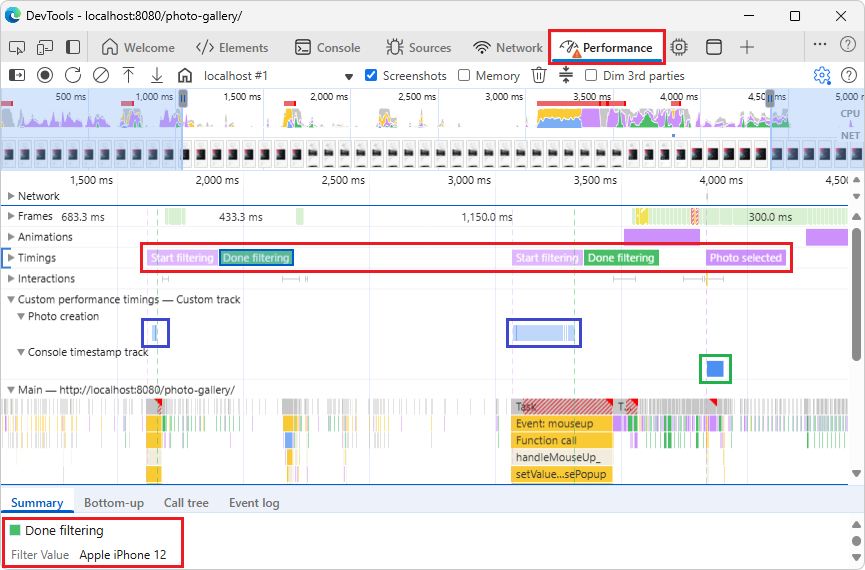
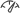
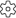
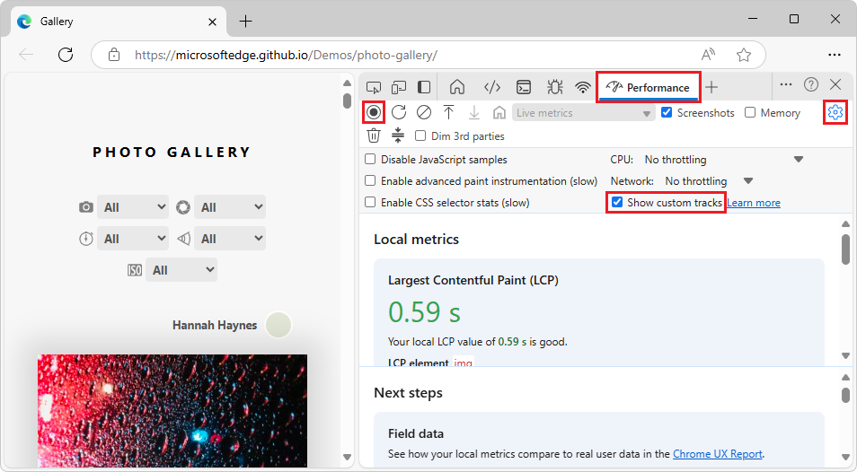
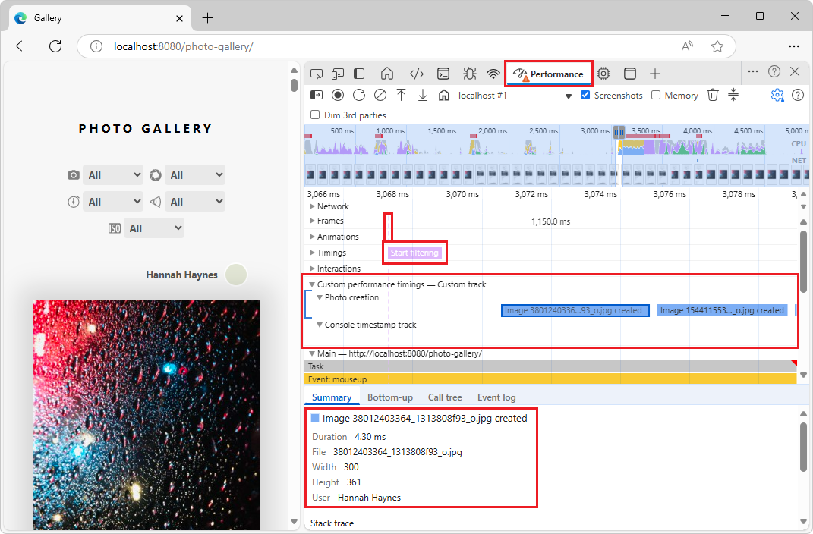
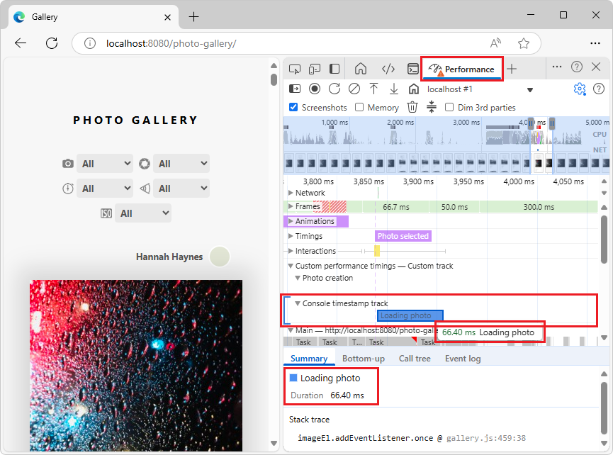
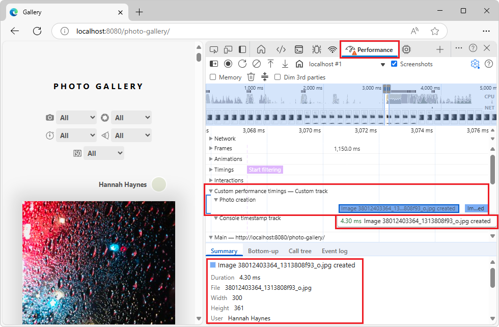
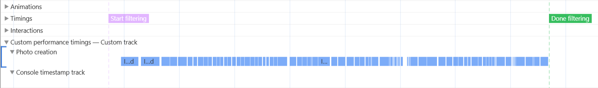
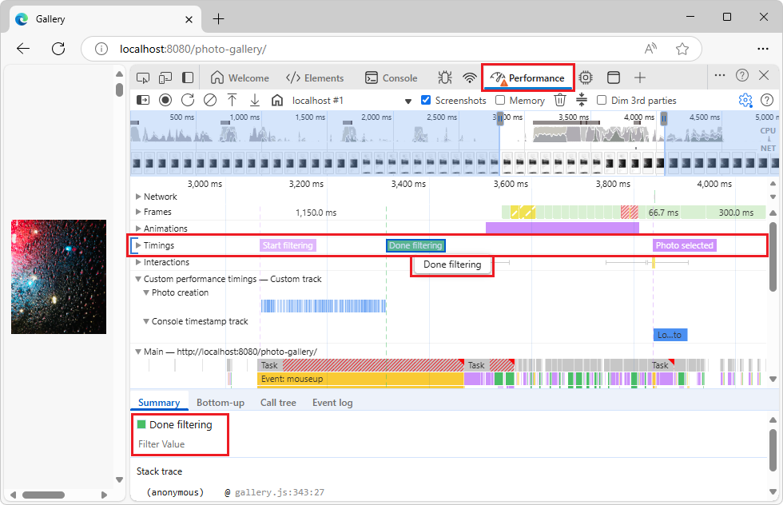

<!-- Copyright Andrés Olivares and Sofia Emelianova

   Licensed under the Apache License, Version 2.0 (the "License");
   you may not use this file except in compliance with the License.
   You may obtain a copy of the License at

       https://www.apache.org/licenses/LICENSE-2.0

   Unless required by applicable law or agreed to in writing, software
   distributed under the License is distributed on an "AS IS" BASIS,
   WITHOUT WARRANTIES OR CONDITIONS OF ANY KIND, either express or implied.
   See the License for the specific language governing permissions and
   limitations under the License.  -->
# Customize performance profile with extensibility APIs
<!-- https://developer.chrome.com/docs/devtools/performance/extension -->

**Detailed contents:**
* [Overview](#overview)
* [Key benefits](#key-benefits)
   * [Choose the right API](#choose-the-right-api)
* [Inject your data with `console.timeStamp()`](#inject-your-data-with-consoletimestamp)
* [Inject your data with the User Timings API](#inject-your-data-with-the-user-timings-api)
   * [`devtools` object](#devtools-object)
* [View your custom data in the performance profile](#view-your-custom-data-in-the-performance-profile)
* [Code examples](#code-examples)
   * [`console.timeStamp()` API examples](#consoletimestamp-api-examples)
   * [User Timings API examples](#user-timings-api-examples)
      * [Add custom tracks and entries to the timeline (`performance.measure()`)](#add-custom-tracks-and-entries-to-the-timeline-performancemeasure)
      * [Add markers to the Timings track (`performance.mark()`)](#add-markers-to-the-timings-track-performancemark)
* [See also](#see-also)


<!-- ====================================================================== -->
## Overview
<!-- https://developer.chrome.com/docs/devtools/performance/extension#overview -->

The **Performance** tool can display your own performance data, in addition to the browser's built-in metrics.  Displaying your own custom performance data in the **Performance** tool can be useful in cases such as when you are:

* Building a framework and you need to visualize internal processes.
* Developing a library and you want to track the impact of your code.
* Building a complex web application with a lot of client-side processing.
    
The performance extensibility APIs make it possible to understand what's happening in your code.

By injecting custom measurements and events, you can create tailored visualizations within the **Performance** tool.

The performance extensibility APIs are two approaches to achieve this:

1. **The `console.timeStamp()` API (extended for DevTools)**

   This API provides a high-performance method for instrumenting applications and surfacing timing data exclusively to the **Performance** tool in DevTools.  It's designed for minimal runtime overhead, making it suitable for instrumenting hot paths and production builds.  It does not add entries to the browser's internal performance timeline.

1. **The User Timings API (using `performance.mark()` and `performance.measure()`)**

   This API leverages the existing [User Timings API](https://developer.mozilla.org/docs/Web/API/Performance_API/User_timing).  It also adds entries to the browser's internal performance timeline, allowing for further analysis and integration with other performance tools; see [Performance APIs](https://developer.mozilla.org/docs/Web/API/Performance_API) at MDN.



The above screenshot has the following boxes added, to highlight the results:

* Red box in the **Timings** track: `performance.mark()`.  The custom markers are **Start filtering**, **Done filtering**, and **Photo selected**.  Vertical dashed lines span all tracks.

* Blue box in the custom **Photo creation** track: `performance.measure()`

* Green box in the custom **Console timestamp track** track: `console.timeStamp()`


<!-- ====================================================================== -->
## Key benefits
<!-- https://developer.chrome.com/docs/devtools/performance/extension#key_benefits -->

Both APIs offer:

* **Custom Tracks:** Add dedicated tracks and track groups, in a performance profile, to represent the unique performance aspects of your code.

* **Entries:** Populate these tracks with entries that clearly mark important events or the duration of specific operation.

* **Color Customization:** Use color-coding to visually distinguish different types of events or measurements at a glance.


<!-- ------------------------------ -->
#### Choose the right API
<!-- heading not upstream -->

The `console.timeStamp()` and User Timings API serve different needs.

Use the `console.timeStamp()` API when:

* Performance impact of instrumentation is a primary concern, especially in production builds.

* You need a quick and efficient way to mark durations or events without the need for extra metadata.

* You only need the data to be visualized within the **Performance** tool.

Use the User Timings API (`performance.mark()` or `performance.measure()`) when:

* You need to store extra data with each entry, and when you are already using the User Timings API.

* You need to associate rich data (tooltips, detailed properties) with your performance entries.

* You want to add visual markers to highlight specific moments.

* You require the data to be available not only in DevTools but also in the browser's internal performance timeline for broader analysis or other tools.

* You're already familiar with or using the User Timings API.

The Photo Gallery demo demonstrates all of these APIs.


<!-- ====================================================================== -->
## Inject your data with `console.timeStamp()`
<!-- https://developer.chrome.com/docs/devtools/performance/extension#inject_your_data_with_consoletimestamp -->

The `console.timeStamp()` API is extended to allow for the creation of custom timing entries in the **Performance** tool with minimal overhead, especially when DevTools is not recording a trace.

Syntax:

```javascript
console.timeStamp(label: string, 
                  start?: string|number, 
                  end?: string|number, 
                  trackName?: string, 
                  trackGroup?: string, 
                  color?: DevToolsColor);
```

* `label`:

   The label for the timing entry.

* `start` (optional):

   * If defined as a string: the name of a previously recorded timestamp (using `console.timeStamp(timeStampName)`).

   * If defined as a number: a timestamp in milliseconds relative to [Performance.timeOrigin](https://developer.mozilla.org/docs/Web/API/Performance/timeOrigin) (for example, taken with [performance.now()](https://developer.mozilla.org/docs/Web/API/Performance/now)) that represents the start time of the timing entry.

   * If undefined, the current time is used as start time.

* `end`:

   * If defined as a string: The name of a previously recorded timestamp.

   * If defined as a number: a timestamp in milliseconds relative to [Performance.timeOrigin](https://developer.mozilla.org/docs/Web/API/Performance/timeOrigin) (for example, taken with [performance.now()](https://developer.mozilla.org/docs/Web/API/Performance/now)) that represents the end time of the timing entry.

   * If undefined, the current time is used as end time.

* `trackName`:

   The name of the custom track.

* `trackGroup`:

   The name of the track group.

* `color`:

   The color of the entry.

See also:
* [Specification for console.timeStamp Extension](https://docs.google.com/document/d/1juT7esZ62ydio-SQwEVsY7pdidKhjAphvUghWrlw0II/edit?tab=t.0) - 6-parameter version of the method.
   * [console: timeStamp() static method](https://developer.mozilla.org/docs/Web/API/console/timeStamp_static) - 1-parameter version of the method.


<!-- ====================================================================== -->
## Inject your data with the User Timings API
<!-- https://developer.chrome.com/docs/devtools/performance/extension#inject_your_data_with_the_user_timings_api -->

To inject custom data, include a `devtools` object within the [detail](https://developer.mozilla.org/docs/Web/API/Performance/mark#detail) property of the `performance.mark()` method, or within the [detail](https://developer.mozilla.org/docs/Web/API/Performance/measure#detail) property of the `performance.measure()` method.  The structure of this `devtools` object determines how your data is displayed in the **Performance** tool.

* Use [performance.mark()](https://developer.mozilla.org/docs/Web/API/Performance/mark) to record an instant event or timestamp in the timeline.  You can mark the start or end of a specific operation or any point of interest that doesn't have a duration.  When you include a `devtools` object within the `detail` property, the **Performance** tool shows a custom marker in the **Timings** track.

* Use [performance.measure()](https://developer.mozilla.org/docs/Web/API/Performance/measure) to measure the duration of a task or process.  When you include a `devtools` object within the `detail` property, the **Performance** tool shows custom measurement entries in the timeline in a custom track.  If you're using `performance.mark()` as a reference point to create a `performance.measure()`, you don't need to include the `devtools` object in `performance.mark()` calls.


<!-- ------------------------------ -->
#### `devtools` object
<!-- https://developer.chrome.com/docs/devtools/performance/extension#devtools_object -->

These types define the structure of the `devtools` object for different extension features:

```javascript
type DevToolsColor =
  "primary" | "primary-light" | "primary-dark" |
  "secondary" | "secondary-light" | "secondary-dark" |
  "tertiary" | "tertiary-light" | "tertiary-dark" |
  "error";

interface ExtensionTrackEntryPayload {
  dataType?: "track-entry";        // Defaults to "track-entry"
  color?: DevToolsColor;           // Defaults to "primary"
  track: string;                   // Required: Name of the custom track
  trackGroup?: string;             // Optional: Group for organizing tracks
  properties?: [string, string][]; // Key-value pairs for detailed view
  tooltipText?: string;            // Short description for tooltip
}

interface ExtensionMarkerPayload {
  dataType: "marker";              // Required: Identifies as a marker
  color?: DevToolsColor;           // Defaults to "primary"
  properties?: [string, string][]; // Key-value pairs for detailed view
  tooltipText?: string;            // Short description for tooltip
}
```


<!-- ====================================================================== -->
## View your custom data in the performance profile
<!-- View your data in the timeline  https://developer.chrome.com/docs/devtools/performance/extension#view-custom-data -->
<!-- how to view a custom track, not how to create it -->

To see your custom data in a recorded performance profile, in the **Performance** tool, first use one of the performance extensibility APIs, and then record a profile.

To record a profile and view the custom performance data of the Photo Gallery demo page:

1. Open the [Photo Gallery](https://microsoftedge.github.io/Demos/photo-gallery/) demo webpage in a new window or tab.

   Or, to be able to modify the sample code:
   1. Clone the "MicrosoftEdge / Demos" repo, per [Clone the Edge Demos repo to your drive](../samples/index.md#clone-the-edge-demos-repo-to-your-drive) in _Sample code for DevTools_.
   1. Start a localhost server in the cloned `/demos/` directory, per [Start the localhost server](../samples/index.md#start-the-localhost-server), in _Sample code for DevTools_.
   1. In the browser, go to `http://localhost:8080/photo-gallery/` or equivalent, in a new window or tab.

1. Right-click the webpage, and then select **Inspect**.

   DevTools opens.

1. In DevTools, select the **Performance** () tool.

1. In the **Performance** tool, click the **Capture settings** () button, and then make sure that the **Show custom tracks** checkbox is selected:

   

1. In the **CPU throttling** dropdown list, select **4x slowdown - recommended**.

   A throttling warning indicator is added to the **Performance** tab.

1. Refresh the page, to clear any selections.

1. Click the **Record** () button.

1. At the top of the demo page, in the **Camera** () dropdown menu on the left, change from **All** to **Apple iPhone 12**.

1. Change the **Camera** filter back to **All**.

1. Click the first photo.

   The photo expands.

1. In DevTools, click the **Stop** button.

   The profile is displayed.

1. Click **Customize and control DevTools** (), and then next to **Dock location**, select **Undock into separate window** ().

   DevTools is detached into its own window, so it's easier to see more data.

1. Scroll down to the **Custom performance timings — Custom track** track group, and expand it.

1. Expand the custom tracks:
   * **Photo creation**
   * **Console timestamp track**

1. Use the mouse and arrow keys to shift and zoom the profile, to display the custom performance measures:

   

1. Hover over a marker in a custom track, such as a **Loading** marker in the **Loading** track.

   A custom tooltip is displayed, including duration and caption.

1. Select a marker in a custom track.

   In the **Summary** tab at the bottom of the **Performance** tool, details are shown for the marker.

The code that defines these custom performance measures is shown in [Add custom tracks and entries to the timeline (`performance.measure()`)](#add-custom-tracks-and-entries-to-the-timeline-performancemeasure), below.


<!-- ====================================================================== -->
## Code examples
<!-- https://developer.chrome.com/docs/devtools/performance/extension#code_examples -->

Below are a few examples of how to use the API to add your own data to the **Performance** tool by using each available mechanism.


<!-- ------------------------------ -->
#### `console.timeStamp()` API examples
<!-- https://developer.chrome.com/docs/devtools/performance/extension#consoletimestamp_api_examples -->

For example, in [photo-gallery/gallery.js](https://github.com/MicrosoftEdge/Demos/blob/main/photo-gallery/gallery.js), the `loadPhoto()` function defines a `startTime` and `endTime` by calling `performance.now()`, and then calls `console.timeStamp()` to show the time it takes to load a photo after that photo was clicked:

```javascript
// Load a photo and return a promise that resolves when the photo is loaded.
function loadPhoto(fileName) {
  // Record the start time of the photo loading for performance tracking.
  const startTime = performance.now();

  return new Promise(resolve => {
    // Load the image by creating a new image element.
    const imageEl = document.createElement("img");
    imageEl.src = fileName;

    // Listen for the load event to resolve the promise when the image is loaded.
    imageEl.addEventListener('load', () => {
      // Record the end time of the photo loading.
      const endTime = performance.now();

      // Display the photo loading duration in the Performance tool, by using console.timeStamp.
      console.timeStamp("Loading photo",              // label
                        startTime,                    // start
                        endTime,                      // end
                        "Console timestamp track",    // trackName
                        "Custom performance timings", // trackGroup
                        "primary-dark");              // color

      resolve(imageEl);
    }, { once: true });
  });
}
```

To view the resulting profile: 

1. Do the steps in [View your custom data in the performance profile](#view-your-custom-data-in-the-performance-profile), above.

1. Scroll down to the **Custom performance timings — Custom track** track group, and expand it.

1. Expand the **Console timestamp track**.

1. Use the mouse and arrow keys to shift and zoom the profile, to display the custom performance measures:

   

   The **Loading photo** event was created by using `console.timeStamp()`.  This event has a duration, because it's created with a start and an end time.  This event corresponds to the time it takes to load the full-screen version of the photo that you clicked.

See also:
* [Inject your data with `console.timeStamp()`](#inject-your-data-with-consoletimestamp) (above) - syntax.
* [performance.now()](https://developer.mozilla.org/docs/Web/API/Performance/now)


<!-- ------------------------------ -->
#### User Timings API examples
<!-- https://developer.chrome.com/docs/devtools/performance/extension#user_timings_api_examples -->

In the next sections, see the examples of code that showcase how to add the following to the performance timeline:
* [Add custom tracks and entries to the timeline (`performance.measure()`)](#add-custom-tracks-and-entries-to-the-timeline-performancemeasure)
* [Add markers to the Timings track (`performance.mark()`)](#add-markers-to-the-timings-track-performancemark)


<!-- ---------- -->
###### Add custom tracks and entries to the timeline (`performance.measure()`)
<!-- https://developer.chrome.com/docs/devtools/performance/extension#tracks -->

Create custom tracks and populate them with entries to visualize your performance data in a custom track.

For example, in [photo-gallery/gallery.js](https://github.com/MicrosoftEdge/Demos/blob/main/photo-gallery/gallery.js), the `populateGallery()` function defines a `startTime` and `endTime` by calling `performance.now()`, and then calls `performance.measure()` to show the time it takes for creating a photo in the gallery:

```javascript
// Populate the gallery with the given images.
function populateGallery(images) {
  // Empty the existing gallery elements.
  galleryEl.innerHTML = '';

  // Iterate over the images.
  images.forEach(({ file, user, description, w, h, meta }) => {
    // Record the start time of this image creation for performance tracking.
    const startTime = performance.now();

    // Create the necessary DOM elements, and append them to the gallery.
    const liEl = createImageDOM(file, user, description, meta, w, h);
    galleryEl.appendChild(liEl);

    // Record the end time of this image creation.
    const endTime = performance.now();

    // Display the image creation duration in the Performance tool
    // by using the performance.measure API, with the devtools
    // object.
    performance.measure(`Image ${file} created`, {
      start: startTime,
      end: endTime,
      detail: {
        devtools: {
          dataType: "track-entry",
          color: "primary",
          trackGroup: "Custom performance timings",
          track: "Photo creation",
          properties: [
            ['File', file],
            ['Width', w],
            ['Height', h],
            ['User', user],
          ],
          tooltipText: `Image ${file} created`
        }
      },
    });
  });
}
```

To view the resulting profile: 

1. Do the steps in [View your custom data in the performance profile](#view-your-custom-data-in-the-performance-profile), above.

1. Scroll down to the **Custom performance timings — Custom track** track group, and expand it.

1. Expand the **Photo creation** track.

1. Use the mouse and arrow keys to shift and zoom the profile, to display the custom performance measures.

   This results in the following custom track entry in the performance timeline, along with its tooltip text and properties:

   

   The events that are created by `performance.measure()` have a short duration, so you must zoom in to see them in the profile.  Each of these events record the creation of an image, which happens when you change the filter (dropdown list) value, and when the whole gallery UI is refreshed.

   The **Photo creation** events appear between the `Start filtering` and `Done filtering` performance marks that result from `performance.mark()` (covered in the next section):

   

See also:
* [performance.measure()](https://developer.mozilla.org/docs/Web/API/Performance/measure)
* [performance.now()](https://developer.mozilla.org/docs/Web/API/Performance/now)


<!-- ---------- -->
###### Add markers to the Timings track (`performance.mark()`)
<!-- https://developer.chrome.com/docs/devtools/performance/extension#markers -->

Visually highlight specific points of interest in the timeline with custom markers that span across all tracks.

For example, in [photo-gallery/gallery.js](https://github.com/MicrosoftEdge/Demos/blob/main/photo-gallery/gallery.js), an event listener handles `input` events on the demo page's filter dropdown lists.  The event listener calls `performance.mark()` twice: before the new filter is applied, and after the new filter has been applied:

```javascript
// Handle input events on the filter selects.
addEventListener('input', e => {
  // Check if the input event is from a filter select.
  // If not, return early.
  const filter = e.target.closest('.filter select');
  if (!filter) {
    return;
  }

  // Add a mark in the Performance tool's recorded profile to
  // indicate that a filter will be applied.
  performance.mark("Start filtering", {
    detail: {
      devtools: {
        dataType: "marker",
        color: "secondary",
        properties: [
          ['Filter Value', filter.value]
        ],
        tooltipText: "Start filtering"
      }
    }
  });

  // Reset the other filters.
  filterEl.querySelectorAll('.filter select').forEach(select => {
    if (select !== filter) {
      select.selectedIndex = 0;
    }
  });

  // Apply the filter based on the selected value.
  filterBy(filter);

  // Add a mark in the Performance tool's recorded profile to
  // indicate that a filter was applied.
  performance.mark("Done filtering", {
    detail: {
      devtools: {
        dataType: "marker",
        color: "tertiary",
        properties: [
          ['Filter Value', filter.value]
        ],
        tooltipText: "Done filtering"
      }
    }
  });
});

// Handle click events on photos.
addEventListener('click', e => {
  const clickedPhoto = e.target.tagName === 'IMG' && e.target.closest('.photo');
  if (!clickedPhoto) {
    return;
  }

  // Add a mark in the Performance tool's recorded profile to
  // indicate that a photo was clicked.
  performance.mark("Photo selected", {
    detail: {
      devtools: {
        dataType: "marker",
        color: "secondary-dark",
        properties: [
          ['photo', clickedPhoto.src]
        ],
        tooltipText: "Photo selected"
      }
    }
  });

  selectPhoto(clickedPhoto);
});
```

To view the resulting profile: 

1. Do the steps in [View your custom data in the performance profile](#view-your-custom-data-in-the-performance-profile), above.

1. Use the mouse and arrow keys to shift and zoom the profile, to display the custom performance measures.

   The **Timings** track displays **Start filtering**, **Done filtering**, and **Photo selected** custom markers:

   

   The events (markers) created by `performance.mark()` have no duration; they just mark some interesting events in a profile: the start and end of a filter change (using the demo page's dropdown menus), and the moment a photo was selected (the **Photo selected** marker).

See also:
* [Performance: mark() method](https://developer.mozilla.org/docs/Web/API/Performance/mark)


<!-- ====================================================================== -->
## See also
<!-- not upstream -->
<!-- all links in article -->

MDN:
* [Specification for console.timeStamp Extension](https://docs.google.com/document/d/1juT7esZ62ydio-SQwEVsY7pdidKhjAphvUghWrlw0II/edit?tab=t.0) - 6-parameter version of the method.
   * [console: timeStamp() static method](https://developer.mozilla.org/docs/Web/API/console/timeStamp_static) - 1-parameter version of the method.
* [Performance APIs](https://developer.mozilla.org/docs/Web/API/Performance_API)
   * [User timing](https://developer.mozilla.org/docs/Web/API/Performance_API/User_timing) in Web APIs > Performance APIs.
* [Performance: mark() method](https://developer.mozilla.org/docs/Web/API/Performance/mark)
* [Performance: measure() method](https://developer.mozilla.org/docs/Web/API/Performance/measure)
* [Performance: now() method](https://developer.mozilla.org/docs/Web/API/Performance/now)
* [Performance: timeOrigin property](https://developer.mozilla.org/docs/Web/API/Performance/timeOrigin)

Demos:
* [Photo Gallery](https://microsoftedge.github.io/Demos/photo-gallery/) - the running web app.
   * [photo-gallery/gallery.js](https://github.com/MicrosoftEdge/Demos/blob/main/photo-gallery/gallery.js) - Source code.


<!-- ====================================================================== -->
> [!NOTE]
> Portions of this page are modifications based on work created and [shared by Google](https://developers.google.com/terms/site-policies) and used according to terms described in the [Creative Commons Attribution 4.0 International License](https://creativecommons.org/licenses/by/4.0). 
> The original page is found [here](https://developer.chrome.com/docs/devtools/performance/extension) and is authored by Andrés Olivares and Sofia Emelianova.

[](https://creativecommons.org/licenses/by/4.0)
This work is licensed under a [Creative Commons Attribution 4.0 International License](https://creativecommons.org/licenses/by/4.0).
