<!-- Copyright Kayce Basques

   Licensed under the Apache License, Version 2.0 (the "License");
   you may not use this file except in compliance with the License.
   You may obtain a copy of the License at

       https://www.apache.org/licenses/LICENSE-2.0

   Unless required by applicable law or agreed to in writing, software
   distributed under the License is distributed on an "AS IS" BASIS,
   WITHOUT WARRANTIES OR CONDITIONS OF ANY KIND, either express or implied.
   See the License for the specific language governing permissions and
   limitations under the License.  -->
# Analyze runtime performance (tutorial)
<!-- https://developer.chrome.com/docs/devtools/performance -->

_Runtime performance_ is how your webpage performs when it's running, as opposed to loading.  The following tutorial teaches you how to use the DevTools **Performance** tool to analyze runtime performance.

The skills you learn in this tutorial are useful for analyzing loading, interactivity, and visual stability of your web content, which are also key indicators for Core Web Vitals.  Each of the Core Web Vitals represents a distinct facet of the user experience, is measurable in the field, and reflects the real-world experience of a critical user-centric outcome.  You can see these Core Web Vitals in the **Performance** tool.

See also:
* [Web Vitals](https://web.dev/articles/vitals)<!-- web.dev link ok, only doc'd there --> at web.dev.
* [Terminology](./overview.md#terminology) in _Performance tool: Analyze your website's performance_.
* [Optimize website speed using Lighthouse](../speed/get-started.md)


<!-- ====================================================================== -->
## Step 1: Open the demo in InPrivate mode, and open DevTools
<!-- https://developer.chrome.com/docs/devtools/performance#get-started -->

In the following tutorial, you open DevTools on the "Sluggish Animation" demo webpage and use the **Performance** tool to find a performance bottleneck on the webpage.

1. Right-click the link [Sluggish Animation](https://microsoftedge.github.io/Demos/devtools-performance-get-started/) and then select **Open link in InPrivate window**.

   You'll profile this demo webpage, which shows a variable number of icons moving up and down.  If you want to view the source code for the demo, see [MicrosoftEdge / Demos > devtools-performance-get-started](https://github.com/MicrosoftEdge/Demos/tree/main/devtools-performance-get-started).

   InPrivate mode ensures that the browser runs in a clean state.  For example, if you have a lot of extensions installed, those extensions might create noise in your performance measurements.  If you want more information, see [Browse InPrivate in Microsoft Edge](https://support.microsoft.com/microsoft-edge/browse-inprivate-in-microsoft-edge-cd2c9a48-0bc4-b98e-5e46-ac40c84e27e2).

1. Right-click the demo webpage and then select **Inspect**.

   DevTools opens:

   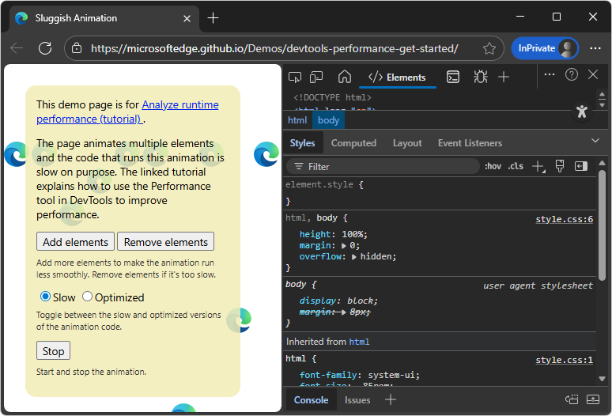

1. In the upper right of DevTools, click the **Customize and control DevTools** () button, and then next to **Dock location**, click the **Undock into separate window** () button.


<!-- ====================================================================== -->
## Step 2: Throttle the CPU, to simulate a mobile CPU
<!-- https://developer.chrome.com/docs/devtools/performance#simulate_a_mobile_cpu -->

Mobile devices have much less CPU power than desktops and laptops.  Whenever you profile a webpage, use CPU throttling to simulate how your webpage performs on mobile devices.

Throttle your desktop machine's CPU to simulate a mobile CPU, as follows:

1. In DevTools, open the **Performance** () tool.

1. Click the **Capture settings** () button.

   DevTools displays settings dropdown menus and checkboxes related to capturing performance metrics.

1. In the **CPU throttling** dropdown menu in the upper left, select the recommended slowdown value, such as **4x slowdown - recommended**:

   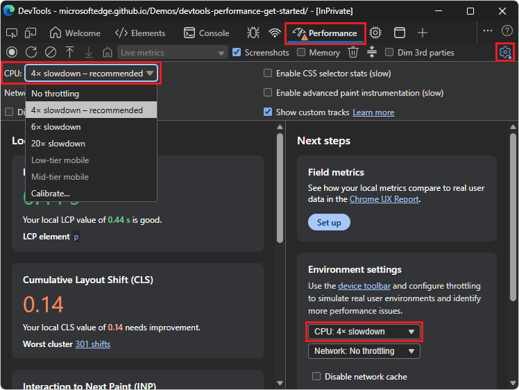

   Or, in the **Environment settings** section in the lower right, in the **CPU throttling** dropdown menu, select the recommended slowdown value, such as **4x slowdown - recommended**.  The two instances of the dropdown menu are linked.

   The recommended throttling factor is calculated by DevTools, based on your machine.  To ensure that a webpage works well on even lower-end mobile devices, select a greater slowdown in the **CPU throttling** dropdown, such as **6x slowdown**.

   DevTools throttles your CPU so that it's slower than usual.

   A throttling warning icon (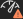) is displayed on the **Performance** tool's tab, to remind you that throttling is enabled.

1. Click the **Capture settings** () button.

   The settings dropdown menus and checkboxes related to capturing performance metrics are hidden.


<!-- ====================================================================== -->
## Step 3: Fill the webpage with an ideal number of icons
<!-- https://developer.chrome.com/docs/devtools/performance#set_up_the_demo -->

Before recording the performance, fill the demo webpage with an ideal number of icons to help compare the unoptimized vs. optimized code.

To create a pair of performance recordings to compare the unoptimized vs. optimized code, the demo webpage first needs to be displaying a certain number of moving icons, depending on your machine.  There should be enough icons so that you can clearly see a difference in speed and smoothness of animation when you alternate between selecting the unoptimized (**Slow**) code and the **Optimized** code.

To fill the demo webpage with an ideal number of icons:

1. Switch to the Sluggish Animation demo webpage.

   The **Slow** option button is initially selected, by default, so that the unoptimized code is used.

1. Click the **Add elements** button multiple times, until the blue icons start moving very slowly and erratically.

1. Select the **Optimized** option button.

   The icons move more quickly and smoothly.

1. If you don't see a noticeable difference between using the unoptimized (**Slow**) and **Optimized** code, try clicking the **Remove elements** button.

   If there are too many icons, that maxes out the CPU and you don't see a major difference in the results for the two versions of the code.


<!-- ====================================================================== -->
## Step 4: Record the unoptimized code's performance
<!-- https://developer.chrome.com/docs/devtools/performance#record -->

When you run the optimized version of the webpage code, the blue icons move faster.  Why is that?  Both versions of the code are supposed to move the icons the same amount of space in the same amount of time.

Take a recording in the **Performance** tool to learn how to detect the performance bottleneck in the _unoptimized_ (**Slow**) version of the code:

1. In the demo webpage, select the **Slow** option button.

   The icons move more slowly and erratically.  The unoptimized code is running and will be profiled, and there is an ideal number of icons to demonstrate poor performance and help find the performance bottleneck.

1. In the DevTools window, in the **Performance** tool, click the **Record** () button.

   DevTools captures performance metrics as the webpage runs:

   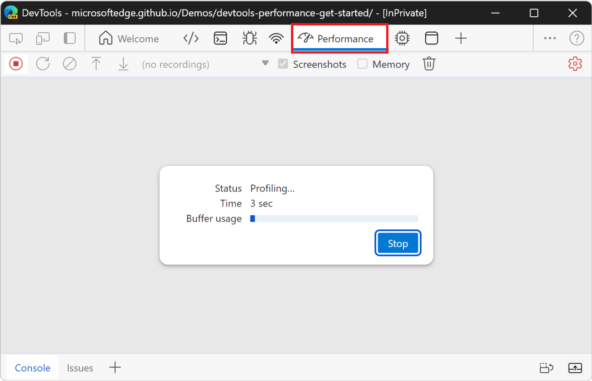

   The CPU is still throttled.  (These screenshots<!-- todo: redo --> should show the throttling warning icon () in the **Performance** tool's tab in the **Activity Bar**.)

1. Wait a few seconds, and then click the **Stop** () icon, or the **Stop** button.

   DevTools stops recording, processes the data, then displays the results in the **Performance** tool:

   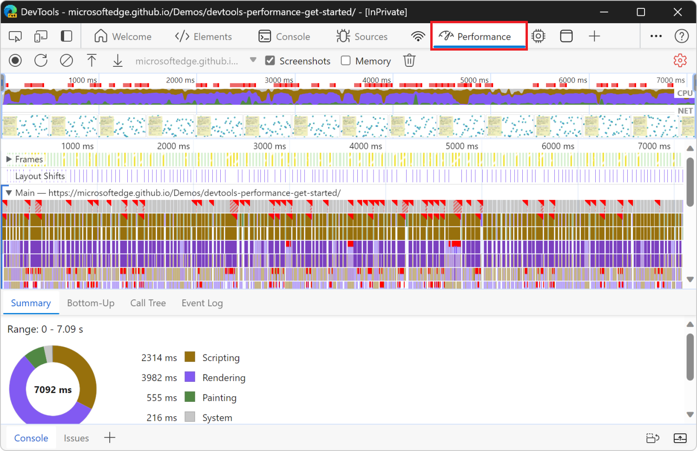

These performance results show an overwhelming amount of data, but it will all make more sense shortly.


<!-- ====================================================================== -->
## Step 5: Analyze the unoptimized code's performance
<!-- https://developer.chrome.com/docs/devtools/performance#analyze -->

Once you have a recording of the webpage's performance, you can assess the webpage's performance and find the cause of any performance issues.

1. In the top of the **Performance** tool, examine the **CPU** chart:

   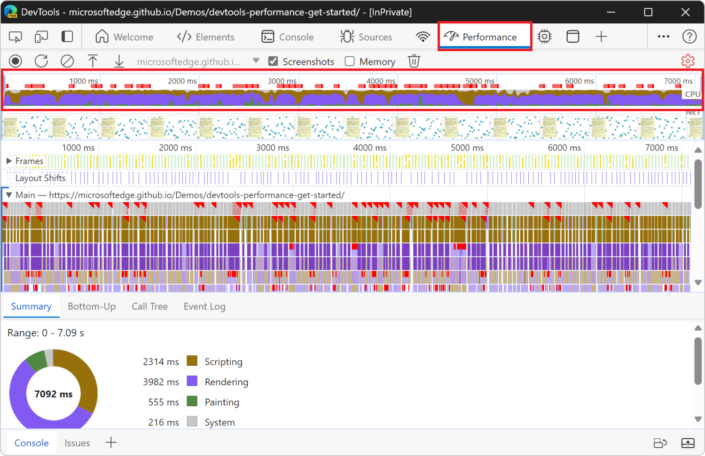

   The colors in the **CPU** chart correspond to the colors in the **Summary** panel, at the bottom of the **Performance** tool.  The **CPU** chart shows that these regions make up a large area, meaning that the CPU was maxed out during the recording.  Whenever the CPU is maxed out for long periods, that's an indicator that the webpage isn't performing well.

1. Hover over the **CPU** or **NET** charts:

   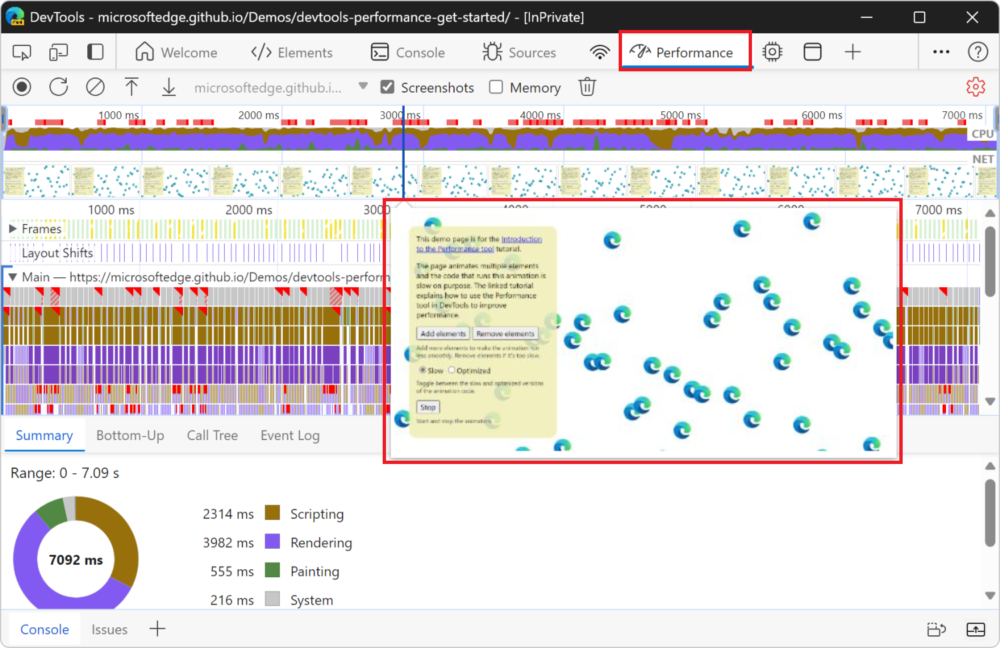

   DevTools shows a screenshot of the webpage at that point in time.

1. Move your mouse left and right to replay the recording.

   This action is called _scrubbing_, and it's useful for manually analyzing the progression of the performance recording.


<!-- ====================================================================== -->
## Step 6: Display the Frame Rendering Stats overlay
<!-- https://developer.chrome.com/docs/devtools/performance#bonus_analyze_the_optimized_version -->

Another handy tool is the **Frame Rendering Stats** overlay, sometimes called the _FPS meter_.  The **Frame Rendering Stats** overlay provides realtime estimates for frames per second (FPS) while the webpage runs.  The **Frame Rendering Stats** overlay is not required for this tutorial, but may provide helpful insight.

1. In the upper right of DevTools, click the **Customize and control DevTools** () button, and then select **Toggle Quick View panel**.

   Or, press **Esc** once or twice.

   The **Quick View** panel is displayed at the bottom of DevTools.

1. In the **Quick View** toolbar, click the **More tools** () button, and then select **Rendering**.

   The **Rendering** tool opens in the **Quick View** panel.

1. In the **Rendering** tool, select the **Frame Rendering Stats** checkbox:

   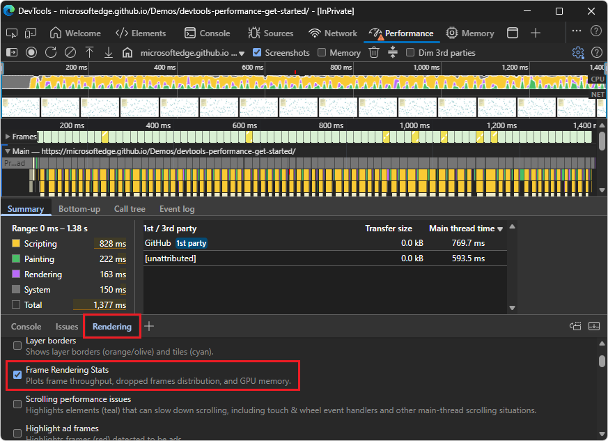

1. Switch to the demo webpage.

   The Frame Rendering Stats overlay is displayed:

   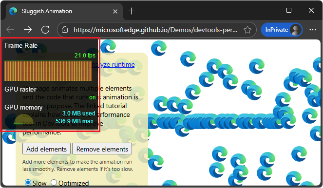

   The overlay has the following sections:
   * **Frame Rate**
   * **GPU raster**
   * **GPU memory**

   **Turn off the overlay:**

1. Switch to the DevTools window.

1. In the **Rendering** tool, clear the **Frame Rendering Stats** checkbox.

1. In the upper right of DevTools, click the **Customize and control DevTools** () button, and then select **Toggle Quick View panel**.

   Or, press **Esc**.

   The **Quick View** panel is hidden.

See also:
* [Rendering tool, to see what a webpage looks like with different display options or vision deficiencies](../rendering-tools/rendering-tool.md)


<!-- ====================================================================== -->
## Step 7: Find the performance bottleneck
<!-- https://developer.chrome.com/docs/devtools/performance#find_the_bottleneck -->

After you verified that the animation isn't performing well, the next step is to answer the question "why?"

1. At the bottom of the **Performance** tool, select the **Summary** tab:

   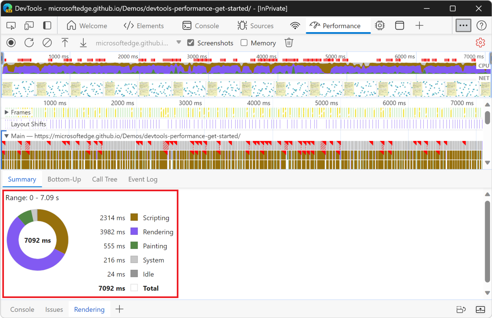

   When no events are selected, the **Summary** tab displays a breakdown of activity.  The webpage spent most of the time rendering.  Since performance is the art of doing less work, your goal is to reduce the amount of time spent doing rendering work.

1. In the **Performance** tool, click the **Main** row, to expand it.

   DevTools displays a flame chart of activity on the main thread, over time:

   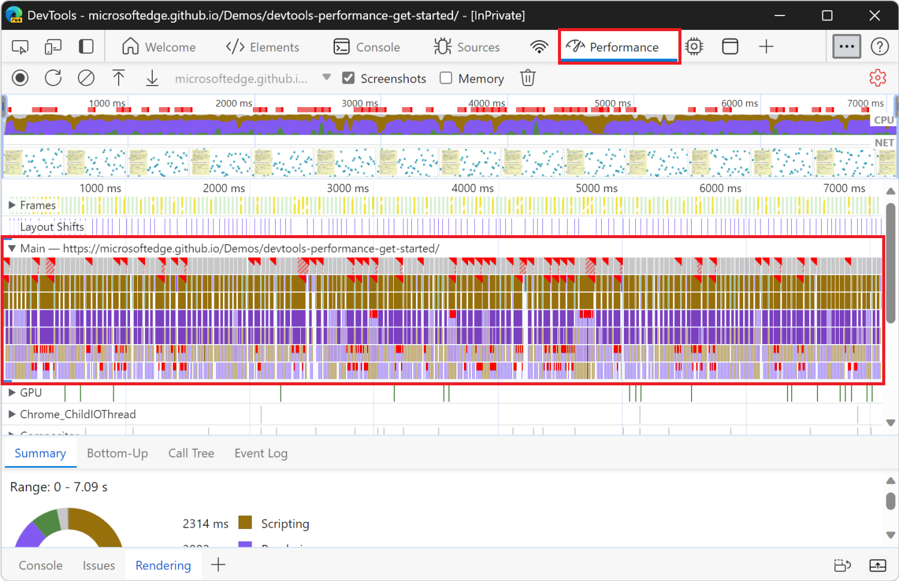

   * The x-axis represents the recording, over time.  Each bar represents an event.  A wider bar means that event took longer.

   * The y-axis represents the call stack.  When events are stacked on top of each other, it means that the upper events caused the lower events.

   There's a lot of data in the recording.

1. In the **Overview** area below the toolbar, click and drag horizontally, to zoom into a portion of the recording:

   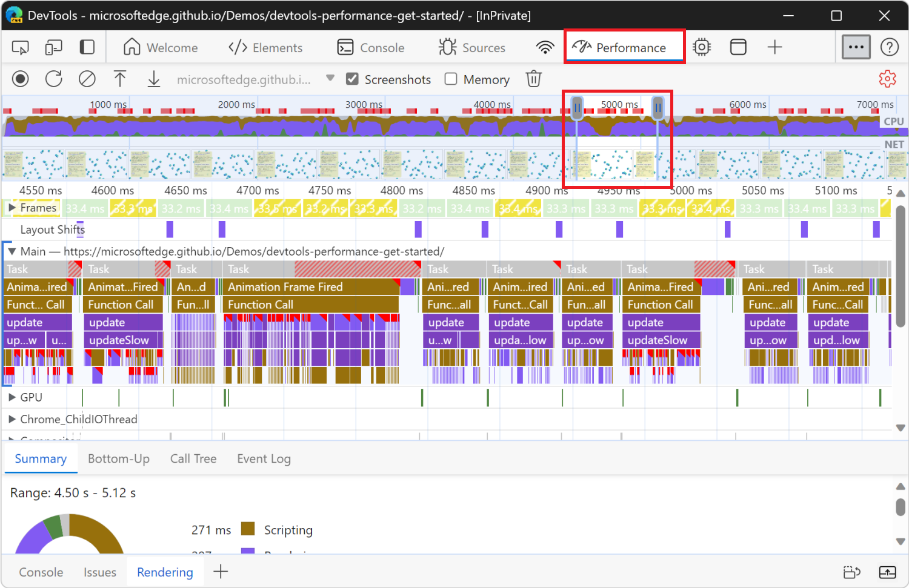

   The **Overview** area includes the **CPU** and **NET** charts (indicated on the right).

   The **Main** section (below the **Overview**) and the **Summary** tab only display information for the selected portion of the recording.

   Another way to change the selected area is to put focus on the **Main** section, click the background or an event, and then press:
   * `W` to zoom in, or `S` to zoom out.
   * `A` to move the selection left, or `D` to move the selection right.

1. Click an **Animation Frame Fired** event.

   When a red triangle is displayed at the top right of an event, it's a warning that there might be an issue related to the event.  The **Animation Frame Fired** event occurs whenever a [requestAnimationFrame() callback](https://developer.mozilla.org/docs/Web/API/window/requestAnimationFrame) is run.

   The **Summary** panel displays information about that event:

   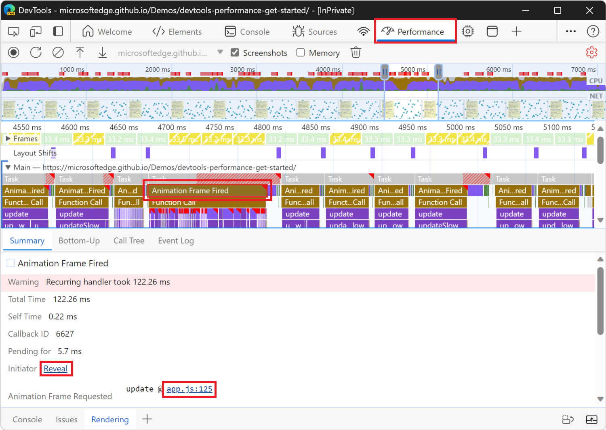

1. Click the **Reveal** link.

   DevTools highlights the event that initiated the **Animation Frame Fired** event.

1. Click the **app.js:125** link.

   The relevant line of source code is displayed in the **Sources** tool.

1. Zoom in on the **Animation Frame Fired** event and its child events, by using the mouse wheel or trackpad.

   Or, press **W**.

   You can now see the events that occur when a single frame of the animation is rendered. The **update** function is called, which, in turn, calls the **updateSlow** function, which triggers many **Recalculate Style** and **Layout** events:
   
   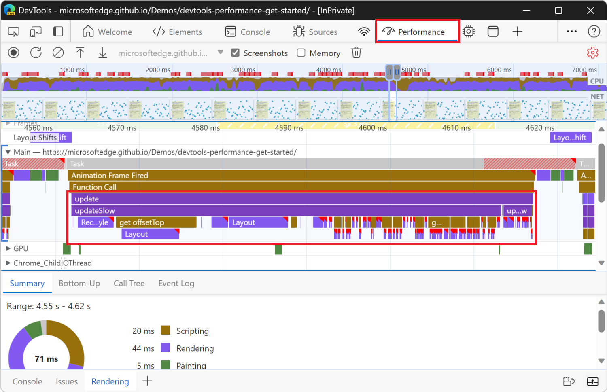

1. Click one of the purple **Layout** events.

   DevTools provides more information about the event in the **Summary** panel.  There's a warning about "forced reflows" (re-layout).

1. In the **Summary** panel, click the **app.js:104** link under **Layout Forced**.

   DevTools takes you to the line of code that forced the layout in the **Sources** tool:

   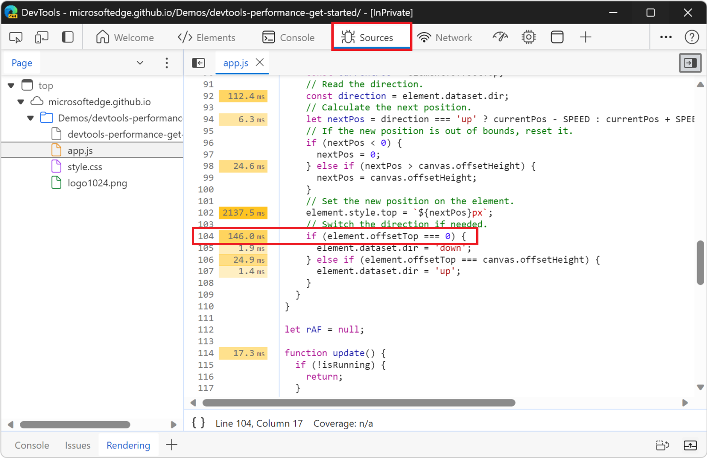

The problem with the unoptimized code is that, in each animation frame, it changes the style for each icon, and then queries the position of each icon on the webpage. Because the styles changed, the browser doesn't know if each icon position changed, so it has to re-layout the icon in order to compute the new position.

See also:
* [Avoid forced synchronous layouts](https://web.dev/articles/avoid-large-complex-layouts-and-layout-thrashing#avoid_forced_synchronous_layouts)<!-- web.dev link ok, no perf doc'n at mdn --> in _Avoid large, complex layouts and layout thrashing_ at web.dev.


<!-- ====================================================================== -->
## Step 8: Record the optimized code's performance

You recorded the _unoptimized_ code performance, above.

Record the optimized code performance, as follows:

1. Click **Optimized** on the demo webpage to turn on the optimized code.

1. In the DevTools window, in the **Performance** tool, click the **Record** () button.

   DevTools captures performance metrics as the webpage runs.

1. Wait a few seconds, and then click the **Stop** icon () or the **Stop** button.

   DevTools stops recording, processes the data, then displays the results in the **Performance** tool.


<!-- ====================================================================== -->
## Step 9: Analyze the optimized code's performance

*  Using the workflows and tools that you just learned, analyze the results in the performance, like in [Step 5: Analyze the unoptimized code's performance](#step-5-analyze-the-unoptimized-codes-performance), above.

   From the improved framerate to the reduction in events in the flame chart in the **Main** section, the optimized version of the app does much less work, resulting in better performance.


<!-- ====================================================================== -->
## Step 10: Analyze the unoptimized code

Compare this snippet of JavaScript from the unoptimized version of the app:

```javascript
// Read the current position.
const currentPos = element.offsetTop;
// Read the direction.
const direction = element.dataset.dir;
// Calculate the next position.
let nextPos = direction === 'up' ? currentPos - SPEED : currentPos + SPEED;

// If the new position is out of bounds, reset it.
if (nextPos < 0) {
  nextPos = 0;
} else if (nextPos > canvas.offsetHeight) {
  nextPos = canvas.offsetHeight;
}

// Set the new position on the element.
element.style.top = `${nextPos}px`;

// Switch the direction if needed.
if (element.offsetTop === 0) {
  element.dataset.dir = 'down';
} else if (element.offsetTop === canvas.offsetHeight) {
  element.dataset.dir = 'up';
}
```

The above code snippet runs on every frame of the browser rendering loop, for each blue icon on the webpage.  The `element` variable references a single blue icon.

In this unoptimized version, we create a `nextPos` variable that's set to the current position of the icon, to which we add some distance.  The current position of the icon is read by using `element.offsetTop`.

After making sure that the icon is still within the bounds of the webpage, we set its new position by using `element.style.top`, which sets inline styles on the element.

Finally, we read `element.offsetTop` again, to adjust the direction of the icon.


<!-- ====================================================================== -->
## Step 11: Analyze the optimized code

The optimized code uses a different sequence of actions to do less work. Here is the same snippet of JavaScript from the optimized version of the app: 

```javascript
// Read the current position.
const currentPos = parseFloat(element.style.transform.match(/[0-9.]+/)[0]);
// Read the direction.
const direction = element.dataset.dir;
// Calculate the next position.
let nextPos = direction === 'up' ? currentPos - (SPEED * 100 / canvasHeight) : currentPos + (SPEED * 100 / canvasHeight);

// If the new position is out of bounds, reset it, and switch the direction.
if (nextPos < 0) {
  nextPos = 0;
  element.dataset.dir = 'down';
} else if (nextPos > 100) {
  nextPos = 100;
  element.dataset.dir = 'up';
}

// Set the new position on the element.
element.style.transform = `translateY(${nextPos}vh)`;
```

In the optimized version, we first set the value of the `nextPos` variable by reading `element.style.transform` instead of using `element.offsetTop`.  Using the element's inline style is faster, because reading `element.offsetTop` forces the browser engine to know where all the elements are on the webpage, which requires the engine to recalculate the styles and the layout.

We then adjust the direction of the icon, but this time we don't read `element.offsetTop` again like done in the unoptimized version.

Finally, we set the new position of the icon, but this time we use `element.style.transform` instead of `element.style.top`. Using `element.style.transform` is faster, because the CSS `transform` property can be applied by the browser rendering engine without having to recalculate the layout of the webpage. When using the `transform` property, the browser considers each icon as an individual layer, and then displays these layers in the correct positions by re-compositing the final image.

See also:
* [Avoid properties that trigger layout or paint](https://web.dev/articles/animations-guide#triggers)<!-- web.dev link ok, not doc'd at mdn --> in _How to create high-performance CSS animations_ at web.dev.
* [Transitioning opacity](https://developer.mozilla.org/docs/Web/CSS/opacity#transitioning_opacity) in _opacity_ at MDN.


<!-- ====================================================================== -->
## Step 12: Reset DevTools settings

1. Switch to the undocked DevTools window.

1. In the **Performance** tool, click the **Capture settings** () button.

   DevTools displays settings dropdown menus and checkboxes related to capturing performance metrics.

1. In the **CPU throttling** dropdown menu in the upper left, select **No throttling**.

   DevTools stops throttling the CPU.  The warning icon is removed from the **Performance** tool's tab.

1. In the upper right of DevTools, click the **Customize and control DevTools** () button, and then next to **Dock location**, click the **Dock to right** () button.


<!-- ====================================================================== -->
## Next steps
<!-- https://developer.chrome.com/docs/devtools/performance#next_steps -->

To get more comfortable with the **Performance** tool, practice profiling your webpages and analyzing the results.

If you have any questions about your results, in the **Activity Bar**, select **Help** () > **Feedback**.  Or, press **Alt+Shift+I** (Windows, Linux) or **Option+Shift+I** (macOS).
 
Or, [file an issue on the MicrosoftEdge / DevTools repo](https://github.com/MicrosoftEdge/DevTools/issues).

In your feedback, include screenshots or links to reproducible webpages, if possible.

There are many ways to improve runtime performance.  This article focused on one particular animation bottleneck to give you a focused tour of the **Performance** tool, but it's only one of many bottlenecks you may encounter.


<!-- ====================================================================== -->
> [!NOTE]
> Portions of this page are modifications based on work created and [shared by Google](https://developers.google.com/terms/site-policies) and used according to terms described in the [Creative Commons Attribution 4.0 International License](https://creativecommons.org/licenses/by/4.0). 
> The original page is found [here](https://developer.chrome.com/docs/devtools/performance) and is authored by Kayce Basques.

[](https://creativecommons.org/licenses/by/4.0)
This work is licensed under a [Creative Commons Attribution 4.0 International License](https://creativecommons.org/licenses/by/4.0).
