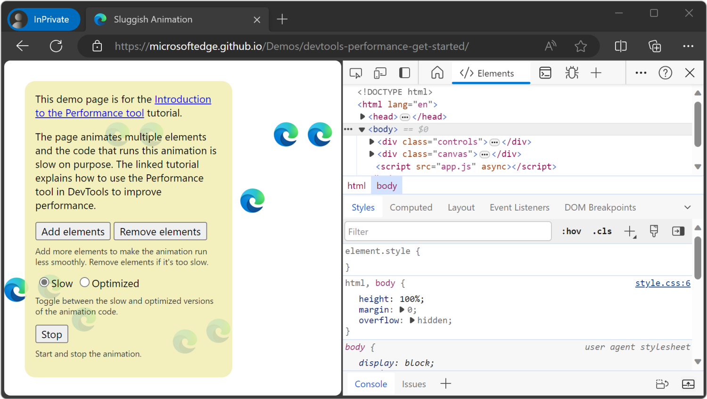
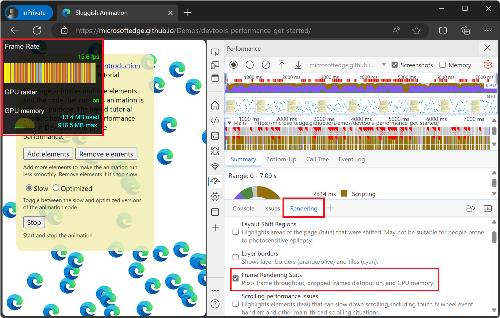

<!-- Copyright Kayce Basques

   Licensed under the Apache License, Version 2.0 (the "License");
   you may not use this file except in compliance with the License.
   You may obtain a copy of the License at

       https://www.apache.org/licenses/LICENSE-2.0

   Unless required by applicable law or agreed to in writing, software
   distributed under the License is distributed on an "AS IS" BASIS,
   WITHOUT WARRANTIES OR CONDITIONS OF ANY KIND, either express or implied.
   See the License for the specific language governing permissions and
   limitations under the License.  -->
# Analyze runtime performance (tutorial)
<!-- https://developer.chrome.com/docs/devtools/performance -->

_Runtime performance_ is how your page performs when it's running, as opposed to loading.  The following tutorial teaches you how to use the DevTools **Performance** tool to analyze runtime performance.

The skills you learn in this tutorial are useful for analyzing loading, interactivity, and visual stability of your web content, which are also key indicators for Core Web Vitals.  Each of the Core Web Vitals represents a distinct facet of the user experience, is measurable in the field, and reflects the real-world experience of a critical user-centric outcome.  You can see these Core Web Vitals in the **Performance** tool.

See also:
* [Web Vitals](https://web.dev/articles/vitals)<!-- web.dev link ok, only doc'd there --> at web.dev.
* [Terminology](./overview.md#terminology) in _Performance tool: Analyze your website's performance_.
* [Optimize website speed using Lighthouse](../speed/get-started.md)


<!-- ====================================================================== -->
## Open the demo in InPrivate mode, and open DevTools

In the following tutorial, you open DevTools on the "Sluggish Animation" demo page and use the **Performance** tool to find a performance bottleneck on the page.

1. Right-click the link [Sluggish Animation](https://microsoftedge.github.io/Demos/devtools-performance-get-started/) and then select **Open link in InPrivate window**.

   You'll profile this demo page, which shows a variable number of icons moving up and down.  If you want to view the source code for the demo, see [MicrosoftEdge / Demos > devtools-performance-get-started](https://github.com/MicrosoftEdge/Demos/tree/main/devtools-performance-get-started).

   InPrivate mode ensures that the browser runs in a clean state.  For example, if you have a lot of extensions installed, those extensions might create noise in your performance measurements.  If you want more information, see [Browse InPrivate in Microsoft Edge](https://support.microsoft.com/microsoft-edge/browse-inprivate-in-microsoft-edge-cd2c9a48-0bc4-b98e-5e46-ac40c84e27e2).

1. Right-click the demo webpage and then select **Inspect**.

   DevTools opens:

   

In this article, most screenshots show DevTools undocked as a separate window.  See [Undock DevTools into a separate window](../customize/placement.md) in _Change DevTools placement (Undock, Dock to bottom, Dock to left)_.

Continue with the steps below.


<!-- ====================================================================== -->
## Simulate a mobile CPU

Mobile devices have much less CPU power than desktops and laptops.  Whenever you profile a page, use CPU Throttling to simulate how your page performs on mobile devices.

Throttle your desktop machine's CPU to simulate a mobile CPU, as follows:

1. In DevTools, open the **Performance** () tool.

1. Click **Capture settings** ().

   DevTools reveals settings related to how it captures performance metrics.

1. In the **CPU throttling** dropdown menu in the upper left, select **4x slowdown - recommended**:

   

   Or, in the **Environment settings** section in the lower right, in the **CPU throttling** dropdown menu, select **4x slowdown - recommended**.  The two instances of the dropdown menu are linked.

   DevTools throttles your CPU so that it's 4 times slower than usual.  For example, the DevTools UI becomes sluggish when using these menus.

   A warning icon is displayed on the **Performance** tool's tab, to remind you that throttling is enabled.

If you want to ensure that pages work well on low-end mobile devices, set **CPU** to **6x slowdown**.

Continue with the steps below.


<!-- ====================================================================== -->
## Use the demo's UI to compare Slow vs. Optimized code with few or many animated icons

In the Sluggish Animation webpage, first we'll show _few_ icons, and compare selecting the demo's **Slow** option button vs. the **Optimized** option button, producing _little_ difference in the speed and smoothness of animation.  Then we'll show _many_ icons, and compare selecting the demo's **Slow** option button vs. the **Optimized** option button, producing a _great_ difference in the speed and smoothness of animation.

Use the demo's UI, as follows:

1. Switch to the Sluggish Animation webpage.

   **Show few icons, and compare Slow vs. Optimized**

   There are 10 blue icons by default.  The **Slow** option button is selected by default.

1. Watch a specific blue icon move up and down.

1. Select the **Optimized** option button.

   The 10 blue icons move a little more quickly and smoothly.

1. Select the **Slow** option button.

   The 10 blue icons move a little more slowly.

   **Show many icons, and compare Slow vs. Optimized**

   Initially, the **Slow** option button is selected.

1. Click the **Add elements** button around 10 times.

   More blue icons are added and animated.  The more blue icons are shown, the slower and more erratic their motion.

   If you add too many blue icons, such as by clicking the **Add elements** button around 20 times, you could max out the CPU, and then you might not observe a major difference in the results for the **Slow** vs. **Optimized** code.

1. Select the **Optimized** option button.

   The blue icons move much more quickly and smoothly.

1. Select the **Slow** option button.

   The blue icons move much more slowly.

1. Click the **Remove elements** button around 10 times.

   The remaining blue icons move faster and more smoothly.  There are always at least 10 blue icons remaining.

1. Switch to the undocked DevTools window.

1. In the **Performance** tool, in the **CPU throttling** dropdown menu in the upper left, select **No throttling**.

   DevTools stops throttling the CPU.  The warning icon is removed from the **Performance** tool's tab.

Continue with the steps below.


<!-- ====================================================================== -->
## Record the unoptimized code performance

When you ran the optimized version of the page, the blue icons move faster.  Why is that?  Both versions are supposed to move the icons the same amount of space in the same amount of time.

Take a recording in the **Performance** tool to learn how to detect the performance bottleneck in the _unoptimized_ version.

1. In the demo page, select the **Slow** option button.

1. In the DevTools window, in the **Performance** tool, click the **Record** () button.  DevTools captures performance metrics as the page runs.

   

1. Wait a few seconds.

1. Click **Stop**.  DevTools stops recording, processes the data, then displays the results in the **Performance** tool.

   

These performance results show an overwhelming amount of data, but it will all make more sense shortly.

Continue with the steps below.


<!-- ====================================================================== -->
## Analyze the results

Once you have a recording of the page's performance, you can assess the page's performance and find the cause of any performance issues.

1. In the top of the **Performance** tool, examine the **CPU** chart:

   

   The colors in the **CPU** chart correspond to the colors in the **Summary** panel, at the bottom of the **Performance** tool.  The **CPU** chart shows that these regions make up a large area, meaning that the CPU was maxed out during the recording.  Whenever the CPU is maxed out for long periods, that's an indicator that the page is not performing well.

1. Hover over the **CPU** or **NET** charts:

   

   DevTools shows a screenshot of the page at that point in time.

1. Move your mouse left and right to replay the recording.

   This action is called _scrubbing_, and it's useful for manually analyzing the progression of the performance recording.

Continue with the steps below.


<!-- ====================================================================== -->
## Bonus: Open the Frame Rendering Stats overlay

Another handy tool is the **Frame Rendering Stats** overlay, which provides real-time estimates for FPS as the page runs. The **Frame Rendering Stats** overlay is not required for this tutorial but may provide helpful insight.

Continuing from above:

1. In DevTools, press **Ctrl+Shift+P** (Windows, Linux) or **Command+Shift+P** (macOS) to open the **Command Menu**.

1. Start typing `Rendering` in the **Command Menu** and click **Show Rendering**.

1. In the **Rendering** tool, turn on **Frame Rendering Stats**.  A new overlay appears in the top-left of your webpage.

   

1. When you are done reviewing the FPS data, clear the **Frame Rendering Stats** checkbox to hide the overlay.

Continue with the steps below.


<!-- ====================================================================== -->
## Find the bottleneck

After you verified that the animation isn't performing well, the next step is to answer the question "why?"

Continuing from above:

1. When no events are selected, the **Summary** panel shows you a breakdown of activity.  The page spent most of the time rendering.  Since performance is the art of doing less work, your goal is to reduce the amount of time spent doing rendering work.

   

1. Expand the **Main** section.  DevTools shows you a flame chart of activity on the main thread, over time.  The x-axis represents the recording, over time.  Each bar represents an event.  A wider bar means that event took longer.  The y-axis represents the call stack.  When events are stacked on top of each other, it means the upper events caused the lower events.

   

1. There is a lot of data in the recording.  To zoom into a portion of the recording, click and drag in the **Overview** area toward the top of the **Performance** tool.  The **Overview** area includes the **CPU** and **NET** charts (indicated on the right).  The **Main** section and **Summary** panel only display information for the selected portion of the recording.

   

   Another way to change the selected area is to put focus on the **Main** section, click the background or an event, and then press:
   * `W` to zoom in, `S` to zoom out.
   * `A` to move selection left, `D` to move selection right.

1. Click an **Animation Frame Fired** event.

   When a red triangle is displayed at the top right of an event, it's a warning that there might be an issue related to the event.  The **Animation Frame Fired** event occurs whenever a [requestAnimationFrame() callback](https://developer.mozilla.org/docs/Web/API/window/requestAnimationFrame) is run.

   The **Summary** panel displays information about that event:

   

1. Click the **Reveal** link.  DevTools highlights the event that initiated the **Animation Frame Fired** event.

1. Click the **app.js:125** link.  The relevant line of source code is displayed in the **Sources** tool.

1. Zoom in on the **Animation Frame Fired** event and its child events, by using the mouse wheel or trackpad. Or, press **W**.

   You can now see the events that occur when a single frame of the animation is rendered. The **update** function is called, which, in turn, calls the **updateSlow** function, which triggers many **Recalculate Style** and **Layout** events:
   
   

1. Click one of the purple **Layout** events.  DevTools provides more information about the event in the **Summary** panel.  There's a warning about "forced reflows" (re-layout).

1. In the **Summary** panel, click the **app.js:104** link under **Layout Forced**.  DevTools takes you to the line of code that forced the layout in the **Sources** tool:

   

   The problem with the unoptimized code is that, in each animation frame, it changes the style for each icon, and then queries the position of each icon on the page. Because the styles changed, the browser doesn't know if each icon position changed, so it has to re-layout the icon in order to compute the new position.

   See also:
   * [Avoid forced synchronous layouts](https://web.dev/articles/avoid-large-complex-layouts-and-layout-thrashing#avoid_forced_synchronous_layouts)<!-- web.dev link ok, no perf doc'n at mdn --> in _Avoid large, complex layouts and layout thrashing_ at web.dev.

Continue with the steps below.


<!-- ====================================================================== -->
## Record the optimized code performance

1. Click **Optimized** on the demo webpage to turn on the optimized code.

1. Using the workflows and tools that you just learned, take another performance recording, and then analyze the results.

   From the improved framerate to the reduction in events in the flame chart in the **Main** section, the optimized version of the app does much less work, resulting in better performance.

This is the end of the tutorial action steps.


<!-- ====================================================================== -->
## Analyze the unoptimized code

Compare this snippet of JavaScript from the unoptimized version of the app:

```javascript
// Read the current position.
const currentPos = element.offsetTop;
// Read the direction.
const direction = element.dataset.dir;
// Calculate the next position.
let nextPos = direction === 'up' ? currentPos - SPEED : currentPos + SPEED;

// If the new position is out of bounds, reset it.
if (nextPos < 0) {
  nextPos = 0;
} else if (nextPos > canvas.offsetHeight) {
  nextPos = canvas.offsetHeight;
}

// Set the new position on the element.
element.style.top = `${nextPos}px`;

// Switch the direction if needed.
if (element.offsetTop === 0) {
  element.dataset.dir = 'down';
} else if (element.offsetTop === canvas.offsetHeight) {
  element.dataset.dir = 'up';
}
```

The above code snippet runs on every frame of the browser rendering loop, for each blue icon on the page.  The `element` variable references a single blue icon.

In this unoptimized version, we create a `nextPos` variable that's set to the current position of the icon, to which we add some distance.  The current position of the icon is read by using `element.offsetTop`.

After making sure that the icon is still within the bounds of the page, we set its new position by using `element.style.top`, which sets inline styles on the element.

Finally, we read `element.offsetTop` again, to adjust the direction of the icon.


<!-- ====================================================================== -->
## Analyze the optimized code

The optimized code uses a different sequence of actions to do less work. Here is the same snippet of JavaScript from the optimized version of the app: 

```javascript
// Read the current position.
const currentPos = parseFloat(element.style.transform.match(/[0-9.]+/)[0]);
// Read the direction.
const direction = element.dataset.dir;
// Calculate the next position.
let nextPos = direction === 'up' ? currentPos - (SPEED * 100 / canvasHeight) : currentPos + (SPEED * 100 / canvasHeight);

// If the new position is out of bounds, reset it, and switch the direction.
if (nextPos < 0) {
  nextPos = 0;
  element.dataset.dir = 'down';
} else if (nextPos > 100) {
  nextPos = 100;
  element.dataset.dir = 'up';
}

// Set the new position on the element.
element.style.transform = `translateY(${nextPos}vh)`;
```

In the optimized version, we first set the value of the `nextPos` variable by reading `element.style.transform` instead of using `element.offsetTop`.  Using the element's inline style is faster, because reading `element.offsetTop` forces the browser engine to know where all the elements are on the page, which requires the engine to recalculate the styles and the layout.

We then adjust the direction of the icon, but this time we don't read `element.offsetTop` again like done in the unoptimized version.

Finally, we set the new position of the icon, but this time we use `element.style.transform` instead of `element.style.top`. Using `element.style.transform` is faster, because the CSS `transform` property can be applied by the browser rendering engine without having to recalculate the layout of the page. When using the `transform` property, the browser considers each icon as an individual layer, and then displays these layers in the correct positions by re-compositing the final image.

See also:
* [Avoid properties that trigger layout or paint](https://web.dev/articles/animations-guide#triggers)<!-- web.dev link ok, not doc'd at mdn --> in _How to create high-performance CSS animations_ at web.dev.
* [Transitioning opacity](https://developer.mozilla.org/docs/Web/CSS/opacity#transitioning_opacity) in _opacity_ at MDN.


<!-- ====================================================================== -->
## Next steps

To get more comfortable with the **Performance** tool, practice profiling your pages and analyzing the results.

If you have any questions about your results, in the **Activity Bar**, select **Help** () > **Feedback**.  Or, press **Alt+Shift+I** (Windows, Linux) or **Option+Shift+I** (macOS).
 
Or, [file an issue on the MicrosoftEdge / DevTools repo](https://github.com/MicrosoftEdge/DevTools/issues).

In your feedback, include screenshots or links to reproducible pages, if possible.

There are many ways to improve runtime performance.  This article focused on one particular animation bottleneck to give you a focused tour of the **Performance** tool, but it's only one of many bottlenecks you may encounter.


<!-- ====================================================================== -->
> [!NOTE]
> Portions of this page are modifications based on work created and [shared by Google](https://developers.google.com/terms/site-policies) and used according to terms described in the [Creative Commons Attribution 4.0 International License](https://creativecommons.org/licenses/by/4.0). 
> The original page is found [here](https://developer.chrome.com/docs/devtools/performance) and is authored by Kayce Basques.

[](https://creativecommons.org/licenses/by/4.0)
This work is licensed under a [Creative Commons Attribution 4.0 International License](https://creativecommons.org/licenses/by/4.0).
