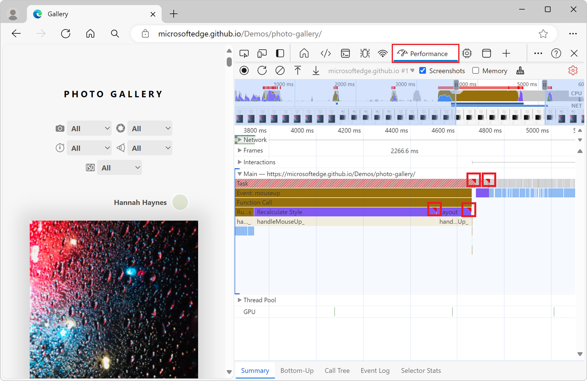
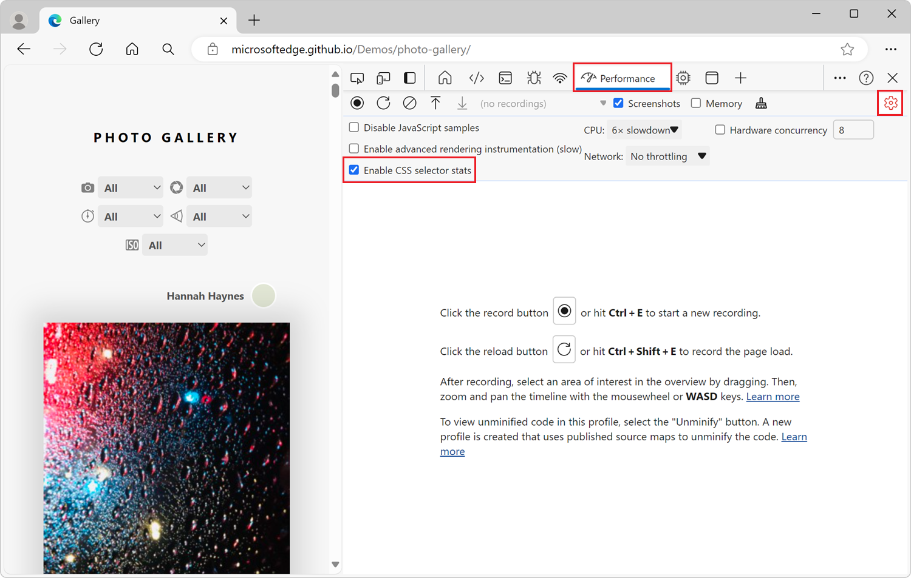
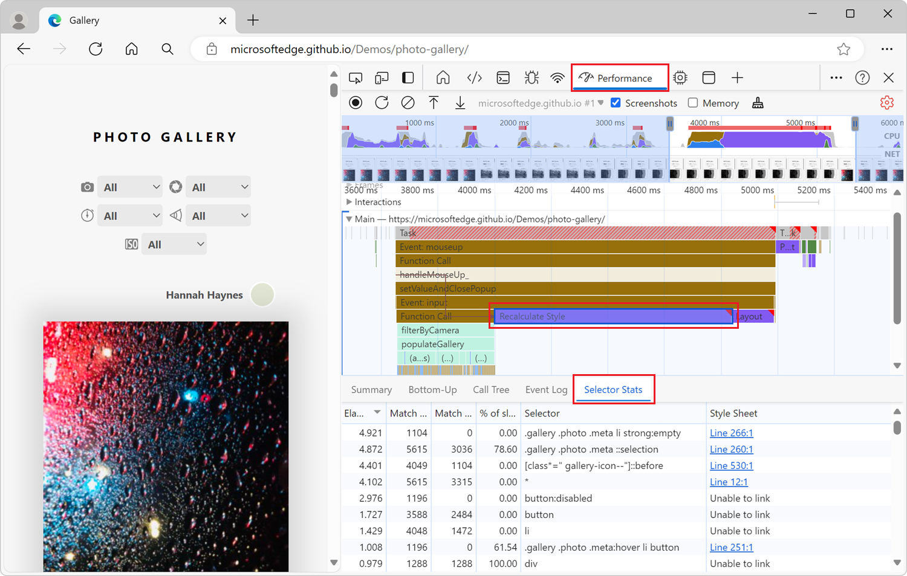
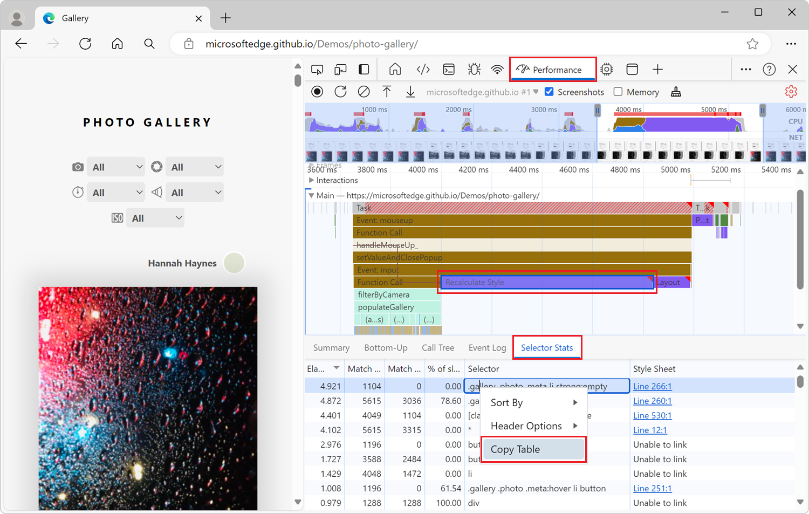
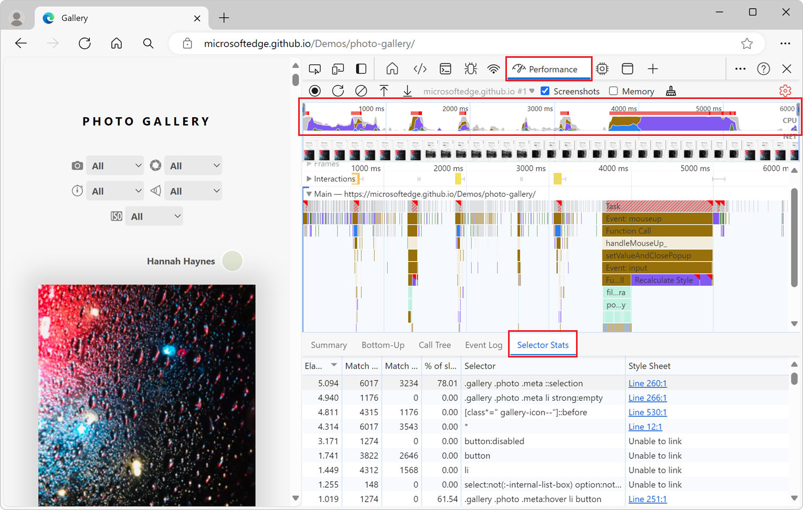
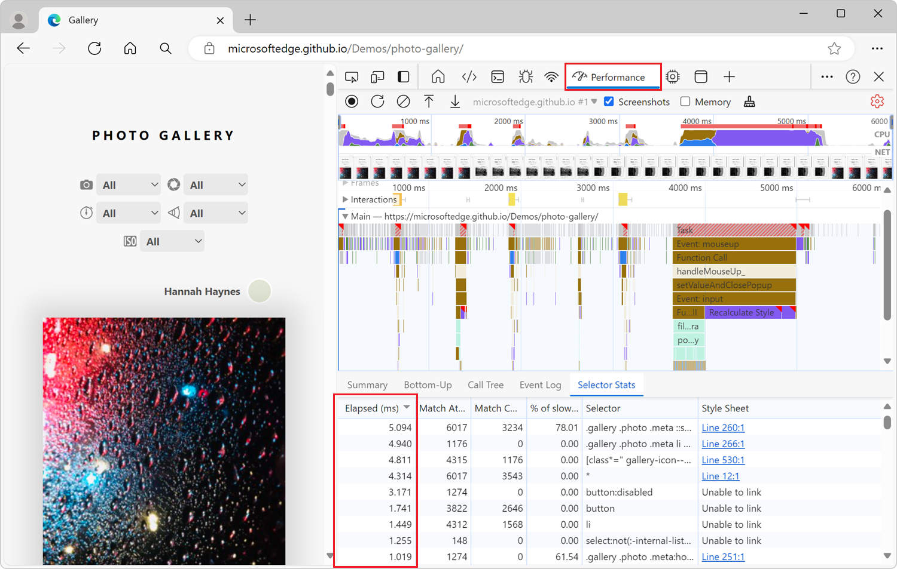

# Analyze CSS selector performance during Recalculate Style events

When your webpage has long-running **Recalculate Style** events, to identify which of your CSS selectors are taking up the most time and resulting in slow performance, use the **Selector Stats** tab in the **Performance** tool.  The **Selector Stats** tab provides statistics about the CSS rule selectors that were involved in one or more **Recalculate Style** events within a performance recording.

The **Performance** tool highlights each long-running task with a red triangle in the upper right corner, to indicate work on the main thread that takes a long time to run and has slow performance:

In your performance recordings, some of these long-running tasks may be **Recalculate Style** events.  A **Recalculate Style** event tracks the time it takes for the browser to do the following:
* Iterate through the DOM elements on a page, to find all of the CSS style rules that match a given element.
* Compute each element's actual style, based on the matching CSS style rules.

CSS styles need to be recalculated whenever the applicability of CSS rules may have changed, such as:

* When elements are added to or removed from the DOM.
* When an element's attributes are changed, such as the value of a `class` or `id` attribute.
* When user input occurs, such as a mouse move or a change of which element in a webpage has focus, which can affect `:hover` rules.

<!-- ====================================================================== -->
## Record a performance trace with Selector Stats enabled

To view the statistics of your CSS rule selectors during long-running **Recalculate Style** events, first record a performance trace with the Selector Stats feature enabled.  You enable the Selector Stats feature by selecting the **Enable CSS selector stats (slow)** checkbox, which displays the **Selector stats** tab.

The Selector Stats feature isn't always enabled, because it adds more overhead to your performance recordings.  You should only leave it turned on when you need to investigate the performance of **Recalculate Style** events and other rendering information.

To record a performance trace with selector statistics:

1. Open a webpage in a new window or tab, such as the [Photo Gallery](https://microsoftedge.github.io/Demos/photo-gallery/) demo page.

1. To open DevTools, right-click the webpage, and then select **Inspect**.  Or, press **Ctrl+Shift+I** (Windows, Linux) or **Command+Option+I** (macOS).  DevTools opens.

1. In DevTools, on the **Activity Bar**, select the **Performance** () tab.  If that tab isn't visible, select **More tools** () > **Performance**.

1. In the **Performance** tool, click the **Capture settings** () button.

1. Select the **Enable CSS selector stats (slow)** checkbox:

   
 
1. Click the **Record** () button, and then run the scenario that you want to improve for your website or app.

1. Click the **Stop** button.

Next, view CSS selector statistics, as described in the sections below.

<!-- ====================================================================== -->
## View CSS rule selector statistics for a single event

To view the statistics of the CSS rule selectors that are involved in a single **Recalculate Style** event:

1. Do the steps in [Record a performance trace with Selector Stats enabled](#record-a-performance-trace-with-selector-stats-enabled), above.

1. Find a **Recalculate Style** event in your performance recording and click it.

1. In the bottom section of the **Performance** tool, click the **Selector Stats** tab:

   

<!-- ------------------------------ -->
#### Table of CSS selectors in the Selector Stats tab

The **Selector Stats** tab in the **Performance** tool contains a table of CSS selectors.  The table displays the following information for each CSS selector:

| Column | Description |
| --- | --- |
| **Elapsed (ms)** | The amount of time the browser spent matching this CSS selector. This time is given in milliseconds (ms), where 1 ms is 1/1000 of a second. |
| **Match Attempts** | The number of elements the browser engine attempted to match with this CSS selector. |
| **Match Count** | The number of elements the browser engine matched with this CSS selector. |
| **% of slow-path non-matches** | The ratio of elements that didn't match with this CSS selector, to the elements that the browser engine attempted to match, and which required the browser engine to use less optimized code to match. |
| **Selector** | The CSS selector that was matched. |
| **Style Sheet** | The CSS style sheet that contains the CSS selector. | 

When finished, in the **Performance** tool, click the **Capture settings** () button, and then clear the **Enable CSS selector stats (slow)** checkbox.

<!-- ====================================================================== -->
## View CSS rule selector statistics for multiple events

To view aggregate statistics of the CSS rule selectors that are involved in multiple **Recalculate Style** events, copy multiple **Selector Stats** tables into a spreadsheet, as follows:

1. Do the steps in [Record a performance trace with Selector Stats enabled](#record-a-performance-trace-with-selector-stats-enabled), above.

1. Find the first **Recalculate Style** event you're interested in, and then click it.

1. In the bottom section of the **Performance** tool, click the **Selector Stats** tab.

1. Right-click the selector stats table, and then select **Copy Table**:

   

1. Paste the table into a spreadsheet, such as Microsoft Excel.

1. Repeat the previous steps with the other **Recalculate Style** events you're interested in.

When finished, in the **Performance** tool, click the **Capture settings** () button, and then clear the **Enable CSS selector stats (slow)** checkbox.

<!-- ====================================================================== -->
## View aggregate CSS rule selector statistics for the full recording

To view aggregate statistics of the CSS rule selectors that are involved in the entire performance recording:

1. Do the steps in [Record a performance trace with Selector Stats enabled](#record-a-performance-trace-with-selector-stats-enabled), above.

1. Deselect any event that's selected in the performance recording, by clicking an empty area of the flame chart.

1. Select the entire recording range. To do this, double-click in the **CPU** chart at the top of the **Performance** tool or, using your mouse, hover over the flame chart and scroll up until the entire chart is displayed.

1. In the bottom section of the **Performance** tool, click the **Selector Stats** tab:

   

When finished, in the **Performance** tool, click the **Capture settings** () button, and then clear the **Enable CSS selector stats (slow)** checkbox.

<!-- ====================================================================== -->
## Analyze CSS selector stats

To sort the data that's displayed in the **Selector Stats** table in ascending or descending order, click a column header.  For example, to see which CSS selectors take up the most time, click the **Elapsed (ms)** column header:

To try to improve the performance of your webpage, focus on the CSS selectors that:

* took a long time to calculate (high **Elapsed (ms)** value),
* and which the browser attempted to match many times (high **Match Attempts** value),
* and which the browser didn't actually match many elements with (low **Match Count** value compared to the **Match Attempts** value),
* and with a high percentage of slow-path non-matches.

For example, in the screenshot above:
* The first CSS selector (`.gallery .photo .meta ::selection`) required the most time.
* The browser engine attempted to match this CSS selector 6017 times, but only matched 3234 elements.
* Out of the 2783 elements that didn't match, 78% of them required less optimized code to match.

Therefore, this CSS selector is a good candidate to try to improve.

Try to change your CSS selectors so they require less time to calculate, and match fewer elements on the page.  How to improve your CSS selectors depends on your particular use case.  Repeat the steps in the above "Record" and "View" sections, to confirm that your changes helped decrease the **Recalculate Style** event duration, in the **Elapsed (ms)** column.

<!-- ====================================================================== -->
## See also

* [View CSS selector costs in the Performance tool sidebar](../whats-new/2024/11/devtools-131.md#view-css-selector-costs-in-the-performance-tool-sidebar) in _What's new in DevTools (Microsoft Edge 131)_.
* [Analyze runtime performance (tutorial)](./index.md) - An introduction to analyzing runtime performance in DevTools.
* [Performance features reference](./reference.md) - Covers many of the features in the **Performance** tool.
* [The truth about CSS selector performance](https://blogs.windows.com/msedgedev/2023/01/17/the-truth-about-css-selector-performance/) - Windows blog post.
