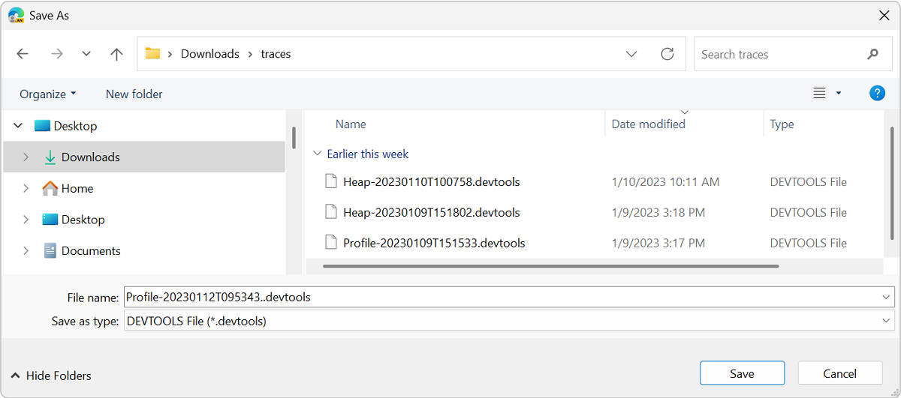

# Share a performance trace with more data

The data that's recorded by the **Performance** tool can be exported to files on disk, which can also include annotations, resource content (HTML, CSS, and JavaScript content), and source maps.  The exported files are called _traces_.  An exported trace is a `.json` file that can be imported in DevTools at any time.

When you export a trace from the Performance tool, you can choose whether to include additional data:
* Annotations.
* Resource content (such as JavaScript content).
* Script source maps.

You can also control whether the trace file is compressed.

The **Performance** tool records runtime data about your webpage.  Exploring the recorded data makes it possible to improve your webpage's runtime performance.

Exporting performance traces is useful when you want to share these files with other people, to get help with investigating issues.

Traces can be saved to include annotations, resource content (such as scripts), and source maps from the webpage.  This additional information makes it easier to analyze an imported trace file, by recreating the environment in which the trace was recorded, and by providing original source files.

Exported trace files are compatible with other browsers that are based on the Chromium engine.

When a trace that includes annotations, resource content (such as scripts) or source maps is imported in DevTools, a new DevTools window appears.  This new window isn't connected to the webpage that's running in your browser, and instead re-creates part of the environment in which the trace was originally recorded.  This DevTools instance contains only the **Performance** and **Sources** tools.

<!-- ====================================================================== -->
## Export a trace from the Performance tool

To record performance for aspects of a webpage, and then export a performance recording:

1. Open a webpage, such as [To do](https://microsoftedge.github.io/Demos/demo-to-do/), in a new window or tab.

1. Right-click the webpage, and then select **Inspect**.

   DevTools opens.

1. In DevTools, open the **Performance** () tool.

   <!-- Leah TODO: get new png of dialog to show annotations and resource content  -->

1. Click the **Record** () button.

1. Interact with the webpage, to run the scenario that you want to investigate the performance of.

   For example, in the demo page, add tasks.

1. Click the **Stop** () button.

   The performance profile appears.

1. Click the **Save trace** () button.

   The **Save performance trace** dialog opens (within the **Performance** tool):

   

1. Select or clear the checkboxes, to control what information to include in the trace file:

   * The **Include annotations** checkbox.
   * The **Include resource content** checkbox.
   * The **Include script source maps** checkbox.  (Must first select the **Include resource content** checkbox.)

   Optionally, clear the **Compress with gzip** checkbox.

   Details about these checkboxes are below.

1. Click the **Save** button.

   The small dialog in the **Performance** tool closes, and the **Save As** dialog opens.

1. Navigate to a folder in which to save the trace file on your disk.

   For example, on Windows, in the `/Downloads/` directory, click the **New folder** button, and then create a `/traces/` directory, in which to save the performance trace file:

   <!-- todo: issue: png shows .. in filename; extension shown is .devtools not .gz -->

1. Accept or modify the file name, such as `Trace-20251103T154500.json.gz`.

1. Click the **Save** button.

   The performance trace file is saved, such as `C:\Users\localAccount\Downloads\traces\Trace-20251103T154500.json.gz`.

<!-- ====================================================================== -->
## Include annotations

In the **Save performance trace** dialog within the **Performance** tool, the **Include annotations** checkbox controls whether to include annotations that were manually added to a performance profile.

Annotations can be helpful when you want to leave annotations for others.

See also:
* [Annotate a recording and share it](./reference.md#annotate-a-recording-and-share-it) in _Performance features reference_.

<!-- ====================================================================== -->
## Include resource content

In the **Save performance trace** dialog within the **Performance** tool, selecting the **Include resource content** checkbox includes the contents of HTML files, CSS files, and JavaScript scripts, which can then be viewed in the **Sources** tool.

The **Sources** tool will reliably resolve source code references found in imported traces to the actual runtime code.

Some Performance insights require resource content (such as scripts) for analysis.  The contents of extension scripts are not included in the trace file, even when this checkbox is selected.  However, the profiling data from extension scripts is still saved in the trace, because extension scripts can impact performance.

<!-- todo:
See also:
* 
-->

<!-- ====================================================================== -->
## Include script source maps

In the **Save performance trace** dialog within the **Performance** tool, selecting the **Include script source maps** checkbox includes minified production content files and the mappings back to the original source code files.  Source maps are used by DevTools to load your original files and replace minified code with original code.

When the resulting trace file is subsequently opened, the **Performance** tool will display the original function names, and the **Sources** tool will show the original file names.

Some Performance insights require source maps for analysis.  See [Get actionable insights](./reference.md#get-actionable-insights) in _Performance features reference_.

To make this checkbox available instead of dimmed, you must select the **Include resource content** checkbox, which includes script content in the trace file.

<!-- todo:
See also:
* 
-->

<!-- ====================================================================== -->
## Compress with gzip

In the **Save performance trace** dialog within the **Performance** tool, the **Compress with gzip** checkbox is selected by default.  This option helps compress large performance traces to save disk space, and makes the importing and processing of trace files faster in DevTools. 

* If this checkbox is selected, the default file name extension is `.gz`.
* If this checkbox is cleared, the default file name extension is `.devtools`.

<!-- ====================================================================== -->
## Open a performance trace file in DevTools

When a trace file is opened (imported) in DevTools, a new, specialized DevTools tab opens in the browser, containing only the **Performance** and **Sources** tools.  The trace can include annotations, resource content (such as scripts), and source maps.  This new tab isn't connected to the webpage that's running in your browser, and instead re-creates part of the environment in which the trace was originally recorded.

To open a saved trace file in DevTools:

1. Open Microsoft Edge or another Chromium-based browser.

1. Right-click the webpage or empty tab, and then select **Inspect**.

   DevTools opens.

1. In DevTools, select the **Performance** () tool.

1. Click the **Load trace** () button.

   The **Open** dialog opens.

1. Navigate to a shared trace file, such as `C:\Users\localAccount\Downloads\traces\Trace-20251103T154500.json.gz`.

1. Select the file, such as the zipped file `Trace-20251103T154500.json.gz`.

1. Click the **Open** button.

   A special DevTools tab opens in the browser, entirely filled with DevTools, consisting only of the **Sources** and **Performance** tabs:

   

   This is a special DevTools-dedicated tab of the browser, rather than the undocked DevTools window.

   The Address bar displays a special URL, such as:
   * `devtools://devtools/bundled/trace_app.html`
   * `devtools://devtools/bundled/rehydrated_devtools_app.html`

<!-- ====================================================================== -->
## See also
<!-- all links in article -->

* [Share a memory trace with more data](../experimental-features/share-memory-traces.md)<!-- link not in article -->

<!--
* [Save performance traces](https://developer.chrome.com/docs/performance/save-trace/)
https://developer.chrome.com/s/results?q=Save%20performance%20trace
Leah TODO: confirm chrome link
link not in article
-->
